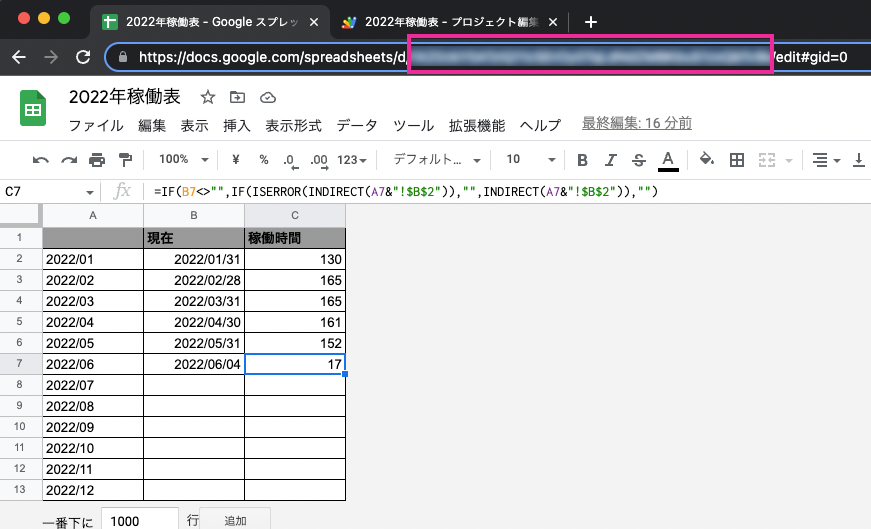
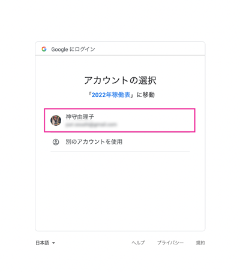
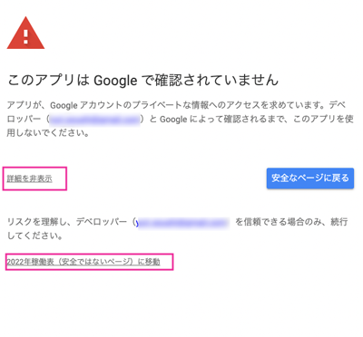
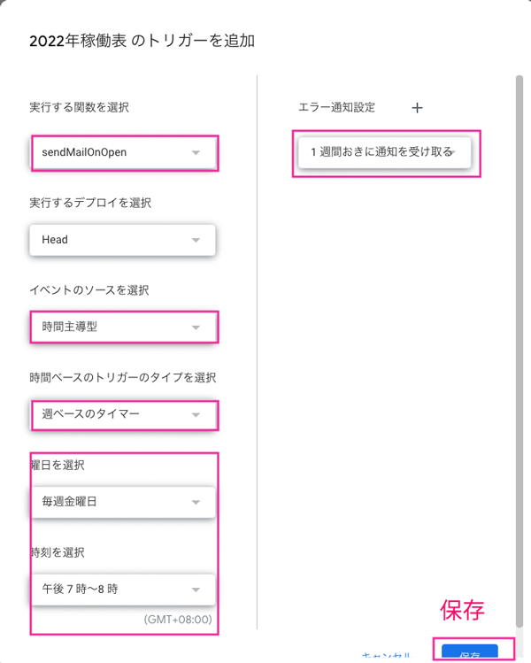
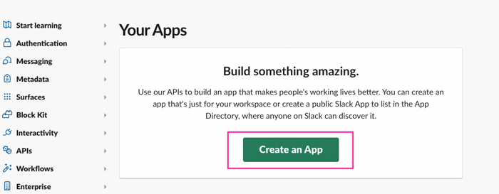
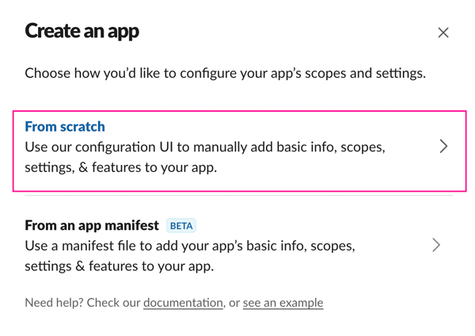
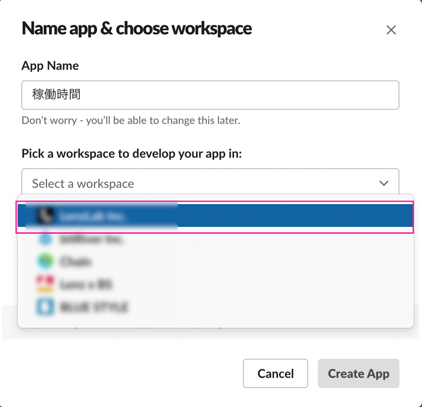
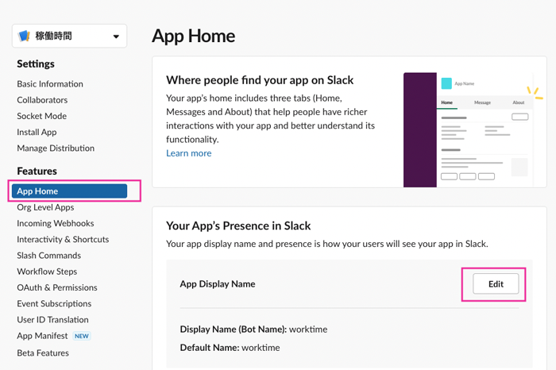
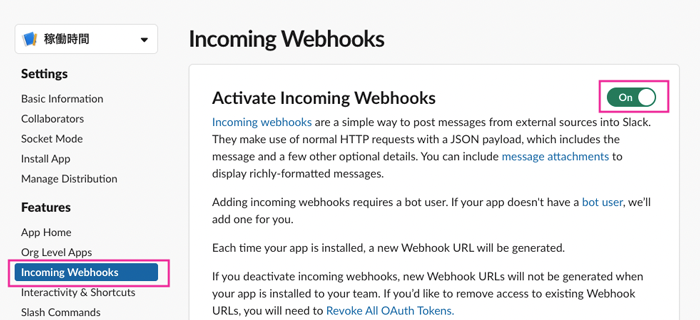
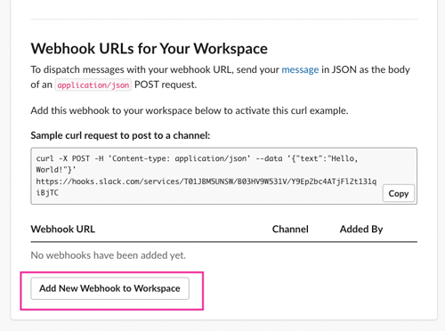

スプレッドシート（Googleスプレッドシート）の最新の内容をトリガーを使って定期的にGメールやSlackで通知するGoogle Apps Script（GAS）を作成しました。GASの設定方法を解説します。コードサンプルもありますのでコピペ可能です。

今回は実際、スプシで集計した稼働時間を定期的に送ることを想定して、GASを組んであります。GメールとSlackの方法を紹介しているので目次を利用して必要な項目をお読みください。
<prof></prof>

この記事は人日（プロジェクト勤務時間）を管理したくて作成したGASの紹介で、*こんな人におすすめ* です。

* 定期的にメール送信したい
* クライアントなどにGoogle Apps Script（GAS）でメールを送信したい
* 社内SlackのワークスペースなどでGoogle Apps Script（GAS）を通知を受け取りたい

<msg txt="毎回いちいちメッセージするのも面倒ですし、事務作業は減らしたい"></msg>

Slack活用術について気になる方は以下をご覧ください。
<card slug="entry460"></card>

## スプレットシートを準備し、値を関数で計算する

今回は2022年稼働表というスプレッドシートを準備します。<br>2022/01 ~ 2022/03というシートを作ります。


各項目を関数で計算します。
```
稼働日数　sum(B5:B)
稼働日数　count(B5:$B)
残　160-B2
```

liveというシートを作り、各月ごとの値を取得できるよう関数を組みます。


<ad location="/blogs/entry504/"></ad>

```
月　"2022/"&text(row()-1,"00")
現在　IF(row()-1<MONTH(today()),EOMONTH(A2&"/01",0),IF(row()-1=MONTH(today()),"",""))
稼働時間　IF(B2<>"",IF(ISERROR(INDIRECT(A2&"!$B$2")),"",INDIRECT(A2&"!$B$2")),"")
```
月が終わったら、最終日を取得し更新を止めます。

これでシートは完成です。

### シートの複製が面倒な場合

12枚のシートを作るのは面倒です。その場合はGASで作ったほうが早いです。

一個シート（2022/01）を作りあとはそれをコピーして値もGASで書き換えてしまいます。

```js:title=copySheet()
function copySheet() {
  const spreadsheet = SpreadsheetApp.getActiveSpreadsheet();
  const exist_sheets = spreadsheet.getSheets();

  for (i = 0; i < 12; i++) {
    let skip = false;
    const sheetname = '2022/'+( '00' + (i + 1) ).slice( -2 )
    const date = new Date( 2022, (i + 1), 0 ) ;
    const lastDay = date.getDate();

    // すでに存在するシートでループし、重複チェック
    for(j = 0; j < exist_sheets.length; j++ ){
      if(sheetname == exist_sheets[j].getSheetName()){
        skip = true;
      }
    }
    if(skip === true) continue

    // コピー元シートを取得、コピー元からシートを複製
    const formatsheet = spreadsheet.getSheetByName("2022/01");
    const copiedsheet = formatsheet.copyTo(spreadsheet);

    // 生成したシートの名前を変更
    copiedsheet.setName(sheetname);

    const lastCell = spreadsheet.getSheetByName(sheetname).getRange(4, 1).getNextDataCell(SpreadsheetApp.Direction.DOWN);
    for(k = 1; k <= lastCell.getRow()-4;k++) {
      if(k>lastDay) {
        spreadsheet.getSheetByName(sheetname).getRange(k+4,1).setValue('')
      }else {
        spreadsheet.getSheetByName(sheetname).getRange(k+4,1).setValue((i+1)+'/'+k)
      }
    }
  }
}
```

面倒なのでGAS側から実行します。


これで12ヶ月分のシートが一気にできました。

## メールを送信するGASを組む
定期的にメールを送信するGASを組みます。

```js:title=sendMailOnOpen()
function sendMailOnOpen() {

  const address = 'client@mail.com'; // メールの送付先
  const subject = 'Aプロジェクト稼働時間|銀ねこアトリエ'; // メールの件名

  const spreadsheet = SpreadsheetApp.openById('xxxxxxxxxxxxxxxxxxx');
  const sheet = spreadsheet.getSheetByName('live');
  const date = new Date();
  const range = sheet.getRange('C:C').getValues();
  const lastRow = range.filter(String).length;
  const url = spreadsheet.getUrl();

  const body = `
ご担当者様

お世話になっております。
今月の稼働時間をお知らせします。

------------------------
【作業期間】
${date.getFullYear()}年${(date.getMonth() + 1)}月1日〜${date.getFullYear()}年${(date.getMonth() + 1)}月${date.getDate()}日

【トータル作業時間】
${sheet.getRange(lastRow,3).getValue()}時間(残り稼働可能時間 ${82-sheet.getRange(lastRow,3).getValue()}時間)

【作業詳細】
${url}
------------------------

銀ねこアトリエ
HP: https://ginneko-atelier.com
`;
  let options = {
  "cc":"cc@mail.com",
  "bcc":"bcc@gmail.com"
  };
  GmailApp.sendEmail(address, subject, body, options);
}
```
スプレッドシートは`getActiveSpreadsheet`ではなく`SpreadsheetApp.openById`でシートIDで指定します。
<ad location="/blogs/entry504/"></ad>

```js
const spreadsheet = SpreadsheetApp.openById('xxxxxxxxxxxxxxxxxxx');
```
シートのIDはURLから取得できます。



稼働時間の取得ですが、`getNextDataCell(SpreadsheetApp.Direction.DOWN)` を使うと、見た目は空でも関数のあるセルもカウントされてしまうので、`range.filter(String).length` を使います。

```js
const range = sheet.getRange('C:C').getValues();
const lastRow = range.filter(String).length;
```
optionでCCやBCCも指定できます。複数送りたい場合はカンマ区切りにします。
```js
let options = {
  "cc":"cc@mail.com,cc2@mail.com",
  "bcc":"bcc@gmail.com"
  };
```

### メールを送信するGASのデバッグ

関数を `sendMailOnOpen` に切り替えてデバッグします。


承認を求められるので許可。


アカウントを選択します。



確認されていないよーと言われるので、詳細を表示に切り替えて、アプリに移動します。



アクセスを許可します。


メールが届きました！


### メールで通知するGASのトリガーの設定
トリガーを設定します。

GASの左側の時計マークをクリックします。
以下スクショはすでにトリガーの設定が終わったものです。


新規で作りたい場合は右下に「トリガーの追加ボタン」があるのでクリック。

対象の関数を選び、イベントを時間ベースにします。


週1度、毎週金曜日の夜7〜8時の間にメールが送れるように設定しました。

<ad location="/blogs/entry504/"></ad>

## Slackで通知するGASを組む
今どきメールも面倒なので、Slackで通知できるGASのコードのご紹介です。

[Slack api](https://api.slack.com/apps)にアクセスし、先にアプリを作成します。



From scratchを選択します。


アプリの名前をつけ、workspageを選びます。


左のメニューからApp Homeに移動し、「Your App’s Presence in Slack」から「App Display Name」を変更します。

「App Display Name」を変えておかないと、次のWebHookからの操作ができなくなります。


Incoming Webhooksに移動し、Incoming Webhooksをオン。

そのままスクロールし、「Add New Webhook to Workspace」をクリック。


チャンネルを選びます。今回は実装方法の紹介なので私自身に送信してみました。


<small>※ チャンネルに通知が来ます。</small>

Webhook URLが発行されるのでコピーします。


## Slackで通知するGASのコード
出力するためのコードはほぼ変わりません。`UrlFetchApp.fetch` を使うだけです。
```js
function notification_operation(){
  const spreadsheet = SpreadsheetApp.openById('1XZ0zkY5ATziQ11cSErOy0TqLdNdZMBKbuS1zxQbTv9k');
  const sheet = spreadsheet.getSheetByName('live');
  const date = new Date();
  const range = sheet.getRange('C:C').getValues();
  const lastRow = range.filter(String).length;
  const url = spreadsheet.getUrl();

  const message = `
【Aプロジェクト稼働時間】
作業期間:${date.getFullYear()}年${(date.getMonth() + 1)}月1日〜${date.getFullYear()}年${(date.getMonth() + 1)}月${date.getDate()}日\n
トータル作業時間:${sheet.getRange(lastRow,3).getValue()}時間(残り稼働可能時間 ${150-sheet.getRange(lastRow,3).getValue()}時間)\n
${url}`;

  const options =
  {
    "method" : "post",
    "contentType" : "application/json",
    "payload" : JSON.stringify(
      {
        "text" : message
      }
    )
  };
  // exec send
  UrlFetchApp.fetch("https://hooks.slack.com/services/xxxxx/xxxxxxxxxxxxxxxxxx", options);
}
```
`UrlFetchApp.fetch` の第一引数に *Webhook URL* を代入します。
```js
UrlFetchApp.fetch("https://hooks.slack.com/services/xxxxx/xxxxxxxxxxxxxxxxxx", options);
```
### Slackで通知するGASを実行してみる
Slackで通知するGASを実行します。デバッグでもいいです。

関数を `notification_operation` に切り替えて、実行します。

許可を求められるので、[メールを送信するGASのデバッグ](#メールを送信するGASのデバッグ)と同様に進めます。

デバッグがうまく行ったら、チャンネルに以下のように通知が飛んできます。


<ad location="/blogs/entry504/"></ad>

### Slackで通知するGASのトリガーの設定

[メールで通知するGASのトリガーの設定](#メールで通知するGASのトリガーの設定)と同様、毎週金曜日に通知が飛ぶようにします。

違うのは関数を `notification_operation` にセットするだけなので[メールで通知するGASのトリガーの設定](#メールで通知するGASのトリガーの設定)を参考に設定してください。

## まとめ・自動化しておくと仕事が減る
今回はGASを使って、稼働時間を定期的にお知らせする方法を解説しました。

人間がやらなくていいことはGASにやらせるのが一番です。

昔、毎日売上をSlackで投稿しろって言われて毎日憂鬱だったことが有りました。

<msg txt="今考えるとすごく面倒でなんで私がやんなきゃいけなんだって何百回も思いました。。。"></msg>

このGASは汎用性があるのでそういったケースでも使えると思います。

この記事がみなさんのGASライフの一助となれば幸いです。

最後までお読みいただきありがとうございました。

### GASの関連記事
GASの関連記事もあわせてお読みください。

<card slug="entry481"></card>
<card slug="entry476"></card>
<ad location="/blogs/entry504/"></ad>
<card slug="entry475"></card>
<card slug="entry470"></card>
