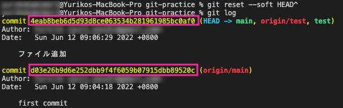

やってしまった！このコミットまだだったのに、わぁ、、、コンフリクトしちゃった汗

git使いたての頃によくぶち当たる壁ですよね？<br>私は初心者の頃、git の入門書や公式の解説はことごとくわかりづらく何度も挫折しそうになりました。

Gitのコミットやステージングでの取り消し、打ち消し、上書き、push できないときなど、git は困る沼だらけ。私がよくあるお困りごとの対処法をケース別にまとめました。

<prof></prof>

*この記事の対象者です*

* git初心者
* gitが苦手
* gitのコマンドラインを使いたい

前提条件として Mac と VS Code、 gitHub を使っています。

## 初心者に一番怖いコンフリクト解決の仕方
git といえば初心者に一番怖いものはコンフリクトです。

コンフリクトしないために初心者が気をつけないといけないことがあります。

<msg txt="基本はやらかす前に、「必ず <code class='language-text'>pull</code> してリモートなどと同期して最新状態にして作業する」を心がけましょう"></msg>

VS Codeなどではコンフリクトすると、以下のようにファイルにビックリマークが表示されます。


対象のファイルを開き、コンフリクト箇所ごとに修正します。修正方法は3種類選べます。

* Accept current change(現在の変更)
* Accept incoming change(リモートなどから受け入れた変更)
* Accept both change(コードを比べて手動)

タブをクリックしてコンフリクトを解決します。


<ad location="/blogs/entry507/"></ad>

コンフリクトの箇所が長くて、どっちが正しいか、手動で修正しようにもどうしていいかわからない場合は、*Compare changes* でコードを比較します。

間違えたら、`⌘Z` を押せば変更を取り消せます。

あとは、いつもどおり `commit` すればOKです。


コンフリクトファイルは、コマンドからも探すことができます。

```bash:title=コマンド
 git status
```
コンフリクトしたファイルパスなどを確認できます。


<ad location="/blogs/entry507/"></ad>

### 【pull request】がリジェクトされた場合
プルリク送って、リジェクトされた場合の対処法です。

リジェクトされたら、まずはマージしたいリモートのブランチを `pull` します。
```bash:title=コマンド
git checkout 【マージしたいブランチ名】
git pull 【リモート名】 【プルリクを送りたいブランチ名】
# 例
git checkout branch-a
git pull origin main
```

必ずコンフリクトが起こるはずなので、必要な箇所を修正し再度プルリクを出します。

これでたいてい解決できます。

<div class="box">
<h3>コンフリクトファイルが表示されないこともある</h3>
たまに何故かコンフリクトファイルが VS Code側で表示されない場合があります。そんなときはVS Codeで「<<<」を全体検索して探します。
</div>

## あるある git のお困りごと解決法
私の git でよくやらかすケース別の対処法をご紹介します。

### 【git add】で間違ってステージングしたファイルを取り消したい（コミット前）
変更済みのファイルをまとめてにステージングするための便利なコマンドがあります。

```bash:title=コマンド
 git add .
```
*.gitignore* に無視ファイルを追加していないのに（もしくは *.gitignore* の記述自体を間違えたなど） `git add` してしまい、困ることがあります。

追跡中のファイルか、すでに追跡済みかで取り消し方は変わってきます。

まずは `git status` でファイルの状況を確認します。

```bash:title=コマンド
git status
```


はじめて追加したファイルの場合。
```bash:title=コマンド
# すべてのファイルを取り消す
git rm --cached -r .
# 特定のファイルを取り消す
git rm --cached -r 【ファイル名】
```
すでに追加したファイルの場合。
```bash:title=コマンド
# すべてのファイルを取り消す
git reset HEAD
# 特定のファイルを取り消す
git reset HEAD 【ファイル名】
```

取り消したら再度確認し、ステージングし直します。

<div class="box">
<h3>VS Code であれば、.gitignore に追加したファイルはグレーアウトされる</h3>
VS Code であれば、.gitignore に追加した無視ファイルやフォルダはグレーアウトされているはずなので目で見て確認できるはずです。もしグレーアウトされてない場合は VS Code を起動し直すか、コードを良く見直しましょう。
</div>

### 【git reset】直前のコミットをなかった事にする（コミット後）

やっちまった！の代表が直前の `commit` をなかったことにしたいケースです。

私はよくVS CodeからのPushが画像などが重くて終わらない時によく使います。

<msg txt="昨日の飲み過ぎもなかったことにしたい！"></msg>

```bash:title=コマンド
 git reset --soft HEAD^
```
`commit` が取消されるだけで変更内容は残ります。変更内容も取消したい場合は `--hard` オプションをつけます。

ちなみに、`HEAD^` の `^` は正規表現で最初という意味。つまり、正規表現で遡（さかのぼ）って `commit` を取消せます。正規表現について知りたい方はこちらも合わせてお読みください。
<card id="/blogs/entry336/"></card>

事前の `commit` でない場合は、`git log` で履歴を調べてハッシュで指定したほうが無難です。



`git log` は `q` で抜けることができます。

```bash:title=コマンド
git log

git reset --soft ［ハッシュ］
```

<ad location="/blogs/entry507/"></ad>

全体像を把握しながらログを確認したいときは以下のコマンドをつかいましょう。視覚的にわかりやすいです。

```bash:title=コマンド
git log --graph --oneline
```


ハッシュは短くなりますが同様に使えます。

戻してもファイルのファイルの変更等はそのまま残ります。落ち着いて不要なファイルを削除したり軽いものに差し替えて `git add`  `git commit` と順次行います。

### 【git revert】履歴を残してやり直す
```bash:title=コマンド
git revert ［ハッシュ］
```

コメントを求められますが、英語のメッセージで良ければそのまま `:q` とコマンドを叩いて入力を終わらせます。

これで変更した `commit` のデータが残ったまま、指定の `commit` まで巻き戻すことができます。

### 【git commit --amend】直前のコミットのメッセージを直したい
うっかり誤字脱字のある `commit` メッセージを残してしまい恥ずかしいことがあります。

そんなときは、`--amend`オプションを付けてコミットし直します。

```bash:title=コマンド
git commit --amend -m 'コミットメッセージ'
```

### 【git push】が10分以上終わらない
リモートにブランチを追加しているにも関わらず、`push` が終わらないことがあります。

```bash:title=コマンド
 git push
```

<ad location="/blogs/entry507/"></ad>

容量を超えてないのに `push` が終わらない場合は、リモート名ブランチを指定してプッシュしたらたいていうまくいくことがあります。

```bash:title=コマンド
git push ［リモート名］ [ブランチ名]

# 例
git push origin main
```

単純に容量を超えいる場合は、回数を分けて `push` するかプランを変えるかのどちらかです。

### 【git stash】作業途中で他にブランチを切り替える必要がある場合
急ぎでこっちやってなどという依頼はしょっちゅうあります。そんな時よく使うコマンドです。

いったん変更下内容を退避（棚上げ）しておいて、後ほど作業できます。

```bash:title=コマンド
git stash -u
```

`-u` オプションで追跡対象に含まれていないファイルも退避することができます。他のブランチで作業が終わった後、作業途中のブランチを切り替え後の処理です。

一度棚上げした作業の続きをしたいので、`stash` の一覧を確認します。

```bash:title=コマンド
git stash list
```
一覧が確認できます。

```
stash@{0}: WIP on [ブランチ]: ［HEADのコミットハッシュとコミットメッセージ］
```

`stash` を戻します。

```bash:title=コマンド
git stash apply stash@{0}
```
削除したい場合。

<ad location="/blogs/entry507/"></ad>

```bash:title=コマンド
# 対象だけ削除
git stash drop stash@{0}
# すべて削除
git stash clear
```
<!-- ## 【git rebase】コミット履歴を整えて統合
gitに慣れてきたら、`git rebase`を使って、履歴をキレイにしてから統合しましょう。

`marge` より `rebase` のほうがいい理由は分岐したブランチ（トピックブランチ）のコミットを取得してくれないからです。

```bash:title=コマンド
git rebase a-branch
```

<div class="box">
<h3>分岐したブランチ、トピックブランチについて</h3>
git ではあるブランチを起点にしてそれをコピーして新しいブランチを作っていきます。この枝分かれしたブランチのことをトピックブランチといいます。
</div> -->

## まとめ・Gitコマンドはチートシートを作っておくといざとなると困らない
今回、git で私が個人的に困って使うコマンドをまとめました。

昔は私も Source Tree という GUI(見た目で操作しながら使えるツール) git のツールを使っていましたが、gitHubやその他のプラットホームでコミットすることが増え設定が面倒になり、コマンド＋VS Code に落ち着いてしまいました。

まだ、`rebase` について書ききれてないので後日追記しようと思います。

この記事がみなさんのバージョン管理ライフの一助となれば幸いです。

最後までお読みいただきありがとうございました。

<!-- https://www.wenyanet.com/opensource/ja/5feef4b7771ee619bb70553d.html -->
