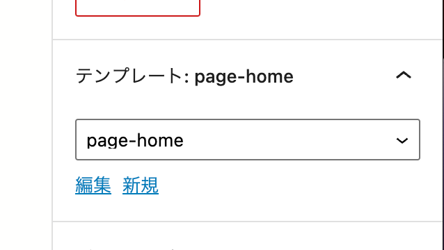
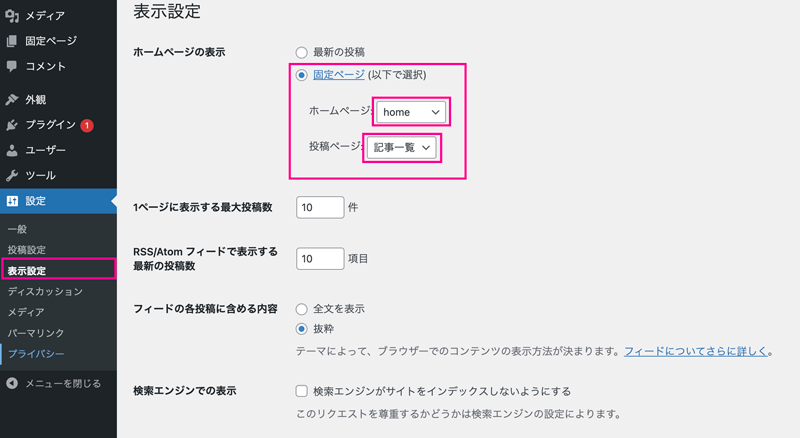
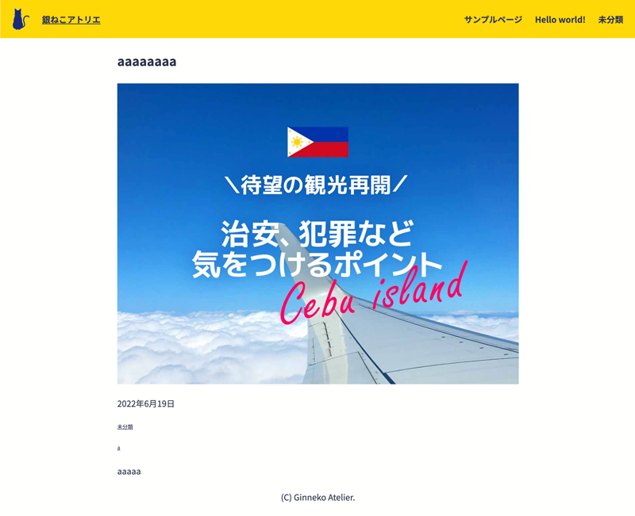

前回はブロックテーマでtheme.jsonの設定の仕方、テンプレートやブロックパターンの作成方法を紹介しました。

今回は一覧と記事詳細ページのテンプレートを作ります。簡単なブロックテーマが作成できる構成となっています。

<prof></prof>

この記事は二部構成となっています。
* [前編・ベースのテンプレート作成](/blogs/entry506)
* 後編・記事一覧出力やページの追加（←イマココ）


## トップページのテンプレートを作る

ファイル構造などは前回の[WordPress(5.9〜) theme.jsonの設定方法とブロックテーマ/オリジナルテーマの作り方・前編](/blogs/entry506)を参考にしてください。

index.htmlを複製して新たなテンプレート・home-page.htmlを作成します。

index.htmlは *記事一覧を表示させるページ* として利用します。

```
myblocktheme/
  ├ index.php
  ├ templates/
  │  ├ page-home.html(index.htmlを複製)
  │  └ index.html
  ├ parts/
  │  ├ header.html
  │  └ footer.html
  ├ style.css
  └ theme.json
```

WordPress管理画面からhomeという固定ページを作り、テンプレートpage-homeをセットしておきます。



WordPress管理画面から記事一覧という固定ページも追加しておきます。スラッグはblogとかで大丈夫です。

設定　>　表示設定からホームページの表示を固定ページで *ホームページは home* 、*投稿ページは記事一覧* にセットしておきます。



### ブロックテーマのテンプレートの仕組み
ブロックテーマではテンプレートファイルがHTMLになるだけで、従来のテンプレート同様ファイル名で判断で用途が判断されます。

|ファイル名|説明|
|-|-|
|*single.html*|投稿|
|*page.html*|固定ページ|
|*xxx.html*|固定ページ用テンプレート|
|*home.html*|HOME用テンプレート|
|*archive.html*|一覧用テンプレート|
|*category.html*|カテゴリ一覧|
|*tags.html*|タグ一覧|
|*４０４.html*|404|

もし、htmlテンプレートがなくphpのテンプレートがある場合は、phpのテンプレートが使われます。

## 記事一覧を作成
index.htmlを編集し記事一覧を作成を作成します。完成イメージはこちら。

コードが長くなってしまったので小分けに説明していきます。

説明をすっ飛ばしたい人は[記事一覧テンプレートのすべてのコード](#記事一覧テンプレートのすべてのコード)へ。


### 一覧のタイトル追加
まずは、見出しを追加します。
```html:title=index.html
<!-- wp:template-part {"slug":"header","tagName":"header"} /-->
<!-- wp:group {"tagName":"main","align":"wide","layout":{"inherit":true}} -->
<main class="wp-block-group alignwide">
  <!-- wp:heading {"level":1,"align":"wide"} -->
  <h1 class="alignwide">記事一覧</h1>
  <!-- /wp:heading -->
  </div>
</main>
<!-- /wp:group -->
<!-- wp:template-part {"slug":"footer","tagName":"footer"} /-->
```
h2以外の見出しにはレベルを追加します。指定しないとブロックが壊れます。
```html
<!-- wp:heading {"level":1,"align":"wide"} -->
  <h1 class="alignwide">記事一覧</h1>
<!-- /wp:heading -->
```
### ループで記事一覧を出力
ループの方法です。
```html
<!-- wp:query {"query":{"perPage":10,"pages":0,"offset":0,"postType":"post","categoryIds":[],"tagIds":[],"order":"desc","orderBy":"date","author":"","search":"","exclude":[],"sticky":"","inherit":true},"align":"wide"} -->
  <div class="wp-block-query alignwide">
    <!-- wp:post-template -->
    <!-- ここにループさせたい内容を記述 -->
    <!-- /wp:post-template -->
  </div>
</div>
<!-- /wp:query -->
```

|オプション|説明|
|-|-|
|*perPage*|1ページに表示させるページ数|
|*pages*|ページ送り数|
|*offset*|表示させたいページ数|
|*postType*|絞り込みたいページのタイプ|
|*categoryIds*|表示させたいカテゴリー|
|*tagIds*|表示させたいタグ|
|*order*|昇順･降順|
|*orderBy*|ソートの基準（日付とか）|
|*author*|投稿者で絞り込む|
|*exclude*|除外|
|*sticky*|調べ中|

記事からは以下の値を取得してみます。`{"isLink":true}` でリンク付きのブロックが呼び出せます。

```html:title=サムネイル
<!-- wp:post-featured-image {"isLink":true} /-->

<!-- 出力結果 -->
<figure class="wp-block-post-featured-image"><a href="http://localhost:3011/aaaaaaaa/"></a/></figure>
```
```html:title=タイトル
<!-- wp:post-title {"isLink":true} /-->

<!-- 出力結果 -->
<h1 class="wp-block-post-title"><a href="http://localhost:3011/aaaaaaaa/" target="_self" rel="">aaaaaaaa</a></h1>
```
`{"format":"Y.m.d"}`で日付のフォーマットを指定します。
```html:title=日付
<!-- wp:post-date {"format":"Y.m.d"} /-->

<!-- 出力結果 -->
<div class="wp-block-post-date"><time datetime="2022-06-19T13:58:06+09:00"><a href="http://localhost:3011/aaaaaaaa/">2022.06.19</a></time></div>
```
```html:title=抜粋
<!-- wp:post-excerpt /-->

<!-- 出力結果 -->
<div class="wp-block-post-excerpt"><p class="wp-block-post-excerpt__excerpt">aaaaa </p></div>
```
`wp:post-template`内をまとめて書くとこんな感じになります。

`wp:columns`を使って2カラムにしました。

```html:title=ループ内のコード
<!-- wp:post-template -->
  <!-- wp:columns -->
  <div class="wp-block-columns">
    <!-- wp:column {"width":"200px"} -->
    <div class="wp-block-column" style="flex-basis:200px">
      <!-- wp:post-featured-image {"isLink":true} /-->
    </div>
    <!-- /wp:column -->
    <!-- wp:column {"width":""} -->
    <div class="wp-block-column">
      <!-- wp:post-title {"isLink":true} /-->
      <!-- wp:post-date  {"format":"Y.m.d","isLink":true} /-->
      <!-- wp:post-excerpt {"isLink":true} /-->

    </div>
    <!-- /wp:column -->

  </div>
  <!-- /wp:columns -->
<!-- /wp:post-template -->
```

### ページネーションを出力

ページネーションを出力します。


「前のページ」「数字」「次のページ」の3つのパーツに分かれています。

```html:title=ページネーション
<!-- wp:query-pagination {"paginationArrow":"arrow","align":"wide","layout":{"type":"flex","justifyContent":"center"}} -->
<!-- wp:query-pagination-previous /-->
<!-- wp:query-pagination-numbers /-->
<!-- wp:query-pagination-next /-->
<!-- /wp:query-pagination -->
```

### 記事一覧テンプレートのすべてのコード

```html:title=index.html
<!-- wp:template-part {"slug":"header","tagName":"header"} /-->
<!-- wp:group {"tagName":"main","align":"wide","layout":{"inherit":true}} -->
<main class="wp-block-group alignwide">
  <!-- wp:heading {"level":1,"align":"wide"} -->
  <h1 class="alignwide">記事一覧</h1>
  <!-- /wp:heading -->
  <!-- wp:query {"query":{"perPage":10,"pages":0,"offset":0,"postType":"post","categoryIds":[],"tagIds":[],"order":"desc","orderBy":"date","author":"","search":"","exclude":[],"sticky":"","inherit":true},"align":"wide"} -->
  <div class="wp-block-query alignwide">
    <!-- wp:post-template -->
    <!-- wp:columns -->
    <div class="wp-block-columns">
      <!-- wp:column {"width":"200px"} -->
      <div class="wp-block-column" style="flex-basis:200px">
        <!-- wp:post-featured-image {"isLink":true} /-->
      </div>
      <!-- /wp:column -->
      <!-- wp:column {"width":""} -->
      <div class="wp-block-column">
        <!-- wp:post-title {"isLink":true} /-->
        <!-- wp:post-date  {"format":"Y.m.d","isLink":true} /-->
        <!-- wp:post-excerpt {"isLink":true} /-->

      </div>
      <!-- /wp:column -->

    </div>
    <!-- /wp:columns -->
    <!-- /wp:post-template -->
    <!-- wp:spacer {"height":50} -->
    <div style="height:50px" aria-hidden="true" class="wp-block-spacer"></div>
    <!-- /wp:spacer -->
    <!-- wp:query-pagination {"paginationArrow":"arrow","align":"wide","layout":{"type":"flex","justifyContent":"center"}} -->
    <!-- wp:query-pagination-previous /-->

    <!-- wp:query-pagination-numbers /-->
    <!-- wp:query-pagination-next /-->
    <!-- /wp:query-pagination -->
  </div>
  <!-- /wp:query -->
</main>
<!-- /wp:group -->
<!-- wp:template-part {"slug":"footer","tagName":"footer"} /-->
```

### カテゴリーやタグ一覧を出力したい場合
archive.htmlを追加し、タイトルを出力するコードを書き換えるだけです。
```html{4}:title=archive.html
<!-- wp:template-part {"slug":"header","tagName":"header"} /-->
<!-- wp:group {"tagName":"main","align":"wide","layout":{"inherit":true}} -->
<main class="wp-block-group alignwide">
  <!-- wp:query-title {"type":"archive","level":1,"align":"wide"} /-->
  省略
</main>
<!-- /wp:group -->
<!-- wp:template-part {"slug":"footer","tagName":"footer"} /-->
```

## 記事詳細のテンプレート
記事詳細のテンプレートの作り方です。



記事詳細出力用のsingle.htmlを作成します。

```
myblocktheme/
  ├ index.php
  ├ templates/
  │  ├ page-home.html
  │  ├ single.html(新規追加)
  │  └ index.html
  ├ parts/
  │  ├ header.html
  │  └ footer.html
  ├ style.css
  └ theme.json
```

コードが短いのでまとめて紹介します。

```html:title=single.html
<!-- wp:template-part {"slug":"header","tagName":"header"} /-->
<!-- wp:group {"tagName":"main","align":"wide","layout":{"inherit":true}} -->
<main class="wp-block-group">
  <!-- wp:group {"tagName":"article"} -->
  <article class="wp-block-group">
    <!-- wp:post-title {"level":1} /-->
    <!-- wp:post-featured-image {"align":"wide"}}}} /-->
    <!-- wp:post-date {"format":"Y.m.d","style":{"fontSize":"small"} /-->
    <!-- wp:post-terms {"term":"category","fontSize":"small"} /-->
    <!-- wp:post-terms {"term":"post_tag","fontSize":"small"} /-->
    <!-- wp:post-content /-->
  </article> <!-- /wp:group -->
</main> <!-- /wp:group -->
<!-- wp:template-part {"slug":"footer","tagName":"footer"} /-->
```

各パーツを出力するコードです。

```html:title=記事タイトル
<!-- wp:post-title {"level":1} /-->
```
```html:title=アイキャッチ
<!-- wp:post-featured-image {"align":"wide"}}}} /-->
```

```html:title=投稿日
<!-- wp:post-date {"format":"Y.m.d","style":{"fontSize":"small"} /-->
```

```html:title=カテゴリーやタグ
<!-- wp:post-terms {"term":"post_tag","fontSize":"small"} /-->
```
`term` の指定を変えるだけです。
* *category* ... カテゴリー
* *post_tag* ... タグ
```html:title=本文
<!-- wp:post-content /-->
```

## 固定ページ
タイトルとコンテンツだけを出力するのであれば以下でOKです。

```html:title=page.html
<!-- wp:template-part {"slug":"header","tagName":"header"} /-->
<!-- wp:group {"tagName":"main","align":"wide","layout":{"inherit":true}} -->
<main class="wp-block-group">
  <!-- wp:group {"tagName":"article"} -->
  <article class="wp-block-group">
    <!-- wp:post-title {"level":1} /-->
    <!-- wp:post-content /-->
  </article> <!-- /wp:group -->
</main> <!-- /wp:group -->
<!-- wp:template-part {"slug":"footer","tagName":"footer"} /-->
```

## まとめ・ブロックテーマを使うと自由度が高くなる
2回に分けてブロックテーマの作り方をご紹介しました。

* [前編・ベースのテンプレート作成](/blogs/entry506)
* 後編・記事一覧出力やページの追加（←イマココ）

まだまだブロックテーマはリリースされたばかりで情報が不足しています。

随時追記していきますので乞うご期待ください。

この記事が、ブロックテーマで次世代WordPressを試したい方の一助となれば幸いです。

最後までお読みいただきありがとうございました。
