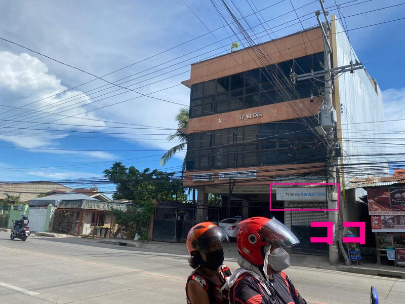
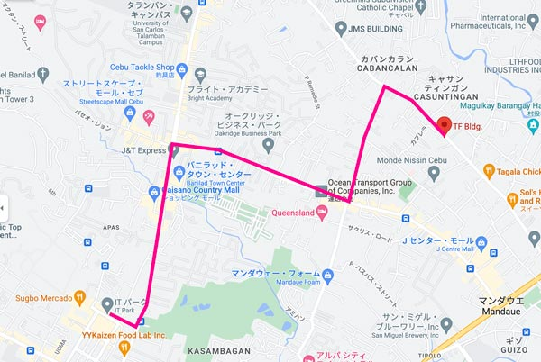
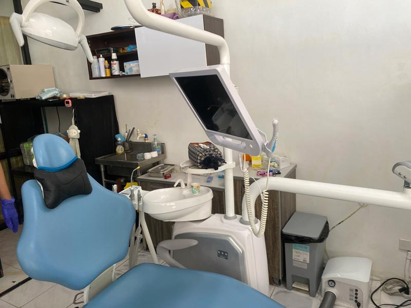
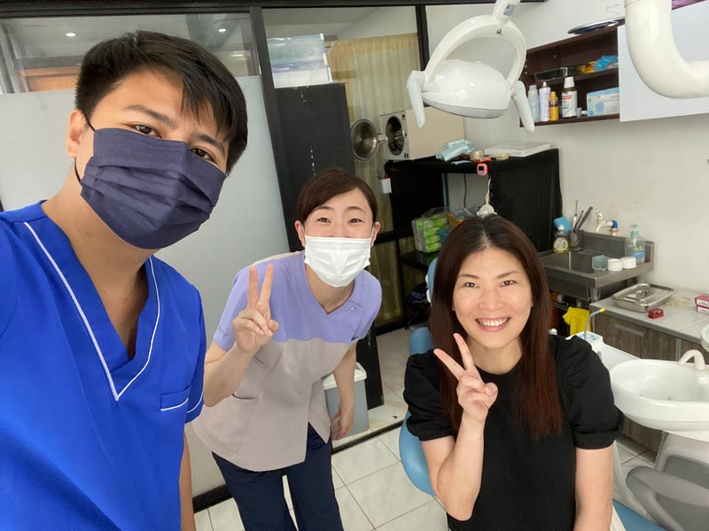
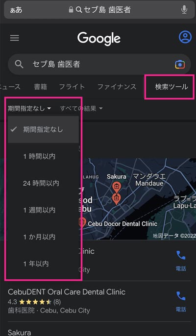
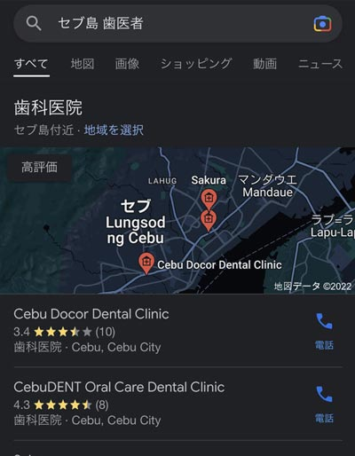
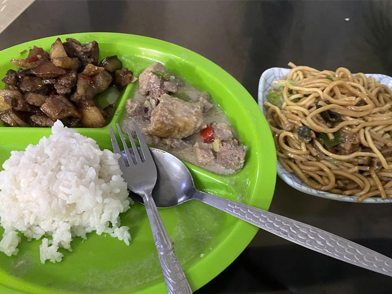
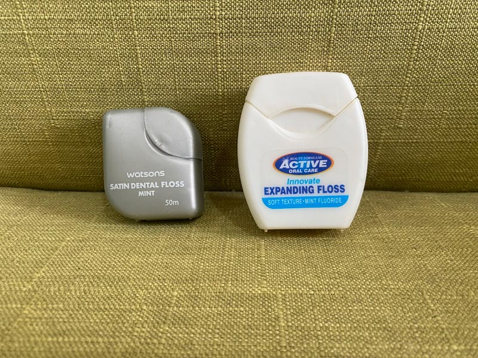

フィリピン・セブ島で突然の歯のトラブルでお困りの方のために、現地在住の私が日本語が通じる安心の歯医者さん・TY スマイルデンタルクリニック（TYA dental clinic）をご紹介します。

日本だと保険診療で大体の治療費に目安がわかるけどフィリピンではピンきりです。 コロナでいろんな店が潰れているので2020年以前の情報が当てになりません。

<msg txt="銀歯が取れた！歯が痛い！海外でいつ歯のトラブルに見舞われるかわかりません!備えあれば憂いなし！！"></msg>

2022年現在の情報です。

<prof></prof>

## 焼肉の後、フロス中に銀歯がコロンと外れた
ある金曜日の夜、合法レバ刺しが食べられる「ドラム缶焼き肉 粋」へ。

オウチに帰って酔っ払って気分良くフロスかけていたらコロンと洗面台の銀色の物体が…。

8年前に装着した銀歯で、そのままコロコロと排水口の中に入ってしまいました。

 一旦は諦めて寝ましたが、気になって目が覚めたので再度排水口を確認。中をよくよく見ると途中で引っかかっている銀歯を発見しました。

割り箸を使い、かろうじて銀歯を拾いました。

<msg txt="なんとか拾うことができました！実は私、米粒に字を書けるくらいスーパー器用です。"></msg>

インターネットで調べると、銀歯が外れた箇所は歯が割れたり歯列が動いてしまう事があるので2日以内に外れた銀歯を歯医者に持って行く必要があるとのこと。

## 日本語が通じる TY スマイルデンタルクリニック（TYA dental clinic）
知り合いに紹介してもらった TY スマイルデンタルクリニック（TYA dental clinic）へ。

インターネットだと「[TYA dental clinic](https://www.google.com/search?q=TYA%20dental%20clinic&rlz=1C5CHFA_enPH997PH997&oq=TYA+dental+clinic&aqs=chrome..69i57.379j0j7&sourceid=chrome&ie=UTF-8&tbs=lf:1,lf_ui:2&tbm=lcl&sxsrf=ALiCzsbTxyEkd92973E8d2BzOhTSB5uB8w:1656383606194&rflfq=1&num=10&rldimm=5758053924140230283&lqi=ChFZVEEgZGVudGFsIGNsaW5pY1oTIhF5dGEgZGVudGFsIGNsaW5pY5IBDWRlbnRhbF9jbGluaWOqARkQASoVIhF5dGEgZGVudGFsIGNsaW5pYygA&ved=2ahUKEwi909Xjjc_4AhW-Z2wGHctmAqEQvS56BAgPEAE&sa=X&rlst=f#rlfi=hd:;si:5758053924140230283,l,ChFZVEEgZGVudGFsIGNsaW5pY1oTIhF5dGEgZGVudGFsIGNsaW5pY5IBDWRlbnRhbF9jbGluaWOqARkQASoVIhF5dGEgZGVudGFsIGNsaW5pYygA;mv:[[10.3463111,123.9342233],[10.3041091,123.88638840000002]];tbs:lrf:!1m4!1u3!2m2!3m1!1e1!1m4!1u2!2m2!2m1!1e1!2m1!1e2!2m1!1e3,lf:1)」で調べないと引っかかりません。

<em>住所</em> TF Bldg. M. L. Quezon Ave, Mandaue City, 6014 Cebu <a href="https://maps.app.goo.gl/z88P2PFRX7ymsWPb6">MAP</a>

現在コロナの影響などもあり、*完全予約制* です。土日が中心ですが、平日も院長とのスケジュールさえ合えば予約が取れます。

TY スマイルデンタルクリニックは世界最長ロックダウンが始まった2020年3月にオープンしたそうです。ITパークからタクシーで15分程度（150ペソくらい）です。

院長のYuji先生は日本人ハーフで *片言ですが日本語が話せます*。

通訳が必要な場合は希望すれば **オンラインでも日本人がサポートの依頼も可能** です。

今回私が行ったときは直接助手の方が日本人で通訳サポートしてくれました。

余談ですが、Yuji先生はセブ島のNGO法人DAREDEMO HEROさんの支援する子どもたちの歯科検診もしています。DAREDEMO HEROさんは微力ながらプロボノでお手伝いしているセブ島にある子供を始めとする貧困層の支援団体です。

[子どもたちの口腔衛生改善プロジェクト|DAREDEMO HERO](https://daredemohero.com/38730/)

### いざ銀歯の治療、そして歯のお掃除

幸運なことに銀歯はまだ使えるらしく、セメントで再装着してもらえました。

  <h4>TY スマイルデンタルクリニックの安心ポイント</h4>
  <ul>
    <li>セメントなどの治療に使う材料を日本から取り寄せている</li>
    <li>消毒をきちんとしている</li>
    <li>ディスポーザルできるものはきちんとディスポーザルしている</li>
  </ul>

ついでにクリーニングもしてもらいました。私はブリッジをしているので、歯石が溜まりやすいです。日本に居たときは半年に一度、歯のクリーニングをしていたのですが、フィリピンではたった1回しかできておらず。

トータル *1800ペソ（クリーニングが800ペソ~）* でした。

価格表はないので、症状を伝えて都度見積もってもらいましょう。

虫歯なし、歯もあまり汚れていないとのこと。「奥歯とブリッジの周りはプラークが付きやすいから気をつけて歯磨きしてね-」とのことでした。

## ネットで調べたらコロナ前の情報ばかり
「セブ島、歯医者」で検索するとほとんど語学留学でセブに来た人の情報ばかり、つまりコロナ前の情報です。

*コロナでいろんな店が潰れている* ので、**2020年以前の情報** はぶっちゃけ当てにはなりません。

ちなみにGoogle検索では「*検索ツール*」という機能を使って最新の記事のみに絞ることができます。*1年以内であれば問題ないことが多い*と思います。

ちなみに最新の「セブ島、歯医者」の記事はでっぱりんのローカル歯医者で歯列矯正をしたブログでした。
 <small>※ でっぱりんはあいのりという番組に出演していた女性だそう。私はあいのりを見ていないのであまり知りません。</small>

  フィリピンあるあるですが、Googleマイビジネスの情報さえも怪しい事が多いです。

<small>※ Googleマイビジネスは検索したら出てくる上記のような施設情報。</small>

 掲載されている営業時間などの情報も更新されてないのか、いい加減なことが多いです。情報を元に行ってみたら店がなかったなんてこともあります。

<msg txt="お店や場所を探すときは知り合いに聞くのが一番"></msg>

## 歯医者はお値段も技術も格差がすごい

モールなどに入っているキレイなデンタルクリニックは清潔で安心できる上、ホテルのラウンジみたいに高級感があります。

<msg txt="お金に余裕があり、安心して治療を任せたければ高いところもおすすめです"></msg>

1年前同僚の情報を頼りに、ビジネスアヤラの中のデンタルクリニックで歯石除去したときは確か *2,000ペソ（4,500円くらい）* くらいかかりました。日本の歯石除去は保険適用外でも2,000円くらいなので相当高いです。

高級感があり雰囲気も良かったのですが、休憩なく一気にすべての歯の歯石除去をされました。終始口を開けっ放しで泣きそうでした。

そういったデンタルクリニックですすめられるがままセラミック素材で治療してしまった人もちらほらいるようで、どこかのブログでは虫歯の治療ごときに25万円かかったとか腰抜かしそうな内容も。

かといってローカルの人が行く歯医者は治療すればまだ使える歯もすぐ抜歯、セメントなどが粗悪だったり、消毒もちゃんとやってくれないとか。怖い情報ばかりでした。。。

<msg txt="ちょっとローカルな場所に行くと歯のないおじさんやおばさんが、そこら辺にいます"></msg>

## なんでそんなに金額が違う… フィリピンの医療費事情
私はフィリピンに来て以来、病院にかかったことがありません。

日本でも健康診断では毎年問題なく、医者からは酒を控えろと言われる程度でした。

ということで病院には縁がないので、実際に病院に行った人の話を参考にお話します。

医療費はご紹介の通りピンきりで、フィリピンには日本のような手厚い保険制度がありません。民間で保険に入ると高齢者は月額2万ペソとか取られるそう。

* 骨折で入院100万ペソ（保険なし）
* コロナ入院で100万ペソ以上
* 風邪で1,000ペソ（保険なし）
* 膀胱炎で700ペソ（保険なし）

<msg txt="保険を使おうが使わなかろうが、行った病院次第という印象"></msg>

特に語学留学中の日本人は海外保険などで入院させたほうが儲かるので、とにかく病院は入院させたがる印象です。

病院に行くときは知り合いのフィリピン人などに付いてきてもらうほうが安心できそうです。

## まとめ・歯のトラブルは突然やってくる
海外にいると、食生活も大幅に変わります。

とくにフィリピンでは飲み物は甘いし、料理に使われるお肉は骨ごとチョップされてるし、お腹や歯のトラブルに見舞われやすくなります。

<small>※ カレンデリア（大衆食堂）の料理。ココナッツスープのピリ辛のチキンはほぼ骨。</small>

 セブ島で急な歯の痛みや銀歯が取れたなどあった方の一助となれば幸いです。

最後までお読みいただきありがとうございました。

<card slug="entry417"></card>
<card slug="entry503"></card>

### おまけ・セブ島で入手できるフロス
セブ島には糸ようじのようなタイプから、本格的なフロスまで入手可能です。

<small>※ セブの薬局で買えるフロス。Lazada（通販）でも180ペソくらいで購入できる。日本のデンタルクリニカなどのフロスに比べてコシがない。</small>

 私はフィリピンで入手できる歯ブラシだけはヘッドが大きくて細かいところが磨けないので、日本製歯ブラシを使っています。子供用歯ブラシを使っている日本人もいます。
