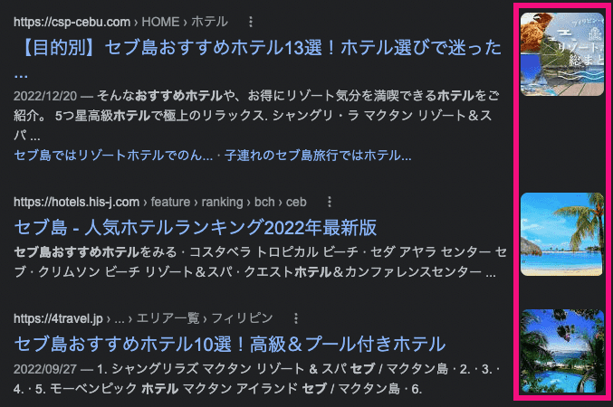

ブログのSEO上、サムネイル画像、OGP画像を静的ジェネレータを使っていてもきちんとしたサイズで出力したい。かといっていちいち何枚も画像を作るのも面倒。

Gatsbyでは画像フォーマットも変更でき、リサイズした画像が作成できます。

そこで記事ごとにリサイズしたサムネイル画像（正方形）、OGP画像（長方形）を出力する方法をご紹介します。

<prof></prof>

## 早速、OGP用にリサイズした画像パスを取得する
この記事はSEOのプラグイン *Helmet* を使うことが前提で、以下記事の拡張版です。


<card id="/blogs/entry418/"></card>

もちろん *gatsby-plugin-image* がすでに導入されていることも前提です。記事詳細やimgタグの出力がわからない方はこちらをご覧ください。

<card id="/blogs/entry406/"></card>

## GraphQL で img 内に格納されたサムネイル画像の画像のパスだけ抜き取る

OGPとはFacebookやTwitterなどのSNSでリンクをシェアした時に表示される画像のことです。
<br>一般的にはOGP画像がある方が目立ち、クリック率などに良い影響を与えるので、Gatsbyを使った静的ジェネレーターサイトでも実装したほうがもちろんいいです。

ここでの留意点はリサイズはあくまで大きな画像を小さくするので元々小さなサイズは大きくすることはできないということと、アイキャッチが設定されていない記事からはリサイズ画像を取得できません。

なのでダミー画像も用意しておきます。

```
root/
├ static/images/
|         ├ ogp.png
|         └ thumbnail.png
└ src/
  ├ components/seo.js
  └ template/blog-post.js
```

以下は記事詳細を出力するコンポーネントです。前提として記事詳細では markdown で記述し front matter に `hero` という名前でアイキャッチとして使う画像を記載しておきます。（markdown、 front matter について詳しくは[こちら](/blogs/entry406/)）

```js:title=blog-post.js
import * as React from "react"
import Seo from "../components/seo"
import { GraphQL } from "gatsby"

const BlogPostTemplate = ({ data, location }) => {
  const ogpSrc = data.ogpSrc
    ? `${data.ogpSrc.childImageSharp.resize.src}`
    : "/images/ogp.png"

  const seoData = {
      ogpSrc; ogpSrc,
      /*省略*/
    }

  return (
    <Layout location={location} title={siteTitle}>
      <Seo data={seoData}/>
      {/*省略*/}
    </Layout>
  )
}

export const pageQuery = GraphQL`
  query BlogPostBySlug(
    $id: String!
    $hero: String
  ) {
    site {
      siteMetadata {
        title
        siteUrl
      }
    }
    ogpSrc: file(
      relativePath: { eq: $hero }
      sourceInstanceName: { eq: "images" }
      ) {
      childImageSharp {
        resize(width: 1200, height:630, toFormat: PNG, quality: 30) {
          src
        }
      }
    }
    markdownRemark(id: { eq: $id }) {
      id
      fields {
        slug
      }
      frontmatter {
        title
        description
        hero
      }
    }
  }
`
```
OGP画像は環境下にもよりますが、小さく表示されることが多いので今回は画像のクオリティはかなり下げてみました。お好みで調整してください。

## Helmet 側で出力する

リサイズされた画像パスは GraphQL 経由で data に格納されます。そのパスを取り出して Seo コンポーネントに渡します。

```js:title=seo.js
import * as React from "react"
import { Helmet } from "react-helmet"
 /*省略*/

const Seo = ({lang, meta, data}) => {
return (
  <Helmet
      /*省略*/
    meta={[
      /*省略*/
      {
        property: `og:image`,
        content: data.ogpSrc,
      },
        ].concat(meta)}
  >)
}
```

出力結果は以下の通りとなります。

```html:title=出力結果
<meta property="og:image" content="***.png" data-react-helmet="true">
```
## 検索画面にサムネイル画像を出力させるコードも追加
検索画面にサムネイル画像を出力させるコードも追加します。

検索画面でのサムネイル画像は 運次第でサムネイルが出力されますが、表示されるとクリック率にかなり影響します。表示は Google のさじ加減ですが設置しておくのは得策です。

推奨サイズは正方形なので今回は300×300でリサイズしたものをHelmet側で出力します。



```js:title=blog-post.js
/*省略*/

const BlogPostTemplate = ({ data, location }) => {
  /*省略*/
  const thumbnailSrc= data.thumbnailSrc
    ? `${data.thumbnailSrc.childImageSharp.resize.src}`
    : "/images/thumbnail.png"

  const seoData = {
      thumbnailSrc; thumbnailSrc,
      /*省略*/
    }

  return (
    <Layout location={location} title={siteTitle}>
      <Seo data={seoData} />
      {/*省略*/}
    </Layout>
  )
}

export const pageQuery = GraphQL`
  query BlogPostBySlug(
    $id: String!
    $hero: String
  ) {
    /*省略*/
    thumnailSrc: file(
      relativePath: { eq: $hero }
      sourceInstanceName: { eq: "images" }
      ) {
      childImageSharp {
        resize(width: 300, height:300, toFormat: PNG, quality: 30) {
          src
        }
      }
    }
  }
`
```

```js:title=seo.js
import * as React from "react"
import { Helmet } from "react-helmet"
 /*省略*/

const Seo = ({lang, meta, data}) => {
return (
  <Helmet
      /*省略*/
    meta={[
      /*省略*/
      {
        name: `thumbnail`,
        content: data.thumbnailSrc,
      },
        ].concat(meta)}
  >)
}
```
出力結果は以下です。
```html:title=出力結果
<meta name="thumbnail" content="***.png" data-react-helmet="true">
```
## まとめ・Gatsby なら GraphQL からリサイズした適正画像を生成可能
今回、SEO強化のためにあれこれ画策していた際に今までのOGP画像のパス取得方法がイケてなかったので改めて記事にまとめました。

まだまだ Gatsby の記事は少ないので、また新しいナリッジがたまりましたら記事化しようと思います。

皆さんのコーディングライフの一助となれば幸いです。

最後までお読みいただきありがとうございました。

v5へのアップグレード方法はこちら。
<card id="/blogs/entry519/"></card>
