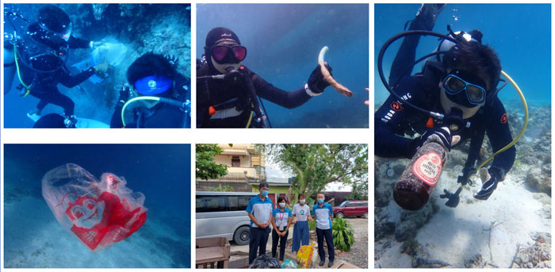

先日、フィリピンで廃棄プラスチックのリサイクルプロジェクトに取り組む企業 [Guun Co. Ltd. Philippine Branch](https://www.facebook.com/p/Guun-Co-Ltd-Philippine-Branch-100063939460175/) さんにお邪魔してきました。

ご案内いただいたのは、フィリピン支店副支店長でブルーエコノミー研究所シニアマネージャーの原木裕さんです。

工場見学することになったきっかけですが、友達とスペイン料理のお店「Terry's Bistro & Gourmet Store」に行ったら、たまたま隣のテーブルに日本人の方々を発見。しかも私の友達の知り合いという偶然。

お店情報 : <small><a href="https://www.facebook.com/p/Terrys-Bistro-Gourmet-Store-100089450187957/" target="_blank" rel="noopener">Terry's Bistro & Gourmet Store (Cebu City Branch) </a></small>

<msg txt="今度、ぜひうちの工場に遊びに来てください。" name="原木さん" cls="right"  img="common/haraki.jpg"></msg>

<msg txt="え？！私、（工場好きなので）マジで行きますよwww"></msg>

ワタクシ、約束は守る女。 ということでメールを送り付けアポを取り、工場見学してきましたのでそのお話をシェアします。

<prof></prof>

## まず、フィリピンのゴミ問題について

フィリピンに住んでいると道端にゴミがガッツリ落ちているのが当たり前。私の住む IT パークも一歩外に出ればご覧の通り。

<msg txt="本当、清潔感に関しては日本はいい国やなぁ。。。"></msg>

と、しみじみ思います。

## なぜ Guun さんはフィリピンのゴミ問題に取り組むようになったのか

<msg txt="セブ市と横浜市が、持続可能な都市開発に関する都市間連携の覚書を交わしており、2012年に横浜市Y-PORT事業による現地合同調査に弊社が参加し、現地の廃棄物処理に関する課題を知ったことが、廃棄プラスチックのリサイクルプロジェクトに取り組むきっかけとなりました。" name="原木さん" cls="right"  img="common/haraki.jpg"></msg>

<msg txt="ほへー、そうなんですか？！！"></msg>

Guun さんのプロジェクトは 2012 年からスタートしています。

セブ市のごみ埋め立て処理場のゴミの成分を分析、燃料として再利用できないかと調査を始めたそう。

当時、Guun さんはセブの地方自治体と約 3 ヶ月間 ゴミ捨て場（ダンプサイト）に捨てられるゴミを調査し、再利用できるものがあるか模索しました。

<msg txt="そもそも、ペットボトルなどの素材・プラスチックって <em>石油からできている</em> じゃないですか？ つまり、燃料として使えるんですよ。" name="原木さん" cls="right"  img="common/haraki.jpg"></msg>

<msg txt="なるほど！！確かに！！！"></msg>

## 「きちんと」処理すればゴミも再利用できる

Guun さんの調査の結果、家庭から廃棄されるゴミは _フラフ燃料_ として十分再利用できるということが分かりました。

しかも、石炭より CO2 排出量が少ないのも魅力です。

| 比較         | フラフ燃料と石炭の比較       |
| ------------ | ---------------------------- |
| _CO2 排出_   | 17% 削減（※）                |
| _カロリー価_ | 同レベル, 5,000 kcal/kg 以上 |
| _水分含有量_ | 20％以下目標                 |

<small class="caption--left">※ Guun さん調べ</small>

 ゴミを減らして、CO2 削減できるのってすんごくないですか？

#### フラフ燃料とは？

フラフ燃料とは **廃プラスチック類を主原料とした、細かく砕かれた状態の燃料** のことだそう。

**ゴミとして廃棄されたプラ袋やお菓子の袋は _燃料として再利用_ できる**んですよ？！10 年以上前からフィリピンでゴミ再利用してフラフ燃料化する取り組みをしていた Guun さん、感慨深いです。

昨今、サステナビリティ（広域で環境・社会・経済の 3 つの観点からこの世の中を持続可能にする考え方）に対する関心が社会全体で強まっています。 Guun さんはまさに先駆者ですね。

### ゴミがフラフ燃料になるまで

Guun さんに搬入されたゴミは大まかに仕分けられます。

燃料になるゴミのみを手作業で仕分けます。

最後に特殊な機械でゴミを細かくし、圧縮します。

<small class="caption">0.5 トンもある完成したフラフ燃料</small>

#### フラフ燃料の用途

_フラフ燃料_ の用途ってご存知ですか？

ズバリ、主に最先端のセメント製造技術に活用されています。セメントを生成するためには高熱で熱する必要があるそうです。

<small class="caption">UBE 三菱セメント株式会社 HP より引用</small>

今や急激に経済成長しているフィリピン。建築やインフラ整備に必要不可欠なセメント生成にフラフ燃料が一役買っているワケです。

## Guun さんとフィリピン国内の自治体との歩み

日本ではゴミの分別は当たり前ですが、フィリピンでは比べものにならないくらいゴミの分別に関するルールは自治体に依存します。

ちなみに私の住むセブ市では、ほぼ分別せずにゴミを出しています。

一方、お隣のマンダウエ市では住民が分別する習慣が根付きつつあるそうで、リサイクルしやすいゴミがだいぶ増えているとのこと。

<msg txt="今では弊社に持ち込まれるマンダウエ市の <em>ゴミの85％がリサイクル</em> に繋がってますが、最初はそんなことなかったんですよ。 横浜市の事例を参考に、「こうしたらいい！」というフィードバックを重ねました。 結果、リサイクル率が向上したんですよ。" name="原木さん" cls="right"  img="common/haraki.jpg"></msg>

<msg txt="ほーーー!!! <em>フィードバックと地方自治体</em> との連携が大切なんですね。時間をかけ、住人への「 <em>なぜ分別する必要があるのか</em>」を伝え続けることがカギなんですね。"></msg>

### フィリピンのゴミ処理の現状

現状、基本フィリピンの **ゴミ処理は埋め立て** です。

私も何度か訪問したことがありますが、フィリピンにはゴミを捨てる場所、いわゆるゴミ山（ダンプサイト）があります。

ダンプサイトでは、ゴミを拾って売ることで生計を立てる人も住んでいます。

フィリピンのスラム街の様子を知りたい方はこちらをご覧ください。

<card slug="entry464"></card>

### 地方自治体と民間企業でタッグを組んだら、埋め立てるゴミの割合に変化が？！

Guun さんとマンダウエ市で協力し、住民にゴミを分別する大切さを伝え続けた結果、変化が起こります。

<msg txt="なんと埋め立る <em>ゴミが全体の半分に削減</em> できたんです！これは市と協力して住民に訴求し続けた結果です。" name="原木さん" cls="right"  img="common/haraki.jpg"></msg>

<msg txt="すごい成果ですね！！伝え続けることって本当に大事ですね！！！"></msg>

## セブで環境問題に取り組みたい地元の企業やボランティア団体とも連携する Guun さん

<msg txt="もちろん、家庭ゴミだけではなく環境問題に取り組む企業様からもゴミを回収しています。SDGs に取り組む企業様も増えてますからね。弊社ではゴミを納入された企業様へ証明書を発行しています。 ゴミを納入いただいた企業様が、どれだけ環境に貢献したかわかりますしね。" name="原木さん" cls="right"  img="common/haraki.jpg"></msg>

<msg txt="またセブの日本人会や日系ダイビングショップが開催するゴミ拾いのアクティビティに参加し、集めたごみをダンプサイトに持ち込むのではなく、弊社で処理するようにしました。" name="原木さん" cls="right"  img="common/haraki.jpg"></msg>

<msg txt="神守（本名）さんもご存知通り、セブも広いんですが、、、、 わざわざ遠くからトラックをレンタルしてゴミを持ってきてくれる、ゴミ問題に関心のあるボランティア団体もあるんですよ。" name="原木さん" cls="right"  img="common/haraki.jpg"></msg>

<msg txt="え？！！そんな遠くからボランティア団体が Guun さんの取り組みを知って来るなんて、、、世の中は本当にリサイクルや環境への意識が高まっているんですね。"></msg>

## まとめ・ゴミを再利用するのは環境にやさしい

今回、工場大好きフェチで自分勝手にお邪魔した Guun さんでしたが、改めて環境問題に関して深く考える機会をいただけました。

原木さんとの会話の中で興味深い内容がありました。

<msg txt="リサイクルには2通り有るんです。例えばプラスチックを元通りの素材として再利用する方法と、弊社のやっているような燃料として扱うなど他のものに変えて再利用する方法です。ヨーロッパでは前者が主流です。" name="原木さん" cls="right"  img="common/haraki.jpg"></msg>

確かに、素材を元に戻すことができるのがベストかも知れません。

でもゴミとして川や海にあふれかえさせるよりは、断然燃料になった方がいいというのが私の見解です。最高の対応ができなくても、環境に対してベストを尽くしていることが大事だと私は考えます。

ゴミを燃料に変え、しかもセブでフィリピン人の雇用も生んでいる Guun さん、とてもステキでした。

隅々まで見学させていただいただけではなく、丁寧なプレゼン資料までご用意いただいた原木さんには心から感謝です。

人数規模にもよりますが工場見学を受け付けているみたいなので、興味のある方は Guun さんにぜひ足を運んでみてください。もちろん、事前に連絡・確認してくださいね。

[Guun Co. Ltd. Philippine Branch](https://www.facebook.com/p/Guun-Co-Ltd-Philippine-Branch-100063939460175/)

最後までお読みいただきありがとうございました。
