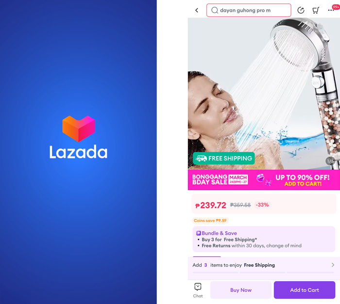
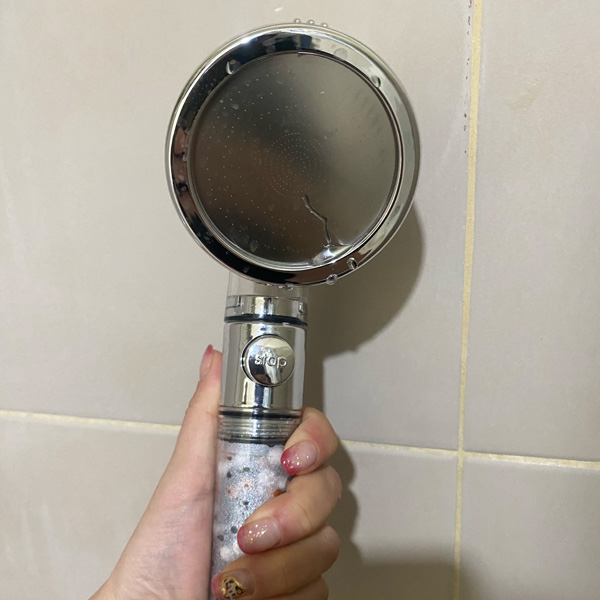
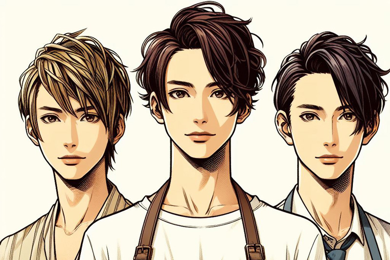

セブに住んで早いもので 5 年経ちます。

ほぼ不自由なく暮らせてはいますが、悩みは日本にいたときに比べ髪がとても傷んでしまったこと。

特に髪が _干し草_ みたいにパサパサになってしまい、オイルなしではお出かけできなくなってしまいました。

美容院に行ったときは必ずトリートメントはしているものの、数日経つと元通りの干し草に戻ってしまい…涙。紫外線も浴びないようにお出かけ時は必ず帽子を被るなど、とても気を使っていましたが効果も見られない…。

せめて、傷んだ髪をカットすることでひどくなるのを防ぐくらいしかできませんでした。本当は髪伸ばしたいのに…。

<msg txt="日本人が海外で生活して髪が傷むのはよく聞く話です"></msg>

そこで今回はセブ島で髪が傷む原因やその対処法などを実体験を元に記事にしてみました。

<prof></prof>

セブにいてもすぐできることなのでぜひ、興味のある方は試してみて下さい。

## 髪の傷みの原因は？美容師さんとの会話で水道水の水質と発覚

ある日知り合い（美容師）と話をしていて、ふと髪が傷む原因の話題になりました。

<msg txt="髪が傷む原因は多分水質ですよ。セブの水はアルカリ性ですから。" img="common/biyoushi1.jpg" name="美容師さん" cls="right"></msg>
<msg txt="へー、知らなかった！"></msg>

<msg txt="2、３日に一度のシャンプーで我慢すればいいんですよ！" img="common/biyoushi1.jpg" name="美容師さん" cls="right"></msg>

<msg txt="常夏の国でそれはちょっと…。"></msg>

傷む髪のことで周囲に聞き込みしているとボロボロと証言があり、もっと深刻な悩みも…。

<msg txt="日本や他の国にいたときに比べ髪が抜けるんですよね。もうね、結構深刻なくらい。◯ゲるんじゃないかって心配。" img="common/biyoushi4.jpg" name="30代男性" cls="right"></msg>

<msg txt="僕もセブに来た頃より生え際が後退してきた気がします。" img="common/biyoushi3.jpg" name="20代男性" cls="right"></msg>

<msg txt="うぅ、若いのにかわいそう…。"></msg>

水こわー！！！

## 髪が痛むメカニズム

髪が傷む原因はどうやら、アルカリ性というところまでたどり着きました。

そこでなぜアルカリ性の水で傷むのか、調べてみました。

### 健康な髪は弱酸性

健康は髪は弱酸性（pH4.5 〜 5.5）で、アルカリ性に傾くと髪のキューティクルが開いた状態になります。

髪がアルカリ性に傾いた状態が続くと、もちろんキューティクルが開きっぱなしになり本来髪の中に蓄えられていた水分などの大切な成分が抜けてしまうのでパサパサになるのです。

### 水道水がなぜアルカリ性に傾くのか

塩素がたっぷりはいったプールに入った後、髪がガシガシになる経験はしたことはありませんか?

アルカリ性に傾くのは、主に **水の殺菌などに使われる*塩素*** が原因です。

日本の水道水も実は pH 値 7 ～ 8 で中性からアルカリ性らしく、フィリピンと pH 的には変わらないみたいです。ただ、日本の水道水の安全基準は法律で市販のミネラルウォーターより厳しいらしく、雑菌や汚染など別の理由で水質が別格なのかもしれません。

日本と比べるとフィリピンの水道水は飲めませんからね。
<msg txt="日本の水道水は高度な浄水技術によりそもそも安全！！"></msg>

美容師さんは普段お仕事柄、 pH コントロールしてキューティクルを開いたり閉じたりしてカラーやパーマしたりするので pH が原因の一つだと思ったんでしょうね。

## フィルター付きシャワーヘッドを買って使ってみる

フィルター付きのシャワーヘッドを [Lazada（フィリピンの通販アプリ）](https://www.lazada.com.ph/)で探すことにしました。

pH 調整でき、不純物を取り除けるシャワーヘッドを見つけたので早速購入。

約 240 ペソでした。値段も値段なので効果も期待せず、「ダメだったらまた別のものを探せばいい」ぐらいの気持ちで試してみることにしました。

そもそも、このアプリでは安いのが売りなので質の良いものはあまり売ってません。 ちゃんとしたものを買いたいなら信頼あるメーカーから取り寄せたり、日本で購入したほうがいいかもです。

### 結果・髪の毛がマシになった

以下のような改善が見られました。

- シャンプーの泡立ちが良くなった
- シャワー中のカルキ（塩素）臭さが減った
- ドライ後のオイルが必要なくなった

シャワーヘッド取り替えて 4 週間後、美容院に行ってみると…。

<msg txt="以前よりマシになりましたね！指通りが違います。" img="common/biyoushi2.jpg" name="美容師さん" cls="right"></msg>

ヤッ*｡٩(ˊᗜˋ*)و\*｡ター！効果あったみたいです！！！

コスパからするとかなりいいんじゃないでしょうか?

## どうやら硬水の方がもっとヤバいかも

日本の水は軟水、フィリピンの水は硬水です。

フィリピンの水は石灰が含まれているので、水回りのあちこちが白くなります。

調べていくうちに、この _硬水がもっとヤバい_ かもということが発覚しました。

### 【弊害その 1】髪がきしむ

髪を洗うと硬水のミネラルと髪のタンパク質が反応し付着したままになることがあります。

また、シャンプーなどの洗浄剤がミネラルと反応してできたいわゆる石鹸カスも、髪の上に残りやすいです。

しかもこの石鹸カスは水に溶けず髪に残留しやすい性質です。その結果、髪がきしんだ状態になってしまいます。

<msg txt="流しの白い汚れ（ウロコ）がそのまま頭皮や髪の表面に残っているのを想像してみてほしいです。"></msg>

### 【弊害その 2】髪や頭皮が乾燥

髪や頭皮に残った石鹸カスは乾燥を引き起こします。その状態が蓄積されると、髪がゴワゴワの干し草のように…。

<msg txt="お肌の乾燥は油脂分泌を促すので、頭皮に良くないです。 セブは常夏で、ただでさえ頭皮から脂の分泌が促進されがち。 道理で抜け毛が増えるわけだ。"></msg>

<small>※ 元・美容インストラクターなので、肌の構造やメカニズムには詳しいです。</small>

### 【弊害その 3】シャンプーが泡立ちにくい

硬水に含まれる金属イオンがシャンプーの成分と反応し、界面活性剤の働きを妨げます。結果、余分な皮脂や汚れを取り除けません。

<msg txt="セブに来たての頃、シャワーのたびに「なんでこんなに泡立たないんだ」って思ってたけど、そういうことだったのね…。"></msg>

### 【弊害その 4】石鹸カスが邪魔してトリートメントが効かない

水でも流せない石鹸カスが残っている髪に、トリートメントの効きは悪くなります。

<msg txt="私は何回トリートメントをムダにしてきたんだ…。"></msg>

### 日本のシャンプー＆トリートメントを使っている人は要注意

わざわざ日本からシャンプーやトリートメントを持ってきて使っている人も結構います。

日本で使われているシャンプーなどの多くは日本の水、つまり軟水用に開発されていることが多いようです。

軟水仕様のシャンプーは硬水（ミネラル類）と化学反応が起こるなど、相性が悪い可能性があるので注意が必要です。むしろ現地のシャンプー・トリートメント（硬水向け）を使ったほうが良いこともあります。

## まとめ・高いトリートメントでヘアケアするより、まず使用している水を見直す

まだまだ時間がかかりそうですが、髪の状態はだいぶ良くなりました！

私は現地で調達したシャンプー・トリートメント（LUX）を使っていますが、髪を乾かした後もまとまるようになりました。

<msg txt="人間は何か解決しようとするとき、つい足し算の発想になるけど足せばいいってもんじゃない。引き算も大事。"></msg>

実は硬水は軟化させる装置やフィルターもあるみたいなので、もっと髪をいたわりたいならそういうものも用意したほうがいいかもしれません。

今回は、海外生活で髪が傷んだり抜け毛に悩んでいる人のために、その原因や実際に試して効果があったことを記事にしました。

<msg txt="抜け毛に関しては暑さによる皮脂の分泌も関係している可能性もあるかもです…。"></msg>

この記事が、みなさまの海外生活の一助となれば幸いです。

最後までお読みいただきありがとうございました。

参考

- [健康的な髪の毛は「弱酸性」｜髪の毛と pH の関係について解説！](https://quickpcr.jp/contents/womanhair/hair-ph-detail/)
- [海外に行くなら水質に注意！硬水が髪の毛に与える影響と対策を解説](https://quickpcr.jp/contents/womanhair/hard-water/)

### おまけ・イラストは Colipot で作成

今回は [Colilot](https://copilot.microsoft.com/) に含まれる Designer という AI ツールでイラストを作らせました。

ものの数分（秒かも）で 4 枚イラスト完成。

ただ「_3 人の 20 代のオシャレな正面を向いた男性_」と依頼したら **ホストチックな見た目のトリオ（三人組）が爆誕** してしまいました。

「オシャレ」とか抽象的な言葉を使ったせいでですね。言葉選びは気をつけねばと思いました。
