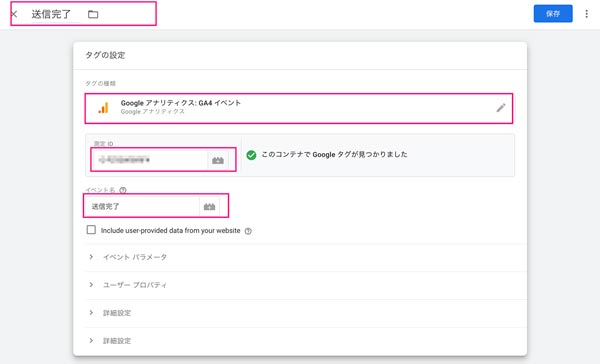

先日、WordPressサイトを弊社 [Lenz Technologies Inc.](https://lenz-ph.com/) で実装させていただきました。

ミニマムペライチのサイトで、特にサンクスページも設けなかったのでコンバージョンをどうやって計測しようと思った結果データレイヤーを追加することで実装することにしました。

他にもやり方はあると思いますがあくまで参考にしていただければ幸いです。

<prof></prof>

## データレイヤーってなんぞ？

> データレイヤーとは、Google タグマネージャー（GTM）とウェブページ間で情報をやり取りするための配列（変数が複数くっついたもの）です。ページ上のさまざまなイベントやデータ（商品ID、購入金額、ユーザーの行動など）を記録し、GTMなどのタグ管理ツールが取得できるようにします。<br>
> データレイヤーは、JavaScriptオブジェクトとしてウェブページに埋め込まれ、GTMによって読み取られて分析やトラッキングのために使用されます。

とのこと。Google検索が最近勝手に概要作ってくれるので便利ですね。

## データレイヤーの追加方法
Googleタグマネージャーを実装しているサイトであれば以下のコードでデータレイヤーを追加可能です。

```js:title=JS
window.dataLayer = window.dataLayer || [];
window.dataLayer.push({
 //ここに追加したいデータレイヤー
});
```
例えば単にコンバージョンの数（この場合のコンバージョンはお問い合わせの数）を計測したいだけであれば、`applied`というイベント（`event`）として追加するだけで十分です。

```js:title=JS
window.dataLayer = window.dataLayer || [];
  window.dataLayer.push({
  'event': 'applied'
});
```
## Contact Form 7 送信後の処理にデータレイヤーを追加
WordPress おなじみのフォームには プラグイン [Contact Form 7](https://wordpress.org/plugins/contact-form-7/) があります。個人的にも、使い勝手が良くカスタマイズも簡単なので重宝しています。

Contact Form 7 では以下コードでフォーム送信完了後、JSで諸々操作できます。以下コードはフォームを設置したページに実装します。

```js:title=JS
document.addEventListener( 'wpcf7mailsent', function( event ) {
  //ここにコード
}, false );
```

通常、送信成功の後Thanksページに転送し、Thanksページ訪問数をカウントし、コンバージョン数を計測するのが定石です。

長年いろんなWebサイトを観測して、このやり方では数値の正確性にかけることがあります。<br>
ユーザーがブラウザーバックでThanksページとお問い合わせをいったり来たりしてしまってデータが重複することがあります。

なので、送信成功後一度しか発火しない `wpcf7mailsent` イベントを使ってデータレイヤーをGoogle タグマネージャーに送ることで計測します。

```js:title=JS
document.addEventListener( 'wpcf7mailsent', function( event ) {
  window.dataLayer = window.dataLayer || [];
  window.dataLayer.push({
    'event': 'applied'
  });
}, false );
```
## Google Tag マネージャーの設定

GTMで受け取ったイベントをGA4と紐づけます。まずはGTM側でトリガーに「送信完了」を作成します。

1. カスタムイベント
2. イベント名設定
3. 一部のイベントを選び条件設定


タグを追加します。

1. Googleアナリティクス:イベント
2. GA4のIT追加（変数に設定しておいてもいいかも）
3. イベント命名名



## おまけ・TypeScript × Vue.js で作ったSPAのフォームにも追加してみた
TypeScript × Vue.js で作成したSPAフォームにもDatalayerを追加してみたので、そのコードを紹介しておきます。

```JS:title=コード
<script setup lang="ts">
import axios from 'axios';
//データレイヤーの呼び出し
const { dataLayer }: any = window;
//データレイヤーを追加する関数
const gtmDataLayer = ()=>{
  dataLayer?.push({
    'event': 'applied'
  });
}
//送信閭里
const onSubmit = ()=>{
  axios({
    method: "POST",
    headers: { "Content-Type": "application/x-www-form-urlencoded" },
    data: params,
    url: "/"
  }).then(res => {
    // 送信完了した時に追加の処理をする
    gtmDataLayer()
    ...
  }).catch(err => {
    ...
  });
}
</script>
<template>
  <form>
    ...フォームパーツ諸々
   <button type="button" @click="onSubmit">Send</button>
  </form>
</template>
```
## さいごに
今回はGTMのデータレイヤーを使ってContact Form 7のコンバージョン測定をする方法をまとめてみました。最近は運用の仕事も増えてまして、データレイヤーなどを扱うときに「プログラミングできてよかった」って思うことがよくあります。

走り書きなので多分加筆します笑。

ナレッジは溜まっているのに、忙しさにかまけて随分とブログを書いていなかったのでたまには更新しなきゃと久々にブログを書きました。昨年は二回しか更新していませんが、2014年から書いているので14年めです。

この記事が皆さんの一助となれば幸いです。最後までお読みいただきありがとうございました。
