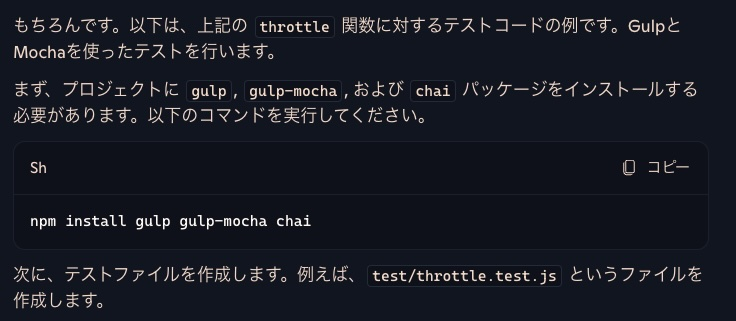
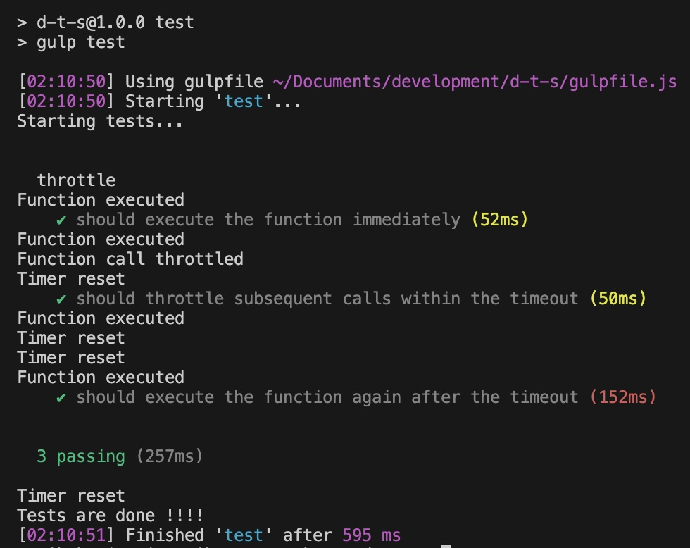

copilot は Microsft が提供数する AI (アシスタントツール)です。今回はその colilot　（無料枠）を利用してテストコードを書いたことを記事化しました。

> Generative AI コパイロット（Microsoft Copilot）は、Microsoft社が提供するAIアシスタントツールです。
> * ユーザーの質問やリクエストを理解し、直接応答する
> * 文章作成を支援する
> * 画像を作成する
> * メールやWord文書作成などの作業負担を軽減する


ユニットテストとは、プログラムを構成する最小単位（モジュール）の機能が正しく動作しているかどうかを確認するテストです。単体テストとも呼ばれます。

* バグを効率的に発見する
* コードの理解と修正を容易にする
* 迅速な変更を行う

*大切なのはモジュール化* で、単体単位でトラブルを回避できることが重要です。大森林の中で特定の木の問題を探すより、自宅の庭に生えている木の問題を探すほうが簡単ですよね？

<msg txt="この例え話は自宅の敷地が広い人は対象外です！！"></msg>

範囲が狭ければ狭いほど問題も探しやすくなります。それでは、行ってみましょう！

<prof></prof>

*今回の対象者*
* JS でテストしたい
* JS のバグを早期発見したい
* 予期しないバグを事前に取り除いておきたい
* ある程度JSやプログラミングのロジックを理解していてコードが書ける
* ESモジュールで記載できる

この記事でやっていることを試してみたい方で、 copilot のアカウントがない方は、こちらから登録をお願いします。

[Microsft Copilot](https://copilot.microsoft.com/)

## 環境構築(Gulp＆Mocha)
インストールするモジュール
* gulp
* gulp-plumber
* gulp-mocha
* gulp-notify

開発環境に適宜必要なnpmモジュールをインストール
```shell:title=コマンド
npm i モジュール1 モジュール２ -D
```

```js:title=gulpfile.js
import { src } from 'gulp'; // series 等必要に応じて追加する
import mocha from 'gulp-mocha';
import plumber from 'gulp-plumber';
import notify from 'gulp-notify';

const runMocha = (done) => {
  console.log('Starting tests...');
  return src(['src/__test__/*.js'], { read: false })
    .pipe(plumber({
      errorHandler: notify.onError({
        title: 'Gulp Mocha',
        message: 'Error: <%= error.message %>',
      })
    }))
    .pipe(mocha({ reporter: 'spec' }))  // 標準の 'spec' レポーターを使用
    .on('error', (err) => {
      notify.onError({
        title: 'Mocha Test Failure',
        message: 'Test failed, see console for details.',//テスト失敗
      })(err);
      done(err);  // エラーが発生した場合にタスクを完了
    })
    .on('end', () => {
      console.log('Tests are done !!!!');
      done();  // タスクの終了時にタスクを完了
    });
};
export const test = runMocha;
```

テストファイルは見ての通り、`./src/__test__/` に格納します。

テストの script をpackage.jsonに追記。
```json:title=package.json
 "scripts": {
    ...
    "test": "gulp test",
    ...
  },
```
```shell:title=コマンド
npm run test
```
#### テストファイルの設定
今回は以下記事のように、Browserify + Browserify + Babel で作った環境だったのでいくつか別にモジュールを入れました。

この設定を行った理由は、最小単位（Module）でデバッグを行いたかったからです。ほかにもESモジュールをトランスパイル（CommonJSにソースコードに変換）したことも起因しています。

もう時代的にはこの設定は必要ないかもしれないんでまたこの記事も見直します。

<card slug="entry540"></card>

* @babel/core
* @babel/register
* @babel/preset-env
* @babel/plugin-transform-modules-commonjs

babel でトランスパイルしたファイルのテストが通るように、プロジェクトのルートに `.babelrc` ファイルを作成。
```
{
  "presets": ["@babel/preset-env"],
  "plugins": ["@babel/plugin-transform-modules-commonjs"]
}
```
テストファイルの上には必ず上記を記載。
```js
import '@babel/register';
```
## 実際のcopilotでのプロンプト（AIに尋ねる）の進め方

今回はテスト用のライブラリとしてMochaを採用しました。

JSテストライブラリはいくつかあるので、適宜調べて自分にあうものを使ってみてください。
### 慣れないうちはコードを投げてテストコードを提案させる

慣れないうちは、そのままコードを copilot 投げてみましょう。

copilot がコードをみてどんな処理をしたいか理解してくれます。

copilot は Github を所有する Microsoft が提供するサービスです。プログラミングでは老舗なだけでなく、コンプラガン無視して思うに、あれだけ大量のコードのあるGithubの相当優秀なはず笑。

そのままコードを投げて、テスト内容が意図しない返答が返ってきたらそもそも自分が~~クソ~~コードを書いているかもしれません。

プロンプトはこんな感じ。今回は単純なコードをテストしてみます。

`以下コードをgulp-mochaのテストコードを書いてください`
```js:title=./src/js/_inc/_throttle.js
/**
 * 指定された関数の呼び出し回数を制限し、`timeout` ミリ秒ごとに1回だけ呼び出されるようにします
 *
 * @param {Function} func - 制限する関数
 * @param {number} timeout - 関数を再度呼び出すまでに待機するミリ秒数
 * @returns {Function} 制限された関数
 */
const throttle = (func, timeout) => {
    let timer = null;

    return function (...args) {
        const context = this;

        if (!timer) {
            console.log('Function executed');
            func.apply(context, args);
            timer = setTimeout(() => {
                clearTimeout(timer);
                timer = null;
                console.log('Timer reset');
            }, timeout);
        } else {
            console.log('Function call throttled');
        }
    };
};

export default throttle;
```
すると、こんな回答が帰ってきます。



言われるがままに chai もインストール。

> chai は JavaScript のテスティングフレームワークで、主にアサーション（テストの期待結果を検証すること）をサポートするために使われます。アサーションライブラリとも呼ばれ、テストコードを書く際に使うと、コードが期待通りに動作しているかどうかを確認することができます。
```js:title=./src/__test__/throttle.test.js
import { expect } from 'chai';
import throttle from '../path/to/throttle.js'; // throttle 関数の正しいパスを指定してください

describe('throttle', function () {
    it('should execute the function immediately', function (done) {
        let called = false;
        const func = () => { called = true; };
        const throttledFunc = throttle(func, 100);

        throttledFunc();
        
        setTimeout(() => {
            expect(called).to.be.true;
            done();
        }, 50);
    });

    it('should throttle subsequent calls within the timeout', function (done) {
        let callCount = 0;
        const func = () => { callCount++; };
        const throttledFunc = throttle(func, 100);

        throttledFunc();
        throttledFunc();
        
        setTimeout(() => {
            expect(callCount).to.equal(1);
            done();
        }, 50);
    });

    it('should execute the function again after the timeout', function (done) {
        let callCount = 0;
        const func = () => { callCount++; };
        const throttledFunc = throttle(func, 100);

        throttledFunc();
        
        setTimeout(() => {
            throttledFunc();
            expect(callCount).to.equal(2);
            done();
        }, 150);
    });
});

```
以下が Should (必須)で行われるか確認します。
* should execute the function immediately(関数が即時に実行)
* should throttle subsequent calls within the timeout(タイムアウト以内に後続の呼び出しを抑制)
* should execute the function again after the timeout（タイムアウト後に関数を再度実行）


実行（execute）通りにテストが通りましたね！！
### 複雑な処理は確認したい項目を処理順に分けて順番にテストコードを書かせる
最小単位（順番）といえど複雑な処理を走らせる場合は更に分解します。

コードを書く→デバッグ→テスト

を各ステップごとに行うのが良いと思われます。

例えば、Instagram 投稿一覧の取得などをAPIで呼び出すようようなプログラムの場合、まずはAPIの呼び出しに成功したかどうかを確認する必要がありますよね？

そんな感じで一つづつ細分化してテストコードのプロンプトをちょっとづつ進めます。

今回例えば、jsdom　というDOMに見立てたモジュールが合ったのですが、割と新しめのJSの　ObserberAPI に対応しておらずモックを作ることになりました。


<msg txt="AIは万能じゃありません。"></msg>

こんな感じで予期せぬことが起こるので分解して、問題を早期発見しながら進めないといつまでも終わらないプロンプトループにハマることがあります。

<msg txt="colpolot も ChatGPTほどじゃないけどたまにあやふやな情報出してきますwww"></msg>

うまくいかない場合は、適宜ググったり従来の方法を試しつつ進めるべきです。そういう時に融通や鼻がきかない新人エンジニアには使いこなすのは厳しいと思いました涙

## まとめ・テストコードを書いたらナレッジが爆上がりした

copilot を使いながらテストをしていて、まあまあ感動したことが多々あろ、ありました。

<msg txt="へーーーー！！こんな書き方あるんだ！！"></msg>

コードの質はたまに怒りレベルのこともありますが、とてもレベルが高いですし、自分の保守性の低い~~クソ~~コードを反省しています。

AIすごいなぁ。。。。人間がしなくていいことを人間よりハイクオリティでやってくれるから、脳死状態で作業だけしている人間は淘汰されて行くんだろうなぁと遠い目にもなりつつ。。。
### AI時代、アイデアを持っている人だけ生き残る

結局、このAI時代、アイデアを持っている人だけ生き残るのだと強烈に痛感しました。

そんな感想も述べつつ今回の記事もお開きにさせていただきます。

この記事がみなさんのコーディングライフの一助と慣れば幸いです。

最後までお読みいただきありがとうございました。
