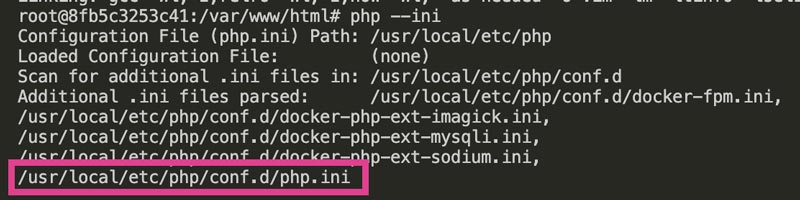

サーバー、PHP、データベースはバージョンや種類が違うと今まで使えていたメソッドが突然使えなくなったり、結構困ることがあります。

特に、`wordpress:latest`　などの出来合いの Docker イメージを使うと PHP Warning のような軽微なエラーが表示されないこともあります。

今回は Docker を本番環境に忠実に再現し、エラーを開発の段階で取り除けるような環境を構築します。

記事が長くなってしまったので前半は、Docker を本番環境に忠実に作成する手順を解説し[、後半では実際のエラーを出力できるようにしログ](/blogs/entry544/)を出力する方法を解説しています。

<prof></prof>

*この記事の対象者*
* サーバー・インフラのことはあんまりわからない
* 自分のコードのエラーが確認できる環境を構築したい
* Dockerをイチから作ってみたい
* 本番環境と開発環境で使うサーバー、PHP、データベースの種類やバージョンを厳格に揃えたい

インストール方法はこちらを参考にしてください。
<card slug="entry480" anchor="dockerインストール"></card>

## docker-compose.yml ファイルの準備

<msg txt="YAML（YAML Ain't Markup Language）は、人間が読みやすく、書きやすいデータフォーマットのこと。インデントによって構造を表現するため、見た目がシンプルで分かりやすいですよね！"></msg>

```
myproject/
   └-- docker-compose.yml
```
コンテナの構成です。
```yml:title=docker-compose.yml
version: '3.8'

services: # コンテナサービスの定義
  nginx: # ウェブサーバー（Nginx）
  php: # PHP（PHP-FPM）
  db: # データベースコンテナ（今回は MariaDB）
volumes:
  db_data: {} # 永続的にデータ保存するための領域（ボリューム）
```

Docker では、コンテナの外部にデータを保存できます。この領域のことを「ボリューム」といいます。たとえば、データベースコンテナのデータをボリュームに保存することで、コンテナが停止したり削除された場合でも、データを保つことができます。ボリュームを使用することで、カンタンかつ安全にデータの保存ができます。

### サーバー（nginx） のコンテナを作る

今回は本番と一緒の Nginx（エンジンエックスと読みます） というサーバーを使いました。

バージョンも本番と同じ 1.25.5 とします。

```
myproject/
  ├-- public/
  ├-- docker/
  │   └- nginx/
  │   　  └-- nginx.conf
  └-- docker-compose.yml

```
```yml:title=docker-compose.yml
version: '3.8'
services:
  nginx:
    image: nginx:1.25.5
    #他のコンテナ名と被らないように接頭辞にプロジェクト名をつけておく
    container_name: myproject_nginx
    platform: linux/amd64
    ports:
      - "8000:80"
    volumes:
      #phpファイルなどを置くサーバー
      - ./public:/var/www/html
      #confに関するコンフィグ設定
      - ./docker/nginx/:/etc/nginx/conf.d
    environment:
      TZ: Asia/Manila #日本にしたい場合はAsia/Tokyoに
volumes:
  db_data: {}
```

他のバージョンが使いたい人は、[Nginx - Official Image | Docker Hub](http://hub.docker.com/_/nginx)を参考に。

サーバーの設定ファイルを作ります。

```nginx:title=docker/nginx/nginx.conf
worker_processes 1;  # ワーカープロセスの数を指定

events {
    worker_connections 1024;  # 同時接続数の上限を指定
}

http {
    server {
        listen 80;  # ポート80でリクエストをリッスン
        server_name localhost;  # サーバー名を指定

        root /var/www/html;  # ドキュメントルートを指定
        index index.php index.html index.htm;  # デフォルトのインデックスファイルを指定

        location / {
            try_files $uri $uri/ /index.php?$query_string;  # ファイルが存在しない場合はindex.phpにリダイレクト
        }

        location ~ \.php$ {
            include fastcgi_params;  # FastCGIパラメータを含む
            fastcgi_pass myproject_php:9000;  # PHP-FPMにリクエストを渡す
            fastcgi_index index.php;  # デフォルトのインデックスファイルを指定
            fastcgi_param SCRIPT_FILENAME $document_root$fastcgi_script_name;  # スクリプトファイル名を指定
        }

        location ~ /\.ht {
            deny all;  # .htaccessファイルへのアクセスを拒否
        }
    }
}
```

コンテナに入りちゃんと設定が反映しているか確認します。

```bash:title=コマンド
docker exec -it myproject_nginx /bin/bash
```

Nginx のバージョンを確認。
```bash:title=コマンド
nginx -v
# nginx version: nginx/1.25.5 でOK
```

`date` コマンドでタイムゾーン反映しているか確認してみましょう。
```bash:title=コマンド
root@[コンテナID]:/# date
```


空でもいいので `index.html`ファイルを作成し、public/ディレクトリへ格納にします。

http://localhost:8000/ にアクセスできれば成功です。

### PHP（PHP-FPM） のコンテナを作る
PHP-FPM（PHP FastCGI Process Manager）のコンテナを作ります。

PHP-FPM は PHP を効率的に実行するので、特に高トラフィックのウェブサイトでパフォーマンスを向上させます。

```
myproject/
    ├-- public/
    │   └-- index.html
    ├-- docker/
    │   ├-- nginx/
    │   │   └-- nginx.conf
    │   ├-- errors/  ← 自動生成される
    │   └-- php/
    │        ├-- Dockerfile  ← 追加
    │        └-- php.ini  ← 追加
    └-- docker-compose.yml  ← 修正
```
PHP用のコンテナーの設定。
```yml:title=docker-compose.yml
version: '3.8'
services:
  nginx:
  ...
    depends_on:
      - php #依存関係の追加
  ...
  php:
    build:
      context: ./docker/php  # カスタムのPHPイメージをビルドするためのディレクトリ
    container_name: myproject_php
    platform: linux/amd64
    volumes:
      # PHPファイルなどを置くサーバーのルートディレクトリ
      - ./public:/var/www/html
      # php.iniをコンテナ内の/usr/local/etc/php/conf.dにマウント
      - ./docker/php/php.ini:/usr/local/etc/php/conf.d/php.ini
      # エラーログ用のディレクトリをコンテナ内の/var/logにマウント
      - ./docker/errors/php_errors.log:/var/log/php_errors.log
    environment:
      TZ: Asia/Manila  # タイムゾーンを設定
      PHP_MEMORY_LIMIT: 512M  # PHPのメモリ制限を設定
      PHP_MAX_EXECUTION_TIME: 300  # PHPの最大実行時間を設定
      PHP_UPLOAD_MAX_FILESIZE: 16M  # アップロードファイルの最大サイズを設定
      PHP_POST_MAX_SIZE: 16M  # POSTデータの最大サイズを設定
...
```
Dockerfile で必要なモジュールをインストールします。
```yml:title=docker/php/Dockerfile
FROM php:8.2-fpm

# 必要なパッケージをインストールし、mysqli および imagick 拡張モジュールを有効化
RUN set -eux; \
    apt-get update; \
    apt-get install -y --no-install-recommends \
    libmagickwand-dev \
    vim \
    build-essential \
    && docker-php-ext-install mysqli \
    && docker-php-ext-enable mysqli \
    && pecl install imagick \
    && docker-php-ext-enable imagick \
    && rm -rf /var/lib/apt/lists/*  # 不要なAPTキャッシュを削除
```

`php.ini` にPHPのエラーをログを残せる設定の記述をします。

ここではあえて `display_errors = Off` とし、ページへアクセスしたとき画面に表示させません。

```ini:title=docker/php/php.ini
; すべてのエラーを報告
error_reporting = E_ALL

; エラーを非表示
display_errors = Off

; スタートアップエラーを表示
display_startup_errors = On

; エラーをログに記録
log_errors = On

; エラーログのファイルパス
error_log = /var/log/php_errors.log
memory_limit = 512M
max_execution_time = 300
upload_max_filesize = 16M
post_max_size = 16M
max_input_vars = 1000
```
コンテナを再起動します。
```bash:title=コマンド
docker-compose down
docker-compose up -d
```

コンテナに入って各設定が反映しているか確認します。

```bash:title=コマンド
docker exec -it myproject_php /bin/bash
```

PHP（PHP-FPM）もバージョン確認。./docker/php/Dockerfile で設定した 8.2型が入ったことを確認できました。

```bash:title=コマンド
php-fpm -v
# PHP 8.2.27 (fpm-fcgi) (built: Feb  4 2025 04:26:07)
```

Dockerfile 経由でPHPモジュールの vim と imagick をインストールしたので、それぞれインストールされているか確認します。

```bash:title=コマンド
# php -mですべてのモジュールが確認できる
# grep で imagick だけに絞り込んで確認
php -m | grep imagick
# はPHPモジュールとして認識されないので version の確認でインストールを確認する。
vi --version
```
`cat` コマンドで php.ini が反映されいるか確認。
```bash:title=コマンド
cat /usr/local/etc/php/conf.d/php.ini
```


ファイルパスがわからない場合は、`php --ini` コマンドでPHPが使用している設定ファイル（php.ini）から探すこともできます。

```bash:title=コマンド
php --ini
```


public/ ディレクトリに `index.php` を置いてみましょう。http://localhost:8000/ にアクセスできたら成功です。

### データベース（MariaDB） のコンテナを作る

ここでも本番環境と一緒の MariaDB でバージョンも合わせたものを使います。MariaDB は MySQLのフォーク（派生）として誕生したのもあり、MySQLと互換性があります。

[MariaDB Docker Hub イメージ](https://hub.docker.com/_/mariadb)

```
myproject/
   ├-- public/
   │   ├-- index.html
   │   └-- index.php
   ├-- docker/
   │   ├-- nginx/
   │   │   └-- nginx.conf
   │   ├-- errors/
   │   ├--php/
   │   │    ├-- Dockerfile
   │   │    └-- php.ini
   │   └-- db/
   │        └-- init.sql ← 追加
   └-- docker-compose.yml  ← 修正
```

```yml:title=docker-compose.yml
version: '3.8'
services:
  nginx:
  ...
    depends_on:
      - php
      - db #依存関係を追加
  ...
  db:
    image: mariadb:10.5.24  # 使用するMariaDBのイメージ
    container_name: myproject_db  # コンテナ名を指定
    platform: linux/amd64  # プラットフォームの指定
    volumes:
      - ./docker/db:/var/lib/mysql  # MariaDBのデータを格納するディレクトリをマウント
      - ./docker/db/init.sql:/docker-entrypoint-initdb.d/initial.sql  # 初期化SQLファイルをマウント
    environment:
      TZ: Asia/Manila  # タイムゾーンを設定
      MYSQL_ROOT_PASSWORD: rootpassword  # MariaDBのrootユーザーのパスワード
      MYSQL_DATABASE: mydatabase  # 作成するデフォルトのデータベース名
      MYSQL_USER: user  # 作成するデータベースユーザー名
      MYSQL_PASSWORD: password  # 作成するデータベースユーザーのパスワード
      MYSQL_MAX_CONNECTIONS: 900  # 最大接続数の設定
      MYSQL_CHARSET: utf8mb4  # デフォルトの文字セットの設定
      MYSQL_COLLATION: utf8mb4_unicode_520_ci  # デフォルトの照合順序の設定
...
```
データベースがリストア（取り込まれる）されるのを確認するために適当なダミーデータを用意します。
```sql:title=docker/db/init.sql
-- データベースを指定する
USE mydatabase;

-- ユーザー情報を格納するテーブルの作成
-- データベースを作成し使用する
CREATE DATABASE IF NOT EXISTS mydatabase;
USE mydatabase;

-- ユーザー情報を格納するテーブルの作成
CREATE TABLE IF NOT EXISTS users (
    id INT AUTO_INCREMENT PRIMARY KEY,
    username VARCHAR(50) NOT NULL,
    email VARCHAR(100) NOT NULL,
    created_at TIMESTAMP DEFAULT CURRENT_TIMESTAMP
);

-- サンプルデータの挿入
INSERT INTO users (username, email) VALUES ('user1', 'user1@example.com');
INSERT INTO users (username, email) VALUES ('user2', 'user2@example.com');
INSERT INTO users (username, email) VALUES ('user3', 'user3@example.com');

-- 商品情報を格納するテーブルの作成
CREATE TABLE IF NOT EXISTS products (
    id INT AUTO_INCREMENT PRIMARY KEY,
    name VARCHAR(100) NOT NULL,
    price DECIMAL(10, 2) NOT NULL,
    created_at TIMESTAMP DEFAULT CURRENT_TIMESTAMP
);

-- サンプルデータの挿入
INSERT INTO products (name, price) VALUES ('Product1', 10.00);
INSERT INTO products (name, price) VALUES ('Product2', 20.00);
INSERT INTO products (name, price) VALUES ('Product3', 30.00);
```

コンテナを再起動します。
```bash:title=コマンド
docker-compose down
docker-compose up -d
```
`./docker/db/init.sql` のダミーデータが反映されているか確認します。MadiaDBのコンテナに root ユーザーとして入ってみます。ここでは、次の `MYSQL_ROOT_PASSWORD` に設定しておいた `rootpassword`が root ユーザーのパスワードとなります。

```bash:title=コマンド
docker exec -it myproject_db mysql -u root -p
```
ログイン成功したらこんな感じです。


インストールした MariaDB のバージョンを確認します。
```bash:title=コマンド
SELECT VERSION();
# 10.5.24-MariaDB-1:10.5.24+maria~ubu2004
```
データベースが反映しているか確認してみましょう。
```bash:title=コマンド
> use mydatabase;
```


テーブルが反映しているか確認。
```bash:title=コマンド
> show tables;
```
テーブルもバッチリ反映していますね！


`./docker/db/init.sql` を置いたディレクトリに `ib_buffer_pool` というファイルが生成されます。InnoDBストレージエンジンによって使用されるデータベースの一部です。このファイルは、データベースのパフォーマンスを向上させるために使用されるキャッシュに関する情報が格納されているだけなので、基本ノータッチで大丈夫です。

## まとめ・WordPress などの開発でも気を抜かず本番環境に忠実な開発環境を準備する
今回は初心者でもとっつきやすいよう丁寧に説明しました。

<msg txt="最後までお読みいただきありがとうございました"></msg>

続きはこちらです！
<card slug="entry544"></card>

この記事がみなさんのコーディングライフの一助と慣れば幸いです。

最後までお読みいただきありがとうございました。
