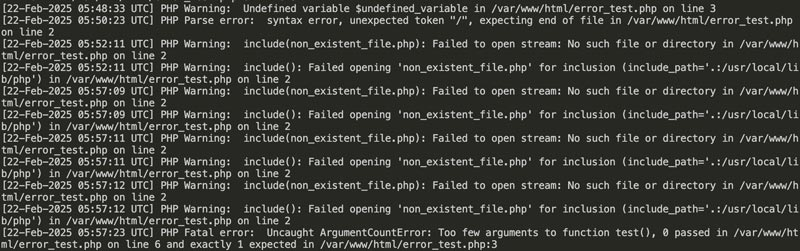

この記事は、[Docker で本番環境に忠実な開発環境を作る（nginx、PHP-FPM、MariaDB）](/blogs/entry543/)の続きです。運用しているWebサイトの本番環境で PHP Warning が発生してしまいました。そのエラーを修正したいのにエラーを見ることができず、修正できたかわからない状況に陥りました。

> PHP Warning（警告）　は、スクリプトの実行中に *非* 致命的なエラーが発生したときに表示されるメッセージ
次はよく起こる *PHP Warning（警告）* です。

* *未定義変数の使用*: 作っていない変数を使おうとする場合
* *配列でないものへのアクセス*: 配列ではないにも関わらず、配列のようにアクセスした場合

この記事を試すためには Docker 環境が必要です。先に「 *Docker で本番環境に忠実な開発環境を作る（nginx、PHP-FPM、MariaDB）* 」を参考にしてください。
<card slug="entry543"></card>

<prof></prof>

*この記事の対象者*
* サーバー・インフラのことはあんまりわからない
* 自分のコードのエラーが確認できる環境を構築したい
* Dockerをイチから作ってみたい
* 本番環境と開発環境で使うサーバー、PHP、データベースの種類やバージョンを厳格に揃えたい

## PHPエラーログが出力できるか確認してみる
前回は、PHPエラーをログに残せる設定をコンテナ内に追加したところまでやりました。

エラーログを確認してみましょう。わざとエラーを発生させる、`error_test.php` 作成します。

```
myproject/
   ├-- public/
   │   ├-- index.html
   │   ├-- index.php
   │   └-- error_test.php ← 追加
   ├-- docker/
   │   ├-- nginx/
   │   │   └-- nginx.conf
   │   ├-- errors/
   │   ├--php/
   │   │    ├-- Dockerfile
   │   │    └-- php.ini
   │   └-- db/
   │        └-- init.sql
   └-- docker-compose.yml
```
よくあるPHPの警告を意図的に発生させてみましょう！

未定義変数の使用し、配列でないものへのアクセスの確認した場合。
```php:title=public/error_test.php
<?php
$variable = false;
echo $variable['key'];
echo $undefined_variable;
```
> PHP Warning:  Trying to access array offset on value of type bool
> PHP Warning:  Undefined variable $undefined_variable

他にもPHP Worning はあります。一般的なものを紹介しておきます。

| PHP Warning                                              | 説明                                                                                 |
|----------------------------------------------------------|--------------------------------------------------------------------------------------|
| Division by zero                                         | 0で割ろうとした場合。                                                      |
| Invalid argument supplied for foreach()                  | `foreach` ループに対して無効な引数が渡された場合に。                             |
| array_merge(): Argument #x is not an array               | `array_merge` 関数に配列でない引数が渡された場合に。                              |
| include_once(): Failed opening 'file' for inclusion      | `include_once` で存在しないファイルを読み込もうとした場合。                   |
| require(): Failed opening required 'file' for inclusion  | `require` で存在しないファイルを読み込もうとした場合。                          |
| Cannot modify header information - headers already sent  | `header` 関数が呼び出される前に出力が行われた場合。                              |


### リアルタイムでモニタリングしながらエラーを監視する
リアルタイムでモニターしながらも開発できます。

コンテナに入り、logファイルの変更を監視します。`tail`コマンドはファイルの末尾の変更を監視するコマンドです。
```bash:title=コマンド
docker exec -it myproject_php /bin/bash
tail -f /var/log/php_errors.log
```
全部文字が白くてわかりづらいですね。


特定のエラー文字を検索して色を付けることもできます。
```bash:title=コマンド
tail -f /var/log/php_errors.log | grep --color=auto -E 'PHP Fatal error|PHP Warning'
```


## モジュールの追加などコンテナーの設定をし直したい場合

PHP モジュールの追加などコンテナーの設定をし直した場合は、コンテナを再構築する必要があります。

一度構築したコンテナを再構築するには`docker-compose up --build -d`を使います。

```bash:title=コマンド
docker-compose down
docker-compose up --build -d
```
## まとめ・PHPでも エラーを追いながら開発する
本番環境に忠実な開発環境を準備のは基本です。

私もインフラやサーバーは苦手だから徹底的に調べつくしたり勉強するのは今まで避けてきました。

今回この記事を書くことで Docker への理解がより深まりました。副作用として、サーバーやPHP、MariaDBのこともかなり理解できました。

<msg txt="今回勉強になりとても良い経験になりました"></msg>

この記事がみなさんのコーディングライフの一助と慣れば幸いです。

最後までお読みいただきありがとうございました。
