CSS はややこい!!!

覚えるのも学習コストも掛かります。今から Web 制作を始めるなら、サクッとフレームワークを使ったほうがカンタンです。

<msg txt="CSSフレームワークと一言で言っても40個以上あって、全部比較していたら私の寿命尽きちゃう笑"></msg>

今回、特に人気のフレームワーク3つほど厳選し、使い方を徹底的に比較してみました。

<prof></prof>

## まずはおさらい: なぜ CSS はややこいのか？

CSS は次のような理由で初学者を一気に絶望の淵に追いやります。

1. *カスケーディング（滝のように上書きされる）*: 上書きされる順序が複雑でデバッグが苦行
2. *詳細度(どの設定が優先されるか)*: セレクタの種類や構造に基づく優先度の計算がツライ
3. *複雑なプロパティやレイアウト*: プロパティ同士の組み合わせが予期しない挙動を引き起こしてカオス。うなぎと梅干し食べて食あたりみたいなことがよく起こる
4. *クロスブラウザ対応*: ブラウザごとに解釈が異なるため、ブラウザごとの表示確認と調整が必要

<msg txt="うなぎと梅干し食べて食あたり起こすのは科学的根拠がないみたいですよ！"></msg>

基本 CSS フレームワーク は CSS の手練れの人が開発しています。しかも無料で提供して、そんな4つの問題を解決してくれているんです。初学者や CSS が苦手な人は、フレームワークを使えばいいじゃないか！

## Bootstrap、Tailwind CSS、Foundation比較表（個人の感想含む）

*Boot Strap*

|           | 詳細                                                                                       |
|-----------|--------------------------------------------------------------------------------------------|
| *特長*        | 豊富なコンポーネントと強力なコミュニティサポート。[日本語ドキュメント](https://getbootstrap.jp/docs/5.3/getting-started/introduction/)もあるよ！                                          |
| *メリット*    | 豊富なコンポーネント、強力なドキュメントとサポート、レスポンシブデザイン、一貫性。         |
| *デメリット*  | 大規模プロジェクトでのカスタマイズが難しい、デフォルトのCSSファイルが大きくなる。           |
| *リリース*    | 2011年8月〜                                                                                |
| *開発元*     | X（Twitter）                                                                                    |
| *個人的感想* | クッソ重い。デザイン的に Bootstrap 臭（日本人には向かない感）がすごい |

*Tailwind CSS*

|           | 詳細                                                                                       |
|-----------|--------------------------------------------------------------------------------------------|
| *特長*        | ユーティリティファーストのアプローチでデザインの自由度が高く、カスタマイズが容易。          |
| *メリット*    | 必要なスタイルのみを使用できるためカスタマイズが容易、JITモードでパフォーマンス向上、レスポンシブデザイン、クラス名の再利用性。 |
| *デメリット*  | HTMLに大量のクラス名が追加されるためコードの可読性が低下する、慣れるまでに時間がかかる。    |
| *リリース*    | 2017年11月〜                                                                               |
| *開発元*     | Adam Wathan, Jonathan Reinink, David Hemphill, Steve Schoger                               |
| *個人的感想* | htmlへのクラス付与が多すぎてうざいんじゃけど。。。 |


*Foundation*

|           | 詳細 |
|-----------|--------------------------------------------------------------------------------------------|
| *特長*        | エレガントなコードと豊富なUIコンポーネントを提供し、プロなプロジェクトに適している。|
| *メリット*    | スタイリッシュなコードと高い可読性、高度なカスタマイズ、アクティブな開発。                   |
| *デメリット*  | 学習曲線が高い、Bootstrapほどの大規模なコミュニティサポートがない。                         |
| *リリース*    | 2011年10月〜                                                                               |
| *開発元*     | ZURB                                                                                       |
| *個人的感想* | 使ったことないから知らんかったけど、めっちゃ有名なサイトFoundationでできとったんやな ^ ^ |

<msg txt="調べてみると最新の Bootstrap アップデート(v5.5.5)がこの記事を書いた前日でした笑。 X に買収されたあとも、活発に開発しているみたいですね。"></msg>

前述したように、*最近は更に増して複雑化した CSS は習得にめちゃ時間がかかります*。本音を漏らすと、それなのにプログラミングの絡まないコーディングだけの仕事だと、単価が安いだけじゃなく学習コストも高すぎる。

CSSフレームワーク導入は初学者やデザインのことがあまりわからないプログラマーにはとても有効です。

とはいえ、CSSを深く理解しているコーダーの需要もないとは言えません。

<msg txt="私は CSS LOVE なので全然書きます！！特にスマホとPCでデザインがガラッと変わるような複雑なコードはフレームワークじゃ対応できないです。"></msg>

## 初心者へのイチオシ Bootstrap
初心者へのイチオシはやはり Bootstrap です。Bootstrap とは英語でブーツのヒモという意味です。最初の資本やリソースがほとんどない状態から何かを立ち上げるという比喩表現でも使われます。つまり、初学者の「はじめの一歩」にはぴったりなフレームワークです。

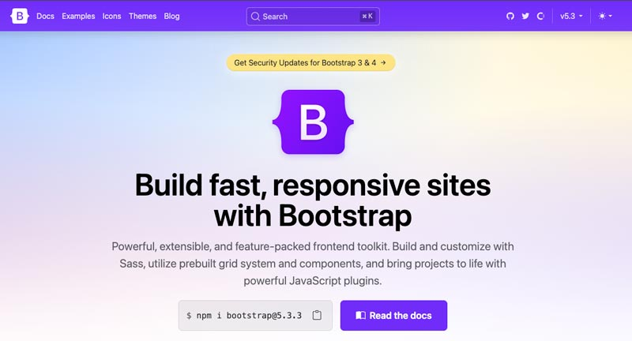

[公式サイト：Bootstrap](https://getbootstrap.com/)

Bootstrap を気軽に始める方法は CSS と JavaScript の CDN を読み込む、です。
```html:title=HTML
<!DOCTYPE html>
<html lang="ja">
<head>
  <meta charset="UTF-8">
  <meta name="viewport" content="width=device-width, initial-scale=1.0">
  <title>Document</title>
  <!-- CSSのCDNを読み込む -->
  <link href="https://cdn.jsdelivr.net/npm/bootstrap@5.3.3/dist/css/bootstrap.min.css" rel="stylesheet" integrity="sha384-QWTKZyjpPEjISv5WaRU9OFeRpok6YctnYmDr5pNlyT2bRjXh0JMhjY6hW+ALEwIH" crossorigin="anonymous">
  
</head>
<body>
  ここにコード
  <!-- JavaScriptのCDNを読み込む -->
  <script src="https://cdn.jsdelivr.net/npm/bootstrap@5.3.3/dist/js/bootstrap.bundle.min.js" integrity="sha384-YvpcrYf0tY3lHB60NNkmXc5s9fDVZLESaAA55NDzOxhy9GkcIdslK1eN7N6jIeHz" crossorigin="anonymous"></script>
</body>
</html>
```

もちろん、npm 経由でもインストール可能です。

```bash:title=コマンド
npm install bootstrap@5.3.3
```

Bootstrap は基本 6 つの構成になっています。

| 構成要素      | 説明                             | 実例                                   |
|---------------|----------------------------------|----------------------------------------|
| Layout        | レイアウトに関する設定            | グリッドシステム、コンテナ、ブレークポイント |
| Content       | コンテンツに関する設定            | フォント、画像、テーブル（表）             |
| Form          | フォームのパーツ                  | 入力フィールド、チェックボックス、ラジオボタン|
| Component     | コンポーネント（部品）            | ナビゲーションバー、カード、ボタン     |
| Helper        | ヘルパー                         | スクリーンリーダー専用テキスト(※)|
| Utilities | 補助的なツール | 余白、表示非表示の制御 |

[各構成要素のコードの書き方等の ドキュメント | Bootstrap Documantation](https://getbootstrap.com/docs/5.3/getting-started/introduction/)

> ### スクリーンリーダーとアクセシビリティ
> スクリーンリーダーは視覚障がい者が画面上のテキストを音声で読み上げるためのソフトウェアで、ほとんどのディバイスに標準搭載されています。ウェブアクセシビリティに対応していないことを理由に訴訟が増加しています。アメリカでの、年間 4,000 件以上に上ったと報告されています。<br>
> 引用 : [米国で「ウェブアクセシビリティ訴訟」が年間4000件にも](https://www.alterna.co.jp/145828/)

### Bootstrap おすすめポイント: コンポーネント（部品化）の概念が学べる
Bootstrap の素晴らしいところは、*コンポーネント（部品化）* の概念が学べることです。

2020年前後、CSS 設計という概念がもてはやされました。

CSS を HTML のパーツ、たとえば小さなコンポーネントでいうとボタンが挙げられます。ボタンはたいてい、テキスト（ラベル）、矢印などのアイコン、それらを梱包するラッパーなどで構成されています。

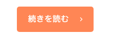

Bootstrap でもいかにもボタンなボタンが提供されています。みなさん、見覚えありませんか？
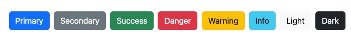

<msg txt="見覚えがあるということは、Bootstrapが幅広く使われているということです。昔、会計ソフトの Freee を使っていた時、あからさまにBootstrapだなぁと思いつつ使っていました笑"></msg>

### Bootstrap おすすめポイント: デフォルトだとクソ重い？でも必要なものだけ取り出して使えばいいじゃないか！！

Bootstrap のダメなところは全部使うととにかく重い。

これを回避するためには *必要なSCSSだけを取り出して使う*、です。

とくにFontAwesomeをすべて読み込むのはおすすめしませんし、Bootstrap は JavaScript も jQuery ベースなのでモダンじゃないです。

Bootstrap のダウンロードページに行くと、すべてのソースコードが梱包されたパッケージをダウンロードできます。その中にSASSなども含まれています。

[Download Source files | Bootstrap](https://getbootstrap.com/docs/5.3/getting-started/download/)

必要なものだけ呼び出せば、コードを軽量化できます。

<p><small>※ Dart Sass 形式で記述しています。環境下に応じて記載方法を変えてください。</small></p>

```SCSS:title=Layout関連
// カスタマイズ可能な変数（例: カラー、フォントサイズ）
@use "./bootstrap/scss/variables";

// HTMLの基本スタイル
@use "./bootstrap/scss/root";

// グリッドシステムやレイアウト関連のスタイル
@use "./bootstrap/scss/layout";

// グリッドシステムの詳細設定
@use "./bootstrap/scss/grid";
```
```SCSS:title=コンポーネント関連
// タイポグラフィのスタイル
@use "./bootstrap/scss/type";

// ボタンのスタイル
@use "./bootstrap/scss/buttons";
```
```SCSS:title=ユーティリティ関連
// スペーシングや表示制御などのユーティリティ
@use "./bootstrap/scss/utilities";
```
Dart Sassに関する記述方法については次の記事を参考にしてください。
<card slug="entry545"></card>

Gulp の環境構築なんざムズすぎてインストールできんわい！って人は VS Code のプラグインでSASSのコンパイルもできるし、直感的に操作できる Prepros（プリプロス）などのソフトを使えば解決できますよ。

* [DartJS Sass Compiler and Sass Watcher](https://marketplace.visualstudio.com/items?itemName=codelios.dartsass)
* [Prepros（プリプロス）](https://prepros.io/)

## 柔軟にカスタマイズしたいなら Tailwind CSS
CSSのコンポーネント（部品化）からユーティリティ（実用性）ファーストブームの火付け役 Tailwind CSS のご紹介です。

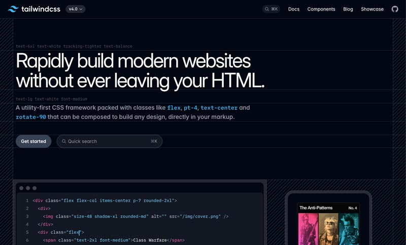

[Tailwind CSS](https://tailwindcss.com/)

<msg txt=" Tailwind（追い風）とな。。。CSS学習にかまけずにとっとと開発しろってことだろうね。"></msg>

ユーティリティの概念を理解するのに学習コストがかかりますが、近年爆発的に人気で需要も高いです。柔軟性を考えると習得しておいて損のないフレームワークです。

ひたすらブロックを積み上げるかのようにユーティリティを組み合わせスタイルを構築します。

<msg txt="Bootstapなどのコンポーネントが主体なCSSフレームワークだとどうしても、そのフレームワークの特徴が隠しきれない。そんな時は、ユーティリティクラスを使うことでオリジナリティの主張を抑えることができます。"></msg>

ユーティリティクラスを例えるならもんじゃ焼きが近いかも。もんじゃ具材を追加することにより、味変をカスタマイズできますよね？

* *もんじゃ*: イカ+モチ+ホタテ+ベビースター+チーズ+ネギ+イカ天+エビ
* *Tailwind*: `<span class="bg-gray-800 rounded-lg shadow-xl text-xl font-bold p-4 border-2 border-yellow-500 hover:bg-green-500">もんじゃ</span>`


しかしご注意。柔軟性が高いということは諸刃の刃。*デザイン力が乏しい方が使うととてつもなくダサくなる* こともあります。

<msg txt="そんな人は、迷わずBootstrapやFoundationを使いましょう。"></msg>


気軽に始める方法はCDNを読み込む、です。Tailwind CSS には JavaScript で動的に CSS を生成する方法と、従来通り CSS を静的によみこむ方法があります。

```html:title=CSSをJSで動的に読み込む
<!doctype html>
<html>
  <head>
    <meta charset="UTF-8" />
    <meta name="viewport" content="width=device-width, initial-scale=1.0" />
    <script src="https://unpkg.com/@tailwindcss/browser@4"></script>
  </head>
  <body>
    <h1 class="text-3xl font-bold underline">
      Hello world!
    </h1>
  </body>
</html>
```
```html:title=CSSを静的に読み込む
<!DOCTYPE html>
<html lang="ja">
<head>
  <meta charset="UTF-8">
  <meta name="viewport" content="width=device-width, initial-scale=1.0">
  <title>Document</title>
  <link href="https://cdn.jsdelivr.net/npm/tailwindcss@2.2.19/dist/tailwind.min.css" rel="stylesheet">
</head>
<body>
  <h1 class="text-3xl font-bold underline">
      Hello world!
  </h1>
</body>
</html>
```


* text-3xl: フォントサイズ1.875rem（約 30px）
* font-bold: フォントウェイトbold
* underline: 文字装飾下線

たとえば、Tailwind CSS で Bootstrap の primary のボタンを作りたい場合、次のようなコードで再現できます。
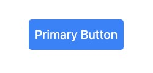

```html:title=CSSを静的に読み込む
<!-- html -->
<button class="bg-blue-500 text-white border-blue-500 hover:bg-blue-600 hover:border-blue-600 p-2 rounded">
    Primary Button
</button>
```
はぁ……、これは流石に付与するクラスが多すぎ涙。

`@apply` ディレクティブ（ディレクティブとはプログラミングにおける小さな命令みたいなもの）を使えば、カスタムクラスやスタイルを再利用できます。HTMLへの付与するクラスも短くなり（クラスが多すぎ問題も解決👍️）、可読性も上がります。

```html:title=CSSを動的に読み込む
<!-- スタイル -->
<style>
 .btn-primary {
   @apply text-white bg-blue-500 border-blue-500;
 }
 .btn-primary:hover {
   @apply bg-blue-600 border-blue-600;
 }
</style>
<!-- html -->
<button class="btn-primary p-2 rounded">
 Primary Button
</button>
```

### Tailwind CSS おすすめポイント: チートシートがあれば脳死状態でコーディングできる

Tailwind CSS の習得には一般的には学習コストがかかると言われていますが、問題なし。チートシートやプラグインを活用すれば余裕です。

<msg txt="Tailwind CSS の習得には一般的には学習コストがかかるというのはきっとユーティリティの概念を理解するのに時間がかかるんやろうね。みんなレゴで遊べ。"></msg>

[Tailwind CSS 日本語チートシート](https://telehakke.github.io/tailwindcss-japanese-cheat-sheet-v4/)

シェアの多いエディタ VS Code にもいくつか Tailwind CSS 用のコーディングを強力にサポートするプラグインがあります。

| プラグイン名                    | 簡単な説明                                                                                               | リンク                                                                                                 |
| ------------------------------- | -------------------------------------------------------------------------------------------------------- | ------------------------------------------------------------------------------------------------------ |
| Tailwind CSS IntelliSense       | Tailwind CSSのクラス名を自動補完し、ドキュメントを表示。                                 | [Tailwind CSS IntelliSense](https://marketplace.visualstudio.com/items?itemName=bradlc.vscode-tailwindcss) |
| Headwind                        | Tailwind CSSのクラス名をアルファベット順に並べ替える。                                       | [Headwind](https://marketplace.visualstudio.com/items?itemName=heybourn.headwind)                       |
| PostCSS Language Support        | Tailwind CSSを含むPostCSSの構文をサポート。                                              | [PostCSS Language Support](https://marketplace.visualstudio.com/items?itemName=csstools.postcss)         |
| Prettier - Code formatter       | Tailwind CSSのクラス名を含むコードを自動的に整形。                                      | [Prettier - Code formatter](https://marketplace.visualstudio.com/items?itemName=esbenp.prettier-vscode)  |

これで初学者でも安心！！

### Tailwind CSS おすすめポイント: JIT（Just-In-Time）でビルドサイズを削減
ここから少しハードモードです。

膨大なすべてのユーティリティクラスをCSSでよみこむのは、ファイルサイズを考えるとさすがにぞっとします。しかしご安心ください。*JIT（Just-In-Time）コンパイル* をつかえば解決できます。

JIT（Just-In-Time）コンパイルを使いたい場合は環境を自分で作る必要があります。

```
my-project/
├── node_modules/
├── public/
│   ├── css/
│   │   └ style.css
│   └── index.html
├── src/
│   └ styles.css
├── tailwind.config.js
├── postcss.config.js
├── package.json
└── package-lock.json
```

npmプロジェクトを初期化。
```bash:title=コマンド
npm init -y
```
必要なモジュールをインストール。
```bash:title=コマンド
npm install tailwindcss postcss autoprefixer
```
Tailwind CSSの設定ファイル（tailwind.config.js）を生成。コマンド叩かなくてもプロジェクト直下に`tailwind.config.js`ファイルを追加してもいい。
```bash:title=コマンド
npx tailwindcss init
```
postCSSの設定ファイルの作成。必要に応じて設定を追加してください。
```js:title=postcss.config.js
module.exports = {
  plugins: {
    tailwindcss: {},
    autoprefixer: {},
  },
}
```
Tailwind CSSのエントリーポイントの作成。必要なものだけ追加すればOK。
```css:title=styles.css
@tailwind base;
@tailwind components;
@tailwind utilities;
```

`package.json`にスクリプト追加。

```json:title=package.json
"scripts": {
  "build": "npx tailwindcss build src/styles.css -o public/style.css"
}
```

```bash:title=コマンド
npm run build
```

## 有名サービスがこぞって使うプロ並みのサイトを構築できる Foundation
プロ顔負けのデザインを構築したいなら、Foundation がオススメです。

Foundation は、日本語で「土台」や「基盤」という意味でウェブ開発の基盤となる強力で柔軟なフレームワークを提供するというコンセプトで開発されてきました。

コンポーネントの概念を取り入れたCSSフレームワークなので、個人的には *リッチな Bootstrap* というイメージです。

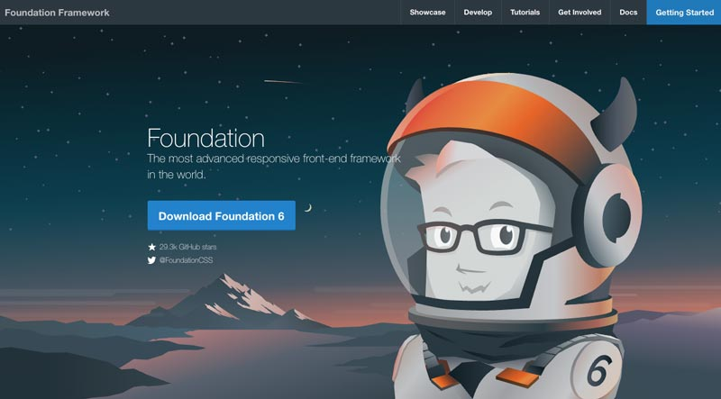

[Foundation](https://get.foundation/)

クリエーターおなじみ、Creative Cloud も実は Foundation 製です。

* [National Geographic](https://www.nationalgeographic.com/)
* [SUBARU](https://www.subaru.com/)
* [Adobe Creative Cloud](https://www.adobe.com/jp/creativecloud.html)
* その他多数

Foundation の構成要素は9つからなり、Bootstrap（構成要素は6つ） と、*より複雑* です。

Foundation の威力を発揮させるには、これらのコンポーネント同士を組み合わせること。リッチなウェブサイトを独自に構築したいのであれば、学習コストがどうしてもかかってしまいますが、その分柔軟で強力なデザインができます。

| 構成要素   | 説明                                   | 実例                               |
|------------|----------------------------------------|-----------------------------------|
| General    | 基本的なスタイルと設定                 | ベーススタイル、グローバル設定      |
| Utilities  | 余白、テキストの位置などのユーティリティクラス | 余白の調整、テキストの位置調整      |
| Typography | 見出し、段落、リストなどのタイポグラフィ関連コンポーネント | 見出し、段落、リスト                 |
| Controls   | フォームコントロール、ボタン、入力フィールドなど | フォームの入力フィールド、ボタン     |
| Navigation | ナビゲーションバー、ドロップダウンメニュー、タブなどのナビゲーション要素 | ナビゲーションバー、メニュー、タブ   |
| Containers | グリッドシステム、カードなど、コンテンツを整理するための要素 | グリッド、カード、コンテナ            |
| Media      | 画像、ビデオ、オーディオなどのメディア要素 | 画像、ビデオ、オーディオ            |
| Plugins    | モーダル、トースト、ドロップダウンなどのJavaScriptで拡張されたインタラクティブなコンポーネント | インタラクティブなモーダル、メニュー |
| Libraries  | フレームワークのコアライブラリと拡張ライブラリ | コアライブラリ、拡張ライブラリ        |

[Foundation コンポーネントの一覧](https://get.foundation/sites/docs/)

CDN を使って気軽に始めることができます。

```html:title=HTML
<!DOCTYPE html>
<html lang="ja">
<head>
  <meta charset="UTF-8">
  <meta name="viewport" content="width=device-width, initial-scale=1.0">
  <title>Foundation CSS Example</title>
  <!-- Foundation CSS CDN -->
  <link rel="stylesheet" href="https://cdnjs.cloudflare.com/ajax/libs/foundation/6.6.3/css/foundation.min.css">
  <!-- Foundation JavaScript CDN (optional, for JavaScript components) -->
  <script src="https://cdnjs.cloudflare.com/ajax/libs/foundation/6.6.3/js/foundation.min.js" defer></script>
</head>
<body>
  <div class="grid-container">
    <div class="grid-x grid-padding-x">
      <div class="cell">
        <h1>Foundation CSS Example</h1>
        <p>This is a simple example using Foundation CSS.</p>
      </div>
    </div>
  </div>
</body>
</html>
```
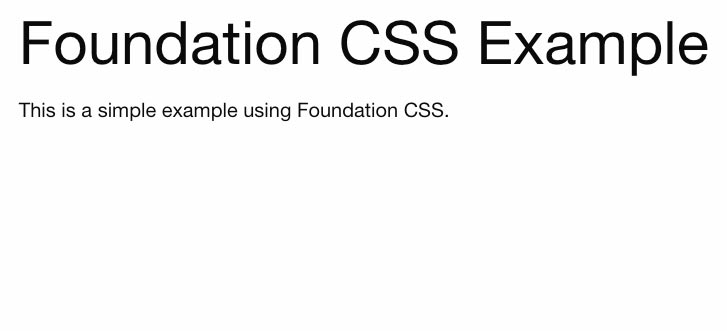

実際、コンポーネントを組み合わせてサクッとサイトを構築してみました。

* ナビゲーションバー
* ヒーロー
* カードレイアウト
* フッター

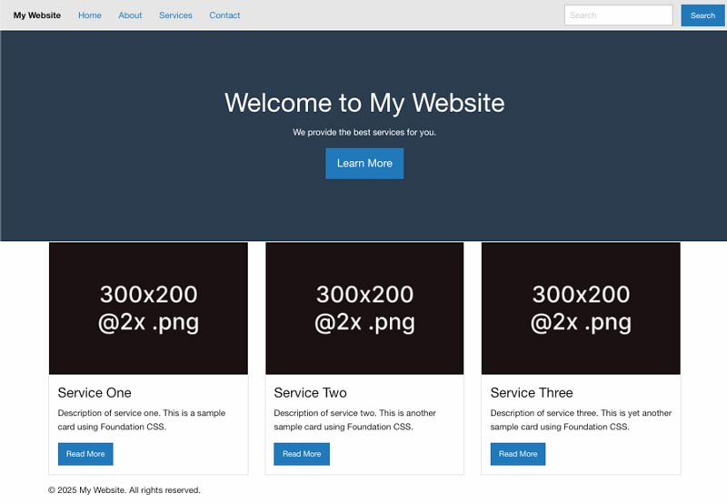

```html:title=HTML
<!-- ナビゲーションバー -->
  <div class="top-bar">
    <div class="top-bar-left">
      <ul class="menu">
        <li class="menu-text">My Website</li>
        <li><a href="#home">Home</a></li>
        <li><a href="#about">About</a></li>
        <li><a href="#services">Services</a></li>
        <li><a href="#contact">Contact</a></li>
      </ul>
    </div>
    <div class="top-bar-right">
      <ul class="menu">
        <li><input type="search" placeholder="Search"></li>
        <li><button type="button" class="button">Search</button></li>
      </ul>
    </div>
  </div>

  <!-- ヒーローセクション -->
  <div class="hero">
    <h1>Welcome to My Website</h1>
    <p>We provide the best services for you.</p>
    <a href="#services" class="button large">Learn More</a>
  </div>

  <!-- カードレイアウト -->
  <div class="grid-container">
    <div class="grid-x grid-margin-x">
      <div class="cell small-12 medium-6 large-4">
        <div class="card">
          
          <div class="card-section">
            <h4>Service One</h4>
            <p>Description of service one. This is a sample card using Foundation CSS.</p>
            <a href="#" class="button">Read More</a>
          </div>
        </div>
      </div>
      <div class="cell small-12 medium-6 large-4">
        <div class="card">
          
          <div class="card-section">
            <h4>Service Two</h4>
            <p>Description of service two. This is another sample card using Foundation CSS.</p>
            <a href="#" class="button">Read More</a>
          </div>
        </div>
      </div>
      <div class="cell small-12 medium-6 large-4">
        <div class="card">
          
          <div class="card-section">
            <h4>Service Three</h4>
            <p>Description of service three. This is yet another sample card using Foundation CSS.</p>
            <a href="#" class="button">Read More</a>
          </div>
        </div>
      </div>
    </div>
  </div>

  <!-- フッター -->
  <footer class="grid-container">
    <div class="grid-x grid-padding-x">
      <div class="cell small-12">
        <p>&copy; 2025 My Website. All rights reserved.</p>
      </div>
    </div>
  </footer>
```

リッチなウェブサイトを独自で構築は難しくてもライブラリから、豊富なテンプレート（Webサイトの土台）とBuilding Blocks（Webサイトの部品）を使えば、たいして学習コストをかけずにWebサイトを構築することができます。

### Foundation おすすめポイント: テンプレートを利用してサクッとサイト構築
お気に入りのテンプレートを使うだけですぐにWebサイトを構築できます。Bootstrap にもテンプレートはありますが、Bootstrap 臭が隠せないです。

[Foundation 5 HTML Templates](https://get.foundation/templates-f5)

こちらは *marketing* のテンプレートに少し手を加えたものです。構築に 3 分もかかりませんでした。

色や画像などを差し替えれば、もっとオリジナリティが増します。

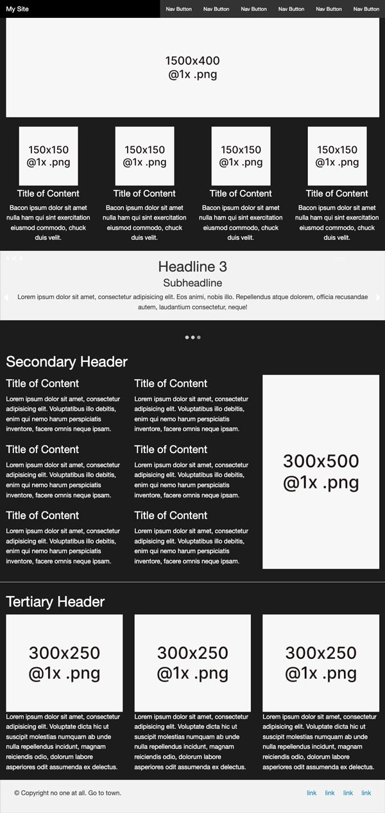

ダウンロードしたテンプレートは2025年3月時点ではPlaceholder画像がリンク切れを起こしていました。必要に応じてURLを置換してください。

```
https://placehold.it
↓↓↓
https://placehold.in
```

### Foundation おすすめポイント: Building Blocksからお好きな部品（コンポーネント）をちょい足しする
Building Blocksとは、FoundationのUIコンポーネントのライブラリです。

[Building Blocks](https://get.foundation/building-blocks/)

これらのHTML、CSS、JSスニペットは、Foundationのプロジェクトにカンタンに組み込むことができます。

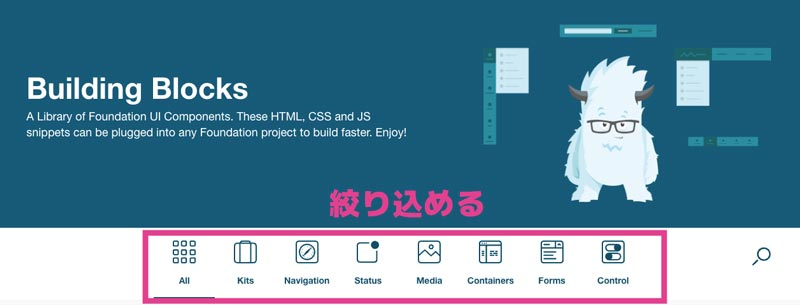


たとえば、次のスクショのような右のヒーローエリアに組み込むフォームを設置したい場合。

必要なパーツだけ取ってきて使うこともできます。

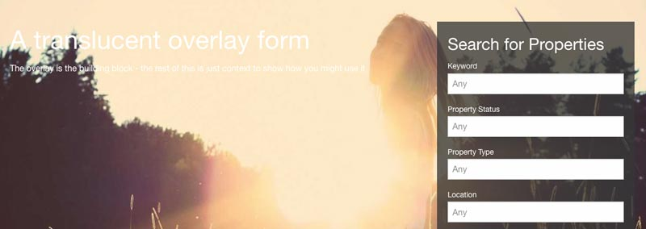

## まとめ・基本は Bootstrap か Tailwind CSS を抑えて、個性を出したい場合は Foundation を拡張
今回2025年現在、人気のCSSフレームワークを比較してみました。

個人的には初学者は日本語のリファレンスも豊富な Bootstrap と Tailwind CSS を学んでおけばいいのかなぁという感想です。

熟成されたCSSフレームワークを使うと、コンポーネントとユーティリティファーストの概念のメリット・デメリットを理解できたりとめちゃめちゃ勉強になります。

初学の枠から出たくなったら、Foundation などのリッチなフレームワークに手を出すのが良さそうですね。

<msg txt="ついでに最近仕事していて、感じたこともシェアしておきます"></msg>

最近仕事で納品されたフレームワークを用いたコードを取り扱うことがありましたが、ブレークポイントが変わるとめっちゃ崩れてました。笑っちゃいけないけど笑。

<msg txt="ここでの教訓を一つ"></msg>

フレームワークを利用するにせよ、CSSの基本の「キ」が分かってないと起こる問題があります。表面だけでフレームワークを使ってるから大丈夫と過信すると思わぬ表示崩れが発生していることもあります。

すでに調整されたフレームワークだからと、過信せずに基本のブラウザごとのデバックを怠ってはいけません。

そんな思いもあり、この記事を書きました。

この記事が皆さんのコーディングライフの一助となれば幸いです。

最後までお読みいただきありがとうございました。

### おまけ・CSSフレームワーク早見表

他にもフレームワークは多数あるので興味ある人は他のものも見てみてください。

| フレームワーク       | コンポーネント度 | ユーティリティ度 | 柔軟性  | 特徴                   |
|--------------------|--------------|--------------|--------|----------------------|
| [Bootstrap](https://getbootstrap.com/)          | *★★★★*           | *★★★*           | *★★★★*      | 豊富なドキュメント、広範なサポート |
| [Tailwind CSS](https://tailwindcss.com/)       | *★★★*           | *★★★★★*           | *★★★★*      | ユーティリティファースト、カスタマイズ性 |
| [Bulma](https://bulma.io/)              | *★★★★*           | *★★★*           | *★★★*      | シンプルで直感的な使い方        |
| [Pure.css](https://pure-css.github.io/)           | *★★*           | *★★★*           | *★★★★*      | 軽量で最小限のスタイル        |
| [Ant Design](https://ant.design/)         | *★★★★*           | *★★★*           | *★★★★*      | エンタープライズ向けデザインシステム   |
| [Materialize](https://materializecss.com/)        | *★★★★*           | *★★★*           | *★★★★*      | マテリアルデザインに基づく美しいUI |
| [Foundation](https://get.foundation/)         | *★★★★*           | *★★★*           | *★★★★*      | リッチなコンポーネントセット     |
| [UIkit](https://getuikit.com/)              | *★★★★*           | *★★★*           | *★★★★*      | 強力なコンポーネントセット     |
| [Tachyons](https://tachyons.io/)           | *★★*           | *★★★★★*           | *★★★★*      | 高速でカスタマイズしやすい     |
| [Skeleton](http://getskeleton.com/)           | *★★*           | *★★*           | *★★★*      | シンプルで軽量           |
| [Semantic UI](https://semantic-ui.com/)        | *★★★★*           | *★★★*           | *★★★*      | セマンティックなクラス名      |
| [Spectre.css](https://picturepan2.github.io/spectre/)        | *★★★*           | *★★★*           | *★★★*      | モダンなデザインの軽量フレームワーク |
| [Primer CSS](https://primer.style/)         | *★★★*           | *★★★*           | *★★★*      | GitHubのスタイルガイド     |
| [INK](https://ink.sapo.pt/)                | *★★★*           | *★★★*           | *★★★★*      | インタラクティブなウェブサイトのための |
| [Schema](https://danmalarkey.github.io/schema/)             | *★★★*           | *★★★*           | *★★★*      | シンプルでモジュラー的     |
| [Milligram](https://milligram.io/)          | *★★*           | *★★★*           | *★★★★*      | 最小限のスタイル         |
| [MUELLER GRID SYSTEM](https://muellergridsystem.com/) | *★★*          | *★★★*           | *★★★★*      | グリッドシステム特化       |
| [Almost Flat UI](https://designmodo.github.io/Flat-UI/)     | *★★★*           | *★★★*           | *★★★*      | フラットデザイン         |
| [Toast](https://daneden.github.io/Toast/)              | *★★★*           | *★★★*           | *★★★*      | シンプルで直感的         |
| [Bootflat](https://bootflat.github.io/)           | *★★★*           | *★★★*           | *★★★*      | フラットデザイン         |
| [Kathamo](https://kathamo.com/)            | *★★★*           | *★★★*           | *★★★*      | フレックスボックスのサポート  |
| [new.css](https://newcss.net/)            | *★★★*           | *★★★*           | *★★★*      | シンプルで読みやすい     |
| [Material UI](https://material-ui.com/)        | *★★★★*           | *★★★*           | *★★★★*      | Reactコンポーネント     |
| [Cardinal](https://cardinalcss.com/)           | *★★★*           | *★★★*           | *★★★*      | モジュラー的なスタイル    |
| [Workless](https://worklesscss.com/)           | *★★★*           | *★★★*           | *★★★*      | 作業効率を高める        |
| [BootMetro](https://aozora.github.io/bootmetro/)          | *★★★*           | *★★★*           | *★★★★*      | メトロUI風のデザイン     |
| [HTML KickStart](https://www.99lime.com/elements/)     | *★★★*           | *★★★*           | *★★★*      | スタートアップ向け       |
| [AUI](https://aui.atlassian.com/)                | *★★★*           | *★★★*           | *★★★*      | インタラクティブなエレメンツ |
| [Base](https://basecss.io/)               | *★★★*           | *★★★*           | *★★★*      | ベーシックなスタイル      |
| [SkyBlue](https://skybluecss.com/)            | *★★★*           | *★★★*           | *★★★*      | フラットでモダン         |
| [Basscss](https://basscss.com/)            | *★★*           | *★★★★★*           | *★★★★*      | 小さくてモジュラー的なスタイル |
| [Cascade Framework](https://cascade-framework.com/)  | *★★★*           | *★★★*           | *★★★*      | オブジェクト指向CSS      |
| [KNACSS](https://knacss.com/)             | *★★★*           | *★★★*           | *★★★*      | フランス語圏向けのフレームワーク  |
| [Concise CSS](https://concisecss.com/)        | *★★★*           | *★★★*           | *★★★*      | シンプルで軽量           |
| [Furtive](https://furtive.co/)            | *★★★*           | *★★★★★*           | *★★★★*      | モバイルファースト       |
| [Kube](https://imperavi.com/kube/)               | *★★★*           | *★★★*           | *★★★*      | シンプルでフレキシブル    |
| [Layers CSS](https://eiskis.net/layers-css/)         | *★★★*           | *★★★*           | *★★★*      | モジュラー的なスタイル    |
| [MVP.css](https://andybrewer.github.io/mvp/)            | *★★*           | *★★★*           | *★★★*      | 最小限のスタイル         |
| [Tacit](https://yegor256.github.io/tacit/)              | *★★★*           | *★★★*           | *★★★*      | クラスなしで使える       |
