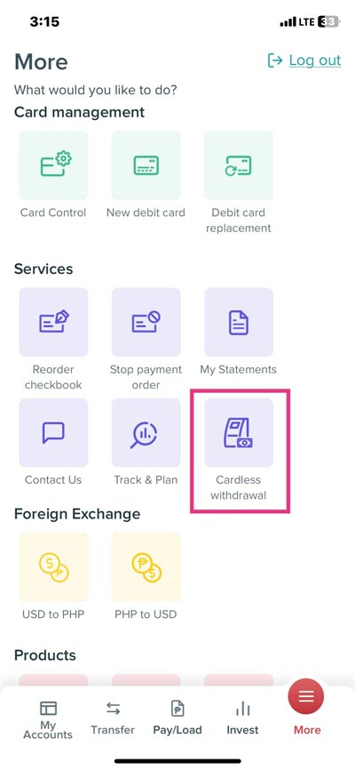

マーヨンハポン、海外ノマドエンジニアのかみーゆです。

昨日、友だちのお見送り会も兼ねた焼き肉会がありました！

1,000 ペソしか持ってなかった＆直前まで仕事していたので、とりあえずいつも使わない一番近くの ATM へ。

お金を引き出そうとしたら、BPI のキャッシュカードがどうやらロックされてしまいました。
> Bank of the Philippine Islands (BPI)とはフィリピンの主要な銀行の一つです。

せめて　BPI のアプリから GCash に送金しようとしたら、E-Wallet の管理画面から GCash への送金項目が消えている。

> GCash はフィリピンで広く利用されている電子決済アプリ。2009年にGlobe Telecomによって設立され、フィリピン国内で最も人気のあるキャッシュレスツールの一つ。

<msg txt="。。。あ、詰んだ。なんて日だ。。。"></msg>

海外の銀行系のトラブルは起きがち。そこで今日はこんなときに使える *Cardless Withdrawal（カードレス引き出し）* 機能の使い方を解説します。

<prof></prof>

GCash に関する記事も書いてます。昨年、成田空港の Doutor Coffee で GCash 使えるって書いてあるのに使えなかったこと思い出した笑

<card slug="entry512"></card>

## Cardless Withdrawal の使い方
キャッシュカードのロックに関しては平日どっかで銀行に行って確認するとしてとにかく今日生きるための現金が必要。

そこで前から気になっていた Cardless Withdrawal を使ってみることにしました。

<msg txt="Withdrawal は銀行口座からのお金の引き出し以外にも、引きこもりという意味もあります。"></msg>

昨年ぐらいからしれっと登場した機能みたいで、More > Services の中に項目を探すことができると思います。

Cardlress Withdrawal を選択します。

一応私のアカウントでは 1 日 10,000 ペソまで引き落とし可能とのこと（普段そんなに使うことはないけど）。

とりあえず引き出し金額を 10,000 ペソで設定。カードレス引き出しのリクエストをします。金額入力の前後どっちだったかな？処理を承認するために BPIアプリの PIN を入力を求められます。

Request Cardlress Withdrawal をクリック。

リクエストが無事完了したら、SMSメッセージで order ID が飛んできます。BPIアプリの管理画面でメールアイコンをタップしても、order ID は確認できます。

### いざ BPI の ATM へ
いざATMへ。1時間位内に処理しないと無効になるので、足早で向かいました。

Cardlress Withdrawal ができる ATM は アクティベートされた BPI ATM か BPI Euronet ATM のみだそう。

公式サイト [BPI and Euronet ATM Directory](https://www.bpi.com.ph/personal/bank/digital-banking/ATM-and-CAM/bpi-euronet-atms/directory) からアクティベートされたATMを調べました。

<msg txt="どれや、、、詳しい住所とどこに設置してあるかまで明記してよ笑"></msg>

スクショは一部です。Ayala はフィリピンで有名なモールの一つなんですが、セブシティーに2つあります。

せめて Business Park にあるとか Ayala Central Block とか言ってくれないと困ると思いつつ、日本だとまずこの表記はないけどフィリピンなので諦め、直ぐそばに Skyrise It Park と明記があるのできっとITパークにも Cardless withdrawal に対応したATMがあるはずに違いないと信じて向かう。

アクティベートされている ATM をほとんど勘で探します。指定されているであろう Ayalaモール の ATM に行ってみましたが、画面をタッチしてもなんにも反応なし。

BPI の公式サイトで改めて銀行名を確認し、検索。Google Map ではなぜか Globe （フィリピンの通信キャリアの一つ）の建物にピンが刺さっているのでダメ元で凸（とつ）。

<msg txt="ここ絶対ちゃうやろ。。。フィリピン住んで6年の私の直感が言っている。 My gut says there is no ACTIVATED ATM for cardless withdrawal..."></msg>

そう思いつつも中に入ったら、まるまると太ったガードのおっさんがスヤスヤ寝ていました。「Good morning」と言って起こして、早速聞いてみる。

おっさんからは当たり前の返答「ここ Globe やで」。いや、分かっている。分かっているけど涙

落ち込む私に「今日は日曜で休みだけど、明日銀行行ったらえーよ」と、おっさん。優しい。無理やり起こしてごめんね。

### Cardless Withdrawal が使えるATMを使う必要がある

もう一度 「Cardlress Withdrawal BPI bank」 などのキーワードで検索したら、BPI Euronet ATM なら Cardlress Withdrawal できると検索結果が。

<msg txt="あ、そうやった。BPI Euronet ATM なら Cardlress Withdrawal できるってさっきも言うとったわ。"></msg>

最寄りの BPI Euronet ATM でググると徒歩 1 分くらいのところに発見。しかもここ、 JP Morgan じゃない気がするんですが。。。

さっきも変なところにマップのピン刺さってたしこんなことイチイチ気にしていたらノイローゼになっちゃうので、とりあえず GO。とりあえず ATM はあった。

<msg txt="私の住むITパークめっちゃ狭いんだけど、どんだけATMあるん？"></msg>

画面をタッチして BPI を選んだら、order ID の入力を求めてきた！！

どうやらビンゴ。早速入力。

order ID は SMS 経由でも、BPI アプリ管理画面でもメッセージが届いているからどちらで確認してもOK。

金額を入力すると SMS（携帯） に One time PIN(ワンタイムパスワードみたいなやつ)が届くのでそれを入力。

金額の入力か、One time PIN パスの入力が先だったかちょっと忘れましたがガイドの順番に従ったらいいです。

そして、無事やっとお金が下ろせました。

### GCash と PAYMAYA の項目は他銀行へ移動したんかい

ちなみに 2025年2月、GCash と PAYMAYA は E Wallet から銀行に移ったらしいです。BPI アプリ管理画面でお知らせを確認したときに気が付きました。

> InstaPayは、フィリピン国内の銀行間で送金や決済を行うことができるサービス

### Cardlress Withdrawal は他の銀行でも使える

Cardlress Withdrawal で検索すると、Metrobank、UnionBank、BDO など BPI 以外でも主要のフィリピンの銀行でヒットしました。

QR を発行するだけで引き出せるものもあるっぽいので、各銀行で何ができるか調べておくと良さそうですね。
> #### Can I withdraw from BDO ATM without card?(BDOATMでカード無しでお金を引き出すことはできますか？)
> Generate the QR using your BDO Digital Banking app, then use it to withdraw from QR-enabled ATMs. 
> BDO銀行アプリからQRコードを発行します。そして、QRが使えるATMでQRを通じでお金を引き出してください。

## 海外はトラブルはつきもの・手元にいくらか置いとけ

昨日は盛大に遅刻した上、みんなの憩いのバー Ripple のあっこちゃんに 1,280 ペソ借りました。快く貸してくれてありがとう涙

海外はトラブルはつきもの。そういえば、昔私の知り合いもカードがATMから抜けなくなって困ってたことがありましたしね。

何があるかわからないので、常に1万ペソくらいは家においておいたほうがいいですね。

良い勉強になりました。
