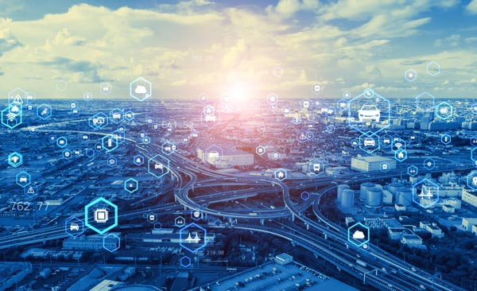
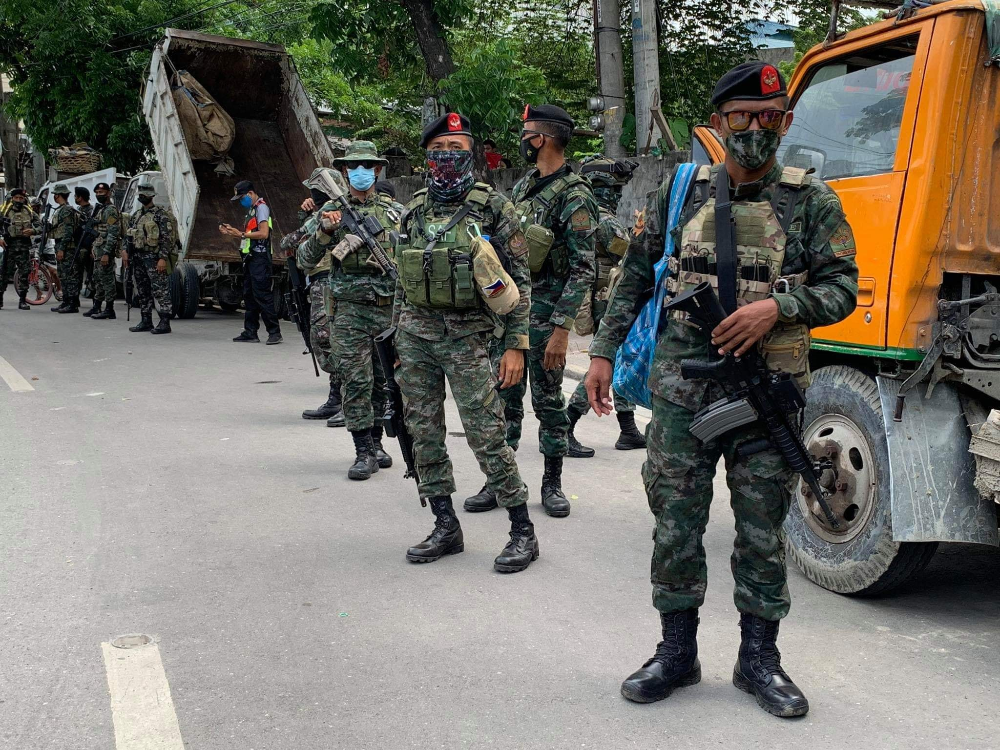

最近、よく生成AIを使って仕事をしています。

コードの質はグッと上がり、今までの自分の限界を悠々と超えることができ、スキルの幅がとてつもなく広がりました。

ある晩10時くらいまで仕事をしていたとき、ふと思いました。

私は楽しようとして生成AIを使ってるのに、なんでこんな夜中遅くまで仕事をしていんだろうか。

特にこの数か月間は「私は一体何をやってるんだ？」という考えが頭をよぎり続けました。

そこで今日は、その疑問を考察したり、自分なりの意見をまとめます。

<prof></prof>

## 便利になった分忙しくなってない？そりゃ、みな生成AIを使う。一様にクオリティが上がるので当然では？

自分のやれることの幅は増えたということは、周りも同じ。つまりこの資本主義の社会では、競争に負けないようにしなければ生き残れません。

やれることは増えたけど結局忙しくなり、正直、楽になったとは言えないなぁ、と。

### そもそもの人類の歴史を振り返る。文明の進化で私たちは本当に「楽」になったの？

みなさん、歴史学者ユヴァル・ノア・ハラリさんの「サピエンス全史」を読んだことはありますか？

この本は、有史以前からサピエンス（人類）の現在までの歴史を壮大に綴っています。

<a href="https://www.amazon.co.jp/%E3%82%B5%E3%83%94%E3%82%A8%E3%83%B3%E3%82%B9%E5%85%A8%E5%8F%B2-%E4%B8%8A%E4%B8%8B%E5%90%88%E6%9C%AC%E7%89%88-%E6%96%87%E6%98%8E%E3%81%AE%E6%A7%8B%E9%80%A0%E3%81%A8%E4%BA%BA%E9%A1%9E%E3%81%AE%E5%B9%B8%E7%A6%8F-%E3%83%A6%E3%83%B4%E3%82%A1%E3%83%AB%E3%83%BB%E3%83%8E%E3%82%A2%E3%83%BB%E3%83%8F%E3%83%A9%E3%83%AA-ebook/dp/B0CLRLB4T5/ref=sr_1_1?crid=3FK7LJE2AIVI8&dib=eyJ2IjoiMSJ9.8mRTPPnQHYMnsTqB2DJg3zsZT4U9zHAbREHtynVuEjJIf8uh3S8oymZSiKTNls1yEjB3FtUquRhd41S38epFTkJgRZGZ8Du3PuYpGJDb5Gey8RS0iaTepu_5xpy-SMO0Bbqm8Pck-AH9_dK5FthdefsEoeVBtXXlt31QhNL6iXp6IhdFKFQFwLnf-LCpF7wgahFATdL6lRG6NtKw_28R7RTz4AkOYKyHihOmm00ZFGPeI8WVtaUBrSr5io2A-ZIlz5CbEjm6P6hjZ_bmmQ2k6eLEkDpq9MsUr3xIdD_FyFzjivT4czt_SNCxjA9_i6KpEIUVKpWZuoqFBQa92-6zin3lAe4Se6QpeDmjq5O1H3sDLThyGs7thQyRMD2oWQMOXNFVkfCNWHBVfzTa2R255t4aCgAnj3iENEyuKbSEEsLUPB1VITSBBDD12hQm3d3O.tFX06LlLhpshvOHSoTWvR8CtvqOEd9sbx-P2zUi308A&dib_tag=se&keywords=%E3%83%9B%E3%83%A2%E3%82%B5%E3%83%94%E3%82%A8%E3%83%B3%E3%82%B9%E5%85%A8%E5%8F%B2&qid=1741576149&sprefix=%E3%83%9B%E3%83%A2%2Caps%2C345&sr=8-1" target="_blank"></a>

<a href="https://www.amazon.co.jp/%E3%82%B5%E3%83%94%E3%82%A8%E3%83%B3%E3%82%B9%E5%85%A8%E5%8F%B2-%E4%B8%8A%E4%B8%8B%E5%90%88%E6%9C%AC%E7%89%88-%E6%96%87%E6%98%8E%E3%81%AE%E6%A7%8B%E9%80%A0%E3%81%A8%E4%BA%BA%E9%A1%9E%E3%81%AE%E5%B9%B8%E7%A6%8F-%E3%83%A6%E3%83%B4%E3%82%A1%E3%83%AB%E3%83%BB%E3%83%8E%E3%82%A2%E3%83%BB%E3%83%8F%E3%83%A9%E3%83%AA-ebook/dp/B0CLRLB4T5/ref=sr_1_1?crid=3FK7LJE2AIVI8&dib=eyJ2IjoiMSJ9.8mRTPPnQHYMnsTqB2DJg3zsZT4U9zHAbREHtynVuEjJIf8uh3S8oymZSiKTNls1yEjB3FtUquRhd41S38epFTkJgRZGZ8Du3PuYpGJDb5Gey8RS0iaTepu_5xpy-SMO0Bbqm8Pck-AH9_dK5FthdefsEoeVBtXXlt31QhNL6iXp6IhdFKFQFwLnf-LCpF7wgahFATdL6lRG6NtKw_28R7RTz4AkOYKyHihOmm00ZFGPeI8WVtaUBrSr5io2A-ZIlz5CbEjm6P6hjZ_bmmQ2k6eLEkDpq9MsUr3xIdD_FyFzjivT4czt_SNCxjA9_i6KpEIUVKpWZuoqFBQa92-6zin3lAe4Se6QpeDmjq5O1H3sDLThyGs7thQyRMD2oWQMOXNFVkfCNWHBVfzTa2R255t4aCgAnj3iENEyuKbSEEsLUPB1VITSBBDD12hQm3d3O.tFX06LlLhpshvOHSoTWvR8CtvqOEd9sbx-P2zUi308A&dib_tag=se&keywords=%E3%83%9B%E3%83%A2%E3%82%B5%E3%83%94%E3%82%A8%E3%83%B3%E3%82%B9%E5%85%A8%E5%8F%B2&qid=1741576149&sprefix=%E3%83%9B%E3%83%A2%2Caps%2C345&sr=8-1" target="_blank">ホモ・サピエンス全史</a>

人類は狩りから農耕に切り替えて、一見文明が発達して *便利になった* ように思えます。実際は狩りで生計を立てている頃と比べ労働時間が増え、単一の食品を口にするようになり栄養バランスも偏り、重労働によるヘルニアなどの病気の痕跡も残っています。人類は「*結局、麦の奴隷になった*」と、ハラリさんは言及していました。

実感がわかないので近代、身近な話もします。

私が生まれてから現在に至るまで、世界は目覚ましく進化してきました。図書館に行かなくても、インターネットさえれば瞬時に欲しい情報を検索できる。

ぶっちゃけ、ハガキよりも小さいサイズの液晶画面付きの電話（スマートフォン）が、私が生きている間に登場すると思わなかったです。

子供の頃の私から知れば、すでにこの現代は漫画で見たようなSFのような世界と驚くでしょう。

こんなに便利になった世の中で、未だに長い時間働いているかって不思議に思いませんか？生産性は上がったけど、労働時間は増えてませんか？

そして、それに対して誰も疑問に思わないのだろうか？

ふと、私は疑問に思わずにいられませんでした。

## 「幸せを追求すること」私のセブにいる理由を改めて考える

私がセブにいる理由はいくつかあります。そのうちの一つは「幸せを追求すること」です。

フィリピンにいると日本のように欲しいものがすぐに手に入りません。大きなモールやスーパーでさえ品切れだらけです。

でも、ものはなければなくても生きていけるんですよね。そんな事に気づき、次第に物欲も減りました。

更にロックダウン、パンデミックは私の人生の価値観を変えました。

<small>写真提供:DAREDEMO HERO</small>

パンデミック初期、コロナは未知の病気でした。医療費に点数制度のないフィリピンでは治療に100万ペソ？以上かかかったという人の話も聞きました。

それだけじゃありません。病気にかからずとも外で働けなくなりました。いわゆる、ロックダウンです。せっかく無理して家族でお金を出し合って大学を出しても、中流階級の人たちは自宅から外出できず、貯金もない。食うに困る人も続出しました。

日本じゃ到底できない体験から、人生観がガラリと変わりました。

「どうすれば幸せになれるんだろうか？」を考えるようになりました。

友だちとも会わずに遅くまで仕事して、楽になったと本当に言えるのか。この状況は、本当に私にとって幸せなんだろうか？

### お金や数字の奴隷になってないか？

私は「幸せの追求」するうえで、心に決めていることが一つあります。*お金や数字の奴隷にならない* ことです。

正直に言うと、日本にはそういう人があまりにも多い。かつての私もそうでした。

とある組織にいたころの話です。上司は営業社員を恫喝する光景を見るのが月末の恒例行事でした。

<card slug="entry382"></card>

*売上目標を達成すること = 上司の成績* 
*売上目標未達         = 部下の責任*

部下は延々と上司の成績が下がるので人前で怒鳴られる。今考えるとなんとも馬鹿らしいし、パワハラで訴えられますね。

売上が上がれば会社の利益になり、自分たちに分配される。そうであれば分かりますが、上司の成績のためだけにやっているのであればただの奴隷です。

お金だってそうです。

欲しいものと必要なものは違う。本当に必要なものだけ買っていれば、そこまでお金は使わないものです。

私はセブに住むようになって不思議なくらい物欲が減りました。

だからこそ不思議なのです。 
いくら稼いでも満足しない人はなぜ満足できないのではないでしょうか？

たまに取り憑かれたようにお金を稼ごうとする人がいます。私はそういう人を「**お金の奴隷**」と呼んでいます。

どんな人間にも死が訪れるし、火葬場で灰になるか、腐って土に還るか、死んでしまえば我々は単なる炭素化合物になるだけです。そうなってしまったら、お金は意味をなさなくなります。

もちろん、現代社会で生きるうえでお金は大事です。最低限必要なだけは稼がなければなりませんが、お金の奴隷になってはいけません。

そもそも、貨幣制度は利便性を良くするために我々が発明したものですよ。自分たちの生み出したものの奴隷になってどうするんですか？

### 未だにハードワーカーがかっこいいと思われる風潮

日本では、未だ遅くまで働く、土日も働くハードワーカーがかっこいいと思われる風潮にあると思います。

フィリピン人を見ているとみな、家族や友人との時間を大切にします。締切が合ってもそちらを優先することもあります。

それでいいんですよ。**人生は*仕事*だけじゃない**んですから。

私の長い社会人経験で、会社は自ら犠牲になるくらいハードに働く社員を評価したり祭り立てる経営層、管理職を山のように見てきました。

ただの教育でそういう社内キャンペーンだと私は感じています。そういう風土を作った方が会社にとって都合が良いだけ。考えてみてください。逆に会社があなたの犠牲になることはないでしょう？

フィリピンでの生活はそんなことも気づかせてくれました。

## ときおり、立ち止まって考える

生成AIを使い始めて便利になったけど、全然仕事が楽になったとは思わなかったことをブログにまとめました。

ちょっと脱線もしましたけど。

冷静に自分を俯瞰すると、便利さに溺れているだけ。以前よりもっと働いていることに気が付きました。

忙しさにかまけていると、自分が本当に何をするためにセブにいるかを忘れてしまいます。

ときおり、手を止め、立ち止まって考えてみる事が必要ですね。

私がセブにいる理由の一つは「幸せを追求する」ことです。

私の幸せは、私と私の周りの人が楽しく生きていけること。

自分を戒めるために書きましたが、この記事がみなさんのライフワークバランスを見直すきっかけになると幸いです。

最後までお読みいただきありがとうございました。
