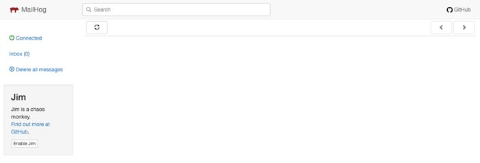
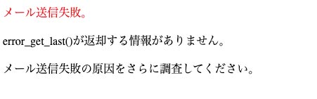

先日、静的HTMLサイトを作っている最中、仕様変更があり急遽フォームを追加しなくてはいけなくなりました。

慌ててDockerにPHPとmailhogを追加して環境構築。AIを駆使したのですが、まあまあ吐き出すコードが間違えていてエラーまみれ笑<br>いざとなったら自分の経験だけがたよりだと痛感しました。

改めてその時作った環境を見直したので、記事にまとめておきます。トラブルシューティングも合わせてまとめておきました。

<prof></prof>

## Dockerでできること：Webサービスとメール送信テストの連携したテスト環境を作る
Docker何ぞやって人もいると思うので Docker のベースの要素をおさらいしておきましょう。

* *イメージ* : プログラムやアプリを動かすための「設計図」や「準備データ」
* *コンテナー* : イメージを元にして実際に動いている「アプリ本体」
* *サービス* : 複数のコンテナーをまとめて管理して効率よく動かす仕組み

<card slug="entry480"></card>


昔主流だった仮想環境の Vagrant や XAMPP を使ったフォーム作成環境の構築は、非常に困難でした。特に、SMTPサーバーを手動で設定する必要があったため、たとえテスト環境であっても、インフラエンジニアなどの専門知識が求められるケースが多かったのです。

しかし、Docker と MailHog を利用すれば、フォームのテスト環境を簡単に手早く構築できます。

<msg txt="本当に良い時代になった。。。"></msg>

### docker-compose.yml を作成

ファイル構成はざっとこんな感じです。web内に設定ファイル、public内に実際に表示させたいファイルを置きます。

```
myproject/
    ├-- public/
    │   ├-- phpinfo.php
    │   └-- index.php(一旦は空ファイル)
    ├-- web/
    │   ├-- Dockerfile
    │   ├-- php_errors.log
    │   └-- php.ini
```

`docker-compose.yml` です。Webの表示には 単に php が動けばいいので、`Dockerfile` で独自のカスタムイメージを作成（後述）します。

```yml:title=docker-compose.yml
services:
  myproject_web:
    build:
      context: ./web
      dockerfile: Dockerfile
    container_name: myproject_web
    ports:
      - "8080:80" # ローカルホスト8080でアクセス
    volumes:
      - ./public_html:/var/www/html # 公開ディレクトリをホストマシンと同期
      - ./web/php.ini:/usr/local/etc/php/php.ini # PHP設定ファイルをコンテナにマウント
      - ./web/php_errors.log:/var/log/php_errors.log #phpエラー出力
    depends_on:
      - myproject_mailhog # MailHogが起動していることを前提にする
    networks:
      - myproject_network

  myproject_mailhog:
    image: 'mailhog/mailhog:latest'
    container_name: myproject_mailhog
    volumes:
      - maildir:/temp # コンテナ内の/tempディレクトリにmaildirをマウント
    environment:
      MH_STORAGE: maildir # MailHogのストレージモードをmaildirに設定
      MH_MAILDIR_PATH: /temp # 保存先ディレクトリを/tempに指定
    ports:
      - "8025:8025" # MailHogのWebインターフェース
      - "1025:1025" # SMTPポート（PHPのメール送信で使用）
    networks:
      - myproject_network

volumes:
  maildir: {} # maildirボリュームを定義（データの永続化用）

networks:
  myproject_network:
    driver: bridge # デフォルトのブリッジネットワークを使用
```

### Docker との相性の良い、mhsendmail の設定

今回は以下4つの理由から`mhsendmail`を使います。

* MailHogとの連携
* PHPのsendmail_path設定に対応
* 簡単にインストールできる
* 開発環境に最適

`mhsendmail` はGo言語で書かれており、軽量で高速に動作します。

`mhsendmail` 導入方法はいくつかありますが今回は `curl` でインストールしました。

`curl` は「インターネットからデータを取得したり送信したりする」ために使われるコマンドラインで使えるツールで、今回使う apache と php のイメージ `php:8.2-apache` に標準搭載されています。

```yaml:title=web/Dockerfile
FROM php:8.2-apache

# vimをインストール(後日困ったらコンテナからファイルを変更できるようにするため)
RUN apt-get update && apt-get install -y vim

# 作業ディレクトリを変更し、mhsendmailをインストール
RUN cd /usr/local/bin && \
    curl -sSL https://github.com/mailhog/mhsendmail/releases/download/v0.2.0/mhsendmail_linux_amd64 -o mhsendmail && \
    chmod +x mhsendmail
```

`Dockerfile` 経由で権限を`-rwxr-xr-x`に変更しておくことがポイントです。

```shell
chmod +x mhsendmail
```

`php.ini` を作成します。`sendmail_path` に `docker-compose.yml` で設定した、SMTPポート `1025` に合わせたパスを追記します。

ついでに、phpエラーを var/log/php_errors.log に出力できるようにしておきます。

```ini:title=web/php.ini
[PHP]
display_errors = On
log_errors = On
error_log = /var/log/php_errors.log
memory_limit = 512M
post_max_size = 100M
upload_max_filesize = 50M

[mail function]
sendmail_path = "/usr/local/bin/mhsendmail -smtp-addr=myproject_mailhog:1025"
```

<p><small>※ 環境に応じて myproject_mailhog:1025 はコンテナ名+ポートになるよう調整してください。</small></p>

### Dockerを起動・送信テスト
Dockerを起動し、正しく動いているか確認しましょう。

```shell:title=コマンド
docker-compose up -d
```

それぞれアクセスしましょう。public/index.phpを空ファイルでもいいので設置しておいてください。

* [サイト:http://localhost:8080/](http://localhost:8080/)

* [mailhog:http://localhost:8025/](http://localhost:8025/)



### Mailhogが反映したか、最低限確認する

`phpinfo.php` を作成し、以下のようにコードを書きます。

```php:title=public/phpinfo.php
<?php
phpinfo();
```
`php.ini` に設定した、`sendmail_path` が反映していることを確認します。


### 実際にメールの送信テストをする

`index.php`にphpの`mail`関数を使ってメール送信テスト用のコードを書いてみましょう。

http://localhost:8080/ にアクセスするだけで送信実行されます。

```php:title=public/index.php
<?php
$to = "test@example.com";
$subject = "メール送信テスト";
$message = "これはDocker環境から送信されたテストメールです。";
$headers = "From: sender@example.com";

if (mail($to, $subject, $message, $headers)) {
    echo "<p style='color: green;'>メール送信成功！</p>";
} else {
    echo "<p style='color: red;'>メール送信失敗。</p>";

    // エラー情報を確認
    $lastError = error_get_last();
    if ($lastError) {
        echo "<h3>エラー内容:</h3>";
        echo "<pre>" . print_r($lastError, true) . "</pre>";
    } else {
        echo "<p>error_get_last()が返却する情報がありません。</p>";
        echo "<p>メール送信失敗の原因をさらに調査してください。</p>";
    }
}
```


<div class="box">
<h4>mail関数</h4>
<p><code class="language-text">mail</code>関数はメール送信の試行が実行できたかを返します。成功したか失敗したかは、PHPが内部的にメール送信コマンド（例: sendmail, mhsendmail）が実行できたかしか判定しません。</p>
<p>つまり、<code class="language-text">if (mail($to, $subject, $message, $headers)) {…}</code>がtrueだった時点で関数は実行されます。</p>
<p>もしここで、メールが送信できない場合、<code class="language-text">mail</code>関数の実行そのものが失敗しているということになるので、mhsendmailのインストールの失敗や不具合を疑うことができます。</p>
</div>

一度Dockerを閉じて、再び起動します。メールのログが残っていれば成功です。
```shell:title=コマンド
docker-compose down
docker-compose up -d
```

## トラブルシューティング
私は最初 GO の拡張機能経由で apache 側に`mhsendmail`をインストールしたのですがメール送信に失敗しました。



```php:title=php
$lastError = error_get_last();
```
`error_get_last()`は、PHPが直前に発生したランタイムエラーを取得する関数です。`mail` 関数の実行結果が`false`の場合、エラー結果として `null` が返ってきます。

<br><br>どんなケースでもプログラミングでは、*どの時点で失敗しているかを特定するのが大切* で、実行した順番にたどりながら確認していくことがポイントです。

1. コンテナは正しくインストールされているか？
2. `mhsendmail` はコンテナ内に正しい場所にインストールされているか？
3. `mhsendmail` のパーミッションは正しいか？
4. `php.ini` に設定した `sendmail_path` のパスは間違ってないか？
5. コンテナは同士のネットワークに問題はないか？

先程も **mail関数** で触れたように、メール送信ができていないので*mhsendmailのインストールの失敗や不具合を疑う*べきです。

### まず最初にコンテナ内にmhsendmailがインストールされているか確認

コンテナは動いているので `apache` 用のコンテナ内（myproject_web）に `mhsendmail` がインストールされているか確認します。

`ls -l`コマンドでパーミッションもついでに確認します。

```shell:title=コマンド
docker exec -it [コンテナ名] ls -l /usr/local/bin/mhsendmail
```
```shell:title=コマンド
docker exec -it myproject_web ls -l /usr/local/bin/mhsendmail
↓↓↓(期待するレスポンス)
-rwxr-xr-x 1 root root 5878296 Apr  6 03:29 /usr/local/bin/mhsendmail
```
初期状態でコマンドでdockerコンテナをインストールする時、メッセージが流れすぎてエラーを見逃してしまうことがあります。私のようなうっかりさんは、ログをファイルに書き出してしまうのもおすすめです。

```shell:title=コマンド
docker-compose up -d > docker-compose.log 2>&1
```

<msg txt="私なんて、退屈だからインストール待っている間ついYouTube見ちゃいますもん。"></msg>


*コンテナ内で叩けるコマンド* は、*Dockerfile内でも必ず実行可能* です。なのでDockerfileで実行する前に、まずはコンテナでコマンドが叩けるか試してみるのもおすすめです。

ということで、昔ながらのやり方`curl`に切り替え実行してみます。コンテナに入ります。

```shell:title=コマンド
docker exec -it [コンテナ名] /bin/bash
↓↓↓
docker exec -it myproject_web /bin/bash
```

Dockerfileで叩きたかったコマンドを実行してみます。
```shell:title=コマンド
cd /usr/local/bin
curl -sSL https://github.com/mailhog/mhsendmail/releases/download/v0.2.0/mhsendmail_linux_amd64 -o mhsendmail
chmod +x mhsendmail
```
[Mailhog/mhsendmail](https://github.com/mailhog/mhsendmail)

<msg txt="この Github の Download パスは将来的に変わるかもしれないので必ずご確認ください。"></msg>

`ls`コマンドで`mhsendmail` があるか確認。

```shell:title=コマンド
ls -l mhsendmail
↓↓↓(期待するレスポンス)
-rwxr-xr-x 1 root root 5878296 Apr  6 03:29 /usr/local/bin/mhsendmail
```

`curl` で確実にインストールできることが分かったので、Dockerfile もそのように書き直しました。


戻ってまた送信テストをしてみます。

### mhsendmail が正しくインストールされたのに、mailhog 側に反映されない


<msg txt="またお前か。。。"></msg>

`mhsendmail`がちゃんとコンテナ内インストールされたのにメールが送信できない場合は、apache と mailhog のネットワークのつなぎ込みの失敗やSTMPサーバーへのパスの記述ミスの可能性が高いです。

まずは問題の起こっている場所の特定するために、コンテナ側からメール送信を行ってみます。

```shell:title=コマンド
docker exec -it myproject_web /bin/bash
echo -e "Subject: Test Email\n\nThis is a test email body." | /usr/local/bin/mhsendmail -smtp-addr=myproject_mailhog:1025 test@example.com
```

ここで`mailhog` にメールは届く場合は、コンテナ内の `mhsendmail` に問題はない事がわかります。

<br><br>私の場合単純な凡ミスで `sendmail_path` が間違ってました。なのでコンテナ内ではメール送信に成功し、web側では送れなかったのです。

```ini:title=php.ini
sendmail_path = "/usr/bin/mhsendmail -smtp-addr=myproject_mailhog:1025"
↓↓↓正しくは
sendmail_path = "/usr/local/bin/mhsendmail -smtp-addr=myproject_mailhog:1025"
```

以下よく確認します。

* `/usr/local/bin/mhsendmail` => myproject_webでmhsendmailをインストールしたパス
* `myproject_mailhog:1025` => -smtp-addr=コンテナ名+ポート

さらに念の為、`docker-compose.yml` のネットワーク名を明示的に指定するために、コードも修正しました。これで同じネットワークに属しているため、通信が確実に行われます。

```yaml:title=docker-compose.yml
services:
  myproject_web:
  ...
  networks:
    - myproject_network #ネットワーク名を明示的に指定

  myproject_mailhog:
    ...
    networks:
      - myproject_network #ネットワーク名を明示的に指定
networks:
  myproject_network:
    driver: bridge # デフォルトのブリッジネットワークを使用
```

## まとめ・導入よりもトラブルの原因を突き止める力が重要

今回はプレーンなサーバー環境にフォームのデバッグをできる環境を作ってみました。

最近 Docker を触る機会が増えましたが大切なのはエラーをキャッチでき、デバッグができる環境をいかに作るかが大事だなということです。

JavaScript しかり、PHPしかり、エンジニアはそこまで用意して初めて一人前になれるとしみじみ思いました。

そして AI の言うことを鵜呑みにせず、ある程度体系的に知識がないと振り回されるので、ベースの勉強大事だと思いました。

この記事が皆さんのエンジニアライフの一助となれば幸いです。

最後までお読みいただきありがとうございました。
