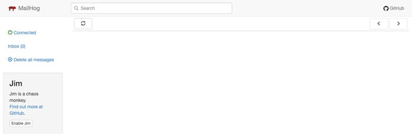
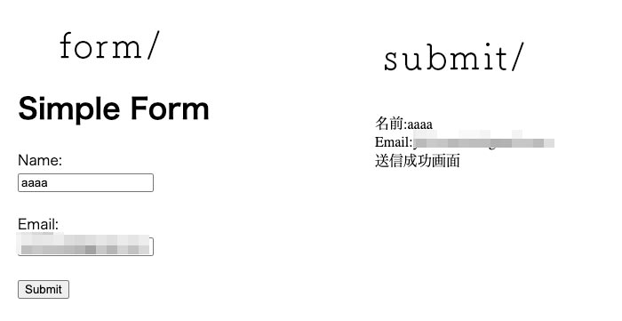
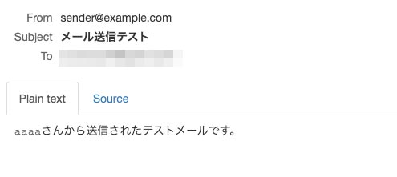
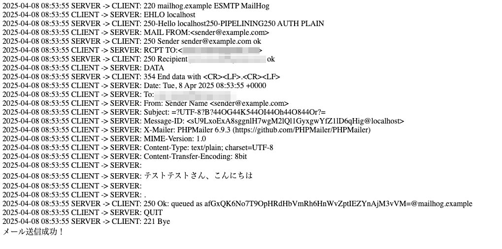
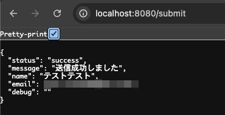
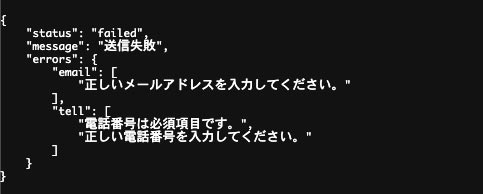
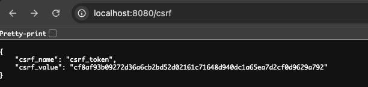

ちょっと前、急いでいたあまりフォームをスクラッチで作成せざるを得ない事案が発生しました。

フォームをスクラッチで作成するなど、私いち個人の業界15年で培ったフィロソフィーからしても *正気の沙汰ではない* と思っています。そこで、鬼気迫る状況下でも困らないよう、framework を導入してフォームを作成する手順をまとめてみました。

<msg txt="こ、これを使うのは危険だろ。。。。"></msg>

その昔 fuelPHP で似たようなことをしましたが、最新版は2019年6月にアップデートされた1.8.2のみ。

かといって Laravel 実装したいことに対して重すぎる。。。

そこで今回は軽量なことで定評あり導入しやすい Slim framework を活用してみたいと思います。

https://www.slimframework.com/

*やりたいこと*
* Xserverなどのサーバーに実装できる
* Dockerでしっかり環境を作ってテストしたい
* FetchAPI で非同期で送信したい

<prof></prof>

コードが長くなってしまったので、目次（この記事のサマリー）を辿ってください。

## 環境構築
まずは基本のディレクトリ構造です。
```
myproject/
    ├-- docker-compose.yml
    ├-- public_html/
    │   ├-- .htaccess
    │   └-- index.php
    ├-- slim_app/ (public以下以外のファイルは全てここに置く)
    │   ├-- composer.json
    │   ├-- vendor/
    │   │ ....
    │   └-- app/
    ├-- web/
    │   ├-- Dockerfile
    │   ├-- php_errors.log
    │   └-- php.ini
```

### Slim をComposer経由でインストール
まず、コンポーザーがあるか確認します。けっこう使うので昔インストールしていることも。

```shell:title=コマンド
 composer -v
```
なければ以下リンクに沿って、コンポーザーをインストールします。

[Download Composer](https://getcomposer.org/download/)

プロジェクトディレクトリで以下コマンドを実行。コンポーザー経由でslimをインストールします。

versionが古い場合（2025年1月現在Latest: v2.8.8）はアップデートしておきましょう。

```shell:title=コマンド
composer self-update
```

```shell:title=コマンド
composer create-project slim/slim-skeleton slim_app
```
`slim_app/`に落ちてきた `public` ディレクトリ を `public_html` と名称変更し `slim_app/` と同じ階層に並べます。

### Docker 環境作成
Docker 環境作成の説明は割愛します。

エラーで躓いたり、困ったら以下記事を参考にしてください。

<card slug="entry480"></card>

<card slug="entry549"></card>

```yaml:title=docker-compose.yml
services:
  slim_app:
    build:
      context: ./web
    container_name: slim_app
    volumes:
      - ./slim_app:/var/www/slim_app
      - ./public_html:/var/www/public_html
      - ./web/php.ini:/usr/local/etc/php/php.ini # PHP設定ファイルをコンテナにマウント
      - ./web/php_errors.log:/var/log/php_errors.log #phpエラー出力
      - ./web/000-default.conf:/etc/apache2/sites-available/000-default.conf
    ports:
      - "8080:80" # ローカルでポート8080で公開
    networks:
      - slim_network
    depends_on:
      - slim_mailhog

  slim_mailhog:
    privileged: true
    image: 'mailhog/mailhog:latest'
    container_name: slim_mailhog
    ports:
      - "8025:8025" # MailHogのWebインターフェース
      - "1025:1025" # SMTPポート（PHPのメール送信で使用）
    networks:
      - slim_network

networks:
  slim_network:
    driver: bridge
```
```yaml:title=web/Dockerfile
FROM php:8.2-apache

# 必要なモジュールをインストール
RUN apt-get update && apt-get install -y \
    libzip-dev unzip curl vim telnet\
    && docker-php-ext-install zip pdo_mysql

# Slim Frameworkのインストール
WORKDIR /var/www/slim_app

# mhsendmailをインストール
RUN cd /usr/local/bin && \
    curl -sSL https://github.com/mailhog/mhsendmail/releases/download/v0.2.0/mhsendmail_linux_amd64 -o mhsendmail && \
    chmod +x mhsendmail

# Apacheのリライトモジュールを有効化
RUN a2enmod rewrite
```
```ini:title=web/php.ini
[PHP]
display_errors = On
log_errors = On
error_log = /var/log/php_errors.log
memory_limit = 512M
post_max_size = 100M
upload_max_filesize = 50M

[mail function]
sendmail_path = "/usr/local/bin/mhsendmail -smtp-addr=slim_mailhog:1025"
```
```html:title=web/000-default.conf
<VirtualHost *:80>
    ServerAdmin webmaster@localhost
    DocumentRoot /var/www/public_html

    <Directory /var/www/public_html>
        AllowOverride All
        Require all granted
    </Directory>

    ErrorLog ${APACHE_LOG_DIR}/error.log
    CustomLog ${APACHE_LOG_DIR}/access.log combined
</VirtualHost>
```
```shell:title=コマンド
docker-compose up -d
```

### ファイル内のパスを修正
public/index.php にはエントリポイントとしてのファイルが置かれています。そのパスを `/../` を `/../slim_app/`に修正します。

もしフォームをさらに1層下に置く場合は`/../../slim_app/`等、適宜設定を変えてください。

http://localhost:8080/ にアクセスするとHello, world が表示されます。

* [サイト:http://localhost:8080/](http://localhost:8080/) → Hello, world!!
* [mailhog:http://localhost:8025/](http://localhost:8025/)


## Slim framework でフォーム作成
以下のようにファイルを置きます。
```
myproject/
    ├-- public_html/
    │   ├-- .htaccess
    │   ├-- index.html(追加)
    │   ├-- form.html(追加)
    │   ├-- .htaccess
    │   └-- index.php
    ├-- slim_app/
    │   │ ....
    │   ├-- app/
    │   │    └-- routes.php
```
さっそく、slimでフォームを作ります。

今回は、テンプレートは予めhmtlで作成しているので、そのまま使います。

routes.php から `/form` にアクセスしたら、`public_html/form.html` を読み込むようにします。

```php:title=slim_app/app/routes.php
<?php

declare(strict_types=1);

use App\Application\Actions\User\ListUsersAction;
use App\Application\Actions\User\ViewUserAction;
use Psr\Http\Message\ResponseInterface as Response;
use Psr\Http\Message\ServerRequestInterface as Request;
use Slim\App;


return function (App $app) {
  $app->options('/{routes:.*}', function (Request $request, Response $response) {
      // CORS Pre-Flight OPTIONS Request Handler
      return $response;
  });
  // ↓↓↓変更
  $app->get('/', function (Request $request, Response $response) {
    $formHtml = file_get_contents(__DIR__ . '/../../public_html/index.html'); 
    $response->getBody()->write($formHtml);
    return $response;
  });
  // ↓↓↓追加
  $app->get('/form', function ($request, $response, $args) {
    // 外部ファイルを読み込む
    $formHtml = file_get_contents(__DIR__ . '/../../public_html/form.html'); 
    $response->getBody()->write($formHtml);
    return $response;
  });
};
```
トップページ
```html:title=public_html/index.html
<!DOCTYPE html>
<html lang="ja">
<head>
  <meta charset="UTF-8">
  <meta name="viewport" content="width=device-width, initial-scale=1.0">
  <title>Document</title>
</head>
<body>
  <p>Hello, world!</p>
</body>
</html>
```
フォームのテンプレhtml。後ほどバリデーション追加して検証するため、あえてtype="text"などにしています。
```html:title=public_html/form.html
<!DOCTYPE html>
<html lang="ja">

<head>
  <meta charset="UTF-8">
  <meta name="viewport" content="width=device-width, initial-scale=1.0">
  <title>Simple Form</title>
</head>

<body>
  <h1>Simple Form</h1>
  <form action="/submit" method="POST">
    <label for="name">Name:</label><br>
    <input type="text" id="name" name="name"><br><br>
    <label for="email">Email:</label><br>
    <input type="text" id="email" name="email"><br><br>
    <label for="tell">Phone number:</label><br>
    <input type="text" id="tell" name="tell"><br><br>
    <button type="submit">Submit</button>
  </form>
</body>

</html>
```

.htaccess で index.html や form.html にアクセスできないようにしておきます。

```shell:title=public_html/.htaccess
<IfModule>
  RewriteCond %{REQUEST_URI}::$1 ^(/.+)/(.*)::\2$
  RewriteRule ^(.*) - [E=BASE:%1]
  
  # If the above doesn't work you might need to set the `RewriteBase` directive manually, it should be the
  # absolute physical path to the directory that contains this htaccess file.
  # RewriteBase /

  RewriteRule ^index\.html$ / [R=301,L]
  RewriteRule ^form\.html$ /form [R=301,L]
  
  RewriteCond %{REQUEST_FILENAME} !-d
  RewriteCond %{REQUEST_FILENAME} !-f
  RewriteRule ^ index.php [QSA,L]
</IfModule>
```
### Slim フォームのベースのロジックを作成

```
myproject/
    ├-- slim_app/
    │   │ ....
    │   ├-- src/
    │   │   ├-- Controllers(←追加)
    │   │   │   └-- FormController.php(←追加)
    │   ├-- app/
    │   │   └-- routes.php
```
`routes.php` に `submi` を追加。
```php:title=slim_app/app/routes.php
<?php

declare(strict_types=1);

use App\Application\Actions\User\ListUsersAction;
use App\Application\Actions\User\ViewUserAction;
use App\Controllers\FormController;

use Psr\Http\Message\ResponseInterface as Response;
use Psr\Http\Message\ServerRequestInterface as Request;
use Slim\App;


return function (App $app) {
    $app->options('/{routes:.*}', function (Request $request, Response $response) {
        // CORS Pre-Flight OPTIONS Request Handler
        return $response;
    });

    $app->get('/', function (Request $request, Response $response) {
        $formHtml = file_get_contents(__DIR__ . '/../../public_html/index.html'); 
        $response->getBody()->write($formHtml);
		return $response;
    });

    $app->get('/form', function ($request, $response, $args) {
		$formHtml = file_get_contents(__DIR__ . '/../../public_html/form.html'); // 外部ファイルを読み込む
		$response->getBody()->write($formHtml);
		return $response;
	});

  //追加
  $app->post('/submit', [FormController::class, 'submit']);
};
```
まずはmailhogが動くかも確認したいので、`FormController.php` を追加しフォーム送信をテストしてみます。

```php:title=slim_app/src/Controllers/FormController.php
<?php
namespace App\Controllers;

use Psr\Http\Message\ResponseInterface as Response;
use Psr\Http\Message\ServerRequestInterface as Request;

class FormController {
    public function submit(Request $request, Response $response): Response {
        $data = $request->getParsedBody();
        $name = htmlspecialchars($data['name'] ?? '');
        $email = htmlspecialchars($data['email'] ?? '');
        $tell = htmlspecialchars($data['tell'] ?? '');
        $message = $name . "さんから送信されたテストメールです。";

        if (mail($email, "メール送信テスト", $message, "From: sender@example.com")) {
            $response->getBody()->write( "名前:$name<br>Email:$email<br>Tell:$tell<br>送信成功画面");
        } else {
            $response->getBody()->write( "メール送信失敗");
        }
        return $response;
    }
}
```
http://localhost:8080/form/ にアクセスしてテスト送信を行ってみましょう。



Mailhog側。



Slim では `mail` 関数を使うことは推奨されていないので、今回は Slim と相性の良い拡張機能 `phpmailer` を利用します。

```shell:title=コマンド
cd slim_app
composer require phpmailer/phpmailer
```
`phpmailer`に合わせたコードに修正します。

phpmailer では STMP の設定が必要になるのですが、*mailhogのコンテナ名ではなくIPアドレスを指定* してください。

```php:title=slim_app/src/Controllers/FormController.php
<?php
namespace App\Controllers;

use Psr\Http\Message\ResponseInterface as Response;
use Psr\Http\Message\ServerRequestInterface as Request;
use PHPMailer\PHPMailer\PHPMailer;//追加
use PHPMailer\PHPMailer\Exception;//追加

// ほぼ書き直してください
class FormController {
    public function submit(Request $request, Response $response): Response {
        $data = $request->getParsedBody();
        $name = htmlspecialchars($data['name'] ?? '');
        $tell = htmlspecialchars($data['tell'] ?? '');
        $email = htmlspecialchars($data['email'] ?? '');

        // PHPMailerでメール送信
        $mail = new PHPMailer(true);

        try {
            $mail->isSMTP();
            $mail->Host = '192.168.16.2'; // slim_mailhogのIPアドレス
            $mail->Port = 1025;           // MailHogのSMTPポート
            $mail->SMTPAuth = false;      // 認証不要
            $mail->SMTPDebug = 2;           // デバッグモード有効
            $mail->Debugoutput = 'html';    // デバッグ出力形式
            $mail->Timeout = 30;            // タイムアウト設定
            $mail->CharSet = 'UTF-8'; // 文字コードをUTF-8に設定

            $mail->setFrom('sender@example.com', 'Sender Name'); // 送信元メールアドレス
            $mail->addAddress($email);           // テスト用受信者

            $mail->Subject = 'テストメール';
            $mail->Body = $name . "さん、こんにちは";

            $mail->send();
            echo "メール送信成功！";

        } catch (Exception $e) {
            $response->getBody()->write("メール送信失敗: {$mail->ErrorInfo}");
            return $response->withStatus(500);
        }

        return $response;
    }
}
```
デバッグモード有効にしているので以下のように出力されます。



### 非同期対応したいので、JSONでデータを返すように修正
今回は非同期でフォーム送信したいので以下のようにコードを修正してJSONを返すようにしておきます。
必要に応じて$mail->SMTPDebugを有効にしておくと良いと思います。

```php:title=slim_app/src/Controllers/FormController.php
// 初期化
$mail = new PHPMailer(true);
$debugInfo = ''; // デバッグ情報用

try {
    // PHPMailer設定
    $mail->isSMTP();
    $mail->Host = '192.168.16.2';  // slim_mailhogのIPアドレス
    $mail->Port = 1025;            // SMTPポート
    $mail->SMTPAuth = false;       // 認証不要
    // $mail->SMTPDebug = 2;          // デバッグモード有効
    // $mail->Debugoutput = function ($str, $level) use (&$debugInfo) {
    //     $debugInfo .= "Level {$level}: {$str}\n";
    // };
    $mail->CharSet = 'UTF-8';      // 文字コードをUTF-8に設定

    // 送信情報の設定
    $mail->setFrom('sender@example.com', 'Sender Name'); // 送信元
    $mail->addAddress($email);                           // 宛先

    $mail->Subject = 'テストメール';                     // 件名
    $mail->Body = "{$name}さん、こんにちは";            // 本文

    // メール送信
    $mail->send();

    // 成功レスポンス
    $responseData = [
        'status' => 'success',
        'message' => '送信成功しました',
        'name' => $name,
        'email' => $email,
        'tell' => $tell,
        'debug' => $debugInfo, // デバッグ情報
    ];

} catch (Exception $e) {
    // エラーハンドリング
    $responseData = [
        'status' => 'failed',
        'message' => '送信失敗',
        'error' => $mail->ErrorInfo,  // PHPMailerのエラー情報
        'debug' => $debugInfo,        // デバッグ情報
    ];
}

// JSONレスポンスを返す
$response->getBody()->write(json_encode($responseData, JSON_UNESCAPED_UNICODE | JSON_PRETTY_PRINT));
return $response->withHeader('Content-Type', 'application/json');
```


### バリデーションを追加する
フォームといえばバリデーション対応が書かせませんね。Slimとの相性がよく、広範なルールを提供するシンプルなバリデーションライブラリの`Respect\Validation`を導入します。

```shell:title=コマンド
cd slim_app
composer require respect/validation
```
コードの見通しが悪くなるので、メソッドで追加します。
```php:title=slim_app/src/Controllers/FormController.php
<?php
...
// 追加
use Respect\Validation\Validator as v;

class FormController {
    ...
    /**
     * バリデーションメソッド
     */
    private function validate(array $data): array {
        $errors = [];

        // ここに処理

        return $errors;
    }
}
```
全体のコードです。
```php:title=slim_app/src/Controllers/FormController.php
<?php
namespace App\Controllers;

use Psr\Http\Message\ResponseInterface as Response;
use Psr\Http\Message\ServerRequestInterface as Request;
use PHPMailer\PHPMailer\PHPMailer;
use PHPMailer\PHPMailer\Exception;
use Respect\Validation\Validator as v;

class FormController {
    public function submit(Request $request, Response $response): Response {
        $data = $request->getParsedBody();

        // バリデーションチェック
        $errors = $this->validate($data);

        // エラーがある場合
        if (!empty($errors)) {
            $responseData = [
                'status' => 'failed',
                'message' => '送信失敗',
                'errors' => $errors,
            ];
            $response->getBody()->write(json_encode($responseData, JSON_UNESCAPED_UNICODE | JSON_PRETTY_PRINT));
            return $response->withHeader('Content-Type', 'application/json');
        }

        // PHPMailerでメール送信
        $mail = new PHPMailer(true);
        $debugInfo = '';

        $name = htmlspecialchars($data['name'] ?? '');
        $tell = htmlspecialchars($data['tell'] ?? '');
        $email = htmlspecialchars($data['email'] ?? '');

        try {
            $mail->isSMTP();
            $mail->Host = '192.168.16.2';  // slim_mailhogのIPアドレス
            $mail->Port = 1025;            // SMTPポート
            $mail->SMTPAuth = false;       // 認証不要
            $mail->CharSet = 'UTF-8';      // 文字コードをUTF-8に設定

            $mail->setFrom('sender@example.com', 'Sender Name'); // 送信元
            $mail->addAddress($email);                  // 宛先

            $mail->Subject = 'テストメール';                     // 件名
            $mail->Body = "{$name}さん、こんにちは";    // 本文

            $mail->send();

            // 成功レスポンス
            $responseData = [
                'status' => 'success',
                'message' => '送信成功しました',
                'name' => $name,
                'email' => $email,
                'tell' => $tell,
                'debug' => $debugInfo,
            ];

        } catch (Exception $e) {
            // メール送信失敗レスポンス
            $responseData = [
                'status' => 'failed',
                'message' => 'メール送信に失敗しました',
                'error' => $mail->ErrorInfo,
                'debug' => $debugInfo,
            ];
        }

        $response->getBody()->write(json_encode($responseData, JSON_UNESCAPED_UNICODE | JSON_PRETTY_PRINT));
        return $response->withHeader('Content-Type', 'application/json');
    }

    /**
     * バリデーションメソッド
     */
    private function validate(array $data): array {
        $errors = [];
        $validators = [
            'name' => [
                ['rule' => v::notEmpty(), 'message' => '名前は必須項目です。'],
                ['rule' => v::length(2, 50), 'message' => '名前は50文字以内で入力してください。'],
            ],
            'email' => [
                ['rule' => v::notEmpty(), 'message' => 'メールアドレスは必須項目です。'],
                ['rule' => v::email(), 'message' => '正しいメールアドレスを入力してください。'],
            ],
            'tell' => [
                ['rule' => v::notEmpty(), 'message' => '電話番号は必須項目です。'],
                ['rule' => v::phone(), 'message' => '正しい電話番号を入力してください。'],
            ],
        ];

        foreach ($validators as $field => $rules) {
            foreach ($rules as $validation) {
                if (!$validation['rule']->validate($data[$field] ?? '')) {
                    $errors[$field][] = $validation['message'];
                }
            }
        }

        return $errors;
    }
}
```
エラーが返ってきました。



`Respect\Validation`で使えるバリデーションです。

| カテゴリ             | ルール           | 説明                                                       |
| ------------------------ | -------------------- | -------------------------------------------------------------- |
| *データ形式*           | `notEmpty`           | 値が空ではないことを確認します。                               |
|                          | `email`              | 有効なメールアドレス形式であることを確認します。               |
|                          | `phone`              | 有効な電話番号形式であることを確認します。                     |
|                          | `url`                | 有効なURL形式であることを確認します。                          |
|                          | `ip`                 | 有効なIPアドレスであることを確認します。                       |
| *数値/範囲*            | `numeric`            | 数値であることを確認します。                                   |
|                          | `intVal`             | 整数であることを確認します。                                   |
|                          | `between(min, max)`  | 指定された範囲内であることを確認します。                       |
|                          | `min(min)`           | 最小値を指定します。                                           |
|                          | `max(max)`           | 最大値を指定します。                                           |
| *文字列*               | `length(min, max)`   | 最小文字数と最大文字数を指定します。                           |
|                          | `startsWith(prefix)` | 特定の文字列で始まることを確認します。                         |
|                          | `endsWith(suffix)`   | 特定の文字列で終わることを確認します。                         |
|                          | `contains(text)`     | 特定の文字列を含むことを確認します。                           |
|                          | `alpha`              | アルファベットのみで構成されていることを確認します。           |
|                          | `alphaNumeric`       | アルファベットまたは数字のみで構成されていることを確認します。 |
| *日付/時間*            | `date`               | 有効な日付であることを確認します。                             |
|                          | `time`               | 有効な時刻であることを確認します。                             |
|                          | `before(date)`       | 指定した日付より前であることを確認します。                     |
|                          | `after(date)`        | 指定した日付より後であることを確認します。                     |
| *リスト/配列*          | `arrayVal`           | 配列であることを確認します。                                   |
|                          | `in(array)`          | 配列内に特定の値が存在することを確認します。                   |
|                          | `subset(array)`      | 配列が指定した配列の部分集合であることを確認します。           |
| *特殊条件*             | `equals(value)`      | 特定の値と一致することを確認します。                           |
|                          | `instance(class)`    | 指定したクラスのインスタンスであることを確認します。           |
|                          | `json`               | 有効なJSON形式であることを確認します。                         |
| *複数条件の組み合わせ* | `allOf`              | 複数のバリデーションを全て満たす必要がある。                   |
|                          | `anyOf`              | 複数のバリデーションのうちいずれかを満たす必要がある。         |
|                          | `noneOf`             | 複数のバリデーションをいずれも満たさないことを確認する。       |

## JavaScript の FetchAPI でフォーム送信できるようにする
ではこのコードを JS の Fetch API で送信してみます。送信がうまく行ったら、thanks/リダイレクトします。
```
myproject/
    ├-- public_html/
    │   ├-- .htaccess
    │   ├-- index.html(修正)
    │   ├-- form.html(修正)
    │   ├-- thanks.html(追加)
    │   └-- index.php
    ├-- slim_app/
    │   │ ....
    │   ├-- app/
    │   │    └-- routes.php(修正)
```
エラーメッセージを出力できるように、コードを追加します。
```html:title=public_html/form.html
  ...
  <style>
    span {
      display: block;
      font-size: 0.8em;
      color: #9f0000;
    }
  </style>
  ...
 <form action="/submit" method="POST" class="form" name="form">
    <label for="name">Name:</label><br>
    <input type="text" id="name" name="name">
    <span class="error-name"></span>
    <br>
    <label for="email">Email:</label><br>
    <input type="text" id="email" name="email">
    <span class="error-email"></span><br>
    <label for="tell">Phone number:</label><br>
    <input type="text" id="tell" name="tell">
    <span class="error-tell"></span><br>
    <button type="button" class="submit-btn">Submit</button>
    <span class="error-all"></span>
  </form>
```
フォームをJavaScriptで非同期で送信するためのコードです。今回はSlimの解説なので細かいことは割愛します。
```js:title=JavaScript
  const form = document.querySelector('[name="form"]');
  const submitBtn = document.querySelector('.submit-btn');

  submitBtn.addEventListener('click', async (event) => {
    submitBtn.disabled = true; // ボタンを無効化して連続送信を防止
    const formData = new FormData(form);
    const data = Object.fromEntries(formData.entries()); // JSON形式に変換
    const response = await fetch('/submit', {
      method: 'POST',
      headers: {
        'Content-Type': 'application/json'
      },
      body: JSON.stringify(data),
    })
    const result = await response.json();
    if (response.ok) {
      if (result.status !== 'success') {
        for (error in result.errors) {
          const errorText = result.errors[error].join('<br>');
          document.querySelector(`.error-${error}`).innerHTML = errorText;
        }
        submitBtn.disabled = false;
      } else {
        const redirectUrl = '/thanks';
        location.href = redirectUrl; // 成功時にリダイレクト
      }
    } else {
      document.querySelector(`.error-all`).innerHTML = '通信エラーが発生しました。後ほど再試行してください。';
      submitBtn.disabled = false;
    }
  })
```
Thanksページのテンプレを追加。
```html:title=public_html/thanks.html
<!DOCTYPE html>
<html lang="ja">

<head>
  <meta charset="UTF-8">
  <meta name="viewport" content="width=device-width, initial-scale=1.0">
  <title>メール送信が完了しました</title>
</head>

<body>
  <p>メール送信が完了しました</p>
</body>

</html>
```
`routes.php`にthanksのルートを追加。
```php:title=slim_app/app/routes.php
  ...
  $app->post('/submit', [FormController::class, 'submit']);

  // /thanks: サンクスページ
  $app->get('/thanks', function (Request $request, Response $response) {
    $thanksHtml = file_get_contents(__DIR__ . '/../../public_html/thanks.html');
    $response->getBody()->write($thanksHtml);
    return $response;
});
```
`thanks.html`にアクセスさせないよう`.htaccess`を編集。
```shell:title=public_html/.htaccess
RewriteRule ^thanks\.html$ /thanks [R=301,L]
```
## セキュリティ対策：CSRFを追加する
セキュリティ対策にCSRFも追加しておきます。

> クロスサイトリクエストフォージェリ（forgery：偽造） は、Webアプリケーションの脆弱性の一つもしくはそれを利用した攻撃。略称はCSRF、またはXSRF。

最初から、blade や Twig などのテンプレートで書いてもいいんですが今回は本来のソースコードを徹底的に活かすため、CSRF トークンも Fetch で取得します。

```shell:title=コマンド
cd slim_app
composer require symfony/http-foundation
```

`routes.php`のコードです。セキュリティヘッダーの追加を追加し、セキュアにするためにトークンは1時間後に有効期限が切れるようにしておきました。

```php:title=slim_app/app/routes.php
<?php

declare(strict_types=1);

use App\Controllers\FormController;
use Psr\Http\Message\ResponseInterface as Response;
use Psr\Http\Message\ServerRequestInterface as Request;
use Slim\App;
use Slim\Factory\AppFactory;//追加
use Symfony\Component\HttpFoundation\Session\Session;//追加
use Symfony\Component\HttpFoundation\Session\Storage\NativeSessionStorage;//追加

return function (App $app) {
    // セッションのセットアップ
    $session = new Session(new NativeSessionStorage());
    $session->start();

    // CORS設定（OPTIONSリクエストを許可）
    $app->options('/{routes:.*}', function (Request $request, Response $response) {
        return $response->withHeader('Access-Control-Allow-Origin', '*')
                        ->withHeader('Access-Control-Allow-Methods', 'GET, POST, OPTIONS')
                        ->withHeader('Access-Control-Allow-Headers', 'Content-Type');
    });
    ...
    // CSRFトークン生成ミドルウェアの設定
    $app->get('/csrf', function (Request $request, Response $response) use ($session) {
        // トークンの生成とセッションへの保存
        $csrf_name = 'csrf_token';
        $csrf_value = bin2hex(random_bytes(32));
        $expires_at = time() + 3600; // 現在時刻 + 1時間（3600秒）
		
        // セッションにトークンと有効期限を保存
    		$session->set($csrf_name, [
    			'value' => $csrf_value,
    			'expires_at' => $expires_at
    		]);

        // JSONでクライアントにトークンを返却
        $responseData = [
            'csrf_name' => $csrf_name,
            'csrf_value' => $csrf_value,
        ];

        $response->getBody()->write(json_encode($responseData, JSON_UNESCAPED_UNICODE | JSON_PRETTY_PRINT));
        return $response->withHeader('Content-Type', 'application/json');
    });
};
```
[http://localhost:8080/csrf](http://localhost:8080/csrf)にアクセスしたらトークンが確認できます。



`FormController.php`を修正

```php:title=slim_app/src/Controllers/FormController.php
<?php
namespace App\Controllers;

use Psr\Http\Message\ResponseInterface as Response;
use Psr\Http\Message\ServerRequestInterface as Request;
use PHPMailer\PHPMailer\PHPMailer;
use PHPMailer\PHPMailer\Exception;
use Respect\Validation\Validator as v;
//追加
use Symfony\Component\HttpFoundation\Session\Session;

class FormController {
    //追加
    private Session $session;

    // 追加
    public function __construct(Session $session) {
        $this->session = $session;
    }

    public function submit(Request $request, Response $response): Response {
        $data = $request->getParsedBody();

        // CSRFトークンの検証
        // 追加
        if (!$this->verifyCsrf($data)) {
            $responseData = [
                'status' => 'failed',
                'message' => 'CSRFトークンが無効です。',
            ];
            $response->getBody()->write(json_encode($responseData, JSON_UNESCAPED_UNICODE | JSON_PRETTY_PRINT));
            return $response->withStatus(400)->withHeader('Content-Type', 'application/json');
        }

        ...

        $response->getBody()->write(json_encode($responseData, JSON_UNESCAPED_UNICODE | JSON_PRETTY_PRINT));
        return $response->withHeader('Content-Type', 'application/json');
    }
    ...

    /**
     * CSRFトークン検証
     */
    private function verifyCsrf(array $data): bool {
        $csrf_name = $data['csrf_name'] ?? '';
        $csrf_value = $data['csrf_value'] ?? '';
        $stored_token = $this->session->get($csrf_name);

        if (!$stored_token) {
            return false; // トークンが存在しない場合
        }

        // トークンの値と有効期限を確認
        $stored_value = $stored_token['value'] ?? '';
        $expires_at = $stored_token['expires_at'] ?? 0;

        if ($stored_value !== $csrf_value) {
            return false; // トークンが一致しない場合
        }

        if (time() > $expires_at) {
            return false; // トークンが有効期限切れの場合
        }

        return true; // トークンが有効である場合
    }

}
```

`form.html` にFetchAPIで取得したトークンを挿入できるようにする。

```html:title=public_html/form.html
...

<body>
  <h1>Simple Form</h1>
  <form action="/submit" method="POST" class="form" name="form">
    ...
    <button type="button" class="submit-btn">Submit</button>
    <span class="error-all"></span>
    <input type="hidden" name="csrf_value">
    <input type="hidden" name="csrf_name">
  </form>
  ...
</body>

</html>
```
```JS:title=JavaScript
...
  const form = document.querySelector('[name="form"]');
  const submitBtn = document.querySelector('.submit-btn');
  async function fetchCsrfToken() {
    try {
      const response = await fetch('/csrf'); // トークンを取得
      if (!response.ok) {
        throw new Error(`ステータスコード: ${response.status}`);
      }
      const data = await response.json();
      document.querySelector('input[name="csrf_name"]').value = data.csrf_name;
      document.querySelector('input[name="csrf_value"]').value = data.csrf_value;
    } catch (error) {
      submitBtn.disabled = true; // ボタンを無効化して連続送信を防止
      const otherErrorElement = document.querySelector('.error-all');
      otherErrorElement.textContent = '通信エラーが発生しました。後ほど再試行してください。';
    }
  }
  window.onload = fetchCsrfToken; // ページロード時にトークンを取得
  ...
```

## まとめ・フォームを作るなら、セキュリティを加味して自作より断然framework
今回、セキュリティ対策のために、Slim を使ったフォームの作成方法をご紹介しました。

* 入力データのバリデーション（respect/validation） 
* セキュリティヘッダーの追加（ルートで設定済み）
* CSRFトークン保護（symfony/http-foundation使用）
* 入力データのサニタイズ（無害化）

上記はセキュリティ対策の一部で特にデータベースなどが絡んでくると不十分です。次のような対応も検討したほうがいいと思います。

* SQLインジェクション防止: プリペアドステートメントで安全なクエリ処理。
* HTTPS強制: HTTPリクエストをHTTPSにリダイレクト（.htaccessなどでも対応可能）
* セッション管理: Symfonyのセッション機能でHttpOnlyとSecure属性を設定。
* レートリミット: slim/throttleでリクエスト数を制限。
* エラーメッセージ制御: addErrorMiddleware()で詳細エラーを非表示。
* ログ記録: monolog/monologでセキュリティログを管理。

この記事が皆さんのコーディングライフの一助となれば幸いです。

最後までお読みいただきありがとうございました。
