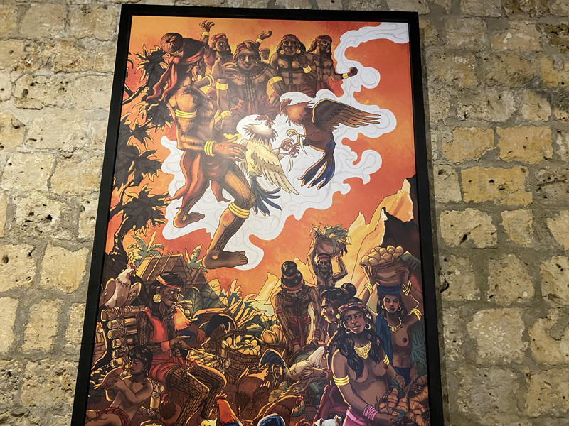
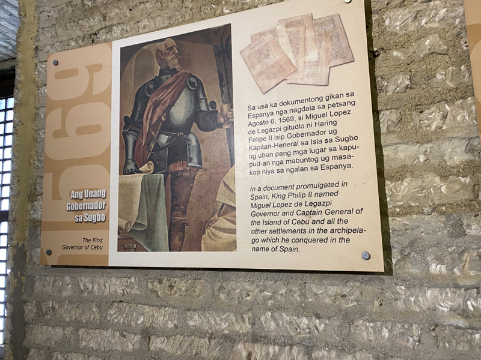

今年は日本が戦後80年を迎える年です。 
私は現在セブに移住しており、日本のリアルな様子は直接は分かりませんが、祖母が被爆者であることもあり、海外から日本の動向を注視してきました。

この数十年でインターネットが飛躍的に普及し、かつては知ることのできなかった情報にアクセスできるようになりました。

最近知ったのが GHQ（連合国軍総司令部）による **WGIP（War Guilt Information Program / ワー・ギルト・インフォメーション・プログラム）** という情報操作政策です。

今日は敗戦国・日本で生まれ育ち、約400年にわたる植民地支配を受けてきたフィリピンに暮らす私だからこそ見えてきた、 *罪悪感の支配* というテーマで掘り下げていきます。

<prof></prof>

## WGIP（War Guilt Information Program / ワー・ギルト・インフォメーション・プログラム）とは？

この文書は GHQ 占領期の1945年〜1948年に実施された **日本人に戦争責任と罪悪感を植え付ける** ための情報操作プログラムです。その他ラジオ・新聞などのメディアを通じて、戦争責任や天皇の責任を強調する報道を促進され、いわゆる徹底的なプロパガンダが展開されました。

目的は以下の通りです：

* 東京裁判や原爆投下の正当化
* 軍国主義の否定と民主主義の普及
* アメリカへの批判を抑制する情報統制

この文書が完全に存在したことが確認されたのは2015年。ごく最近のことです。それ以前にもコピーを入手した人物や証言は多数ありましたが、実在は長らく確証されていませんでした。

私の祖母は被爆者であり、家族の半分を失いました。それにもかかわらず、母はよく「日本は他国でひどいことをした」と言っていました。 
毎年夏、原爆が投下された8月6日。蝉の鳴き声がうだるような暑さを際立たせる中、語り部（被爆体験者）の生々しい話を聞くことが、広島の小学生にとって恒例の行事でした。 
低学年の子どもには耐え難い内容でしたが、それが「平和教育」でした。

戦争を体験していない母の語る「日本による加害の歴史」とは裏腹に、原爆で14万人が一瞬で命を奪われた事実に対して、**我々はなぜ *反省しなければいけない* のか**？ 
日本が侵略したから悪いのだと理解しようとしつつも、心の底では常に矛盾が生じていました。

さらに、日本は民主主義国家であるはずなのに、どこか 「**植民地のようだ**」 とさえずっと感じていました。

この矛盾が腑に落ちたのは、WGIP の存在を知ったときでした。 
GHQ は WGIP によって、多くの日本人に罪悪感を植え付けることに成功したのです。

うちの父や母はもろにこの WGIP の影響を受けた大人たちに育てられた世代です。 そしてその子どもたちもまた、次の世代に罪の意識を継承していきます。

終戦直後には、学生活動や激しいデモが行われていましたが、私が子どもの頃にはそうした動きはすっかり消え、日本人は静かで従順な国民になっていました。

## 植民地支配に利用されたキリスト教の「原罪」と「救済」

私は今、セブに住んでいます。周囲の多くのフィリピン人は敬虔なカトリック信者で、日常の中に信仰が深く根付いています。

セブに来てから、さすがにフィリピンの歴史を知らないのは恥ずかしいと思い、少し調べました。移住するまで、マゼランがマクタン島で族長ラプラプ王に討たれていたことすら知りませんでした。

1521年、植民地支配のきっかけは、セブ島のフマボン王がマゼランから「キリストの子どもの像（ピット・セニョール）」を譲り受け、キリスト教に改宗したことにあります。その後、マゼランはラプラプ王を討伐しようとして返り討ちに遭い戦死。スペイン船団は一時撤退しますが、1565年にミゲル・ロペス・デ・レガスピがセブ島に到着し、以降フィリピンは約300年間スペインの植民地となりました。

サントニーニョ教会にはマゼランの十字架や、「キリストの子どもの像」が展示されています。かつては近くで見ることができたようですが、現在は十字架は保護するため近づけないようになっています。

元同僚によれば、人々は奇跡が起こると信じ、十字架の一部をむしり取ろうとするそうです。

部外者の私からみると、スペインの侵略と搾取の象徴であるマゼランやサント・ニーニョが、現代でも「ありがたがられている」ことに、、強い違和感と矛盾を感じます。

スペイン、日本、アメリカの三度の植民地支配が終わった今も、理不尽な仕事内容でも黙々と従順に働くフィリピン人の姿に、感心することが多々あります。日本人の私からすれば、もっと平等でいいし腹たったら歯向かってもいいと思うのです。

ロックダウン中もその姿勢は変わりませんでした。世界最長とも言われるロックダウン下で、ノーワーク・ノーペイ（無給で自宅待機）の状況にもかかわらず、多くの人が文句も言わず耐えていました。

私は次第に、こうした従順さの根底には、植民地支配期に深く浸透したキリスト教の「原罪」と「救済」の教義があるのではないかと考えるようになりました。

原罪の思想は、人間は生まれながらにして罪を背負っているという前提に立ちます。これが、**自己否定や謙遜の文化的土壌を育み**、支配に対する抵抗よりも、赦しと服従を選ばせる心理的構造を形成してきたのではないか。

そして救済とは、その罪を赦してもらうために、**信仰・悔い改め・従属** を通じて「赦しを与える側」に近づこうとする行為です。 つまり「あなたは罪深いが、赦してやるから従いなさい」という構造が、宗教の名のもとに社会的秩序として内面化されていく。

もちろんそれだけでなく彼らが「未開の民」のレッテルを貼られたのもありますが、一理あると思います。

<card slug="entry472"></card>

## 罪の意識をもたせることは支配者にとって都合が良い？という仮説
植民地支配とキリスト教の教えに関しては前から思うところがあり、さらに WGIP を知ったことで、**罪の意識は人を支配・誘導する手段として極めて都合の良いものではないか** という仮説を立てるようになりました。

この仮説を検証するために、よりミクロな事例に目を向けてみます。たとえば、DV（ドメスティック・バイオレンス）はその典型例です。加害者は暴力を振るった後、被害者に「お前が悪い」と罪の意識を植え付け、従属させる構造が見られます。

いくつかの理論や心理モデルをもとに、この構造を検証していきます。

### Affect-as-Informationモデル（感情情報モデル）

Affect-as-Informationモデル（感情情報モデル）とは、心理学者ノアバート・シュワルツ教授らによって提唱された理論で、**感情は判断や意思決定において情報として機能する**という考え方に基づいています。

人は何かを判断するとき、その瞬間に感じている感情（affect）を、対象に関する情報だと誤って解釈することがあります。

例えば、晴れていて気分がいいと、「なんだか人生もうまくいってる気がする」と感じているとします。でもその気分の良さは天気のせいで、人生そのものとは関係ありません。

このモデルは、マーケティング、教育、政治的判断など多くの領域に応用できます。

さらに2022年、Affect-as-Informationモデルの応用として、**罪悪感が社会的規範への従属を促す「情報」として機能する**という点に焦点が当てられました。

支配者が罪悪感を誘発することで、被支配者は **正しい行動** （例：従属、改宗）を取るよう誘導されます。

ただし、ここで言う「正しい行動」とは、支配者にとっての **都合の良い思考パターンや行動** を意味します。

植民地支配においては、*改宗* を通じてそれらをとらせることは容易でした。

### 集団的罪悪感
2004年、ナイラ・R・ブランスコム（カンザス大学）とベルトヤン・ドーシェ（アムステルダム大学）によって、社会心理学の枠組みの中で「集団的罪悪感（Collective Guilt）」という概念が理論化されました。 
[集団的罪悪感(Collective Guilt)](https://ogeruru.hatenablog.com/entry/2020/12/20/085631)

これは、自分自身が直接加害者ではないにもかかわらず、「自分が属する集団」が過去に行った不正や加害行為に対して、個人が罪悪感を抱く心理現象です。

ミクロな例としては、家族の中に犯罪者がいる場合、親族が社会的に肩身の狭い思いをすることが挙げられます。

| 要素         | 内容                                                                       |
| ------------ | -------------------------------------------------------------------------- |
| *定義*       | 個人が「自分の集団が過去に他者に害を与えた」と認識し、その責任を感じること |
| *対象*       | 歴史的加害（戦争、差別、植民地支配など）に関する集団的記憶                 |
| *感情の性質* | 個人の罪悪感とは異なり、集団アイデンティティに基づく道徳的反               |

自分の所属集団に強くアイデンティティを感じている人ほど、過去の加害行為に対して罪悪感を抱きやすい傾向があります。 
戦後間もない頃、いわゆる「お国のために死ねる覚悟」を持っていた日本人にとって、WGIPは非常に効果的だったと考えられます。

補足すると、本来「罪悪感」と「恥」は異なる感情ですが、両者を混同する人も多く見られます。

* 自分たちは悪い民族だった
* 日本人として生まれたことが恥ずかしい
* 戦争の話は触れてはいけない

このような感情は、「罪悪感」と「恥」の混同によって生じるものです。

### 社会的アイデンティティ理論
1979年にアンリ・タジフェルとジョン・C・ターナーによって提唱された社会心理学の中核理論のひとつです。人間は **自分はどの集団に属しているか** によって *自己を定義し、他者との関係を構築* するという考え方に基づいた理論です。

良い方向に使えば、*私は日本人だから絶対に時間に遅れない* など、アイデンティティを基盤に行動規範を形成することができます。

[社会的アイデンティティ理論（Social Identity Theory）](https://x.com/i/grok/share/aiBUZtRIpv5YjjB4YqOAdhGvP)

しかし、集団的に「罪深い」「劣った」というラベルを植え付けられた場合、自らのアイデンティティを否定的に再定義し、道徳的・文化的に従属する傾向が強まる可能性があります。

実際に、以下のような刻印がなされてきました：
| 国         | 手法 | 例                       |
| ---------- | ---- | ------------------------ |
| フィリピン | 改宗 | 人は原罪を持つ、未開の民 |
| 日本       | WGIP | 戦争犯罪国               |

集団的罪悪感は単なる感情ではなく、社会的アイデンティティの再定義を通じて、**支配構造を強化するために戦略的に利用される** ことがあります。

## まとめ・罪悪感で人を支配することは歴史上行われてきた

今回は、罪悪感による支配というセンシティブなテーマを題材に記事を書きました。

罪悪感は、理論的にも被支配者にとって非常に有効な支配手段であることが理解できました。

日本は本当にひどい侵略をした戦争犯罪国だったかもしれないし、右派の人がよく主張しているように大東亜圏を守るために戦ったのかもしれない。私は先の戦争で誰が悪いかも分かりません。私はその次代生きていなかったし、何も見ていないので実際のところは確証が持てません。

ただ、WGIPも、ヨーロッパ各国による植民地支配も、いずれも歴史的事実です。

そして現在、戦後80年が経ったにもかかわらず、日本人が未だに列強各国の言いなりになっているのもまた事実です。

幼い頃から感じていた違和感も、セブに来なければ気づけなかったかもしれません。

集団の中にいても、「おかしい」と気づくこと。自分の頭で考えること。 
それが、この先われわれが自立していくために必要なことだと思います。

思いついたまま書き殴りましたが、この記事が皆さんの生活の一助となれば幸いです。  
最後までお読みいただき、ありがとうございました。

