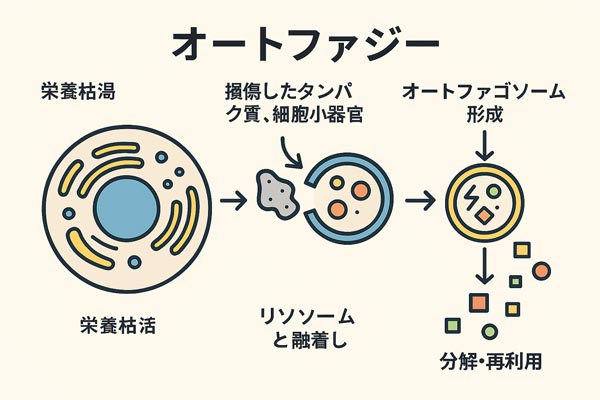
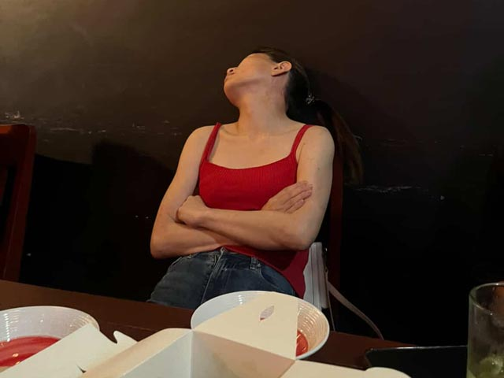
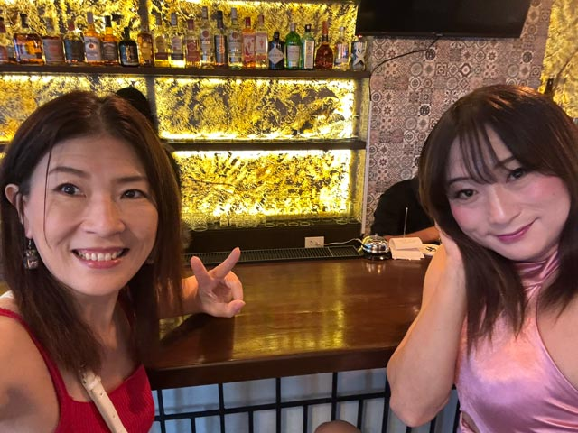
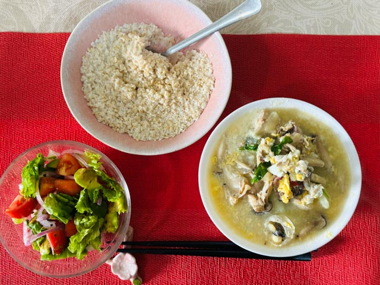
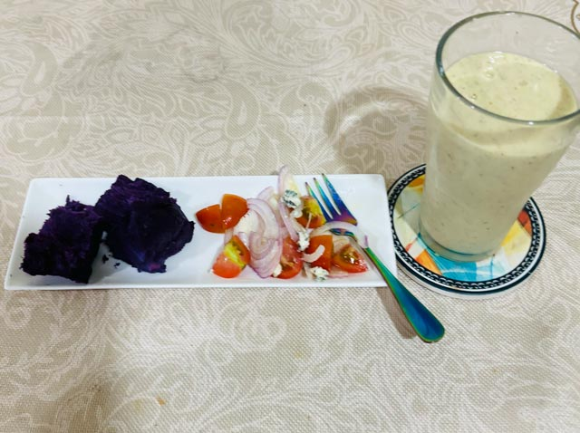
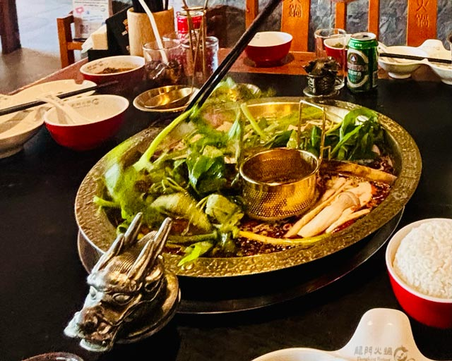

「インターミッタント・ファスティング（断続的断食）」と呼ばれる食事法をご存知ですか？  
一日のうちで食べる時間を区切り、残りの時間は水やお茶だけで過ごすというシンプルな方法です。

この *食べない時間* に働くのが **オートファジー**。古いタンパク質や不要物を分解・再利用する **細胞の掃除** で、炎症や老化の原因を減らし、細胞を若々しく保ちます。

つまり、ただ食べない時間を作るだけで体は自然にメンテナンスモードに入り、老化のスピードを緩める可能性があるのです。

今年急速に老けたことをきっかけに、ようやく危機感が芽生えました。そこで選んだのが、最もシンプルで続けやすい **16時間食べない＋8時間食べる** 16:8ファスティング。

16:8ファスティング始めたものの、はじめの1ヶ月は体の変化に追いつけずめちゃめちゃ戸惑いました。  
これから始める人、今最中でめちゃくちゃ戸惑っている人も多いと思います。  
出会いと1ヶ月目の考察をログとして残しておきます。

<small>※ 私は医学の専門家ではありません。体験談として参考までに。</small>

<prof></prof>

## きっかけ — 死の淵と、変わる決意の瞬間

### 40歳過ぎ、初海外セブで起業した私。目も当てられないほど酷い生活を暴露

お恥ずかしいことを激白します。40歳過ぎて、初海外セブで会社設立、一見キラキラ系に見えますが、生活習慣がどん底でした。

<small>どこでも酔っ払って寝るかみーゆ</small>

一日中椅子に座ってコード書いて、昼もしくは夕方前くらいになると、たいてい空腹に耐えかねてキャベツと玉ねぎと卵をぶち込み辛ラーメンをすする毎日。

仕事を終えたあと、ネトフリ見ながら酒を煽りそのまま寝落ち。食べてもコンビニのマズイチキンナゲットをつまむくらいです。

毎日ほぼ下痢だけど、元気だから「まあいいや」と思って過ごしてました。

### ストレスと更年期、過度の飲酒で死ぬかと思った

今年はセブに来て以来、2度めの極限のストレスを味わいました。

極端な忙しさと加齢でホルモンが乱れまくりました。

納期もあるし、やらなきゃいけない。。。それでもどうあがいてもやる気が出ず、しかも悪循環なのが若い頃からの飲酒習慣。ストレスのつらさを誤魔化すために夜になると強い酒を煽る負のループが続きました。

ほぼ毎日下痢で、たまに腸が腫れてるのがわかるくらいでした。何度か「このままじゃ死ぬ」と本気で思いました。

### ストレス放置。得たのは今まで経験したことのない急激な老化
今年9月に私は人生で初めて白髪染めしました。左の頭頂部付近にはもうカラーリングでは隠せないほど大量の白髪が増えていると美容師さんに指摘されました。

「ストレスがここまで老化速度を早めるのか」と心の底からショックを受けました。

41歳でセブに渡り、日系企業に初めて務めた頃、「どうやってその若さを保ってるのか？」とフィリピン人に驚かれたこともあります。  
だから私はまだまだ若いと自負していました。

特にスキンケアも食事も気をつけずここまで若くいられたのは、親から受け継いだ遺伝子のおかげだったのでしょう。  
アラフィフになると天性のギフトは使い果たし、しっかりシミもたくさんでき、顔もたるんでしまったことにやっと気が付きました。

何もしなくても若かったのは、40代前半まででした。

## ちょっと待って！科学的根拠に基づいて老いは改善できるってホント？

老いることは自然なことだと分かっていても、いざ自分が直面するとイヤなものです。  
どうにかしたいと思い、ネットを漁っていた時に「ルアー・スー」という台湾のインフルエンサーを発見しました。

<insta id="Cut7DjKvKDx"></insta>

彼女は私と同じアラフィフです。20代にしか見えない見た目です。  
さらに完全に生活習慣だけで若さを保っているというから驚きです。

さらに、シンガポールのこれまた20代にしか見えないアラ還「チュアンド・タン」というインフルエンサーも発見。
彼もルアー・スー同様に生活習慣のみで若さを保ってました。

<insta id="C2eu5ShR_DD"></insta>

最後にハーバード大学の遺伝学教授で老化研究のトップランナー・デビッド・シンクレア博士に辿り着きました。

<iframe width="560" height="315" src="https://www.youtube.com/embed/oXq7trXF4aI?si=oJVxVosh7UXA1Dwr" title="YouTube video player" frameborder="0" allow="accelerometer; autoplay; clipboard-write; encrypted-media; gyroscope; picture-in-picture; web-share" referrerpolicy="strict-origin-when-cross-origin" allowfullscreen></iframe>

彼の発言にもあるように、科学的根拠に基づいて「**老化は治療できる**」と確信しました。

デビッド・シンクレア博士、ルアー・スー、チュアンド・タンの共通点

* 運動（中高強度程度の筋トレと散歩などの有酸素運動）
* 食事（インターミッタント・ファスティング）
* 水分補給
* 睡眠時間と質

ということで、私のこれまでの食事スタイル（1日1〜2回）からも16時間断食のような *インターミッタント・ファスティング* ならやりやすいんじゃないかと思い生活に取り入れてみることにしました。

## 私の生活に合わせてルールを設定
9月くらいから栄養に重きをおいた自炊は始めてましたが、インターミッタント・ファスティングの効力を最大限に活かすために食べる時間（食事の窓解放時間）のルールを設定することにしました。

目的はあくまで *アンチエイジング*。健康ではない腸ではちゃんと栄養も吸収できない。長年の飲酒で傷ついた腸を蘇らせることを先決します。  
ファスティングでは食べない=（イコール）腸を休ませることができます。

通常のファスティングは数日酵素ドリンクだけで過ごす方法ですが、私には無理です笑  
実際通常のファスティングをやったことある人の話を聞くと「めちゃ肌がきれいになるけどもう二度とやりたくない」とのこと。

16:8ファスティングでは、1日のうち16時間を食事を取らない時間として過ごします。  
それでも腸は十分に休まり、しっかり回復します。

### 週2回の飲酒チケット
若い頃から嗜（たしな）んだ飲酒習慣はやめないことにしました。好きなことなので、この先も続けていきます。

<small>友だちとの外飲み大好き!</small>

週2回にした理由は、腸という臓器は意外と強く、ちょっとしたダメージなら1日程度で回復すると言われているからです。もし深酒しても週2回だけなら完全にリカバリーできると判断しました。

お酒を飲む日と決めたときは、二日酔いを避けつつファスティングのルールを守るために、食事内容やタイミングを調整します。

### 自炊中心。ファスティングに即した食事タイミングとメニューに変更
セブ在住の強み、安価に手に入り栄養価の高いフィリピン食材を利用しています。

中でも特に心がけて摂っているのがビタミンCです。

1日を通して1000mg以上（サプリも含む）摂取を目標。ビタミンCは水溶性で摂取しすぎても尿で出てしまうので、500mgを上限に小分けに取ります。

フィリピンのビタミンC優秀食材といえばカラマンシー。水やサラダ、スムージーに加えて摂ります。ローカルの市場で買えば1キロ50ペソ（130円）くらいで買えます。

また、私の16:8ファスティングをする目的のひとつが腸ケア。  
腸に生きた菌を送り込む（プロバイオティクス）ためにヨーグルトやキムチ、納豆を摂取。  
またその菌のエサ（プレバイオティク）になる食材、芋類、生野菜、果物、はちみつ、オートミールなども積極的に摂っていきます。

セブのスーパーやローカルマーケットで手に入る食材についてはこちらにまとめてます！

<card slug="entry555"></card>

#### 通常

*食事の窓解禁（11時）*
* 主食
  * 菌のエサになる芋類（セブだとウベがオススメ）、オートミールなど
  * 飲んだ翌日の定番は低GIの春雨スープ
* たいてい食前に筋トレをするのでタンパク質を意識的に取る
  * 鶏や魚（骨ごとしっかり煮出す）などのタンパク質とコラーゲンを取る 
  * 卵や豆腐などのタンパク質
* カラマンシー（レモンの3倍のビタミンC、柑橘類に多く含む光毒性のソラレンが少ない）を1日10個目標
* アボカド、オリーブオイルなど良質のオイルを積極的に取る
* 生野菜でビタミン類を摂取

*おやつ（15時）*
* ナッツや蒸したウベ、雑穀パンにチーズを塗ったもの
* 手作りアップルタイザー（はちみつ、カラマンシー、リンゴ酢を炭酸で割ったもの）

*食事の窓閉じ（18時/19時までに終了）*

* ブルーベリー（アントシアニンで抗酸化）＋ヨーグルト＋チアシード＋その日の気分の野菜と果物でスムージー
* タンパク質を足したいときはサバ缶やゆで卵、炭水化物が足りないと思ったら芋など、その日の食事のバランスに応じて足す

#### チートデイ
チートデイは心置きなく夜遅くまで飲みます。  
飲酒で大量の活性酸素が出るはずなので、通常のビタミンCサプリを2錠（この時点で合計1000mg）、さらに翌朝も500mgを朝イチで飲むようにしています。  
翌日のむくみ防止のために、カリウムも多めに摂取します。

食事の窓の解禁時間が遅いので、どうしてもお腹が空いたときはナッツをちびちび食べてしのぎます。

*食事の窓解禁（15時）*

* アボカド（カリウム多）ヨーグルト＋チアシード＋その日の気分の野菜と果物でスムージー
* サバ缶やゆで卵や蒸した芋

*気が向いたらおやつ（17時）*
* ナッツちょっと
* 手作りアップルタイザー

*食事の窓閉じ（好きに食べて好きに飲んで好きな時間に終わる）*
* 野菜や豆腐を意識的に食べる

### 水を意識的に飲む
朝起きてすぐに常温の水をコップ2杯飲みます。 

寝ている間に約500mlの水分を失っているためです。  
飲むペースはゆっくりめで、常温かお白湯を選びます。 

1日の全体でも、少なくとも2Lは摂るようにしています。

## 16:8ファスティングの週ごとの変化
さて、お待たせしました。みなさんが気になるのは期間ごとの変化ですよね？

そこで気がついた変化を時系列に追っていきますね。

### 開始〜3日：食事の窓解禁時、血糖値急上昇？？！
16時間開けて急に食事取ると急激に血糖値が上がったように感じた

頭に糖が回って脳みそがキューッと感じてしんどい(T_T)。そもそも普段から砂糖は取らないし、糖分も控えてる生活をしてたのでいわゆる「シュガー・ラッシュ」に近い感覚だったのだと思います。

そこで血糖値対策として、最初2回しか摂ってなかった食事におやつをプラス。さらに食事の窓解禁時は特に食べる順番（野菜やタンパク質から食べる）やかける時間（30分以上）に気をかけるようにしました。

### 1週間目：え？なんで？酒も塩も少ないのに頭痛いしむくむ
意気揚々と断食を始めたものの最初にぶち当たったのは起き抜けの顔パン。 
今までお酒を飲まない日の翌朝は顔がシュッとしていることがあっても、むくむなんて経験ゼロ。

しかも、2日酔いか？！と思うほどの片頭痛。明らかにおかしい。。。私、このまま16:8ファスティング続けても大丈夫だろうかと不安になるほど。

でもこの症状は断食初期の一過性。科学的にも根拠があって、体がまだ **断食リズムに慣れていないことによる水分代謝の乱れ** が大きいそう。

#### むくみの主な原因
- *グリコーゲンの分解と水分保持：* 断食を始めると体はまず肝臓や筋肉に蓄えたグリコーゲンを使用。グリコーゲンは水分と結合しているため、分解される過程で水分バランスが崩れやすく、むくみやすくなる。  
- *ナトリウム・カリウムのバランス変化：* 食事時間が制限されることで、電解質の摂取タイミングがずれる。特にカリウム不足や水分摂取の偏りがあると、体が「水をため込もう」としてむくみが出やすくなる。  
- *腸内環境の移行期：* 腸を休ませる時間が増えることで腸内細菌のバランスが変わり始める。この時期は消化や排泄がスムーズにいかず、一時的に水分が滞留しやすくなる。  

#### 頭痛の主な原因
- *血糖値の変動：* 食事間隔が長くなることで血糖が下がり、脳が一時的に燃料不足と感じて頭痛につながる。  
- *カフェインの離脱：* いつものコーヒーやお茶の量が減ると、離脱症状として頭痛が出やすい。  
- *水分・電解質不足：* グリコーゲンの分解に伴う水分排出や、ナトリウム・カリウムの乱れで脱水気味になり頭痛を誘発。  
- *自律神経の揺れ：* 食事リズムの変化で交感神経・副交感神経のバランスが一時的に不安定になり、片頭痛様の症状が出ることがある。  

突然のむくみや頭痛はショックですが、これは体が新しいリズムに適応しようとしているサイン。  
また、インターミット・ファスティング開始時の頭痛は多くの人に見られ、たいていは1〜2週間ほどで自然に落ち着いていきます。

腸や代謝が整えば次の週から顔もスッキリしてくるので安心してください。

### 2週間目：腸内環境の好転反応？便秘がめちゃ苦しかった
かみーゆの代名詞は「いつも腹を壊している」くらいだったのに便秘が5日位続きました。さすがに辛い(T_T)

* *食事の刺激が減る：* 断食で腸のリズムが崩れ、ぜん動運動が一時的に弱まる。特に以前の私は、過度の飲酒と辛ラーメンで胃腸がいつも強すぎる刺激による排便に慣れていた。
* *腸内細菌の入れ替わり：* 食べない時間が増えることで腸内環境が変化し、善玉菌が増える過程で排便が滞ることがある。これは「好転反応」と呼ばれることも。
* *水分や電解質の影響：* 食事から得ていた水分やミネラルが減ると便が硬くなりやすく、食事量が少ない人ほど影響が強い。

腸が新しい断食リズムに適応する過程で起こる一時的な便秘なので、時間が経てば自然に解決します。

私の場合は苦しすぎてマグニット錠に何度か頼りました。  
 ただ、センナなどで **せっかく構築しかけている腸内環境を破壊** するような便秘薬はおすすめしません。

基本的には、水分を意識的に摂ったり、ナッツや野菜で食物繊維を補うことで徐々に改善していくのが良いと思います。

### 3週間目：腸がまともになってきた？火鍋の激辛＋油でお腹もびっくり
3週間目ようやくリズムを取り戻し、標本にしてもいいくらい理想的な便がでるように！

お酒飲んでも下痢もしなくなりました。が、事件が起こりました。

友だちとランチに火鍋（ホットポット）に行った時の話。辛いものすごく好きですし、野菜や豆腐も食べれるしファスティングの範疇✊️と息巻いてました。

食後1時間後、お酒も飲んでいないのに激しい下痢に見舞われました汗

刺激の少ないクリーンな食事を続けてたのに、控えたつもりでも大量の油と大量のスパイスが胃に投入され、お腹がパニックに。  
今まで経験したことないくらいお腹が痛くなって何度もトイレに駆け込みました。

腸が回復してきたからこそ刺激に敏感に反応したという好転反応に近い状態だと思われます。  
今まで腸がボロボロでいつも下痢でもあまり気にもしてなかったですが、これが *正常な反応* だと実感しました。

### 4週間目：下痢ゼロ！？人生初かも♥
4週間もすると、食事の窓を解禁してご飯を食べたあとに自然と便意が訪れるようになり、リズムができてきました。

私は痩せている方だと思うのですが、下腹だけ少しポッコリしていて腹筋ではなかなかへこまなかったお腹周りも、次第にスッキリしてきました。

### 30日経過：風邪のリカバリーが驚異的だった！！！
初めての体験！これはホントスゴイと思ったファスティングの効果もありました。

クリスマス前に軽く風邪を引きました。しかもクリスマスイブの前日、調子に乗って深酒しすぎてこじらせて、翌日は完全にダウン。

通常私、風引くと1週間くらいグズグズ調子が悪いんですが、翌日から筋トレできるくらい回復しましたw

今は咳と喉痛が少し残ってる程度で完全に元気です。

やっぱり、腸が元気だと免疫力がぜんぜん違うと改めて思い知りました。

## 1ヶ月経って総じて感じること
16:8ファスティングは一般的に数週間から1ヶ月位経つとだんだん効果を実感するそうです。

ちなみに腸内細菌はエサやりを怠ると、睡眠や気分、免疫に影響するそう。  
今は毎日快調＆快腸で、思考もかなり前向きになった気がします。

まだ美容院で確認していないけど、生え際が黒くなってきたように見えて相当嬉しい〜。これはファスティングの思わぬご褒美！

外出先でお腹が痛くなりトイレ難民になることもなく、今のところ快適です。  

そして何より、週2回の飲酒日が楽しくて、友だちと過ごす愛おしい時間になりました。

## 次は3ヶ月後をレポートします！
アンチエイジングに欠かせない腸を復活させたくて、私は16:8ファスティングという手段を選びました。  
まとめると、私の腸を弱らせていたのは「*雑な食事* ＋ *酒* ＋ *ストレス*」だったんですよね。

シンクレア博士の言う通り、食べない時間を作るだけで体は驚くほど修復されることを実感しました。

そしてフィリピンで16:8ファスティングをして良かったのは、安価で栄養価の高いスーパーフードが手に入ること。  
ビタミンC豊富、でも柑橘類なのにシミを作りにくいカラマンシー。アントシアニン（抗酸化）とカリウムが豊富なウベ（紫芋）。まさに **身土不二（地で取れるものを食べるのが一番）**、紫外線が日本の5〜6倍あるセブに暮らす人にぴったりの食材です。

これらの食材を楽しみながら料理するのも醍醐味。

この状態を継続することを目標に、3ヶ月後にどのくらい変化があったかをまた報告しますね。
