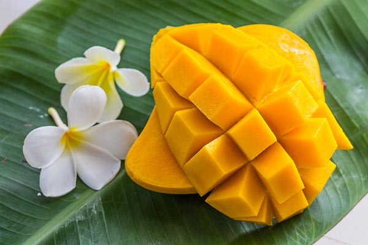
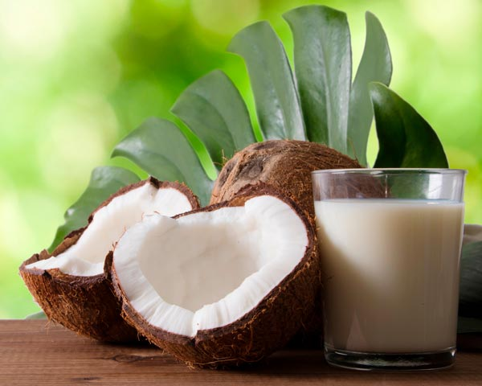

フィリピン在住7年目の私、基本自炊しています。  
フィリピンのスーパー・ローカルマーケットには、美容や健康に役立つスーパーフードがたくさん並んでいます。しかも安い！！  

ここでは、日常的に手軽に買えて、美活にぴったりな食材を9つ紹介します。

<prof></prof>

## カラマンシー

**ビタミンCはレモンの約3倍以上**も含まれるスーパーフード。しかもローカルマーケットではキロ50ペソ程度と超チープ。  

お肌の老化の約90％は紫外線が原因。フィリピンの紫外線量は日本の約5倍とも言われ、日常的な紫外線対策がシミ・シワ・たるみ防止につながります。  

特にカラマンシーのすごいところは、レモンやグレープフルーツなどの柑橘類に含まれるソラレン（摂取後に紫外線を浴びるとシミを作りやすくする光毒性成分）がほとんど含まれていないこと。安心して日常的に摂取できます。  

私は飲み物やサラダのドレッシングに加えて、1日10個（ビタミンC約30〜60mg）を目標に取り入れています。

## 紫タマネギ

フィリピンのスーパーに行くと、白玉ねぎより紫玉ねぎのほうが断然安く手に入ります。  
味は食べ慣れた白玉ねぎの方がマイルドかもしれませんが、栄養価の面では紫玉ねぎが圧勝。  

紫色の成分である **アントシアニン** は強力な抗酸化作用を持ち、細胞の老化を防ぎアンチエイジングに役立ちます。さらに、紫タマネギには **ケルセチン** というポリフェノールも豊富で、血流改善やむくみ予防、免疫力アップにも効果が期待されています。  

加熱しても栄養が比較的残りやすいのが特徴。安価で手軽に買えるので、日常の食卓に取り入れるだけで美活に直結する食材です。

## アルグバティ(ツルムラサキ)

フィリピンの市場でものすごくよく見かける葉野菜。日本では夏野菜として知られていますが、こちらでは一年中手に入ります。  
そして困ったことに「ほうれん草（Snipach）ください」と言うと、必ずこちらを出されます。  

**美活ポイント**  
- *ビタミンA・C*：抗酸化作用で紫外線ダメージから肌を守り、美肌効果に直結。  
- *鉄分*：造血作用で女性にうれしい栄養。  
- *食物繊維*：腸内環境を整え、腸活に最適。  
- *カルシウム*：骨や歯の健康維持に。  

味はほうれん草に近いけれど、少しぬめりがあるのが特徴。私はおひたしやスープに入れることが多いです。クセが少ないので毎日の食卓に取り入れやすい美活食材です。  

**注意点**  
日本ではグリーンスムージー（ほうれん草入）が人気ですよね？  
この前「ほうれん草みたいなものかな？」と思ってスムージーに入れたら…泥臭すぎてマズかったのでやめた方がいいです笑  
代わりにPechay/ペチョイ（小松菜に近い野菜）を入れることをおすすめします。

## マンゴー

個人的にはマンゴーはこの国で一番好きなフルーツ。果糖が多めでダイエット中の方には取り方に注意が必要ですが、そのカロリーを上回る栄養アリ✊️

- *ビタミンC*：マンゴー半分でレモン約2〜3個分に相当。紫外線ダメージから肌を守り、コラーゲン生成をサポート。  
- *β-カロテン（ビタミンA前駆体）*：強力な抗酸化作用で紫外線による肌ダメージを防ぎ、シミやくすみ対策に。  
- *ビタミンE*：血流を改善し、肌のターンオーバーを促進。アンチエイジング効果が期待できる。  
- *葉酸*：造血作用があり、妊娠中や生理中の女性に特におすすめ。肌の血色感アップにもつながる。  
- *カリウム*：余分な水分を排出してむくみ予防。すっきりとしたフェイスライン維持に役立つ。  

ローカルマーケットでは時期にもよりますが2個で100ペソと超お買い得。  
ジム行ってたときは、筋トレ前のエネルギー補給としても重宝していました。  

果糖が多いので夜よりも**朝や昼に摂るのがおすすめ**。ヨーグルトやナッツと合わせると血糖値の急上昇を抑えつつ、美肌やアンチエイジングの効果をしっかり得られます。

## モリンガ

「奇跡の木」と呼ばれるほど栄養豊富。ビタミン、ミネラル、アミノ酸までバランスよく含まれていて、美活には欠かせない食材。一房30ペソと超安い。  

味はぶっちゃけ無味なので何に入れても味を壊さない。唯一の難点は、快適に食べるために葉だけをちぎる作業がちょっと辛いこと。  

フィリピンではスープに豪快にそのまま丸ごと入れることも多いです。  
普通にお茶も売っててスーパーなどで手軽に手に入ります。  

特に**ビタミンAやCが豊富で、肌のターンオーバー促進や紫外線ダメージ対策に効果的**。無味だからこそ毎日の食事に自然に取り入れやすいのが魅力。

## ゴーヤ

フィリピンでは「アンプラヤ」と呼ばれるゴーヤ。ローカルマーケットでも安く手に入る定番野菜です。  

日本でもおなじみ独特の苦味があるけれど、この苦味成分には**血糖値を調整する働き**があり、糖質の多い食事が多いフィリピン生活ではありがたい存在。さらに抗酸化作用も強く、紫外線ダメージや肌の老化対策にも役立ちます。  

ビタミンCも豊富で、シミやシワ予防に直結。食物繊維による腸活効果もあり、美活を意識する人には欠かせない食材です。  

炒め物やスープに入れるのが定番ですが、私はゴーヤチャンプルーが多め。こちらもお茶（アンプラヤ茶）がスーパーで買えますが、ティーパックを長くつけすぎるとめちゃ苦くなるのでご注意を。

苦味＝美容の味、と割り切って楽しむのがアンプラヤの正しい付き合い方です✊

## ココナッツ

南国といえばココナッツですよね？！  
私はココナッツミルクやパウダー（一袋50ペソくらい）を使って、よくカレーやチキン・ハランハラン（チキンをココナッツミルクで唐辛子で味付けして煮るフィリピンの伝統料理）を作ります。  

こちらもカロリー高いですが、栄養価が高いのでトレードオフしてます。  

* *カリウム：* 余分な水分を排出し、むくみ予防。フェイスラインや脚のすっきり感に直結。  
* *MCT（中鎖脂肪酸）：* すぐにエネルギー源になるので、筋トレや有酸素運動前の補給に最適。脂肪として蓄積されにくい。  
* *鉄・マグネシウム：* 造血作用や代謝サポートで、肌の血色感やエネルギー維持に。  
* *抗菌作用：* 腸内環境を整え、肌荒れ予防にもつながる。  

ココナッツジュース（ブコジュース）はフィリピンの民間療法で、UTI（泌尿器のトラブル）の際によく飲まれるそうです。路上では実で、スーパーではペットボトルの商品として売られています。  

「高カロリー＝太る」ではなく、**美肌・むくみ予防・代謝アップ**に直結する栄養が詰まっているのがココナッツの魅力です。

## ウベ（紫芋）

腸活と筋トレを日頃している私にとって欠かせない食材がこのウベ（紫芋）。路上販売でも見かけるしマジで安い。先日小さいレンガサイズをたった100ペソで買いました。

ウベは日本で見かける紫芋と違ってヤマノイモ科（ヤム）。切り口は紫色になっただけの山芋で、食感もねっとり系。  

- *アントシアニン*：強力な抗酸化作用で紫外線による肌ダメージを防ぎ、アンチエイジングに。  
- *カリウム*：余分な水分を排出してむくみ予防。フェイスラインや脚のすっきり感に。  
- *ビタミンC*：美肌・免疫力アップに直結。  
- *プレバイオティクス*：腸内細菌のエサになり、腸活に最適。  

最近の研究では、筋トレ後の筋肉増強や回復にも役立つという報告もあります。  

私の食べ方は単純に蒸すだけ。シンプルだからこそ栄養をそのまま取り入れられるのが魅力です。

## ガビバイオレット（紫芋）
こちらも紫の芋なのですが、ウベと違ってサトイモ科（タロ）です。ひとつ80ペソもしないんじゃないかな？

ウベに比べてホクホクしていて、ちょっと粘り気があります。  
アントシアニンはウベほどではないものの、**マグネシウムが豊富**で腸内環境を整えるプレバイオティクス（腸内細菌のエサ）として優秀。腸活を意識する人には特におすすめです。  

- *マグネシウム*：代謝サポートや筋肉の回復に役立ち、腸内細菌の働きを助ける。  
- *カリウム*：むくみ予防に直結。  
- *ビタミンC*：美肌・免疫力アップ。  

お味はほんのり甘くて私は好き。  
フィリピンでは煮物などおかずとして食べることが多いですが、私は蒸してヨーグルトと蜂蜜をかけて食べることが多いです。シンプルだけど美活に直結する一品です。

## 伝統的な食材は若い世代に敬遠されつつある

近年、モリンガやガビバイオレットなど栄養価の高い食材が、若いフィリピン人の間では「年寄り」「貧しい人の食べ物」と見られ、人気がありません。  

ファストフードや西洋風の食事のほうが「かっこいい」とされ、調理に手間のかかる野菜は食卓に並ぶ機会が減っています。共働き家庭が増え、時間がないため子どもたちはインスタント食品や缶詰で育つことも多いのが現状です。  

しかし、年中常夏のフィリピンで育つ伝統食材には、紫外線や暑さに耐えるための栄養がぎっしり詰まっています。本来なら現地の人々の体質に合った、健康維持に最適な食材なのです。  

残念ながら、フィリピンでは高血圧・肥満・糖尿病などの生活習慣病が多く、40代から薬を飲み始める人も珍しくありません。もし伝統的な食文化が見直されれば、もっと多くの人が健康に暮らせるはず。今こそ「古い食べ物」ではなく、**未来の健康を守る南国のスーパーフード**として復活させたいですね。

## まとめ・フィリピンでは美肌によい安価な山の幸がたくさん！！
フィリピンの山の幸は、美肌づくりに役立つ栄養がぎっしり詰まっていて、しかも手頃な価格で手に入ります。  
セブ在住7年目の自炊派として、日々の食卓に取り入れやすい食材を厳選しました。

どれも特別なものではなく、スーパーやローカルマーケットで気軽に買えるものばかり。  
まずは一品から試してみて、自分の体調や肌の変化を楽しんでみてください。

次回は海産物編を予定していますので、ぜひそちらもチェックしてみてくださいね。

この記事がフィリピン生活を始めたばかりの方の参考になれば嬉しいです。  
最後までお読みいただきありがとうございました。
