フィリピン在住7年目の私、基本自炊しています。  
フィリピンのスーパーマーケットやローカルマーケットには、美容や健康に役立つ「庶民派スーパーフード」が宝庫なんです。しかも、日本では考えられないほど安い！！

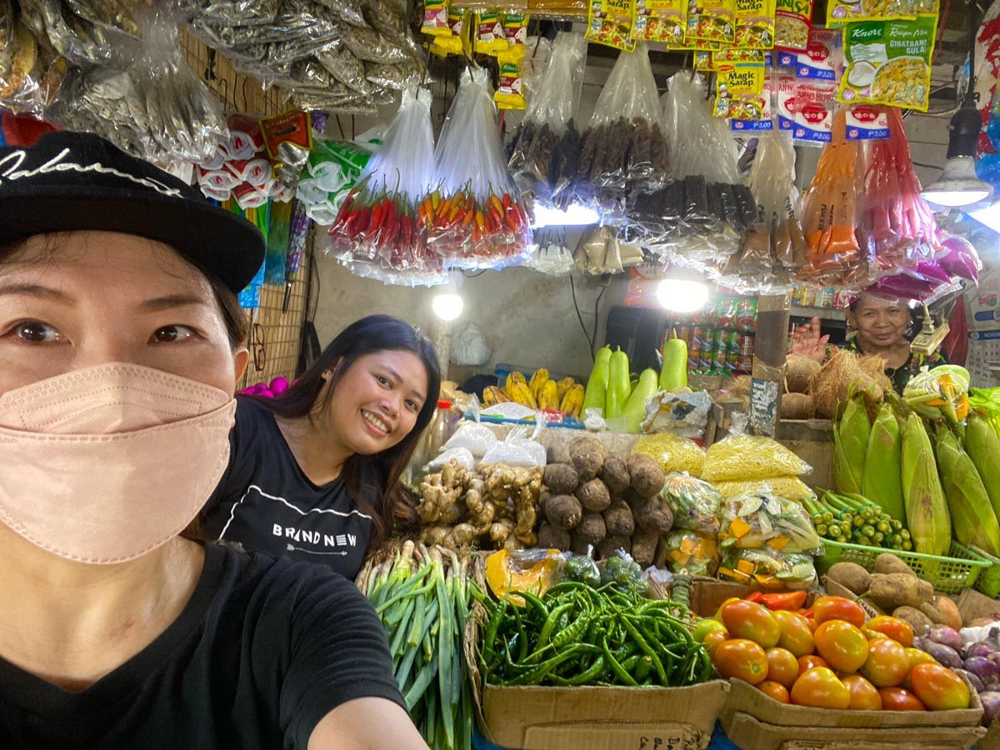

ここでは、日常的に手軽に買えて、美活にぴったりな食材（野菜中心）を10選を紹介します。

<prof></prof>

## カラマンシー
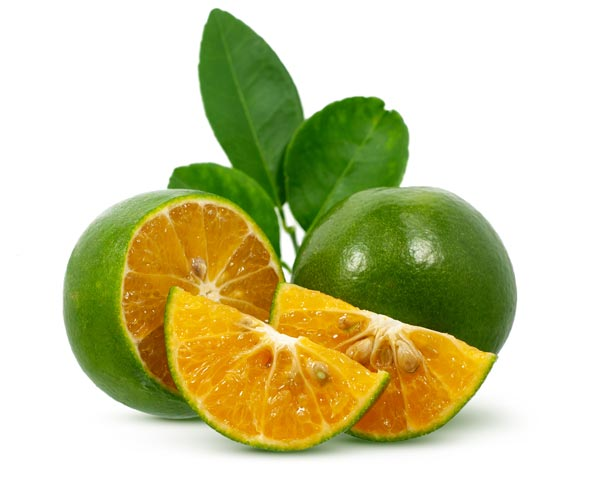

**ビタミンCはレモンの約3倍以上**も含まれるスーパーフード。しかもローカルマーケットではキロ50ペソ程度と超チープ。  

お肌の老化の約90％は紫外線が原因。フィリピンの紫外線量は日本の約5倍とも言われ、日常的な紫外線対策がシミ・シワ・たるみ防止につながります。  

特にカラマンシーのすごいところは、レモンやグレープフルーツなどの柑橘類に含まれるソラレン（摂取後に紫外線を浴びるとシミを作りやすくする光毒性成分）がほとんど含まれていないこと。安心して日常的に摂取できます。  

私は飲み物やサラダのドレッシングに加えて、1日10個（ビタミンC約30〜60mg）を目標に取り入れています。

## 紫タマネギ
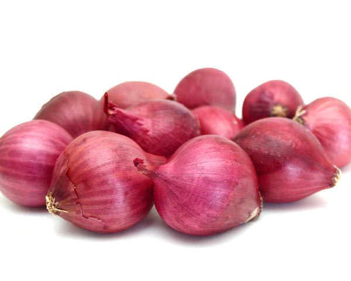

フィリピンのスーパーに行くと、白玉ねぎより紫玉ねぎのほうが断然安く手に入ります。  
味は食べ慣れた白玉ねぎの方がマイルドかもしれませんが、栄養価の面では紫玉ねぎが圧勝。  

紫色の成分である **アントシアニン** は強力な抗酸化作用を持ち、細胞の老化を防ぎアンチエイジングに役立ちます。さらに、紫タマネギには **ケルセチン** というポリフェノールも豊富で、血流改善やむくみ予防、免疫力アップにも効果が期待されています。  

加熱しても栄養が比較的残りやすいのが特徴。安価で手軽に買えるので、日常の食卓に取り入れるだけで美活に直結する食材です。

## アルグバティ(ツルムラサキ)
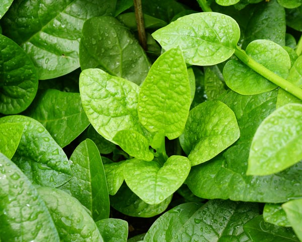

フィリピンの市場でものすごーくよく見かける葉野菜。日本では夏野菜として知られていますが、こちらでは一年中手に入ります。  
そして困ったことに「ほうれん草（Spinach）ください」と言うと、必ずこちらを出されます。  

**美活ポイント**  
- *ビタミンA・C*：抗酸化作用で紫外線ダメージから肌を守り、美肌効果に直結。  
- *鉄分*：造血作用で女性にうれしい栄養。  
- *食物繊維*：腸内環境を整え、腸活に最適。  
- *カルシウム*：骨や歯の健康維持に。  

味はほうれん草に近いけれど、少しぬめりがあるのが特徴。私はおひたしやスープに入れることが多いです。クセが少ないので毎日の食卓に取り入れやすい美活食材です。  

**注意点**  
日本ではグリーンスムージーで人気の材料のひとつがほうれん草ですよね？  
この前「ほうれん草みたいになるかな？」と思ってスムージーに入れたら…泥臭すぎてマズかったのでやめた方がいいです笑  
代わりに [Pechay/ペチョイ](#ペチョイ小松菜の一種) を入れることをおすすめします。

## カンコン（空芯菜）
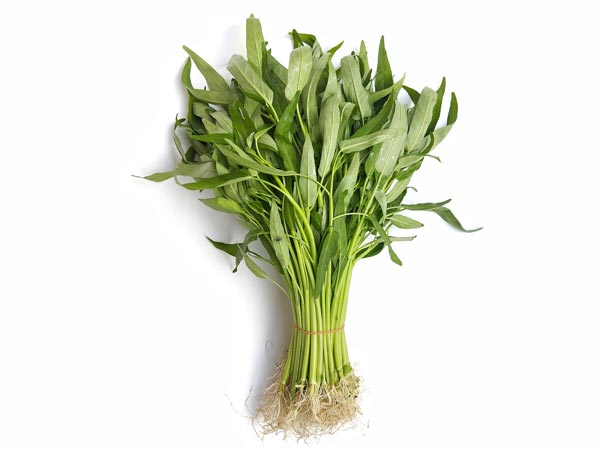

フィリピンのコスパ最強野菜のひとつ・カンコン。  

山のちょっとした水辺などに自生するほど強い生命力です。何かの栄養に特化しているわけではありませんが、バランスよく栄養が含まれてます。  
サッカーのポジションで例えるとリベロみたいに万能です。

- *ビタミン・ミネラルが豊富：* ビタミンA・C、鉄分、カリウムを含み、抗酸化作用や血流改善に役立つ
- *免疫サポート：* 免疫力を高め、皮膚疾患の改善にも効果があるとされる
- *低カロリー＆高食物繊維：* ダイエットや腸内環境改善にも向いている

にんにくと唐辛子で炒めたら最強にうまいんですよ！よくフィリピン料理のお店（House of Lechonとか）で提供しています。  
私は豆腐などのスープなどに入れてさっぱりいただくことが多いです。

## ペチョイ（小松菜の一種）
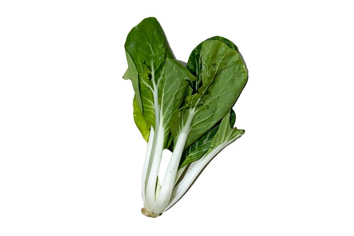

ペチョイはアルグバティ（ツルムラサキ）で、スムージーを作ってあまりのマズさに代替品を探したときにたどり着いた野菜です。  
日本の小松菜よりβ-カロテンや鉄分は少ないのでエグみが少なくさっぱり。その代わりカルシウムとカリウムがやや多めで、骨や血圧の改善や健康増強に役立ちます。

- *カルシウム・ビタミンK：* 骨をつくる材料になるカルシウムと、その働きを助けるビタミンKがたっぷり。骨を丈夫にして、骨粗しょう症の予防にも役立つ
- *グルコシノレート・ビタミンC・ビタミンA：* ペチョイに多い成分グルコシノレートは、体の炎症を抑える働きがある。さらにビタミンCやAが細胞を守って、関節の痛みや傷の回復を助ける
- *カリウム：* 余分な塩分を外に出してくれるので、むくみや血圧の安定

私は、スムージーのほかスープなどに入れて食べることが多いです。アルグバティ（ツルムラサキ）みたいにクセがないので何に入れてもわりとじゃまになりません。

## シタウ／シータウ（長豆）
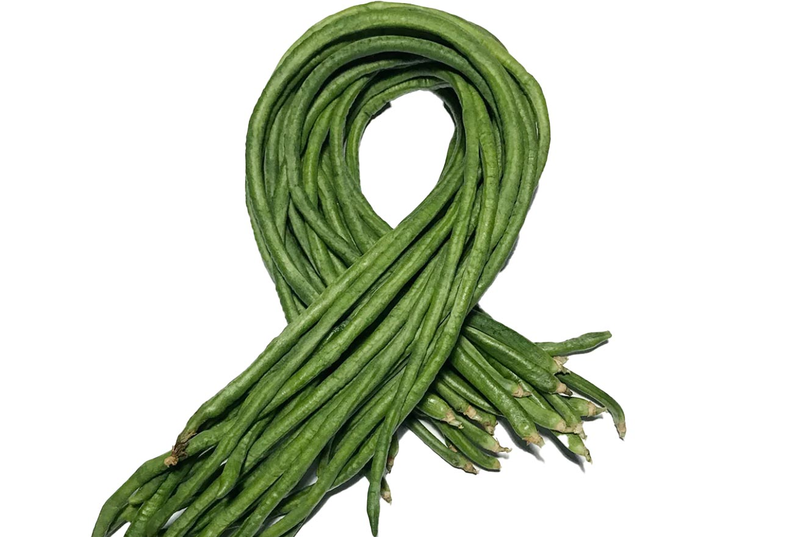

シータウは市場でよく見かけるマメ科の野菜で、長いものは60cmにもなる「長豆」。豆科らしく食物繊維とタンパク質をしっかり含みつつ、カロリーは低めなので日常使いにぴったりです。

それ以外にも「骨」「血」「むくみ」など、更年期世代を含めて女性に嬉しい成分がたっぷり。

- *カルシウム：* 骨粗鬆症が心配な更年期世代の女性に嬉しい成分
- *鉄分：* 貧血予防に
- *カリウム：* むくみや血圧の安定

クセがないので、炒めても煮物に入れてもOK。カットしてさっと茹でて、日本の伝統的なおひたしにしても食べやすいです。

### 紫シータウ発見
BTC（バニラッドタウンセンター）で毎週水曜日開催される、ファーマーズマーケットで珍しい紫のシータウを発見しました！！

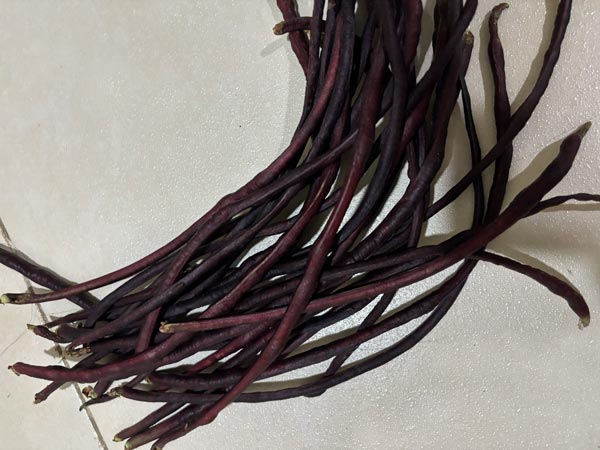

ファーマーズマーケットは朝の 8:30〜 昼くらいまで開催しており、グランドフロア正面入口の入って右側で開催しています。他のお店が閉まっててもガードに言ったら中に入れてくれます。

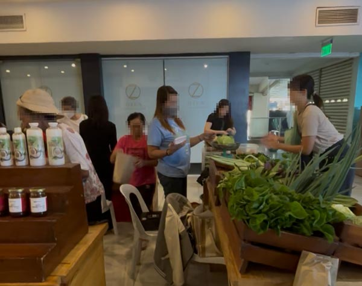

<iframe src="https://www.google.com/maps/embed?pb=!1m18!1m12!1m3!1d3925.0120595707112!2d123.91018327503596!3d10.340919589782615!2m3!1f0!2f0!3f0!3m2!1i1024!2i768!4f13.1!3m3!1m2!1s0x33a998e68d7d7a25%3A0x6491dbac336691b3!2sBanilad%20Town%20Centre!5e0!3m2!1sja!2sph!4v1774539920006!5m2!1sja!2sph" width="600" height="450" style="border:0;" allowfullscreen="" loading="lazy" referrerpolicy="no-referrer-when-downgrade"></iframe>

住所: Gov. M. Cuenco Ave, Cebu City, 6000 Cebu

## モリンガ
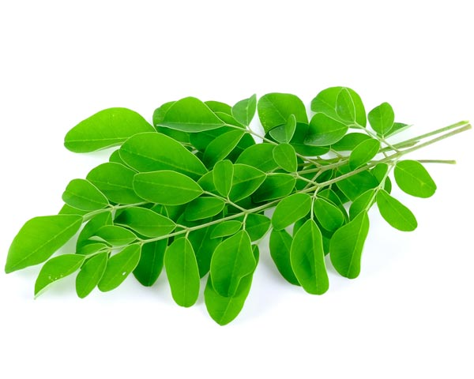

「**奇跡の木**」と呼ばれるほど栄養豊富なモリンガ。ビタミン、ミネラル、アミノ酸をバランスよく含み、美活には欠かせない食材です。しかも一房30ペソ前後（もっと安いことも！）と、とても手頃。

実は道路の中央分離帯など、街のあちこちに自生していて、ローカルの人々はわざわざ買って食べるものという認識が薄いかもしれません。

味はほとんど無味なので、どんな料理に加えても邪魔をせず、自然に栄養をプラスできます。唯一の難点は、葉だけをちぎる下ごしらえが少し手間なこと。

フィリピンではスープにそのまま豪快に入れることも多く、スーパーではお茶や加工品としても手軽に購入できます。

特に**ビタミンAやCが豊富で、肌のターンオーバー促進や紫外線ダメージ対策に効果的**。無味だからこそ、毎日の食事に取り入れやすいのが大きな魅力です。

## ゴーヤ
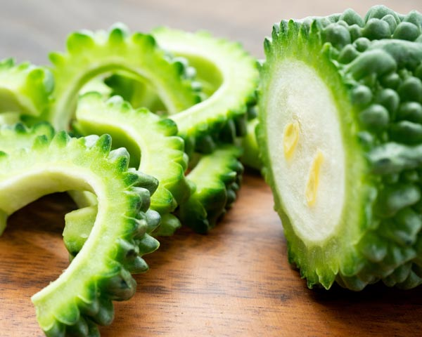

日本でもおなじみゴーヤ。フィリピンでは「アンプラヤ」と呼ばれています。ローカルマーケットでも安く手に入る定番野菜です。  

独特の苦味があるけれど、この苦味成分には**血糖値を調整する働き**があり、糖質の多い食事が多いフィリピン生活ではありがたい存在。さらに抗酸化作用も強く、紫外線ダメージや肌の老化対策にも役立ちます。  

ビタミンCも豊富で、シミやシワ予防に直結。食物繊維による腸活効果もあり、美活を意識する人には欠かせない食材です。  

炒め物やスープに入れるのが定番ですが、私はゴーヤチャンプルーが多め。こちらもお茶（アンプラヤ茶）がスーパーで買えますが、ティーパックを長くつけすぎるとめちゃ苦くなるのでご注意を。

苦味＝美容の味、と割り切って楽しむのがアンプラヤの正しい付き合い方です✊

## ウベ（紫芋）
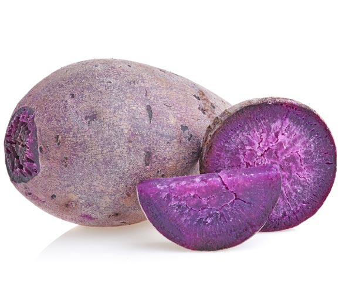

腸活と筋トレを日頃している私にとって欠かせない食材がこのウベ（紫芋）。路上販売でも見かけるしマジで安い。先日小さいレンガサイズをたった100ペソで買いました。

ウベは日本で見かける紫芋と違ってヤマノイモ科（ヤム）。切り口は紫色になっただけの山芋で、食感もねっとり系。  

- *アントシアニン*：強力な抗酸化作用で紫外線による肌ダメージを防ぎ、アンチエイジングに。  
- *カリウム*：余分な水分を排出してむくみ予防。フェイスラインや脚のすっきり感に。  
- *ビタミンC*：美肌・免疫力アップに直結。  
- *プレバイオティクス*：腸内細菌のエサになり、腸活に最適。  

最近の研究では、筋トレ後の筋肉増強や回復にも役立つという報告もあります。  

私の食べ方は単純に蒸すだけ。シンプルだからこそ栄養をそのまま取り入れられるのが魅力です。

## ガビバイオレット（紫芋）
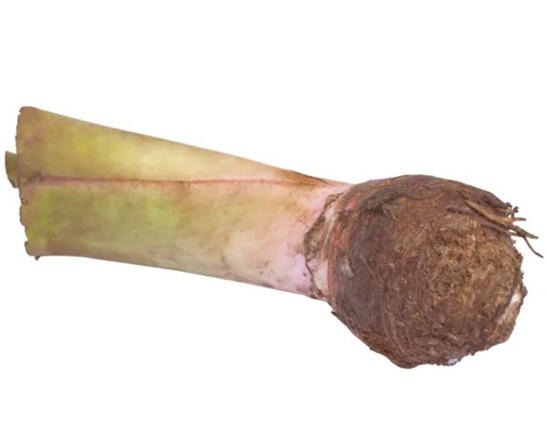

こちらも紫の芋なのですが、ウベと違ってサトイモ科（タロ）です。ひとつ80ペソもしないんじゃないかな？

ちなみに、フィリピンのスーパーや市場ではガビとウベが混同されていることがあるので要注意。  
私も最初AIで調べたのですが、すっかり騙されてウベとガビバイオレット購入。でも味が美味しくてハマったクチです。

違いはガビは丸くて断面がモロ里芋、ガビバイオレットは断面に紫の斑点があります。  
ウベは見た目がゴツゴツしていて断面が濃い紫でモロ山芋でカットするとトローとした汁が出ます。

ウベに比べてホクホクしていて、ちょっと粘り気があります。  
アントシアニンはウベほどではないものの、**マグネシウムが豊富**で腸内環境を整えるプレバイオティクス（腸内細菌のエサ）として優秀。腸活を意識する人には特におすすめです。  

- *マグネシウム*：代謝サポートや筋肉の回復に役立ち、腸内細菌の働きを助ける。  
- *カリウム*：むくみ予防に直結。  
- *ビタミンC*：美肌・免疫力アップ。  

お味はほんのり甘くて私は好き。  
フィリピンでは煮物などおかずとして食べることが多いですが、私は蒸してヨーグルトと蜂蜜をかけて食べることが多いです。シンプルだけど美活に直結する一品です。

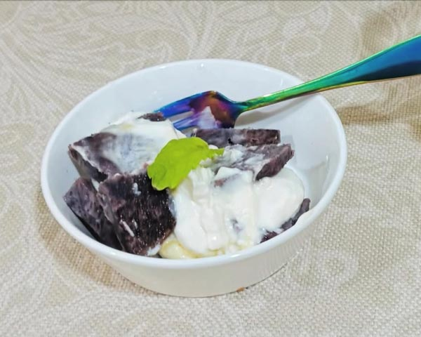

## 伝統的な食材は若い世代に敬遠されつつある

近年やっとモリンガやウベなど栄養価の高い食材が国内外で認知されてきたものの、未だ一部の若いフィリピン人の間では「田舎臭い」「貧しい人の食べ物」と見られています。

ファストフードや西洋風の食事のほうが「かっこいい」とされ、調理に手間のかかる野菜は食卓に並ぶ機会が減っています。共働き家庭が増え、時間がないため子どもたちはインスタント食品や缶詰で育つことも多いのが現状です。  

しかし、年中常夏のフィリピンで育つ伝統食材には、紫外線や暑さに耐えるための栄養がぎっしり詰まっています。本来なら現地の人々の体質に合った、健康維持に最適な食材なのです。  

残念ながら、フィリピンでは高血圧・肥満・糖尿病などの生活習慣病が多く、40代から薬を飲み始める人も珍しくありません。もし伝統的な食文化が見直されれば、もっと多くの人が健康に暮らせるはず。今こそ「古い食べ物」ではなく、**未来の健康を守る南国のスーパーフード**として復活させたいですね。

## まとめ・フィリピンでは美肌によい安価な山の幸がたくさん！！
フィリピンの山の幸には、美肌づくりに役立つ栄養がたっぷり詰まっています。しかもどれも手頃な価格で手に入るのが魅力です。  
他にも挙げればきりがないほどありますが、今回は「調理しやすく、美活に役立つ食材」を中心にピックアップしました。  
（もちろん味が私の好みのものが多め）

セブ在住7年目の自炊派として、日々の食卓に取り入れやすいものを厳選。特別な食材ではなく、スーパーやローカルマーケットで気軽に買えるものばかりです。  
まずは一品から試してみて、自分の体調や肌の変化を楽しんでみてください。

次回は海産物やフルーツ編を予定していますので、ぜひそちらもチェックしてみてくださいね。

この記事がフィリピン生活を始めたばかりの方の参考になれば幸いです。  
最後までお読みいただきありがとうございました。

<card slug="entry556"></card>
