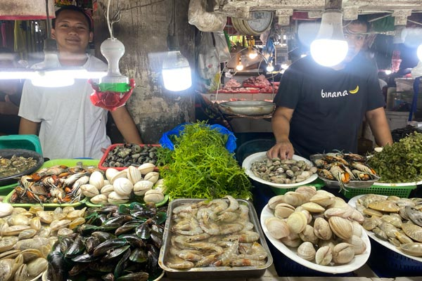
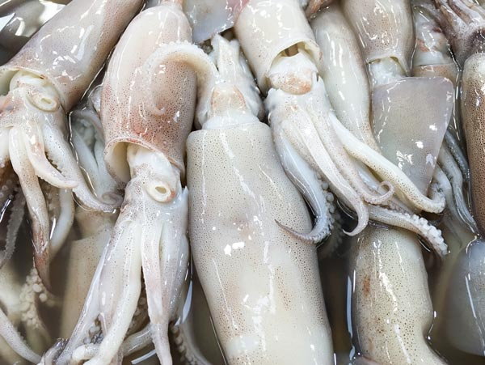
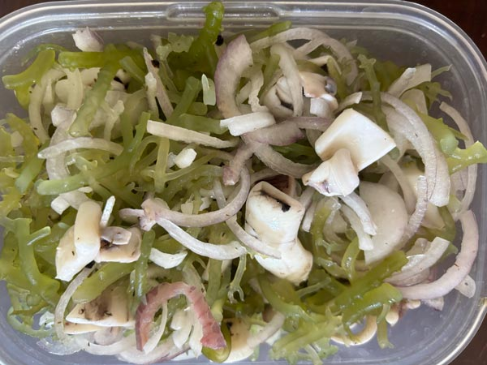
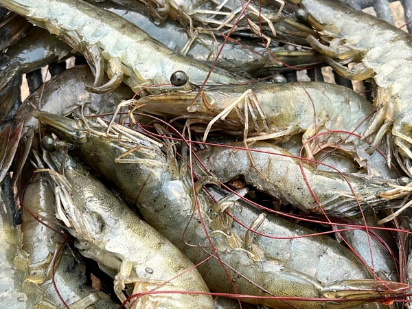
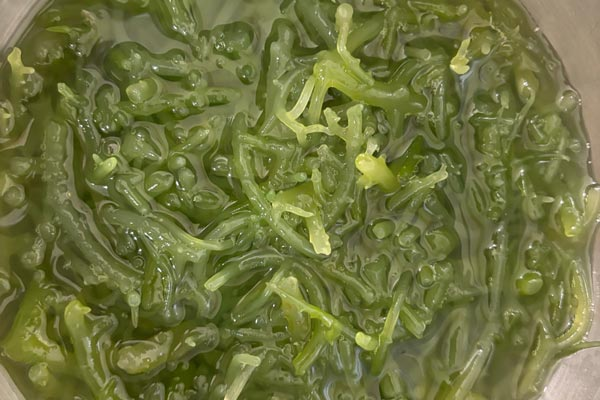
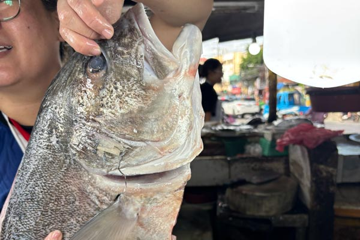
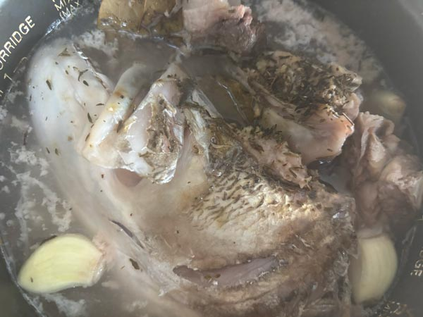
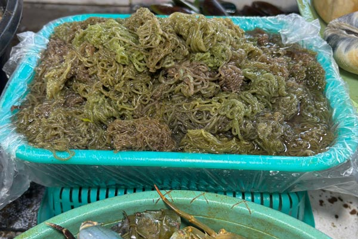
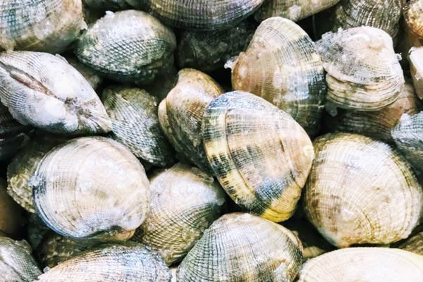

ご飯は時間を節約するために作り置きする派です。  
節約のためによく市場（自宅から歩いて20分）まで足を伸ばします。

<small>Lahug Public Marcket</small>

<iframe src="https://www.google.com/maps/embed?pb=!1m18!1m12!1m3!1d3925.1256917450905!2d123.89638857503569!3d10.331824989791173!2m3!1f0!2f0!3f0!3m2!1i1024!2i768!4f13.1!3m3!1m2!1s0x33a999266894ba0b%3A0xb98ffa839df7c5d9!2sLahug%20Market!5e0!3m2!1sja!2sph!4v1766641159913!5m2!1sja!2sph" width="600" height="450" style="border:0;" allowfullscreen="" loading="lazy" referrerpolicy="no-referrer-when-downgrade"></iframe>

セブと言えば海。実は世界のマグロ漁獲量ランキング（2023年）では、フィリピンは約73,265トンで世界11位。  
特にミンダナオ島南部（ジェネラルサントス港など）は、「フィリピンのマグロ首都」と呼ばれるほど輸出拠点となっています。

もちろんマグロだけではありません。サバやイワシなどの魚はもちろん、イカ、エビ、カニ、海藻や海類も豊富！

そこで今日は自宅でも調理しやすい市場で手に入る海の幸、ちょっと変わったものまでご紹介します。

<small>※ カニがないのは私がカニが食べれないのでレポートできないため。</small>

<prof></prof>

## イカ（カラマリ）

フィリピンと言えばイカ。カラマリ（Calamares・スペイン語）と言われ、何処に行っても手に入ります。  
先日少し大きめサイズ2杯でたった240ペソ（550円）でした。

ルスタンスやマーケットプレイスでも新鮮なものは手に入ると思いますが、ローカル市場では値段が格段に違います。

フィリピン料理のお店に行くと、イカリングとサンミゲルライト（100Kcalしかないアジアで人気のフィリピンビール）が定番。

- *高タンパクで低脂質：* 脂肪を落としつつ筋トレしたい人にもオススメ
- *タウリン豊富：* 疲労回復や肝機能サポート
- *ビタミンB12：* 赤血球をつくるのを助け、貧血予防や神経の健康維持に役立つ

私は[海藻（グソ）](#グソ海藻)と一緒に酢の物にして常備菜としてストックしています。

その他、パスタやココナッツカレーの具としても重宝しています。

友だちいわく刺し身としても食べれるみたいですが、アニサキスが怖いので私は家では食べたことがありません笑。

<small>※ フィリピン近海の魚にもアニサキス（寄生虫）は確認されています。 日本だけでなく、温暖な海域でも広く分布していて、フィリピンの漁場でも報告があります。</small>

## エビ（ガンバス）

エビもフィリピンの定番。個人的には魚介類で1、2を争う好物！
ガンバス（Gambas・スペイン語）と呼ばれ、Chobi Chobi などのフィリピン料理レストランではニンニクたっぷりで炒めて提供しています。

基本、現地のガンバスは皮ごとにんにくと炒めてるので背わたもそのままですけどね。。。

いつも10尾とか買うのですが、大きなエビなのに〜200ペソくらいで入手できます。カルボンマーケットだったらもっと安い可能性アリ！

- *高タンパクで低カロリー：* ダイエット中でも安心して食べられる
- *アスタキサンチン：* 強力な抗酸化成分で、肌の健康や免疫力アップに役立つ
- *ビタミンB12：* 赤血球をつくるのを助け、貧血予防に効果的
- *セレン：* 体の抗酸化機能をサポートし、老化防止や免疫維持に関わる

こちらはイカ同様に酢の物、ココナッツカレー、冷凍用に鶏ミンチと混ぜてエビ団子にしています。

## グソ（海藻）

グソは紅藻の一種で、私が最もよく食べる海藻です。ビニールいっぱいに詰めてもらい大体30ペソ（100円以下）。超お得です。

キニラウというフィリピン伝統のココナッツベースの酢の物で、マグロなどの生魚や野菜と一緒に和えたものですが、たまにこのグソが入っていることがあります。  
コリコリの食感が気に入ってよく食べるようになりました。

- *食物繊維：* 腸内環境を整え、便通改善に役立つ
- *ミネラル（カルシウム・マグネシウム）：* 骨や歯の健康をサポート
- *ヨウ素：* 甲状腺の働きを助け、代謝を支える

海藻なのでもちろん低カロリー！さらにビタミンKやビタミンCも含まれていて、血液や抗酸化の働きにプラスになります。

私は基本１、2分さっと茹で（茹ですぎるとぬめりが出るので要注意）水洗いします。
エビやイカと酢のものにしてストックしていることが多いです。

## タンギギ（青魚）
こちらは市場のおばちゃん曰く、タンギギ（Tangigue）です。

タンギギはスパニッシュ・マケレレ（サバの仲間）で市場で1キロ450ペソ（1200円）くらいで購入可能です。  
日本の魚で言えばサワラに近いです。

私はよくアラで買ってます。

タイムやローリエなどのハーブと粒胡椒・生姜・にんにくで下味をつけ、炊飯器（保温のみで5時間程度放置）で骨ごとじっくり煮出し、小分けに冷凍してストックしています。

セブの魚は血抜きされてないので、さっと湯引きして血合いを洗って下ごしらえが基本です。

タンギギは青魚なので：

- *DHA・EPA（オメガ3脂肪酸）：* 脳の働きや血流改善に役立ち、炎症を抑える働きもある
- *ビタミンD：* 骨の健康をサポートし、カルシウムの吸収を助ける
- *良質なたんぱく質：* 筋肉や代謝の維持に欠かせない

魚のコラーゲン（1型）はサプリのコラーゲンペプチドほどではありませんが粒子が細かく吸収がいいとされています。肌活をしている私としてはありがたいです。

お酒を飲んだ次の日は春雨スープが定番なので、タンギギスープに野菜と一緒にぶち込んでいます。脂の旨味とコラーゲン、さらにオメガ3が溶け出して、体が喜ぶ一杯になります。

### 大型魚の水銀対策
マグロなど大型魚と同じく、タンギギも *サイズが大きいほど水銀残留が心配* になります。  
水銀は体内で分解・排出されにくいのですが、魚自身が **セレン** というミネラルを同時に含んでいて、このセレンが水銀と結合して毒性を弱める働きを持っています。

ちなみに、アメリカ周辺の海域に比べて、インド・東南アジアの海域の魚のほうが水銀残留が少ないとされています。

通常の食生活で週に2〜3回程度の摂取であれば問題ないとされています。  
むしろ青魚のオメガ3やビタミンDの恩恵の方が大きいです。水銀＝悪ではなく、バランスを意識して楽みましょう。

<msg txt="大きな切り身を選ぶときは、血合いをしっかり湯引きして下処理をすることで、臭みだけでなく余分な不純物も落とせるので安心ですよ！"></msg>

<!-- ## カタンバ（青魚）
## ビスゴ（白身魚） -->
## ロコット（アメフラシの卵塊）

ロコットは一見海藻のようですがアメフラシの卵塊です。
無数の卵がゼラチンでコーティングされたもので、日本でも一部の地域では「海素麺」と言われて食べられているらしいです。

食感は臭みもなくコリコリとしてとても食べやすいです。

見た目のユニークさだけでなく、美容面でも注目できる食材です。卵由来の栄養素は肌の健康に直結しており、以下のような効果が期待できます。

- *必須アミノ酸：* コラーゲン生成の材料となり、肌のハリや弾力をサポート。
- *ビオチン（ビタミンB群）：* 皮膚細胞の代謝を助け、乾燥や肌荒れを防ぐ働き。
- *ビタミンE：* 強力な抗酸化作用で血流を改善し、くすみのない透明感ある肌を守る。

あまり耳慣れない成分ですが「卵黄の色素成分 *ルテイン*」という抗酸化成分も含まれており、肌の酸化ストレスを軽減。紫外線によるダメージから肌を守る働きもあるとのこと。

単なる珍味ではなく「食べるスキンケア」としても魅力的です！私は刻み生姜をトッピングしてカラマンシーと醤油で日本のもずくのようにいただく事が多いです。

## アサリ（二枚貝）

フィリピンではマニラクラム（アサリ）がよく知られています。  
私はパスタに入れてボンゴレビアンコにしたり、味噌汁に加えて楽しんでいます。

- *鉄分や亜鉛：* 血をつくるのを助け、体の抵抗力を保つ  
- *ビタミンB12：* 神経や血液の働きを支える大事な栄養素  
- *タウリン：* 肝臓の働きを助け、疲れをやわらげる  
- *オメガ3脂肪酸：* 血の流れを良くし、体の炎症を抑える  

ただしフィリピンの二枚貝で注意すべきなのは *貝毒*。  
赤潮が発生すると貝の身に毒素が蓄積され、一度溜まると解毒はできません。日本のように水質管理や出荷規制が徹底されていないため、毒素を含んだアサリが市場に並ぶ可能性もあります。

実際、フィリピンでは貝毒による中毒で亡くなった家族のニュースを目にしたことがあります。

牡蠣やムール貝も好物ですが、私は二枚貝は少量に留めるようにしています。  
さらに身の黒い部分には毒素や泥が残っていることがあるため、取り除いてから食べるようにしています。

もちろん完全にリスクを避けられるわけではありませんが、少量に抑えたり下処理を工夫することで、被害を軽減することは可能です。

旨味が強く栄養も豊富ですが、環境リスクを理解した上で「少量＋下処理」で楽しむのが現実的です。

## まとめ・フィリピンは豊かな漁場--海の幸を食べないのはもったいない！

今回は魚介類でローカルマーケットで入手できる調理しやすいものを厳選して紹介しました。  
食べることは毎日のことですし、以前のブログでも触れたように *身土不仁（しんどふじ/しんどふに）*--人間（身）とその土地（土）は切り離せない一体のものである--とあるように、この度セブで採れる魚介の栄養を調べたところ、この気候風土のための体にぴったりの栄養がたっぷりとも証明できました。

だからこそ、地元の魚を食べることは体を整えるだけでなく、その土地に根ざす生き方でもあるんでしょうね。

<card slug="entry555"></card>

最近、更年期や体調を崩し藁（わら）をも掴む思いでインターミットファスティング(断続的断食)を始めました。ちょうど食生活を改善しているところです。

<card slug="entry554"></card>

地のものを食べると値段も安いし、新鮮。お財布にも体にも優しいです。

昨今、水銀や貝毒などの汚染は避けようがないですが摂取量に配慮しつつ、地産地消をこれからも楽しんでいこうと思います。

この記事がフィリピンで地元の食材を楽しんで生活したい方の参考になれば幸いです。  
最後までお読みいただきありがとうございました
