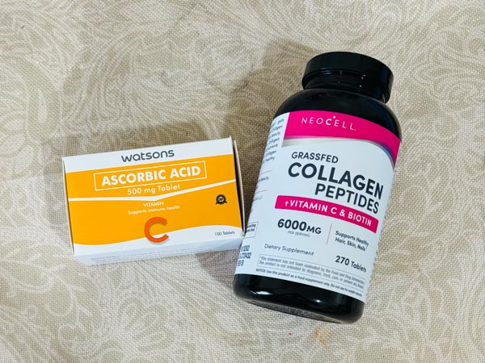
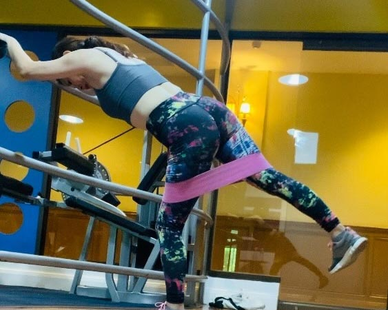
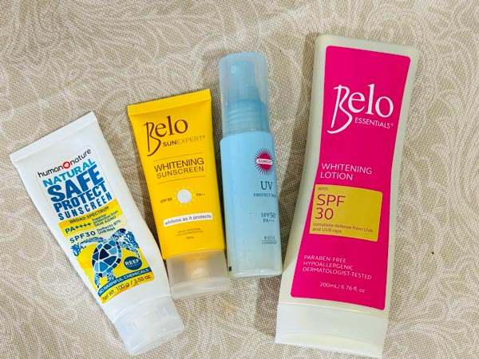
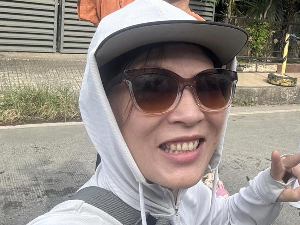
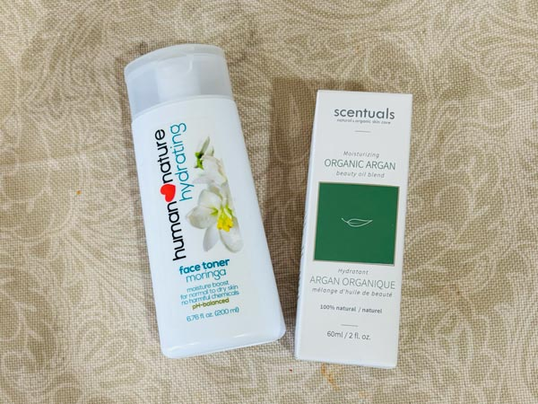

シミでお悩みの方、朗報です。

48歳、更年期真っ盛りの私が、紫外線が日本の5〜6倍とも言われるフィリピンで10年以上悩んでいた“**ラスボス級のシミ**”を薄くできた方法をご紹介します。

アラフィフ、更年期…正直いろいろ諦めかけていましたが、やっぱりここで諦めてはダメだと一念発起し、16:8ファスティングを始めました。最初はたるみケア中心に行っていたのですが、特にシミに関しては、たった一ヶ月で目に見える結果が出ました。。

<small>左）ビフォー：2025年11月21日　右）アフター：2025年12月17日</small>

私のバックグラウンドは現在、セブ島で会社を経営するエンジニアです。ただし、15年以上前キャリアチェンジするまでは、専門学校や化粧品メーカーでインストラクターをするなど美容の知識は深いと自負しています。

やったこと
1. ファスティングで腸を休ませ、改善する
2. ビタミンC1000mg以上を分割摂取
3. 中高強度の運動を30分
4. 日焼け対策の徹底

この4つが私のシミケアの軸です。なぜシミが薄くなったか、経験と科学的な根拠を併せて私の分かる範囲で実践したことを解説します。

<small>※ 専門家ではないのであくまで体験談として参考にしてください。</small>

<prof></prof>

## ファスティングで腸を休ませ、改善する
ファスティングを始めた理由のひとつがアンチエイジング。

最初は気付かないうちにたるんでしまった顔を改善したくて、フィリピンでは有名な Healthy Options でビタミンC入のコラーゲンペプチド（2,300ペソ／5,000円以上ぐらい）を購入し、意気揚々と摂取を開始しました。

<small>（左から）WatsonsのビタミンC（1錠500mg）、Healthy Optionsのコラーゲンペプチド</small>

<iframe src="https://www.google.com/maps/embed?pb=!1m18!1m12!1m3!1d3925.307978968859!2d123.90271357503539!3d10.317218989804966!2m3!1f0!2f0!3f0!3m2!1i1024!2i768!4f13.1!3m3!1m2!1s0x33a9993ee6ec1c81%3A0xb9543e95e8b533f8!2sHealthy%20Options!5e0!3m2!1sja!2sph!4v1766990532501!5m2!1sja!2sph" width="600" height="450" style="border:0;" allowfullscreen="" loading="lazy" referrerpolicy="no-referrer-when-downgrade"></iframe>

<small>Healthy Options Ayala Center level2</small>

それを友だちに話したら、「コラーゲンは実はあまり吸収できない」とアドバイスをうけました。美容インストラクターだったくせに実はお金をかけてこなかった私。私の割に美容のために高いお金を出したつもりでしたがショックでした。

その後、様々な研究やエビデンスを調べたところ、現時点（2025年現在）、サプリのコラーゲン・ペプチドは通常の食品のコラーゲンよりも分子的にも細かく、効果が見られることが分かりました。

とはいえ、どんなに良い栄養を摂取しても、どんなに高いサプリメントを摂取しても、 *腸が吸収できなければ **お金の無駄遣い*** です。

金ドブ絶対イヤ！と思って、まずは先に土台作りとして腸内環境を改善するために 16:8ファスティング を開始。

私の場合、長年の飲酒習慣があり、腸内環境は劣悪でした。まずは腸を回復させるために休ませる必要があると考えました。

<small>ファスティング中の食事</small>

普段から私1日、1〜2回しかご飯を食べません。私にとってはイージーな *インターミットファスティング（断続的断食）* をチョイスしました。これが私の腸改善の第一歩となりました。

断続的断食のひとつ、16:8ファスティングについて、詳しく知りたい方はこちら。

<card slug="entry554"></card>

ファスティングで腸内環境改善までに、最初は壁にぶつかることもありましたが、1ヶ月ほどで落ち着いてきました。

### オートファジー（細胞の自己修復・浄化）
1日16時間以上の断食で空腹状態が続くことで、*オートファジー* という体が本来持っている機能が促進されます。

体は栄養が足りないと体の中で壊れたり、不要になった細胞をリサイクルしようとします。

結果、炎症や肌のターンオーバーが助けられる可能性を研究結果でも示唆されているそうで、特に水分保持、肌表面の滑らかさ改善、色素沈着（シミ）軽減したという体験談も多くあります。

ただ、今回はこのオートファジーはサポート程度の効果で、ファスティングそのものの腸のリカバーのほうが個人的にはシミ改善に貢献したと考えてます。

## ビタミンC1,000mg以上を分割摂取
ビタミンCをサプリも併せて1日1,000mg以上（目標1,500mg）を分割して摂取しています。

AI曰くこれが一番根拠が強いとのこと。ビタミンCは水溶性で一度に多量摂取しても体内に留めることが難しく、500mgを上限に分割（4回〜6回）して摂取。科学的にもビタミンCの分割摂取は根拠が強いとされています。

セブにはありがたいことにカラマンシー（レモンの3倍）やアップルグアバ（グアバの品種改良されたものでグアバほどじゃないけどビタミンCがチート級）など、ビタミンCが豊富に含まれた食品がたくさんあります。しかし、いろんな摂取方法を試しましたが、 一度の食事で摂れるのはせいぜい200mg程度が限界でした。
1500mg 摂取しようとしたらサプリ無しは無理と断念し、食事とサプリの合せ技で行くことにしました。

体内にビタミンCがより長くいる状態を持続させたいので、私の場合 500mg のビタミンC錠剤を半分に割って分割して摂取しています。

<small>16:8ファスティングの間の空腹対策の軽食やサプリ摂取は一回50kcalに満たないので、カウントしてません。</small>

私の普段の食事だと、1日トータル大体300〜700mgのビタミンCは摂取できますが、更にプラスしてビタミンC錠剤2個摂取しています。

**例)**

* 朝イチ--お白湯にカラマンシー(2個絞る)
* 食事後や水分補給時にビタミンC錠剤
* アップルグアバ（グアップル）などのビタミンC豊富な野菜やフルーツでスムージー

夜寝る前にはコラーゲン・ペプチドとビタミンCを一緒に摂るようにしています。そのため、夜寝る前に残しておいた錠剤250〜500mgを摂るようにしています。

## 中高強度の運動を30分
これは30代で10年以上、中高強度の運動をやってきた持論です。運動は *最強の美容法* です。

当時カポエイラ（ブラジルの舞踏風格闘技）をやっていた私は、大したスキンケアもしておらず、大酒飲みだったにも関わらずお肌もキレイで、30代後半でも、時には20代に間違われるほどでした。

その頃からなんとなくですが、運動をしたら成長ホルモンが出て、コラーゲン生成やターンオーバーが促進されるのは知ってました。中高強度の運動で見た目が若返って見えるのはよくあることです。

それだけではなく、筋肉から分泌されるマイオカイン（特にマイオネクチン）がメラニン生成を抑え、シミを防いだり、肌を白く保ったりする効果が研究で指摘されているそうです。

### 自宅で気軽にできる自重トレが中心

私の具体的な筋トレですが、スクワットなどの自重が基本。中高強度にするために、レジスタンスバンドを使ったりひねりを使った運動を取り入れるようにしています。

昨年はジムで筋トレしていましたが、時間もお金もかかるのがもったいないと感じて自宅で半〜1畳あればできる運動に切り替えました。

主に鍛えるのは太もも、おしり、背中など大きめの筋肉を中心に日替わりで狙ったメニューにしています。1種目につき基本数量多めの20回を3セット。メニューの数をあえて減らしてサクッと終わるようにしています。無理なく続けられる工夫が大事！これが私の“運動美容法”の基本です。

<small>ジムに通ってた時に使ってた時に購入したレジスタンスバンド。Lazada などで200ペソ以下で買える</small>

## 日焼け対策の徹底
もちろん、シミは作らせません！！日焼け対策を徹底しています。

### 日焼け止め

<small>セブで手に入る日焼け止めと日本のスプレータイプ</small>

顔は基本頬や鼻など染みができやすい場所は二度塗りです。

体は、首はもちろん耳まで塗っています。  
部屋にいても日が沈むまでは、2〜3時間おきに塗り直しています。

外出時にはシーンに合わせて日焼け止めの種類を使い分けています。

### 物理的な紫外線対策

朝起きた時日差しを浴びないよう、遮光カーテンを締めて寝ます。

出かけるときはサングラス、帽子を忘れないようにしています。長時間出かけるときはフード付き長袖パーカーを羽織っています。

これらを徹底することで、紫外線の強いフィリピンでも肌を守ることができています。

## その他、実践していること
その他、若かりし頃の専門的な美容知識も含めて実践していることをご紹介します。

### ソラレンなどシミを作る成分を摂取しない
レモンやグレープフルーツなどの柑橘類には、*ソラレンという光毒性物質* が含まれています。一見柑橘類はビタミンC豊富そうで飛びついちゃいますが、この成分がシミ対策をしている人には危険。摂取して数時間後に日差しを浴びると、ソラレンが反応してシミの原因になります。

私は若い頃からこのソラレンの特性を知っていたので、レモンなどは夜のみ摂取するようにしています。

フィリピンと言えばカラマンシー。同じ柑橘類でもこのソラレンの含有が微量で、日焼け対策をしていれば気にする必要はないのでガンガン摂取しています。

日本で、このソラレンを避けて食べ物からビタミンCを摂取したい場合、代わりにキウイ、いちご、赤＆黄ピーマンなどをおすすめします。

知識を活かして食べ方やタイミングを工夫することが、シミ対策には大切です。

### とにかく歩く
有酸素運動も兼ねてますが、私の歩く目的はストレス発散と血行を良くすることです。フィリピンのほとんどのコンドミニアムは浴槽がありません。血流を促して老廃物を排出しやすい状態にしています。

ストレスもシミを作りますから、ストレス対策としても散歩は優秀。

朝の散歩は40分少し早足で歩きます。朝日を浴びる光刺激とリズム運動の相乗効果で脳が活性化することでセロトニンを分泌（※）させるためです。

時々行う夜の散歩は20分でゆっくり歩いてメラトニン（※）を出してしっかり眠れるようにしています。

最初は更年期の落ち込み対策として始めた散歩でしたが、心身のリセットと肌ケアの両方につながっています。

<small>※ セロトニンは心を安定させる神経伝達物質で、メラトニンは眠りを促す睡眠ホルモンです。</small>

### 就寝時：よく眠れるよう工夫をする
お肌は寝てる間に作られます。だから単純によく眠れるようにしています。

今まではセブのゴキ◯リ怖すぎて睡眠中も電気をつけっぱなしでしたが、最近は暗くして寢るようになりました。そして、枕元に携帯も置くのをやめました。  
そして携帯を時計代わりにするのもやめ、部屋にかけ時計を置きました。

スマホなどから発せられるブルーライトは脳を覚醒させ、メラトニン分泌を抑制し、眠りを妨げることが科学的に確認されているからです。  
どうしても見たいのであれば物理的にブルーライトをカットするシートを貼り付ける方法もありますが、SNS をダラダラと見て睡眠時間を削るのを防ぐためでもあります。

本来は就寝前1時間はブルーライトを遮断したほうが良いので、今後は就寝前には携帯を見ない習慣をつけようと思います。

### 朝晩〜10分の表情筋トレーニング
元々たるみが気になって始めたアンチエイジングだったので、表情筋トレーニングも始めました。顔のリンパや血流が良くなるので間接的にシミ対策のサポートしているはずです。

こういったルーティーンを毎日やるのはとても面倒だと思いますよね？  
だから、実践に移す基準は「普段YouTubeやそのほかのSNSなど閲覧で無駄遣いしている時間」と同等くらいで終わる内容と定めてます。

どうせ時間を無駄遣いするなら、未来に投資しようって気になるじゃないですか？

だから、筋トレも30分以内に収まるようにしています。

### 保湿の徹底
私は基本UV対策とお肌の保湿はセットだと考えています。水分を保持していない肌は紫外線にも弱くなるので、保湿も徹底。

#### シンプルなスキンケア
私は敏感肌なのでスキンケアもシンプルです。余計なものをベタベタつけてたら時間もかかるし、お肌にも負担がかかります。

私はスキンケアグッズに値段はこだわりませんが、Human Nature の化粧水と洗顔、Healthy Options の オーガニック・アルガンオイル が基本です。

<small>（左から）Human Nature モリンガエキス配合の Hydrating face toner（化粧水）、Healthy Optionsオーガニックアルガンオイル</small>

<iframe src="https://www.google.com/maps/embed?pb=!1m18!1m12!1m3!1d31402.46389786884!2d123.88468890889214!3d10.31721832711735!2m3!1f0!2f0!3f0!3m2!1i1024!2i768!4f13.1!3m3!1m2!1s0x33a9994efe4bdd79%3A0x137e3674baa1703f!2sHuman%20Nature!5e0!3m2!1sja!2sph!4v1766990657933!5m2!1sja!2sph" width="600" height="450" style="border:0;" allowfullscreen="" loading="lazy" referrerpolicy="no-referrer-when-downgrade"></iframe>

<small>Human Nature マンダウエ店</small>

クリームや乳液を避けるのは乳化剤入の基礎化粧品を使いたくないからです。

ちなみにアルガンオイルは、ブースターオイル（化粧水などで保湿する前の一時的なフタ）としても使えます。一本1,000ペソちょい（2025年現在）ですが、相当気に入っていてリピしています。

日中は保湿ミストを数回使います。お肌が突っ張るようだったらアルガンオイルを乾燥が気になるところだけ塗布します。

* 刺激はNG！！こすらない
* お肌の水分を蒸発させないために上質なオイルでフタを優先
* 化粧水は二度付けまで（水分を与えすぎは肌の蒸発を招く） 

#### 水は少なくても2L。常温かお白湯で内からの水分補給
経皮吸収（肌からの吸収）の効果は雀の涙ほどなので、内側から潤すために水分を1日2L以上は取るようにしています。

特にこだわりは起き抜けの水分補給。前は常温水をコップ2杯でしたが、現在はお白湯を3杯（うち1はカラマンシー果汁入り）を飲むようにしています。

## まとめ・3ヶ月後が楽しみ
たった、1ヶ月で10年来の頑固なシミが薄くなった体験談をシェアさせていただきました。

基本の軸の4つ、*ファスティングで腸を休ませ、改善する*・*ビタミンC1,000mg以上を分割摂取*・*中高強度の運動を30分*・*日焼け対策の徹底* 以外にも、その他実践していることなどに上げた、小さな習慣の積み重ねが、シミ対策や肌の回復に大きくつながって来たのだと思います。

よっぽどレーザーも考えたけど、レーザーでシミ取りしたいろんな人の話を聞くとみんな口を揃えて「シミが復活した」というので、その後ケアをしない限りは継続性がないんですよね。

それなら、シミの出来にくい根本の *肌作りや習慣を身に着けたほうが現実的* かなぁと思った次第です。

<small>こうやって改めて比較すると、毛穴の縦開きなどを含むたるみも改善されてますね。</small>

### 実は以前、ハイドロキノン＋トレチノインでシミ対策を行っていたけど。。。
実はファスティング＋ビタミンCを行う前、ハイドロキノン＋トレチノインでシミ対策を行っていました。

それはそれで効果は感じたけどA反応（肌が赤くなりヒリヒリする状態）はツライかったです。しかもこのファスティング＋ビタミンC集中砲火ほど劇的な変化は感じられませんでした。

> <em>Beauty comes from the inside.</em> 美は内側から溢れ出す。

私が好きな言葉のひとつなのですが、美容効果も外からではなく内側からあふれるものなんですよね。

48歳でシミを薄くすることができた私の体験が、シミ対策をしたい人の一助となれば幸いです。

また、3ヶ月後の変化もまたシェアしたいと思います。

最後までお読みいただきありがとうございました。
