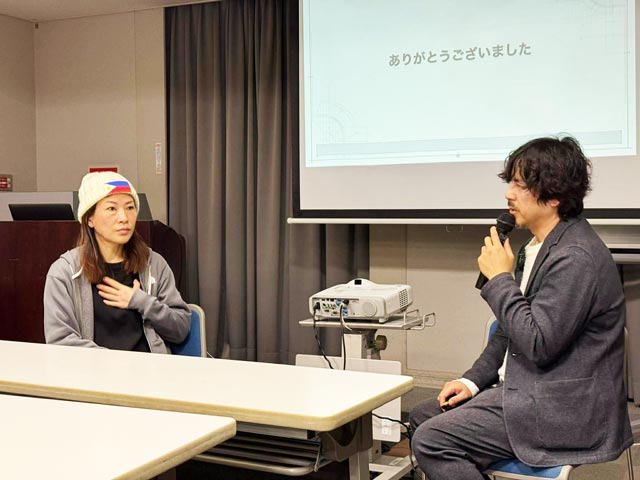
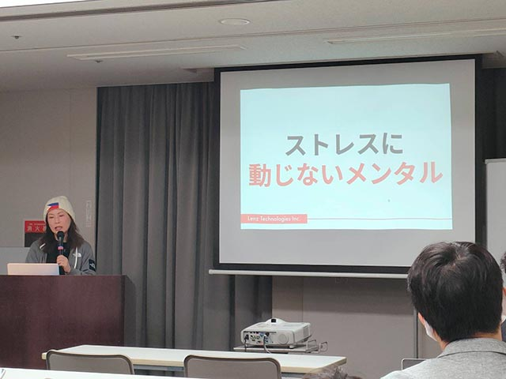
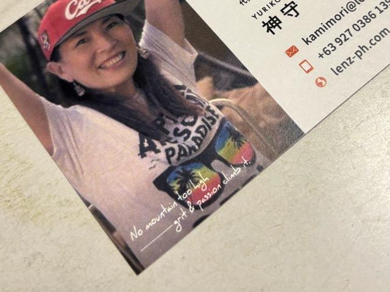

日本に3年ぶりに帰省しました。帰省の目的は、主にクライアントと会うことはもちろん、Web Touch Meeting に登壇することでした。

日本にいた頃、広島では約10年 IT で頑張ってきました。仕事だけではなく勉強会を通じてたくさんの友だちもできました。当日は懐かしい面々もおり、少し同窓会のようでホッとする一面もありました。

ですが、40分のセッション時間では語りきれなかった **裏面** があります。ここからは、忖度なく本音で綴っておきます。

## Web Touch Meeting #125 セッションの概要

[第125回「WEB TOUCH MEETING」](https://webtouchmeeting.com/event/31)

### 資金ゼロから挑んだ海外起業奮闘記 ～セブ島で学んだリアルなサバイバル～概要
* *フィリピンと日本の違い*…文化・価値観のギャップを体験談とともに解説。
* *資金ゼロで会社設立*…日系エージェントの費用 vs 自力。リアルな選択肢とその結果。
* *設立直後の資金難*…危機の中で見えてきた、海外で本当に大切なもの。
* *政府・自治体との闘い*…複雑な手続きにすり減った2025年。メンタル崩壊からの復活方法。

### 訂正とお詫び
フィリピンと日本を比較した際、人口に関して大きな間違いをしてしまいました。  
要望に応えようと急ぐあまり、AIに派手なハルシネーション（もっともらしい嘘）をかまされ、そのまま数値を転記してしまったのが原因です。

カケナビ[@kakenavi](https://x.com/kakenavi?lang=ja)さんに「広島市の人口より少ない（笑）」と突っ込まれてようやく気づきました……。はぁ、お恥ずかしい。

|　| 日本 | フィリピン|
|-|-|-|
| 人口 | 約1億2,200万人 | 約1億1,800万人 |
| 人口動態 | 減少傾向（年間約80万人減） | 増加傾向（年間約1.5%増） |
| 平均年齢 | 約49歳〜50歳 | 約25歳〜26歳 |

## あの時、セッションでは言えなかった裏話

さて、あの時セッションで言えなかったことを語ります。

### 10年以上のIT業界人生とセブの資金難で見えてきた「ヒト」の本質

「資金ゼロから挑んだ海外起業奮闘記 ～セブ島で学んだリアルなサバイバル～」でもお伝えしましたが、やっとの思いで会社を設立した直後、請求金額が回収できず資金難に陥りました。海外でいきなり直面した、リアルな生活難です。

セッションの締めくくりでは「何をするかより何をしないか」が大事だと伝えましたが、本当に伝えたかった本音は別にあります。

> 誰と付き合うかより、誰と**付き合わないか**が大事

見方によっては角が立つと判断し、当日のスライドからは削除した言葉です。ですが、自分や会社を守るための生存戦略として、これ以上に学んだことはありません。

> **友だちとビジネスの間が曖昧な人**と仕事をするな

これは経験則ですが、一見「良い人」に見える、耳障りの良いことを言うやつほど信用できないことが多い。実際に向き合ってみて、悔しい思いをしたことがあります。

ビジネスを続けていれば、どうしても「やばいヤツ」を完全に避けることはできません。

<msg txt="悪口を言ったり呪ったりして解決するならいくらでもやりますが、現実はそうはいきませんよね。"></msg>

だからこそ、**「面倒くさがらず契約書を巻く」**。これが、この世界を生き抜くためのリアルな **「生きる知恵」** です。

#### こんな世の中だからこそ、正直でいろ

もちろん、私自身も無意識のうちに相手に対して同じような不誠実な振る舞いをしてしまっている瞬間があるかもしれません。

だからこそ、私は腹の中を隠さず、常に正直でいることが重要です。  
自分が嫌な思いをしてきたのであれば、なおのこと自分は同じ道を歩まない。

こんな世の中だからこそ、正直で、誠実でいること。これが人生の真理だと思います。

### なぜあなたは、ここでそれをしているのかを常に問え

政府や自治体との闘いに明け暮れていた2025年、私はもう一つの大きな問題を抱えていました。

昨今の言葉で言えば、ADHDやASDといった発達障害のグレーゾーンと診断されるのでしょう。子供の頃は「集中力がない」「興味のない勉強がとことんできない」「忘れ物が多い」といった言葉で片付けられてきました。

しかし私は、このADHDの特性である **過集中（ゾーンに入る）** と **長期記憶の定着（興味のあること限定）** のおかげで、普通の集中力では到底成し得ない成果を出してきました。

* 中学生で教科書を丸暗記
* 元素記号をすべて暗記
* 大学受験では、受けた授業の内容がそのまま試験に出て合格
* 20代のネイリスト時代、大会で入賞
* 漫画で佳作入賞
* 30歳を過ぎてからIT業界へ転職
* チームで29個のアプリを制作し、大会で入賞

「過集中」という武器は、寝食も忘れて没頭しすぎるのが難点です。大人になっても膀胱炎を患うなど、多くの弊害を伴うものでもありました。

そして2025年。納期が危うい案件が3件重なりました。私は意識的に「過集中」をコントロールできるようになっていたため、やむを得ずそのスイッチを入れましたが、それが運の尽きでした。

反動で酷く燃え尽きてしまい、鬱状態に陥り、現実から逃げるように酒に溺れる日々が続いたのです。

#### ドーパミンの奴隷から抜け出すための「脳の再起動」

更年期の影響も重なり、仕事を制限せざるを得ないほど状態は悪化していました。

<msg txt="このままでは死ぬ…"></msg>

本能的な危機感から、藁をも掴む思いで、少しずつ以下の習慣を試していきました。

* *散歩*：セロトニンを活性化させ、心を安定させる
* *30分の筋トレ*：自分を律する訓練
* *酒の制限*：一時的な逃避を断つ
* *16時間断食*：暴飲暴食で荒れた腸の回復

これらはすべて、脳の快楽物質である**ドーパミンに支配されないための工夫**です。

<card slug="entry559"></card>

こうした試行錯誤を続けるうちに、頭を覆っていた霧のようなモヤが少しずつ晴れ、自分が本当にやりたかったことが再び見えてきました。

#### 逃避の終わり：私がセブにいる「唯一の理由」を思い出す

私がセブにいる理由は、ビジネスを始めたから。それ以外に他ありません。休みの日に酒に溺れたり、Netflixを観たりするためにここにいるわけではないのです。

日々のストレスで、その目的をすっかり見失っていました。生きていると雑音が多く、自分の本当にやりたいことを見つけても、すぐに忘れてしまうもの。

<msg txt="あー、情けない。"></msg>

過去の対人関係も、未来のお金の不安も、今この瞬間には起こっていない。ここで会社を作りたいと決めて設立したのは、誰でもなく私自身です。

<msg txt="今ここで自分のビジネスに集中しなくてどうする？"></msg>

ようやく、そんな正常な思考が戻ってきました。

#### ストレスを消すのではなく「打ち勝つメンタル」を武装する

生きている上で、ストレスのない人生など存在しません。
ストレスがなくならないのであれば、それに打ち勝つメンタルを作るのが一番手っ取り早いのです。

* *瞑想*：ADHDの脳みそは24時間止まらないラジオ。荒れ狂う思考を静める
* *SNS閲覧の制限*：過剰な情報の刺激から脳を守る
* *読書*：Netflixの代わりに質の高い情報で脳を再構築する
* *Netflix解約*：受動的な娯楽を断ち、自分を取り戻す

読書で脳の仕組みを勉強し、ドーパミンの受容レベルの管理こそが重要だと知りました。それ以来、快楽に流されず自分をコントロールする生活を習慣化することに決めたのです。

## まとめ：揺るぎない覚悟と、その先にある幸せ

人間関係から生まれた悔しさも、海外での絶体絶命の資金難も、今では大きな学びだったと言い切れます。  
ただの不満で終わらせず、自分の生きる糧に変える。それがサバイバルを生き抜く術だからです。

2026年1月、私は改めてここセブで、ビジネスをやり切る覚悟を決めました。

脳の仕組みを学んで気づいたことがあります。頭の中に不満や不安といったネガティブな感情があると、やりたくないはずなのに、無意識にそれを引き寄せる行動をとってしまう。

「お金がない」と思えばますますお金がなくなる行動をとり、「将来が不安」「自分に自信がない」とイメージすれば、自ら失敗へと足を踏み入れてしまう。

<msg txt="実際、「この人と会いたくないなぁ」と思っている時に限って、居酒屋でバッタリ出くわしたりするものでしょう？ ネガティブに想像したことほど現実化するものですよ"></msg>

だから、まだ起こってもいないネガティブなことに、自分の脳を1ミリも渡さないことにしました。

<msg txt="正直、華々しい結果なんてどうでもいい。 とにかく、やり切る。 だって、やるって決めたのは他でもない私なんだもん。"></msg>

そこには、理屈を超えた揺るぎない覚悟があります。

このAI時代、過酷な競争は続くでしょう。でも、私は私を律し続け、私と私が大切だと思う人たちと一緒に幸せになる。そのために戦い抜きます。

私の名刺には、こんな言葉を刻んでいます。

> *No mountain too high*  
> --- grit & passion climb it.  
> （どんな高い山でも、情熱と根気があれば登れない山はない）

これは、私自身への「覚悟」であり「戒め」です。

泥臭いサバイバルの果てに見つけたのは、自分を律する規律と、誰と付き合わないかという境界線。これらを武器に、私はこれからもセブの地で、自分の山を登り続けます。

この記事がみなさんのこの先の人生の一助となれば幸いです。  
最後までお読みいただきありがとうございました。
