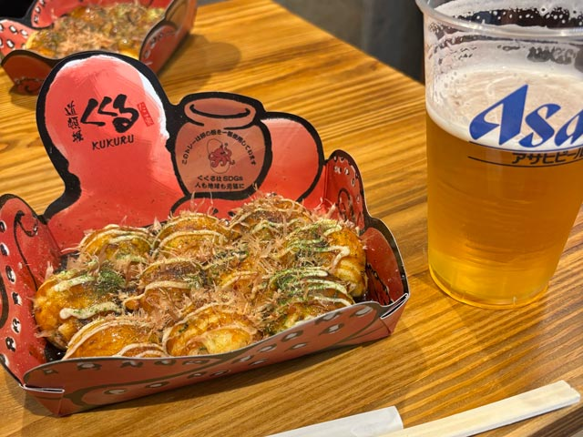
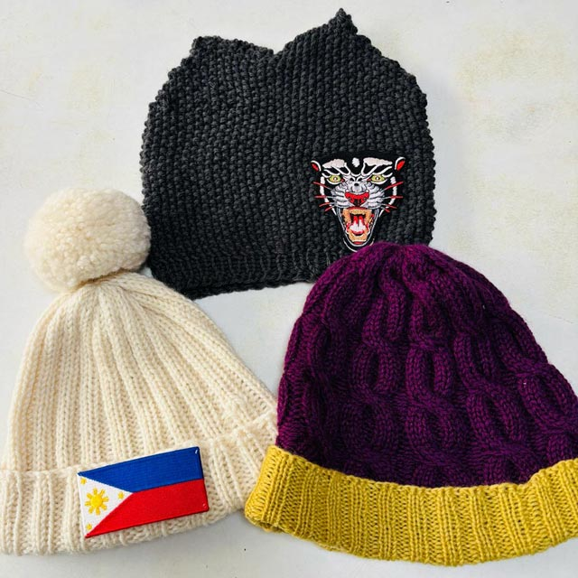
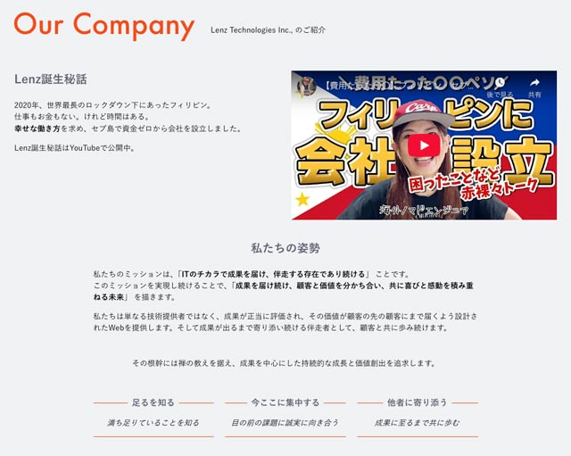
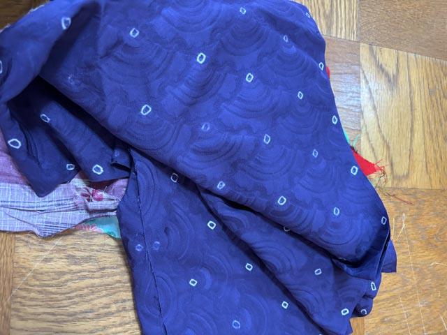
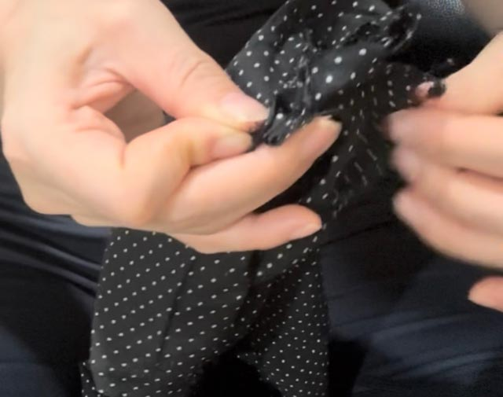
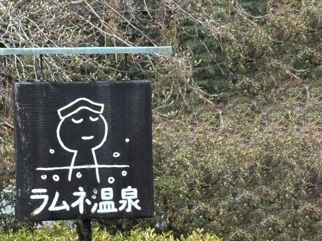

先日、3年ぶりに日本へ2週間ほど帰省しました。

久々の日本の日常。その裏側で突きつけられたのは、**AIの効率化が働き方を根底から変えようとしている現実**でした。

IT業界の端っこに身を置く私自身、「このまま立ち止まれば、加速する変化の波に飲み込まれてしまう」――そんな強い直感を覚えました。

今、私たちの前に突きつけられているのは残酷な二択。

* **レッドオーシャンで溺れるか**
* **疲弊しながら泳ぎ続けるか**

<msg txt="でも私は、そのどちらでもない <strong>第三の道</strong> を選びたい。"></msg>

テクノロジーを賢い相棒にしつつ、人間らしく、のびのびと生きられる場所を模索したい。  
滞在中に得た確信を、**【確信・実践・実験】** の3ステップで整理してみます。

## 確信（Evidence）：効率から見えてくる、使い捨ての構造

「AIに仕事が奪われる」なんて話は、今さら珍しくもありません。
けれど、フィリピンというBPOの熱狂の中に身を置き、一方で日本の実家で「物を大切にしろ」という父の古い教訓に触れたとき、私の中である確信が生まれました。

それは、私たちががむしゃらに追い求めてきた「効率」の正体です。

### AIという、冷徹な「最適解」

先日、日本の勉強会 [Web Touch Meeting #125](https://ginneko-atelier.com/blogs/entry560/) に登壇した際、他の登壇者の方のセッションを聞いて、強い危機感を覚えました。

<card slug="entry560"></card>

> **「たった3秒の音声があれば、その人の声を再現できる」**

この数字を聞いたとき、頭に浮かんだのはフィリピンの街並みでした。

<msg txt="皆さん、フィリピンの経済がどの程度BPO（コールセンター等）産業に支えられているか知っていますか？"></msg>

BPO産業はフィリピンの**GDPの約1割**を稼ぎ出し、**150万人以上（2023年時点）の雇用**を生んでいる巨大な生命線です。
セブの街を歩けば、深夜でも巨大なビルに明かりが灯り、膨大な数の人々が英語で電話に応対しています。そこは今、間違いなく「人間」の仕事場です。

けれど、「3秒」で声が再現され、多言語で24時間、不満も言わずに稼働し続けるAIという「最適解」を前にして、この景色がいつまで保てるのか。

利益の最大化を土俵とする資本家にとって、もはや人間を雇い続ける理由はどこにもありません。  
効率という名の濁流が、150万人の仕事を飲み込んでいく。それはもはや予測ではなく、すぐそこにある「冷徹なロジック」なのだと確信しました。

#### フィリピンのコールセンターがAIに置き換わる日は、すぐそこまで来ている

すでに米セールスフォースはAIの進化を背景に、大規模なレイオフを断行しています（[参照：米セールスフォースが1000人余り削減、ＡＩ販売要員は採用－関係者｜ブルームバーグ](https://www.bloomberg.com/jp/news/articles/2025-02-04/SR4ULZDWLU6800)）。身近でも、人員削減を迫られた知人のオフショア会社が吸収合併を余儀なくされるなど、地殻変動はすでに始まっています。

<msg txt="もし私が経営者なら、迷わずAIへのリプレイスを決断します。"></msg>

24時間365日、稼働の限界もなく正確に回答するAI。ビジネスにおいて、それは抗いようのない「最適解」だからです。しかしその最適解は、130万人の雇用を一瞬で「不要」にするという、冷酷な側面も持っています。

かつてパソコンが導入された時以上の、**巨大で破壊的な変化**が今まさに起ころうとしている。

AIという存在が突きつけてくるのは、技術の進化そのものではありません。**「効率のためなら、人間をいつでも切り捨てられる」という、私たちの冷徹な合理性。** AIは、そんな私たちのエゴを映し出す鏡のようにも見えました。

### 構造の限界：効率が殺すもの

ここで少し、ITから離れてファストファッション業界の話をさせてください。

<msg txt="突然ですが、世界中で「毎秒」どれだけの衣服が廃棄されているか知っていますか？"></msg>

正解は、**トラック1台分**です。

利益追求を極限まで突き詰めた結果、安く、速く供給し、いらなくなれば即座に捨てる。その「最適解」を追い求めた結果、私たちは「物を大切にする」という感覚を失いつつあります。

この大量消費・大量廃棄のサイクルは、人間すら「替えのきく部品」として扱う労働システムと、根底で強くつながっているように思えてなりません。

私は日本にいた頃から、専門店で質の良い靴を選び、手入れや修理を繰り返して長く履き続けるタイプでした。フィリピンに移住してからも、そのお気に入りの靴を大切に履いています。

ところが、3年前に日本へ帰国した際、フィリピンから持参した靴を修理に出して愕然としました。かつては1,000円程度で済んでいた修理代に、**5,000円以上を支払うことになった**のです。

<msg txt="愛着のある靴を履き続けるために、泣く泣くその金額を支払いました。"></msg>

「直して履き続ける」という、自分にとって当たり前だった心地よい循環を維持するコストが、いつの間にか跳ね上がっている。これでは、ファストファッションの店で新しい靴を買い直すほうが安上がりになってしまいます。

*修理したい人が減る → 需要がなくなる → 職人が消えていく*

そんな **負の連鎖** が、すぐ目の前まで来ている。「物を大切にしろ」という父の古い教訓を守ることすら、今の社会では「非効率な贅沢」になりつつあるのです。

<msg txt="行き過ぎた利益追求の果てに、物を使い捨てる現代の姿。私たちの祖先は今、どんな想いでこれを見つめているでしょうか。"></msg>

あなたには、その姿が想像できますか？
## 実践中（Done）：手仕事による自律と理念の再定義

これまでの気づきや違和感を、単なる「思考」で終わらせないために。
この日本滞在期間、私は自分の手と身体を動かし、いくつかの「確信」を得るための実験を繰り返してきました。

ここにあるのは、すでに私が実践し、手に入れた「自律」のログです。

### 効率100%の世界で、あえて「プロセス」を優先する

日本は寒かった。だから帽子を買おうと思ってましたが、あえて作ることにしました。

効率だけを優先すれば、編み物なんて時間の無駄かもしれません。買ったほうが早いし、安上がりです。

けれど、今回の2週間の日本滞在中に、私はウール100％のニット帽を3つ編み上げました。

久々の帰省で母とお茶をしながら、少しずつ編む。この帽子には、既製品にはない「プロセス（過程）」が残っています。  
あえて解（ほど）きやすいよう「伏目（ふせめ）」で閉じました。昔の人は、不要になった編み物を解いて編み直してましたからね。使い捨ての構造に対する、私なりのささやかな抵抗です。

帽子のひとつは母にあげました。
まだまだ寒い日本。きっとかぶるたびに思い出してくれるはず。

### 理念の再定義：足るを知り、搾取の連鎖から降りる

きっかけは、昨年の体調不良でした。
筋トレや瞑想、デジタルデトックスを通じて雑音を削ぎ落とした先に見えてきたのは、**「私はなぜ、このフィリピンにいるのか？」** というシンプルな問いでした。

<msg txt="答えは明白。ここでビジネスをするためです。"></msg>

日本に渡る前、私はドラッカーのフレームワークを用い、自社の事業と生き方を徹底的に再定義しました。その論理的な棚卸しの末、進むべき道を指し示してくれたのは **「禅」** や老子の思想でした。

* **足るを知る**
* **今、ここに集中する**
* **他者に寄り添う**

[Lenz Technologies Inc.,](https://lenz-ph.com)

これが、新たに言語化した弊社の根幹です。「核」がないと、お金への不安に突き動かされ、かつての私のように焦り、溺れます。私はもう、そういう「逃げ」はやめました。

この理念を据えたとき、見過ごせなくなったのが業界に蔓延する **「搾取の連鎖」** です。

先日のお見積もりでは、自ら甘んじていた「搾取フィルター」を外し、妥協を排した価格を提示しました。結果、その案件は通りませんでした。

**けれど、それでいい。**

以前の私なら、心が揺れて値引きに応じていたかもしれません。しかし、最初からこちらの価値を **過小評価** し、安易な値下げを要求する相手と付き合っても、結局は自分の首を絞めることになります。

パートナーとも価値観の違いで何度も衝突しましたが、私はもう、そこに甘んじるのはやめました。これからは安売り競争から降り、クライアントに真摯に寄り添う **「伴走者」** であることに全精力を注ぎます。

マインドのアップデートは、すでに完了しました。

## 実験（Trial）：AIを相棒に、人間としての「納得」を形にする

ここからは、日本で得た確信と再定義した理念を手に、フィリピンへ戻ってから挑む「実験」の話です。自分に厳しく、退路を断って試します。

### AIを「相棒」にして、一人開発の限界を試す

まず、AIをフル活用して **「一人でどこまでプロダクトを開発できるか」** を徹底的に試してみます。
これは単なる思いつきではありません。セブに戻ってからの日々のタスクとして、すでにスケジュールに組み込みました。

具体的には、実行力の面で圧倒的な性能を誇る **Claude** をメインの相棒に据えます。
世の中では「AIが仕事を奪う」と騒がれていますが、私はその逆を行く。
資本家に買い叩かれるための労働力としてではなく、 **人間のアイディアをシステムに変換するための「最強のパートナー」** としてAIを使い倒します。

ここで大切にしたいのは、**「意思決定（ディレクション）のハンドルは、決してAIに渡さない」** という意志です。
AIは過去のデータの集積から「最適解」を秒速で提示しますが、生身の人間が感じる「現状への違和感」や、どうしてもこれを形にしたいという動機までは持っていません。

AIは優秀な実行役（ツール）にはなりますが、自分から「これが作りたい」と動き出すことはありません。
利益優先の構造に飲み込まれてパーツとして消費されるのをやめ、AIという最強の腕を手に入れた自分が、どこまで「一人の人間」として納得のいく価値を形にできるか。

**まずは半年。**
アジャイルに壁打ち、設計、実装を繰り返し、Claudeと共に一気通貫でプロダクトをデプロイするまで、私は私の限界と向き合い続けます。

### 「プロセス」という付加価値を市場で問い直す

この「感情」や「プロセス」の価値を肌で確かめるため、もう一つの実験を並行させます。  
ターゲットは、効率100%を追求した結果として生まれた「大量廃棄構造」への、ささやかな、でも明確な抵抗です。

今の世の中、安くてそこそこ良いものは溢れています。けれど、その裏側にある「誰が、どんな顔で、どう作ったか」というプロセスは、コストカットの対象として真っ先に削ぎ落とされてきました。

私はそこに、AI生成物には逆立ちしても真似できない価値が残っているのではないか、と考えています。

「自分の手で、何かを形にする」  
その原点に立ち返るため、実家から祖母や父の思い出が詰まった古布や着物の端切れをフィリピンへ持ち帰りました。

実際、フリマ出店を見据えた試作として、シュシュを手縫いで作ってみました。ミシンを使わず、一針ずつ進めて30分。

**まずは、シュシュやあみぐるみを計10個、自分の納得のいく手触りで作り上げること。**  
数が揃い次第、実際に現地のフリーマーケットへ出店します。

1円でも安く、1秒でも早く。そんな「土俵」の論理でいえば、私の30分という手間は非効率の極みかもしれません。
けれど、効率の追求が人間を切り捨てる未来に向かっているのなら、私はあえてその逆を行く。  
来週の現地リサーチを経て、私の手が費やした時間が、誰かの手に渡る価値へと変わるのか。リアルな空気感の中で問い直すつもりです。

### 誰と働かないかを選ぶ
価値観の合わない案件、労働力を買い叩く構造の案件は、**今後100%断ると決めました。**  
すでに一度、妥協を排した価格提示で案件を失いましたが、それでいい。

<msg txt="利益のために自分を切り売りして首を絞める選択からは、もう卒業します。"></msg>

## まとめ：消耗する場所から離れ、持続可能な「経済活動」を育てる

実は、フィリピンに来てからずっと感じていた違和感がありました。  
その原因が「搾取の構造」にあるとわかったときは、胸が痛むような思いをしました。

**でも、それはもう過去のこと。**

<msg txt="もう「怒り」を原動力にするのはやめます。強い感情だけど、心を蝕むだけだから。"></msg>

利益を優先して人間をパーツのように扱う土俵からは、静かに、でも確実に降ります。  
そこに加わらなくても、私は私の道を生きていけます。今回の帰省で得た、揺るぎない確信でした。

フィリピンでの日常が再開しました。  
AIを「賢い相棒」として使いこなし、自分の時間を守りながら価値を生み出す。  
一方で、手仕事のようにプロセスの手触りを感じる、人間にしかできない営みも大切にします。

まずはこの両極端を抱えたまま、小さな実験から始めます。

> **人生は短い。**

だからこそ、誰かに強いられた効率ではなく、私が心地いいと信じる活動を、自分のペースで育てていきたい。

最後までお読みいただき、ありがとうございました。

<small>大分・ラムネ温泉にて</small>
