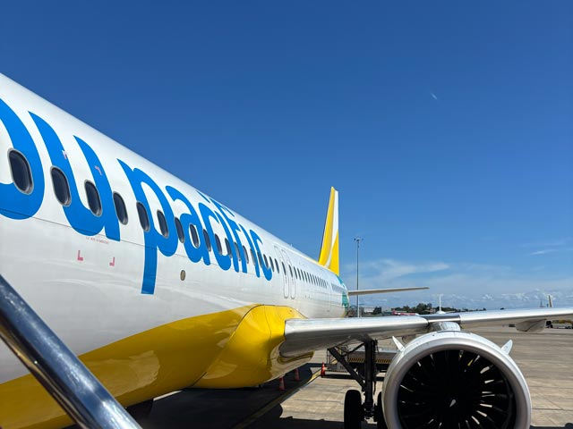

AIの進化は、私たちの働き方を根底から揺さぶっています。日本に一時帰国した数日間で、私はその現実を痛いほど目撃しました。  

2024年度の調査では日本のAI導入率は **26.7%** にとどまりますが、「ものづくりの国」である日本にとって、この浸透速度は決して無視できません。IT業界に身を置く私自身、このまま立ち止まれば、加速するAIの荒波に一瞬で飲み込まれてしまうだろうと直感しました。  

ここで突きつけられる二択は残酷です。  

- **レッド・オーシャンで溺れるか**  
- **疲弊しながら泳ぎ続けるか**  

<msg txt="でも私は、そのどちらでもない <strong>第三の道</strong> を選びたい。"></msg>

テクノロジーを賢い盾にしつつ、人間らしくのびのびと泳げるブルー・オーシャンを模索したいのです。  

本記事では、ここ数年のAIの進化とフィリピンの現場で直面している課題、そして一人の人間として、エンジニアとして **「これからどう生きていきたいか」** を綴ります。

## 資本主義の繰り返し

ここで少し、オフショア開発の実情について。  
維持費や人件費の安い場所でシステムを作るこのモデル、かつては中国、現在はベトナムや、私の住むフィリピンがその主戦場となっています。  

この構造を語るうえで避けて通れないのが、マルクスが著した『資本論』の考え方です。  
*聖書の次に読まれている*とも称されるこの古典で、彼は **「余剰価値」** という仕組みを解き明かしました。  

ざっくり言うと、労働者が生み出した価値のうち、自分の給料分を超えた *「残り」* が資本家の利益になるという仕組み。東南アジア諸国は、先進国から流れる外貨を稼ぐことで成り立っています。安くプロダクトを提供しても、低い人件費というコストがある限り、そこには莫大な **余剰価値（＝利益）** が生まれやすいわけです。  

あえて聞こえの悪い表現をすれば、そこには典型的な **資本主義の搾取構造** が存在します。  
約150年前にマルクスが目撃した、工業化の波に乗る資本家と、馬車馬のように働かされた労働者。あの構造が、今もなお、形を変えて繰り返されているに過ぎません。  

しかし今、AIの台頭によって、その *「搾取する側・される側」* という構造そのものが根本から崩れようとしています。  

顕著な例は、米セールスフォースの動向です（[米セールスフォースが1000人余り削減、ＡＩ販売要員は採用－関係者](https://www.bloomberg.com/jp/news/articles/2025-02-04/SR4ULZDWLU6800)）。  
AIが発達したから **人員はもう不要** とばかりに大規模なレイオフ（解雇）が断行されました。

身近なところでも、過剰な人員削減を迫られた知人のオフショア会社が、親会社にM&A（吸収合併）されようとしています。  

かつてパソコンが一般企業に導入された時のような変革——いや、それよりも **遥かに巨大で破壊的な地殻変動** が、今まさに起ころうとしているんです。  

### AIの利便性と人間の限界

先日、日本での勉強会、[Web Touch Meeting #125](https://ginneko-atelier.com/blogs/entry560/) に登壇した際、別のセッションで衝撃的な言葉を耳にしました。  

<card slug="entry560"></card>

> たった3秒の音声があれば、その人の声を再現できる

想像してみてください。  
たった3秒で個人の口調を習得し、*人間の脳とは比較にならない**膨大なデータベース**から、瞬時に**的確な回答を引っ張り出す***。  

現在、フィリピンにおいてコールセンター業務は主要な外貨獲得源です。  
でも、この技術が浸透したとき、「人間」というリソースは本当に必要とされるんでしょうか？  

生身の人間の記憶は曖昧だし、検索にも時間がかかる。感情のバイアスがクレームを招くことだってある。  
一方で、**AIなら24時間365日、傷つくこともなく、常に客観的で的確な返答が可能**。もし私が経営者なら、迷わずAIを採択します。  

古参のエンジニアの中にこんなことを言う人もいます。

> *AIはまだ使い物になるコードを書けない*

私はそれ、時間の問題だと確信しています。ミスを繰り返すジュニア・エンジニアを育てるコストを考えれば、AIを使いこなす方が「効率」の面では圧倒的に正解だからです。  

もはや、生身の人間が「正確さ」や「速度」という土俵でAIに抗うことは、**どうあがいても不可能**な領域に達しつつあります。  

## IT業界の未来：これから起こるであろう、より熾烈な価格競争

資本主義の観点から見て、IT業界は今後さらに過酷な価格競争が起こると予想しています。  

3年後か、5年後か。  
正確な時期は分かりませんが、ただ「手を動かすだけ」の仕事は、間違いなくこの世界から消えていくでしょう。  

ここで、私の本音を激白します。  

<msg txt="私は正直、この資本主義の在り方に「うんざり」してます。"></msg>

ITとは関係ありませんが、資本主義の典型といえばファストファッション業界。大量生産、大量販売、そして大量廃棄。  
「せっかく作ったものを、ただ捨ててるじゃん（笑）」——そう失笑したくなるような現実が転がっています。  

たくさん作らなきゃ利益が出ない構造のせいで、地球の資源を際限なく食いつぶしている。利益だけを盲信的に追求した結果、もはや「何でもあり」の様相です。  

自国では法律に守られ解雇できない労働者であっても、海の向こうのオフショア会社なら、責任を負うことなく簡単に切り捨てられる。そんな冷たい力学が働いています。  

そして今、人間よりも正確で、スピードがあり、何より「使用料」が圧倒的に安いAIが、人間の知的労働を奪おうとしている。  

今後はさらに安く、それでいて質の高いサービスが次々とローンチされるでしょう。「作業」だけを売りにしている人は、今すぐ覚悟を決めて、この激震に備えておく必要がある。そう強く感じています。  

## 競争の波に呑まれず、どう上手に付き合うか？を考えてみる

では、この熾烈な価格競争の中で、私たちはどう生き残ればいいのか。  

### 戦わないこと ＆ 上手に使うこと
AIは残念ながら **我々と比べ物にならないほど優秀** です。  

無理に最後の一人になるまで意地を張る *「ラスト・モヒカン」* になる必要はありません。むしろ、この圧倒的な力を利用しない手はないんです。  

> **ラスト・モヒカン（映画）**  
> 18世紀半ばのアメリカ植民地時代、先住民モヒカン族の生き残りホークアイが、英国軍大佐の娘たちを救うために戦う物語を描いた名作。  

生身の人間の記憶には限界があります。  
コードを書いていてもメソッドを思い出せないことなんてザラ。でも、AIを相棒にすることで、**わりかし簡単に自分の能力の限界を超えることができる** と最近確信しています。  

ただ、幸いなことに **「アイデア」の種** はまだ人間が握っています。  

だからこそ、ただ言われた通りに *「手を動かすだけの人」* にならなければ、我々には十分に生き残る道があります。  

AIを利用するイメージを表現するなら、**自分の脳のメモリを拡張したり、強力なプラグインをインストールする**、 です。  
AIに振り回されるのではなく、意志を持って使いこなす。そうすれば、この変化は私たちを、もっと自由に、幸せにしてくれるツールになるはずです。  

## 2026年、セブ島で実践する「3つの共生術」

セブで薄々感じていたことが、日本への一時帰国を経て **「確信」** に変わりました。  
ここからは、私がこれから具体的に実践する「3つの共生術」を共有します。  

### 1. AIを「相棒」にして開発を試みる
まず、AIをフル活用して **「一人でどこまで開発できるか」** を徹底的に試してみようと考えています。  

大切なことなので繰り返しますが、**アイデアの種を持っているのは人間です。** なぜなら、AIは「過去のデータベース」からしか学べないから。  

日々の生活で感じる「不便」や「不快」、それを解決した時の「快適感」。これらはすべて、**生身の人間の感情** から生まれるものです。  

かつて人間は、「歩くの面倒くさい。じゃあ馬に乗ろう」と、己の欲求を原動力に進化してきました。根底にあるのは **「誰かの役に立ちたい」という他者に寄り添う気持ち** です。  

こうした切実な *「解決策」* を導き出せるのは、感情を持つ人間にしかできない特権です。AIという最高の相棒と、人間のアイデアだけでどこまで遠くへ行けるか。  

ちなみにこれ、**背水の陣** です。  
あとには引けなくなるよう、あえてここで宣言しておきます（笑）。  

### 2. 実践：「手仕事」というエシカルな営み

これは個人の活動になりますが、AIには決して真似できない **「手触り」や「想い」を価値にする営み** も始めます。  

根底にあるのは、父の教えです。  
戦後物のない時代に生まれた父は、よくLINEで **「物を大切にしろ！」** と連絡があります。  

私がなぜ「大量廃棄」などの資本主義に疑問を抱いていたのか。その答えが、ようやく分かった気がします。  

具体的には、古い着物の端切れや洋服をリメイクして、シュシュ（ヘアタイ）などを作ること。あるいはマニラ麻（アバカ）など素材にこだわり、編んでなにかを作ること。  

この日本滞在中に、試しに作ったニット帽（ウール100％）があります。2週間の滞在で3つの帽子を完成させることができました。  
後で解いて再利用しやすいよう *「伏目（ふせめ）」* で閉じました。  

また、実家で見つけた着物や古布の端切れを持ち帰りました。  

中には亡き祖母の **オートクチュールの残布**。週末、手縫いでシュシュにしてみたら、たった30分で完成しました。  

……少しだけ余談を。  
私は良い靴を修理して履き続けるタイプでしたが、先日、ヒールの修理代が **3,000円以上** かかると言われました。昔は1,000円程度だったのに。  
これでは、ファストファッションで売っている靴を買うほうが安上がりになってしまいます。  

*修理したい人が減る → 需要がなくなる → 職人が消えていく*

そんな **負の連鎖** が、すぐ目の前まで来ている。  
古来、日本には「八百万の神」という考え方がありました。

<msg txt="行き過ぎた利益追求の果てに、物を使い捨てる現代の姿を見て、私たちの祖先は今、どんな想いだと思いますか？"></msg>

あなたには、その姿が想像できますか？  

### 3. 既存のビジネスの再定義

自分の生き方を見つめ直すと同時に、既存の仕事も **「再定義」** することにしました。  

昨年の体調不良をきっかけに、筋トレ、瞑想、お酒の制限など、徹底的に自分を律するメンタルづくりに励んできました。NetflixやSNSの流し見など、本分を妨げるものはやめました。  

そうして見えてきたのは、**「私はなぜ、この国（フィリピン）にいるのか？」** というシンプルな問いでした。  

<msg txt="答えは明白。そこに <strong>ビジネス</strong> があるからです。"></msg>

実を言うと、弊社にはこれまで具体的な経営理念がありませんでした。  
しかし、人生を立て直す過程で出会った **「禅」** や老子の思想が、私の背中を押してくれました。  

  
[lenz-ph.com](https://lenz-ph.com)  

* **足るを知る**
* **今、ここに集中する** 
* **他者に寄り添う** 
 
これが、新たに定義した会社の根幹です。  
「核」がないと、お金が足りないと感じた瞬間に人は焦り、溺れます。かつての私のように。だから、私はそういう「逃げ」をやめました。  

私の人生において、何より大切なのは **「人」** です。

見積もりを出した際に

*「高い。相場と合わない」* 

と言われることがあります。こういう時に限って、相当安い価格を要求されることがあります。

ここで目先の売上のために値下げをするか、価値観の合うクライアントを探すか。  

もし前者を選べば、Web制作業界に蔓延する **「搾取の連鎖」** に自ら飛び込むことになります。  

* **「なぜ、お金を出すほうが偉いのか？」** 
* **「なぜ、作り手はこれほどまでに安易に搾取される側へ回ってしまうのか？」** 
ビジネスパートナーとも、この価値観の違いで小競り合いがありました。

<msg txt="<strong>私自身が搾取される側に回っていた</strong> と気づきました。"></msg>

私はもう、そこに甘んじるのはやめました。これからは、**「どんな人と仕事をするか」** を真剣に選びます。提供するサービスそのものは変わりませんが、クライアントのビジネスに真摯に寄り添う **「伴走者」** であることに、全精力を注ぎます。  

マインドを、完全にアップデートしました。  

## まとめ：奪い合うのではなく、育む未来へ

フィリピンに来てから、違和感がありました。パンデミック中、その原因が搾取の構造と知り、憤りを感じていました。  

<msg txt="でも、もう「怒り」を原動力にするのはやめます。怒りは <strong>精神を消耗させるだけ</strong> だから。"></msg>

私は、怒りに燃える代わりに「育む」ことを選びます。自分と大切な人たちが一緒に幸せになれるよう、まずは小さな実践から始めます。具体的には、以下の**三つの共生術**を軸に動きます。

1. **AIを相棒にする**  
   アイデアは人間が持ち、実行力はAIで補う。AIを使って一人でできる範囲を広げ、価値のある仕事に集中します。

2. **手仕事というエシカルな営みを続ける**  
   物の「手触り」や作り手の想いを大切にする活動を続けます。古布や地元素材を活かしたものづくりで、循環と価値の再生を目指します。

3. **仕事の定義を再考し、誰と働くかを選ぶ**  
   目先の利益に流されず、価値観の合うクライアントや仲間と伴走する。搾取の連鎖に加担しない働き方を優先します。

挑戦してみてうまくいかなければ潔く撤退し、別の道を試します。

**人生は短い**。

志を全うするためには、前進だけでなく撤退も戦略の一つです。  

この記事が、あなたのこれからの選択にとって小さな助けになれば幸いです。

最後までお読みいただき、ありがとうございました。

