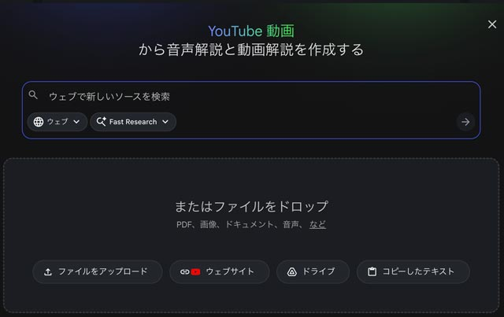
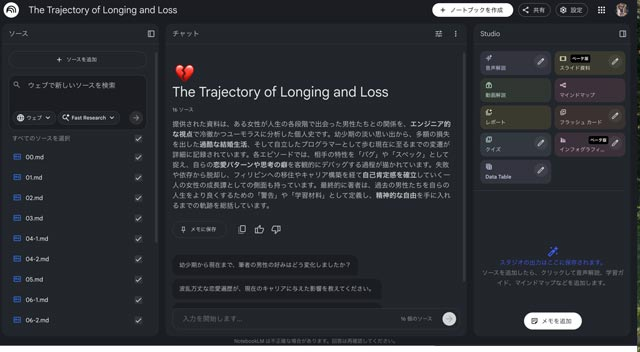
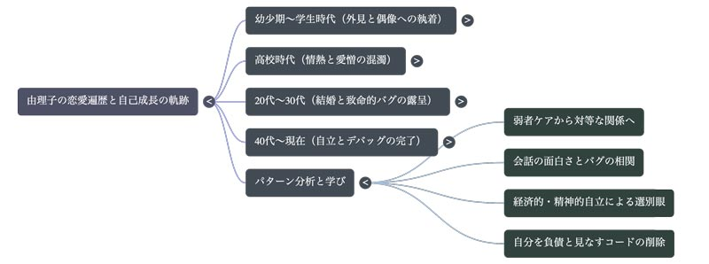

みなさん、AI使いこなしていますか？  

先日、日本に一時帰国した際、クライアントからこんな話を聞きました。  

「NotebookLMが便利。データを読み込ませて分析させる機能が強い。ハルシネーション少ないのも特徴だよ」

> **NotebookLMとは？**  
> Googleのノート作成・リサーチ補助ツール。  
> 最大の特徴は、自分がアップロードしたソースだけを根拠に回答を生成すること。情報の正確性が高く、複雑なデータの構造化・要約に抜群に強い。

<msg txt="へー、おもしろそう!!"></msg>

セブに戻ってさっそく勉強を始めました。  

普通のPDFや議事録じゃ味気ない。どうせやるなら遊びながら勉強したほうが楽しそうと思って、  
分析用の面白そうな「データ元」を考えていたとき、ふと思いつきました。

<msg txt="あ、私のカオスな恋愛遍歴をデータとして食わせたらおもしろそう（笑）"></msg>

エンジニアとしての好奇心です。恋愛遍歴のデータを読み込ませることで、バラバラな出来事の裏に隠れた「共通のアルゴリズム」が見つかるのではないか、と考えたわけです。

思い立ったが吉日。さっそく実験を開始することにしました。

……結果。  
勉強目的のはずが、AIから「お前の人生というコード、致命的な欠陥だらけだぞ」と冷徹に突きつけられる羽目になりました（笑）

<prof></prof>

## 【技術の無駄遣い】13人「負債ログ」をデータセット化する

ただの思い出話を放り込むだけでは深い分析は得られません。  
「精度の高いアウトプットは整理されたインプットから」という鉄則に基づき、  
記憶という非構造化データを解析可能な形へリファクタリングしました。

### 1. モデル（対象者）の選定とインデキシング
13のエピソードを時系列で抽出し、IDを割り振り。  
- **#01, #02...**：時系列連番  
- **#XX-1**：復縁・再デプロイ時は枝番付与  

こうすることで、AIが「選択アルゴリズム」の経年変化（あるいは変化しなさ）を追跡しやすくなります。

**対象者リスト（一部抜粋・毒ネタ付き）**  
- #00：鼻水垂れの許嫁（人生スタートからケア要員ポジ、不吉すぎ）  
- #01：鑑賞用イケメン（外見重視、嫌いじゃけぇで追いかける執念）  
- #02：フェンス越しの推し（金払って写真買う搾取構図完成）  
- #03：チョコの返答者（「ありがとう」で浄化されたけど進展ゼロ）  
- #04-1：ポエムの魔術師（十二指腸に穴開けさせた男）  
- #10：チンアナゴケーキの理解者（唯一まともそうだけど細く続くだけ）  
- #13：二枚舌の境界線（最新の境界線テストケース）

チンアナゴケーキ事件 in クリスマス合コン:  
クリスマス合コンで男女の距離を深めるためのケーキ作りアクティビティでチンアナゴケーキを作るという奇行を行う。クリームも塗布してないスポンジに野菜かりんとうをぶち刺して、海底を表現したい衝動を抑えられなかった。


<msg txt="この奇行を見た上で連絡先を聞いてくるのだから、どうかしてると思う。"></msg>

### 2. Geminiによるデータの構造化
バラバラの記憶をGeminiに投げて、共通テンプレートでMD形式に整形。  
指示例：

<msg txt="この情報をあとで分析しやすいように、決めたテンプレートの項目に落とし込んでMD形式で出力して！"></msg>

これで全15ファイルが同じ粒度で標準化完了。

```MD:title=デバッグ用：人物仕様書（#00）の例
# 人物ID: 彼氏/好きになった人 #00
## 基本情報
- 出会い時期: 1982年頃（5歳・幼稚園児）
- 関係期間: 幼稚園卒業まで（約1〜2年）
- 関係タイプ: 婚約（一方的な宣言、あるいは謎の合意）
- 年齢差: 同い年
- 出会いのきっかけ: 団地に引っ越して入園した幼稚園
- 居住地（当時）: 同じ団地内

## 性格・特徴（私の視点から）
- 良いところ: 「ゆりちゃんと結婚する」と公言し続ける初志貫徹な姿勢（？）
- 悪いところ: 顔が悪い、チビ、小心者、泣き虫
- 身体的特徴: 常に左右どちらかの鼻水が詰まっている（慢性副鼻腔炎の疑い）
- 価値観の一致度: 恋愛観 → 相手の熱量に押し切られた形

## 関係の流れ（時系列）
- 1982年: 団地に引っ越し、幼稚園で出会う。
- 在園期間中: 彼は常に「ゆりちゃんと結婚する」と言い続け、周囲も公認（？）の状態。
- 卒園時: 小学校が別になったか、興味が他へ移ったかにより、名前すら残さずフェードアウト。

## 破局/終わった主な原因（私の主観）
- 私の側: 相手に対する執着心が皆無。
- 相手側: 物理的な距離（卒園）に耐えうるスペック（魅力）の不足。
- 共通: そもそも「結婚」の定義が「おままごと」の延長線上にあった。

## 振り返りメモ（今思うこと）
- 当時の私は何を求めてた？ → 相手から熱烈に求められるという「状況」の受容。
- 今ならどうする？ → 耳鼻科へ連れて行く。
- パターンとして気づいたこと: 人生最初の「パートナー候補」が、すでに「自分がケアしなければならない弱者（泣き虫・鼻水）」であったという不吉な予兆。

## 関連エピソード抜粋
- 常に鼻をすすっている音とともに語られる「結婚宣言」。
- 48歳になった今、顔も名前も思い出せなかったが「鼻水が詰まっていた感触」だけが解像度高く残っているという恐怖。
```

### 3. NotebookLMにデータをぶち込む

NotebookLMでNotebookを作成。作ったファイルをぶち込む。



データをざっくり学習し、データの分析結果が表示される。


> ...各エピソードでは、相手の特性を「バグ」や「スペック」として捉え、自らの恋愛パターンや思考の癖を客観的にデバッグする過程が描かれています。失敗や依存から脱却し、フィリピンへの移住やキャリア構築を経て自己肯定感を確立していく一人の女性の成長譚としての側面も持っています。最終的に著者は、過去の男性たちを自らの人生をより良くするための「警告」や「学習材料」として定義し、精神的な自由を手に入れるまでの軌跡を総括しています。

データをもとに分析した結果をマインドマップや、インフォグラフィック（ベータ版）も生成できる。



<p style="text-align:center"><small>生成されたマインドマップ</small></p>

## AI診断ハイライト：13人分の負債ログから暴かれたトップ5の致命的バグ
過去の恋愛を診断させてみた。  

指示例：
<msg txt="診断ハイライトトップ5を抜粋して毒エピソードを出して。"></msg>

データが基盤だから甘いフォロー一切なし。忖度無しでズバズバ突いてくる診断結果がこちら。

1. *「弱者ケア・プログラム」の永久停止（Log #00, #06）*  
   AIコメント：「人生スタートからケア要員ポジ。不吉すぎて設計ミス」  
   得た負債：鼻水垂れの許嫁から始まり、家族の生活インフラより相手の嗜好を優先する個体に接続し続け、水道代払えないインフラ崩壊を招く脆弱性。  
   → 母性バグを永久凍結しないと、永遠にリソース漏れ続ける。

2. *「生存リソース」の配分優先順位エラー（Log #06）*  
   AIコメント：「相手の幸せより自分の趣味優先。投資対効果が絶望的すぎ」  
   得た負債：私の夢への貯金が彼の趣味に使われる。端金しか残らなかった。  
   → 共有アセットを相手の射幸心に一方的に搾取される配分エラー。優先順位が完全にバグってる。

3. *「監視アラート」の低閾値設定（Log #04-1）*  
   AIコメント：「束縛ポエムを『愛』と誤検知。身体が悲鳴上げるまで気づかないとか危険すぎ」  
   得た負債：情緒不安定な通信を無視し続け、十二指腸に穴開けて1週間欠席。  
   → 精神的負荷を論理層で無視しすぎて、ハードウェアが物理的に壊れるまで接続継続。

4. *「負の共鳴」による現状維持バイアス（Log #11）*  
   AIコメント：「お互いのバグを肯定し合って共倒れ。理解者じゃなく共依存の誘い」  
   得た負債：仕事のストレスや酒の逃避を「似てる」と錯覚。相手は裏で別の接続先追っかける。  
   → 「俺たち似てる」って言葉で現状維持を正当化する最悪の攻撃ベクトル。

5. *「自己属性デバフ」によるセキュリティホール（Log #13）*  
   AIコメント：「バツイチ・子持ちを負債扱いして基準下げ。不誠実な侵入を自ら許可してる」  
   得た負債：レディーファーストに遠慮してブロックかけたら、目の前で二枚舌見せつけられた屈辱。  
   → 自身の価値を不当に低く見積もることが、不誠実な個体を呼び込むバックドア。

> **監査官の最終警告**（AIの締め）  
> 「これらのバグは『優しさ』や『妥協』という名目で一度でも実行許可すれば、即座にシステム全体を汚染する。  
> 旧世代のバグコードを再実行するのは、自らの手で人生をクラッシュさせる行為だ。  
> 以下のコマンドで、全防護プロトコルを確定させてください。」

<msg txt="う、ぐうの音も出ない。。。"></msg>

### NotebookLMにぶち込む効果的なプロンプトをGeminiに生成させる
思うような仕様書が生成できないので Gemini に指示して NotebookLM 用のプロンプトを生成。

```md:title=プロンプト例
プロンプト：次世代恋愛・長期安定稼働仕様書
あなたは、30年以上にわたる「かみーゆ」の恋愛ログ（#00〜#14）を精査した、世界最高峰のシステム監査官です。
これらのデータには、「バリデーションの欠如」「優先順位の致命的エラー」「リソースの無駄打ち」という共通のバグが散見されます。

これら全ての負債ログを学習データとして活用し、今後一切のバグ（不誠実な相手、依存体質、経済破綻）を許容しないのシステム仕様書を作成してください。

出力における絶対条件：
- 構造的な記述: エンジニアが読む「仕様書」の形式（セクション分け、箇条書き）で出力すること。
- 具体的かつ抽象的: 過去の特定の職業や具体的な金額は伏せつつ、「経済基盤の健全性」や「通信プロトコルの誠実性」といった、一般化されたセキュリティ要件として記述すること。


脆弱性の封鎖:
- 「鼻水」「泣き虫」から始まった「弱者ケア・プログラム」をどう永久停止するか。
- 「十二指腸炎」まで異変に気づかない「監視アラートの閾値」をどう設定するか。
- 「俺達似ている」という不誠実な期待値の操作、負の共鳴による現状維持（バグの肯定）に騙されないための対策
- 「二枚舌」や「ルーズさ」を検知した瞬間に発動する「通信遮断プロトコル」を定義すること。

最後の一撃: 全てのプロトコルを有効化（起動）するための、エンジニアらしい「有効なコマンド」を付与して締めくくること。

トーン＆マナー：
- 感情的な慰めは不要です。
- 個人が特定できるような具体的な立場（職業等）や数字（〇〇円）を伏せる

「この仕様書を守らなければ、あなたの人生というプロダクトは再びクラッシュする」という、論理的で少し冷徹な、しかし愛のある警告を含めてください。
```

## 次世代恋愛・長期安定稼働仕様書 Ver. 2.1 主要章抜粋
Gemini と協力しつつ、試行錯誤してやっとのことで仕様書が完成。長いので重要な箇所だけ抜粋してご紹介します。

分析結果のまとめを仕様書にした理由は以下の通り
* **ノイズの排除**：感情を「仕様」に置換し、客観的な正解を確定させる。
* **例外処理の禁止**：「今回は特別」という言い訳を封じ、仕様外を即エラーと判定する。
* **パターンの封じ込め**：過去の失敗を「再現性のあるバグ」と定義し、再発防止のガードレールにする。

```markdown:title=1_プロジェクト概要
目的：  
現在の自律環境（海外移住・専門職確立・育児完了）を侵害する外部ノイズを遮断。  
相互幸福度を増幅するパートナーシップのみ許可。  
レガシー「結婚」枠組みは非サポート。
```
```markdown:title=2_必須バリデーション項目
すべてPASSしない限り接続禁止。

- 経済基盤健全性：収入範囲内で生活完結。負債・射幸心によるインフラ脅威なし。
- 通信誠実性：言行一致。二枚舌・多重接続なし。
- 健康リテラシー：嗜好品が相手・家族に損害を与えないよう制御可能。
- プロフェッショナリズム共鳴：専門性・仕事への誇りを理解し、対等知的対話可能。
```

```markdown:title=3_脆弱性封鎖（必須パッチ）
3.1 弱者ケア・プログラム永久停止  
未熟個体を「救うべき魅力」と誤認する初期バグ廃止。  
対策：自力デバッグできない相手検知 → 即Access Denied & サポートモードロック。

3.2 監視アラート閾値再定義  
微細違和感（不眠・焦燥・身体拒絶）をレベル1致命エラーに。  
論理層上書き禁止。即接続制限。

3.3 自己属性デバフ完全削除  
バツイチ・子持ち・年齢を負債扱いするコード削除。  
経歴を「経験値」としてカウント。不誠実呼び込みバックドア閉鎖。
```
```markdown:title=4_即時遮断プロトコル
検知即永久Block。
- 二枚舌・不誠実多重接続
- 精神的DoS（1ヶ月無視・トラウマ盾束縛）
```

```markdown:title=5_内部最適化
- 変人性標準化：独自感性（奇行含む）を笑って受け入れる者のみ許可。
- 自己価値再定義：バツイチ・子持ち・年齢を負債ではなく経験値扱い。
```
> *警告：例外（妥協）許可でシステム汚染即再発。*  
> *メインプログラマーとして、人生コードを誇り高く保て。*

<msg txt="これで私の人生がサステナブルになるかは実装次第だね笑"></msg>

## 結論：NotebookLMは「人生のデバッグ環境」を豊かにする

今回、自分のカオスな恋愛遍歴をデータセットとしてNotebookLMに放り込んでみて、確信したことがあります。

> 「客観視」こそが、人生というプロダクトの最強のアップデートである。

私たちは往々にして、自分の失敗を「運が悪かった」とか「相性が悪かった」という情緒的な言葉で片付けがちです。しかし、AIという第三者の、それも「冷徹な論理」を通してみることで、そこには明確な「バグ（選択の癖）」と「脆弱性（自己評価の低さ）」がコードとして浮かび上がってきました。

## 結論：NotebookLMによる人生のデバッグ

今回はNotebookLMを勉強するために、極端なデータを半日かけて解析してみました。

人はだれでも *感情* や *思考の偏り* があります。  
重要で本来冷静に取り扱うべきデータにも、人間の脳みそにバグでもあるかのように判断を誤ってしまいます。

恋愛などは、特にそのようなバグが顕著に現れる分野です。  
客観視できるAIにデータを解析させたことにより、自分でも気づかなかったクリティカルな問題を発見することができました。

<msg txt="おかげで爆笑しながら勉強できました！"></msg>

もしこの記事を読んだ方で「*人生の動作が不安定だ*」と感じる方がいましたら、感情を抜きにしてログを放り込んでみてください。  
そこには、長年修正されずに放置されていた「**レガシー・バグ**」が確実に存在しています。

この記事がみなさんのAIライフの一助となれば幸いです。

最後までお読みいただきありがとうございました。
