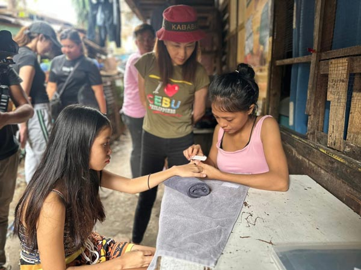
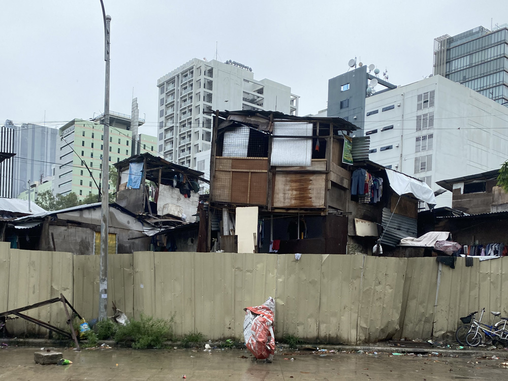
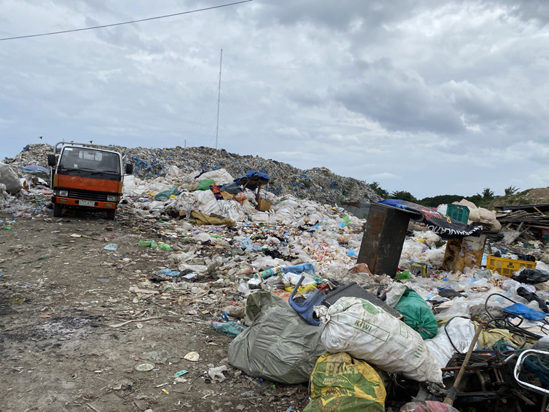
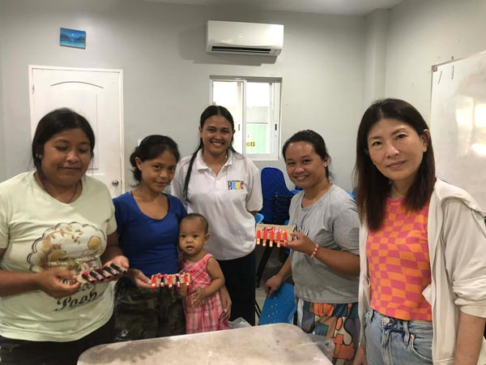
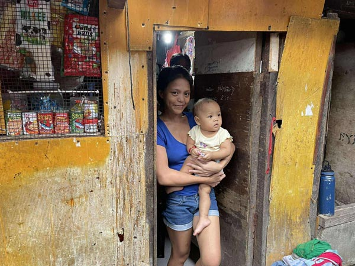
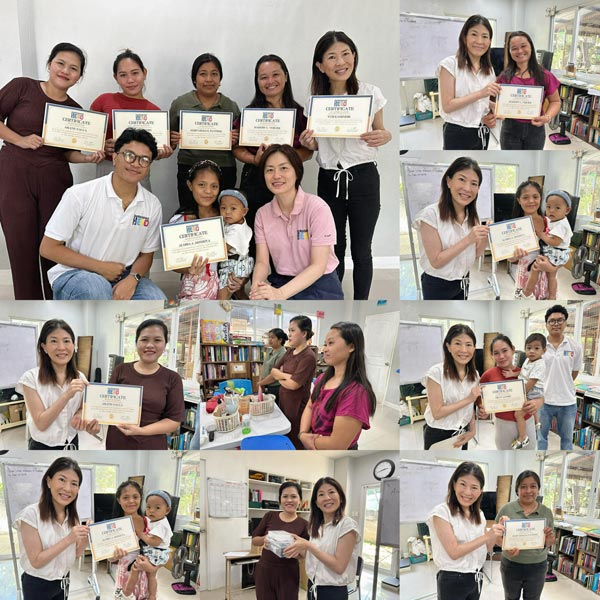
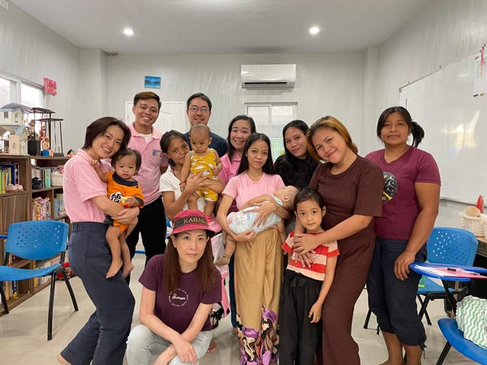

> 日本人の私は、あなたたちの状況や心境を理解したなんて、とても言えません。  
> **日本人の貧困なんて、たかが知れてるから。**

認定NPO法人「[DAREDEMO HERO](https://daredemohero.com/)」にて、半年間にわたるネイル講習の講師を務めました。  

かつて日本でネイル講師をしていた経験から声をかけていただいたのがきっかけです。理事という立場を超え、一人の「技術者」として、過酷な環境に身を置く彼女たちと向き合う日々が始まりました。  

そこで改めて突きつけられたのは、私自身の過去の苦労が「贅沢」に思えるほどの、*圧倒的な貧しさ*でした。

<prof></prof>

## フィリピン・セブ島の裏側。「スラム街にすら」住めない彼女たちの日常

<msg txt="フィリピン・セブと言えば、何を思い浮かべますか？"></msg>

多くの人が「*フィリピン・セブ ＝ 青い海のリゾート*」を思い浮かべるはずです。私が暮らすセブシティのITパークから、車でわずか20分も走れば、豪華なビーチが広がっています。

ITパークはセブを代表するビジネス街ですが、すぐ隣にはトタン板一枚を隔てて、貧困層が暮らすスラム街が広がっています。

そして、一般的な「スラム街」にすら住むことができない人たちがいます。墓地や、ゴミ集積所。日本人の想像を絶するような場所が、彼女たちの **「家」** なのです。

私がネイルを教えたのは、10代で出産を経験した女性たち。20代でも体は小さくやせ細り、どう見ても10代にしか見えないママもいれば、すでに30代になったママもいます。中には、ジプニー（乗り合いバス）を2時間乗り継いで通う訓練生もいました。

### 10代で出産を経験した女性たちの日常

彼女たちが生きる世界は、私たちが想像する「不景気」とは次元が違います。

* **ゴミ集積所**: 数ペソのために一日中ゴミを漁る。
* **墓地**: 墓守の傍ら、ロウソクの燃えカスを集めてリサイクル販売する。
* **農村部**: 一世帯の農業収入は、月にわずか5,000ペソ（約13,000円）<small>※</small> 程度。
  <small>※ 2026年3月現在のレート。一世帯収入はDaredemo Heroの支援地区のを参考にしています。</small>

定職はなく、誰かの手伝いをして数百ペソをもらうことで、その日を繋いでいます。ほとんどの女性が、家庭の事情で義務教育すら満足に受けられませんでした。

切実な問題は、**子供の学費や医療費**です。フィリピンには公的な健康保険制度がなく、病気はそのまま「破産」を意味します。今回の訓練には、*「手に職を付けて、子供の学費や医療費を1ペソでも稼ぎたい」* という、切実な動機を持った女性たちが集まりました。

### 彼女たちは驚くほど明るい。笑いの絶えない教室

フィリピンは英語が公用語ですが、学校に通えなかった彼女たちの多くは、英語を話せません。授業はフィリピン人スタッフに通訳してもらいながらのスタートでした。

まずは「衛生管理」という、彼女たちには馴染みのない概念から教えました。現地の格安サロンでは感染症リスクが隣り合わせだからです。プロとして、消毒や病気の知識を徹底的に伝えました。

実技演習に入り、慣れない道具に苦戦する場面もありました。でも、彼女たちは驚くほど明るいのです。ミスをしても教室には笑い声があり、その様子に私の方が緊張を解きほぐされるほどでした。
## 絶望的な格差。日本人の貧困なんて「たかが知れている」と確信した理由

私の人生を軽く紹介します。20代でデキ婚をし、海外で働く夢を一度は断念しました。寝食を削ってネイリストになりましたが、子供の喘息をきっかけにその道も諦めました。

その後、職業訓練校を経てプログラマーとして再始動。子育てが一段落した時、40歳を過ぎてようやく、**海外で働く夢**を叶えました。

### 日本とフィリピンの貧困。安易に「気持ちが分かる」なんて言えない

今の私があるのは、決して一人の力ではありません。日本には、失業してもおカネをもらいながら学べる「職業訓練」があり、助けてくれるコミュニティがありました。私は、**恵まれた国のセーフティネット**に生かされてきただけなのです。

一方、彼女たちが直面する現実は、日本の想像を絶します。  
家族の状況が厳しいケースもあるそうです。

一人増えれば生活がさらに苦しくなる、そんな状況の中に彼女たちはいます。

かつて日本で弱者だった自分を救うつもりで講師を引き受けました。でも、考えてみてください。彼女たちの現状を *「同じだ」* とは、到底言えませんよね？

### 彼女たちは「人生を諦めていない」

彼女たちが学ぶ半年間。その時間をゴミ拾いに充てれば、数ペソの現金にはなります。その日食べるものに困る環境で、彼女たちは目先の数ペソより、 **「学び」** に時間を投資しました。

自らの意志で投資した時間を、意地でもおカネで取り返してほしい。その経験を、これからの人生の武器にしてほしい。

本当の「底」から這い上がろうとする彼女たちの心意気に寄り添えた時間は、私にとって大きな幸せでした。

## DAREDEMO HERO「女性の権利向上事業2025」

私が講師を務めたのは、認定NPO法人 DAREDEMO HEROが運営する「[女性の権利と健康衛生の向上事業2025](https://daredemohero.com/51654/)」です。

若年妊娠を経験し、経済的に苦しい中で母親になった彼女たちが、**「自分の人生」を取り戻すための活動**です。

* **健康教育**: 感染症予防や、自分の体と人生を守る権利を学ぶ。
* **技術講習**: ネイル技術から接客マナー、価格設定まで。
* **啓発活動**: 自らの経験を次世代へ伝える性教育セミナー。

半年間、彼女たちは幼い子を連れて教室へ通い、宿題と自習に励みました。目標は、技術を「1ペソ」に変える力を得ること。そして、**「自分にもできる」という自信**を掴み取ることです。

## 最後の授業：ゴミ拾いの数ペソを捨てて手に入れた「武器」

授業中、私は「おカネ」の話をしました。

現在、セブの最低賃金は<em>1日540ペソ</em><small>※</small>。ネイルの顧客を4〜5人こなせば、朝から晩まで拘束されて働く日給を上回るというロジックを白板を使って何度か説明しました。 <small>※ 2026年3月現在、中央ビサヤ地方の最高額</small>

それは単なる小遣いではなく、**生活のルールを変える大金**です。

<msg txt="半年間、ゴミ拾いの数ペソを捨てて投じた時間を、意地でも稼いで取り返しなさい"></msg>

修了式の最後、私はこの言葉を贈りました。

> **"Ain't no mountain too high, if you've got passion and grit to climb it."**  
> （登る情熱と根性があるなら、高すぎて越えられない山なんてない）

### 2026年の今：連鎖する小さな希望

劇的な逆転などありません。明日も過酷な環境は続いています。でも、彼女たちの目は「諦め」を拒絶し始めています。

事実、修了を待たずして自ら稼ぎ始めているメンバーがいます。彼女たちが手に入れたのは、子供の薬を買い、学校へ通わせるための現金を、自らの手で作り出す技術でした。

DAREDEMO HEROの活動は今、さらに広がっています。彼女たちが自らの経験を語る姿は、同じ境遇にある女性たちの心に、 **「若年妊娠の現実」と「変わるための勇気」** を届けています。

<iframe width="560" height="315" src="https://www.youtube.com/embed/ppwENJrfSfs?si=T6nS-wF8Z65Bl5Ff" title="YouTube video player" frameborder="0" allow="accelerometer; autoplay; clipboard-write; encrypted-media; gyroscope; picture-in-picture; web-share" referrerpolicy="strict-origin-when-cross-origin" allowfullscreen></iframe>

私はこれからもセブの片隅で、彼女たちが選び取った「これから」を応援し続けます。

## 結び：選べる幸運を、どう使いますか？

日本にいる私たちが持っているのは、**「選ぶことができる」という幸運**です。

蛇口をひねれば水が出る。病気になれば医療がある。学びたいと思えば教育の機会がある。これらは決して「当たり前」ではありません。

安易に同情することはできません。ですが、この世界の片隅に、ゴミ集積所の中から「自らの腕一本」で未来を掴もうとしている女性たちがいる。その事実を、*知るだけでも意味があります。*

もし、あなたが持っている幸運を、ほんの少しだけ「知ること」や「広めること」に使ってくれたら嬉しいです。

墓地の片隅から、新しい未来はもう生まれ始めています。

* **公式サイト**: [DAREDEMO HERO](https://daredemohero.com/)
* **Instagram**: [@daredemohero](https://www.instagram.com/daredemohero/)

DAREDEMO HERO代表の順子さん、タカさん、現場を支えてくれたレスリー、アーメル、ラッセル、そして日本人インターンのみなさま。このプロジェクトを共に走り抜けてくれたすべての方々に、心から感謝します。

