<msg txt="突然ですが、みなさん腸活してますか？"></msg>

海外生活 **8年目** 。セブ島は伝統的な食事より、ファストフードや缶詰などのジャンク食品が人気で、体にいいと言われるものはたいてい **お高め** です。

そこで手軽に腸活できないものかと模索した結果、ふと神が降りてきました。

<msg txt="よし、お酢を作ろう！"></msg>

このブログは、海外住みの日本人エンジニアが、お酢作り **3日目** にしてカビが生え、悔しさのあまり *NotebookLM* を活用しながら論理的思考をぶちまけて、 **1ヶ月** かけてお酢作りを成功させた執念のログです。

<prof></prof>

## なぜ手作りマザー入りお酢なのか？ 〜 BRAGG  が高くてエイヤーで始めた経緯 〜

私、普段から健康を考えてマリネやサラダにお酢を使っています。  
健康に気をつけるようになって以来、工業的に大量生産されるいわゆる、**蒸留酢** （*Silver Swan Vinegar*とか。 1リットル 50 〜 90ペソ 程度と安価）を使うのをなんとなく卒業。

<small>※ 2026年4月時点で1ペソ2.65円。</small>

ちょっと背伸びをして、 *Heinz* のオーガニックアップルサイダービネガー（スーパーで 500ペソ 前後）に切り替えました。

<msg txt="どうせならもっとしっかりマザー（酢酸菌）が入ったお酢はないかな？"></msg>

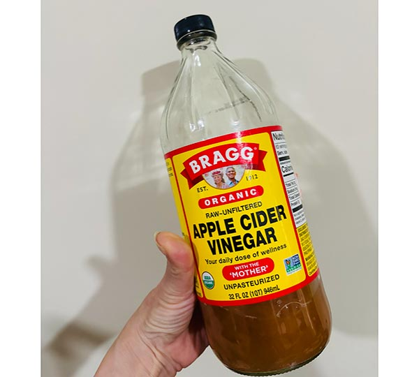

[利久](https://www.facebook.com/100093482852645/mentions/)

探した結果、最強のマザー入りお酢 *BRAGG* というメーカーが、低確率で近所の *Super Metro* に売っていることが発覚。早速購入しましたが、 946ml で **800ペソ前後（約2,000円超）** と地味におサイフ直撃。

セブ島でお馴染みの居酒屋「利久」の飲み放題（ 〜499ペソ ）より高い……。

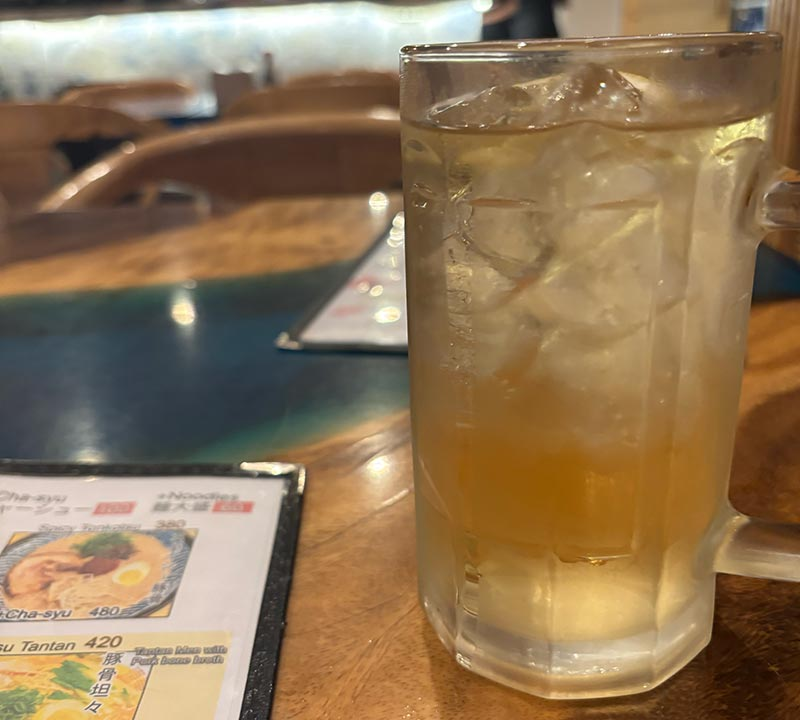

これは毎日使うには死活問題ですよね。とはいえ、 *Heinz* も *BRAGG* もやっぱり美味しいんですよね。

<msg txt="毎日の食事は大切。……よし、ちょっと作ってみようかな。"></msg>

### マザーってなんぞ？ そもそも栄養価は？

「マザー（酢酸菌母）」とは、お酢が発酵する過程で生まれる **膜** や **沈殿物** のこと。  
見た目は少し驚くかもしれませんが、これこそが「生きたお酢」の証です。

マザー自体の栄養素はそれほど多くありませんが、 **腸活・健康へのメリット** が凝縮されています。

  * **酢酸菌や酵母の塊:** 腸内環境を整える善玉菌（プロバイオティクス）としての役割。
  * **タンパク質や酵素:** 発酵の過程で生成される、消化を助ける微量成分。
  * **未濾過のパワー:** 市販の透明なお酢では取り除かれてしまう、発酵由来の栄養がそのまま残っています。

セブの新鮮な魚介を使ったマリネをよく作るのですが、お酢をマザー入りに変えるだけで **明らかにウマイ** 😋。

<msg txt="健康にいいのはもちろん、シンプルに『料理の格』が上がる。これが手作り最大のメリットかもしれません。"></msg>

### お酢ができるまでの 2段階ロードマップ
お酢づくりは世界中で親しまれている、もっとも身近な **自宅醸造** の一つです。セブでもココナッツやサトウキビを使った自家製酢がポピュラーだと聞きます。

お酢が生まれる仕組みは驚くほどシンプルでした。必要なのは 「*糖*」 と 「*酸素*」 、そして 「*適切な温度*」 だけ。

1.  **仕込み:** フルーツを水に浸し、野生の酵母や菌の力を借りる。
2.  **アルコール発酵:** 定期的にかき混ぜて酸素を送り込み、糖をアルコールに変える。
3.  **酢酸発酵:** アルコールが消失し、酢酸菌が元気に活動を開始。
4.  **完成:** 表面に厚い **マザー（膜）** が形成されれば、自家製お酢の収穫！

お酢づくりに最適な気温は **25 〜 30度** とされています。

## プロトタイプスタート！ 3つのトロピカルフルーツでお酢作り挑戦

複数の AI （ Grok や Gemini 、 Copilot など）に相談し、醸造に適したフルーツの方向性を探ります。

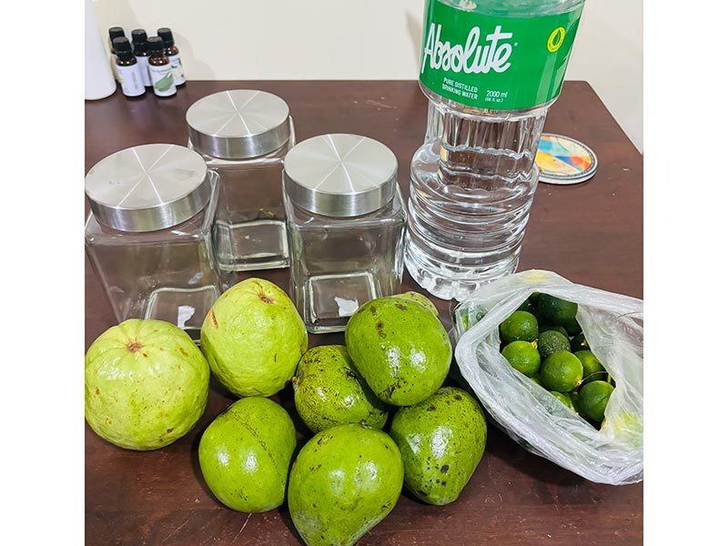

最終的に、インディアンマンゴー（真ん中）、グアップル※（左）、カラマンシー（右）の 3種 を選定しました。

<small>※ 別名アップルグアバ。グアバの改良種</small>

*【プロトタイプ構成】*
* **容器:** 750ml 容量の広口ガラス瓶 3つ 。洗剤洗浄および煮沸消毒済み。
* **水分:** 未開封のボトルウォーターを使用。
* **仕込み:** マンゴー 6個 とグアップル 1個 はミキサーで粉砕。カラマンシー 40個 は手絞り。農薬の可能性があるし、皮はすべて除去。念のため事前に重曹でつけ置きして洗う。
* **スターター:** 菌の活性を促すため、 BRAGG  のマザー入りお酢を大さじ 2 ずつ追加。
* **環境:** 瓶の口にキッチンペーパーを被せ、直射日光を避けるためキッチンの高所にある戸棚に格納。

<insta id="DVr4fgOgd5m"></insta>

AI から 1 〜 2回 の撹拌を推奨されたため、基本的には戸棚の中に収めっぱなしの状態でした。それでも翌日にはマンゴーとグアップルが激しく発酵し、ブクブクと泡立ち始めました。

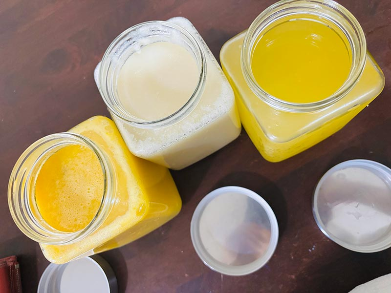

特にグアップルは、撹拌するたびにトロピカルな香りが部屋中に広がり、期待爆上がり。

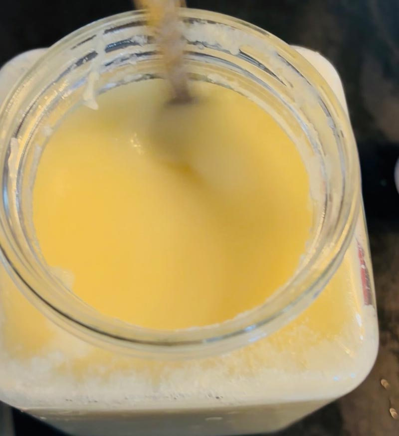

<msg txt="AI のガイド通りに進めていし、うまくいくに違いない!!"></msg>

根拠なくそんなことを確信していました。

### 無念のグアップル離脱。 3日目でカビが生えて大パニック

翌日、夕方の撹拌時に事件が起きました。グアップルの表面に、小さなワタのような物体を **2個** 発見。どう考えてもマザー（酢酸菌膜）ができるには早すぎます。

AI に状況を伝えると、表面にカビが生えるケースがあるとのこと。臭いで判断できるというアドバイスもありましたが……。

<msg txt="グアップルの香りが強すぎて全くわからんわい涙！"></msg>

さらに AI に対策を仰ぐと、提示されたのは以下の **2通り** の選択肢でした。

* **選択肢 A：廃棄**
    カビは目に見えない「根」を液体深くまで張っている可能性がある。
* **選択肢 B：継続**
    カビの部分だけを掬い取り、醸造を続行。発酵が進み、酸度が高まればカビを抑制できる。

香りの良さから期待がマックスだったグアップル。未練はありましたが、汚染された作品は残したくない。苦渋の決断を下しました。

結果、全量を廃棄。泣く泣くトイレに流しました。

<msg txt="さよなら……。大好きだったわ。"></msg>

カビが生えた瞬間の写真はありません。相当なショックで動揺し、記録を残す余裕すらありませんでした。

## エンジニア魂に火がついた瞬間。 NotebookLM に酢酸菌論文をぶち込んで本気モード突入

<msg txt="私にはお酢作りの経験はないけど、エンジニアリングとトライアンドエラーのスピリッツがあるじゃないか"></msg>

くよくよしていられないので、気を取り直して `NotebookLM` に専用のノートブックを作成しました。

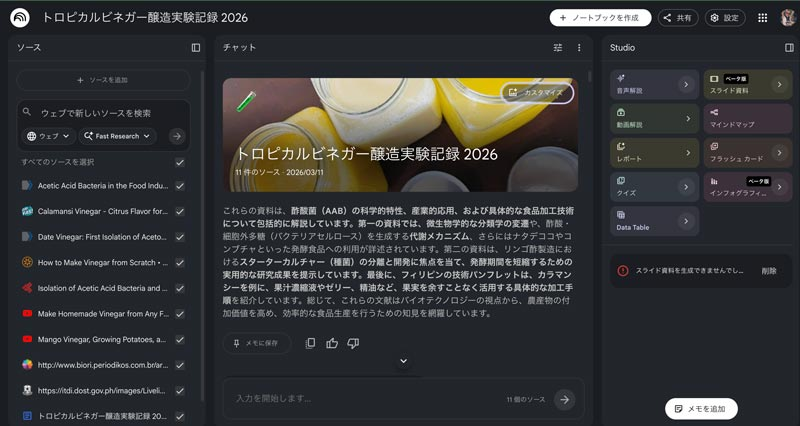

*投入したソース（エビデンス）*
* **学術論文:** 醸造プロセスや酢酸菌の特性に関する論文（ PDFやWebページ ）
* **実践知:** お酢作りに関する、再生回数の多い信頼できる Howto 動画（ YouTube ）
* **現地最適化:** トロピカルフルーツを使ったお酢作りの専門動画（ YouTube ）

さらに、ここ 3日間 の詳細な作業ログをマークダウンで書き起こし、コンテキストとして投入。

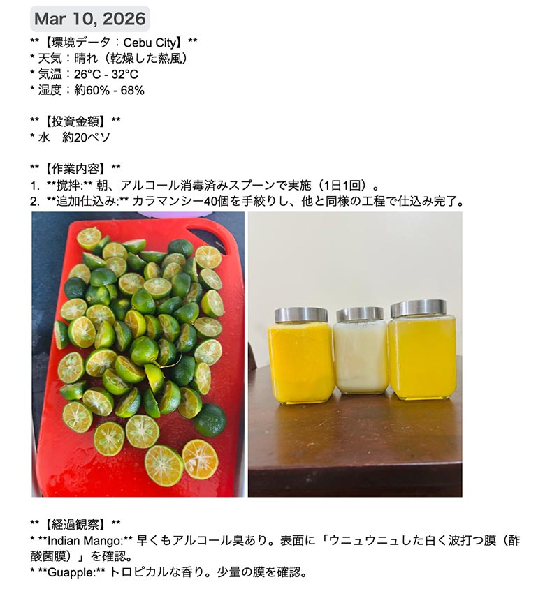

プロ顔負けの専門性と精度が高い情報、そして人気醸造家たちの経験を武装した **「 AI 先生」爆誕**です。

ログは発酵の様子だけではなく、目安になるよう気温だけでなく途中から内蔵テスター（味や香りの確認）も詳細を記録していきました。

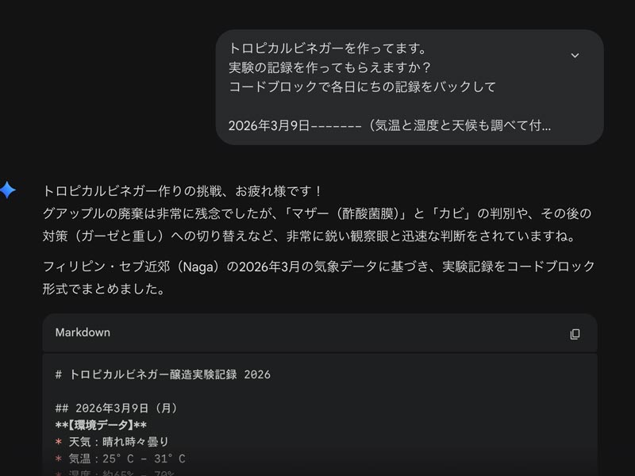

ログなんてまともに一から書くの面倒なので、書式を決め、テキトーな文章をGeminiに投げて下書きを書かせて、情報の過不足調整し、時短しました。

### NotebookLM のアドバイスに基づき、改善したプロトコル

廃棄したグアップル以外のボトルを守るため、刷新したプロトコルを即座に適用しました。

* **配置の変更:** 乾季のセブは最高気温が **30度** 超え。暖かい空気は高いところにこもるため、高所の戸棚は不利です。最も温度が安定する「床置き」に変更し、タオルで遮光するスタイルに切り替えました。
* **撹拌回数の増加:** 1日 2回 だった撹拌を **3回** に。浮いた果実を沈め、カビの発生リスクを物理的に排除します。
* **防塵・防虫の強化:** 粗いキッチンペーパーから、目の細かいコーヒーフィルターへ。口はヘアゴムできっちり密閉します。
  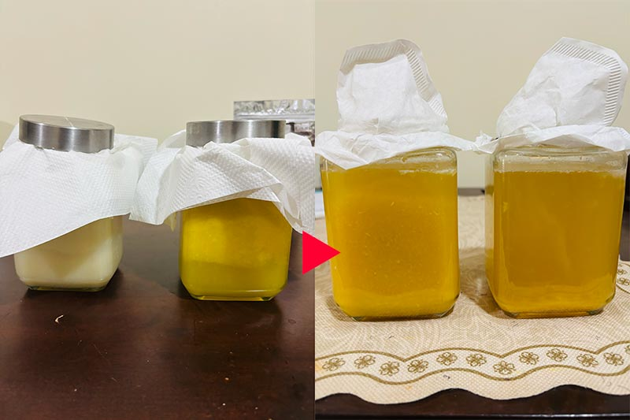

#### なぜグアップルだけがカビたのか？

NotebookLMの分析の結果、最大の原因は *果実が長時間空気に触れたこと*。  
繊維の多いグアップルは浮きやすく、発酵が始まるとガスに押し上げられます。

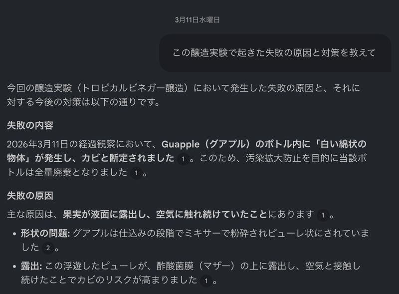

気温の高いセブでは発酵ブーストが日本の比ではなく、この「浮上」が命取り涙。

*果実の浮上を防ぐ有効な対策*
* **重しの利用:** 消毒したチーズクロスで果実を包み、お皿などで沈める。
  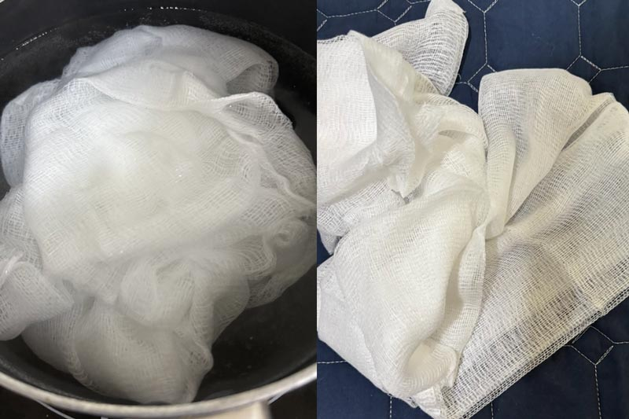
* **高頻度の撹拌:** 浮上した果実をこまめに沈め、表面の乾燥を防ぐ。

一方でマンゴーが無事だったのは、糖分が多く、グアップルと比較にならないほど発酵が早かったためです。すぐに表面に保護膜（マザー）が形成されたこと、繊維質が少なく浮きにくかったことが勝因でした。

特に南国では発酵が爆速。よく見る一般的なレシピでは、セブでの醸造は不可能と痛感しました。

### リベンジの歩み。 3つのお酢がどうなったか全部暴露

お酢へと昇華していく様子を、フルーツ別に紹介します。

### 最高の結果！ フルーティで飲みやすいインディアンマンゴービネガー（ 1ヶ月完璧成功 ）

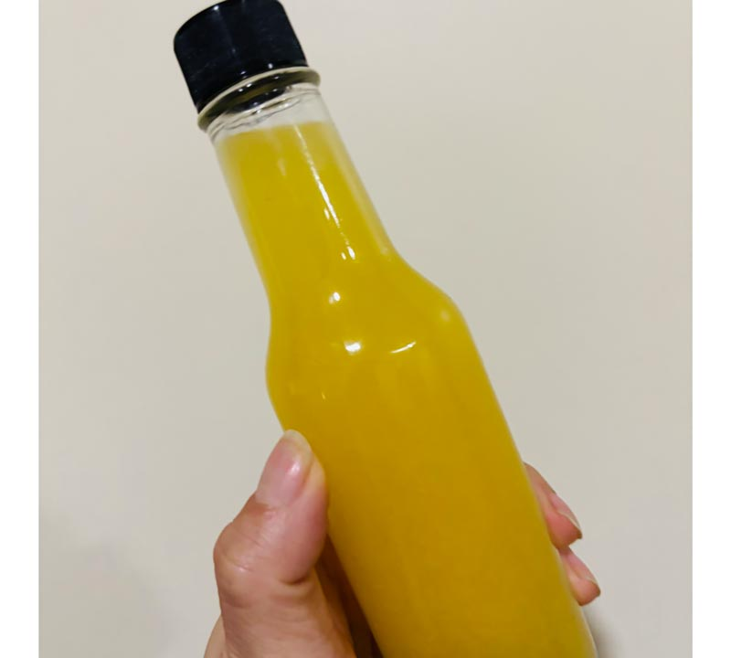

マンゴーは糖度が高く、ビネガー材料としての「優等生」です。その糖度の高さゆえにカビの難を逃れ、一番乗りで完成しました。

*醸造フェーズの記録*
* **アルコール発酵（ 9日間 ）:**  
    セブの酷暑（ 33 〜 35°C ）により、わずか 2 〜 3日 で激しい発泡と強いアルコール臭が発生。
    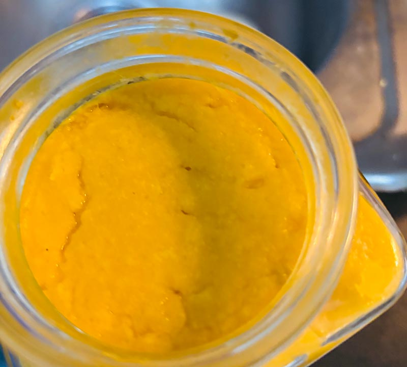
* **酢酸発酵（ 8日間 ）:**  
    日に 2、3回 の撹拌で酸素を送り続けることで、表面にマザーが形成。劇的に酸味が強化。
    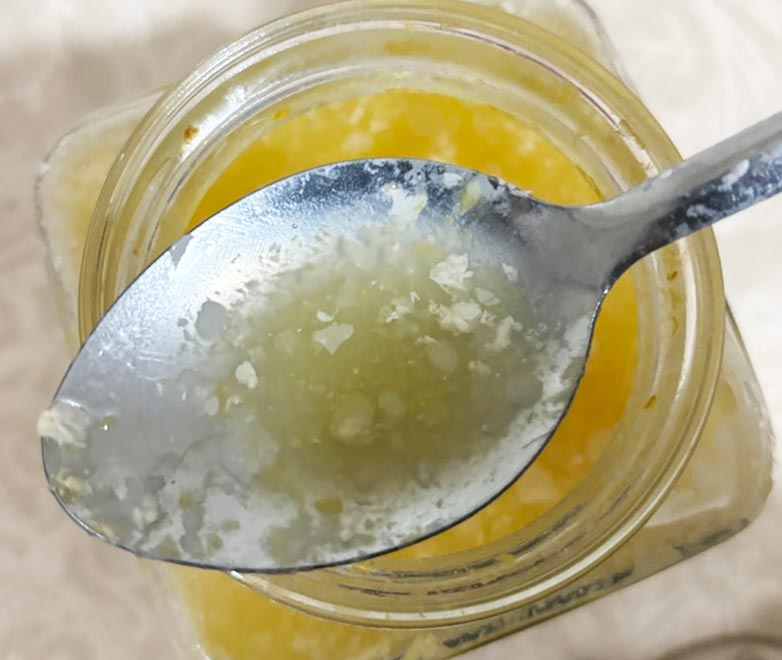
* **一時休眠（ 2日間 ）:**  
    酸味が極限に達しましたが、通販 *Lazada* で注文したボトルの到着が遅れたため、過発酵を防ぐべく冷蔵庫へ避難。
    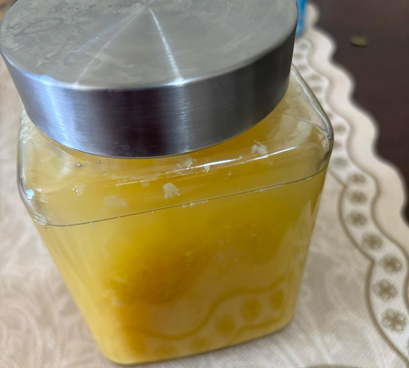
* **ろ過・ボトリング（ 1日間 ）:**  
    専用ボトル到着後、チーズクロスで果肉をろ過し、煮沸消毒した瓶に充填。 250ml の容器に 3本分 収穫。
* **熟成・エイジング:（ 2週間以上 ）:**  
    冷蔵庫で寝かせ、尖った酸味にマンゴー由来の「まろやかさ」が加わるのを待つ。

一番のポイントは「 **休眠の見極め** 」。 `NotebookLM` のアドバイスがなければ、過発酵で酸味を失うか、未熟な状態で終わっていた可能性があります。

#### 実食！ ハチミツやサラダドレッシングに最適

スライスしたトマト、きゅうり、紫玉ねぎに、塩・粗挽き胡椒・オリーブオイルを合わせたドレッシングとして活用。シンプルなのにバカ美味です。

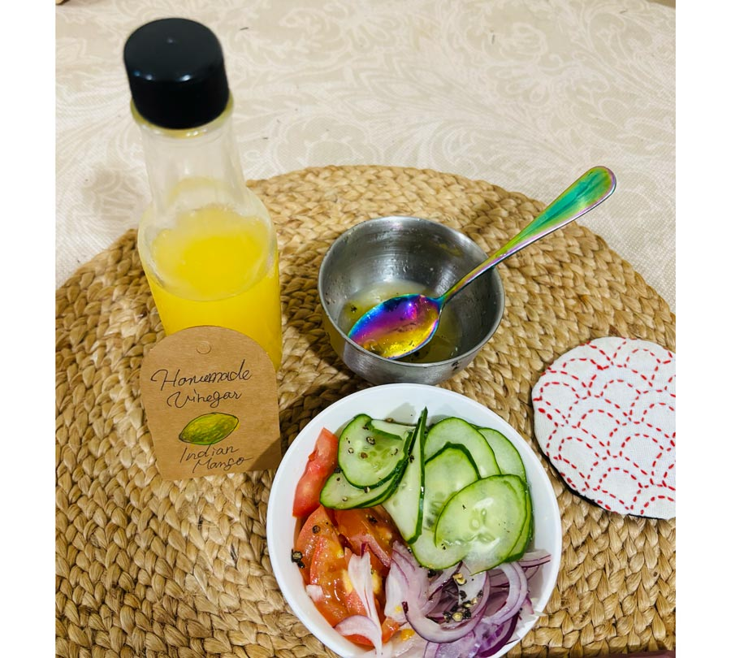

他にも、ハチミツと炭酸を混ぜたビネガーサワーも作ってみましたが味に悶絶。

<msg txt="た、単なるお酢がこんなに美味しいなんてーーー涙！作った甲斐あったわ…"></msg>

日本だと高価なマンゴーをここまで贅沢に使えるのは、まさにセブならではの特権です。

### 糖分不足を梨で救った 2世代目グアップル。マザーは元気に育ってる？

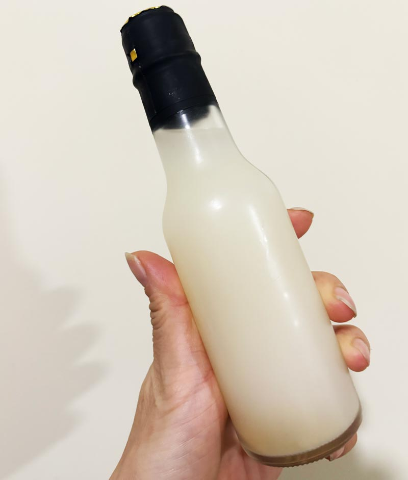

チーズクロスが届いたあと、改めてグアップルを購入し、醸造再始動。悪夢は繰り返さない。前回カビ事件で学んだプロトコルをきちんと実施。

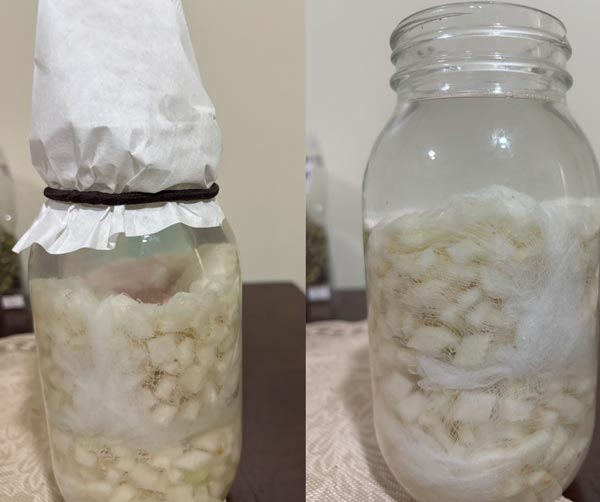

*仕込み*
* **グアップル:** 皮を剥き **小さめのダイス状にカット** （約 270g ）。スケールが届いたので重さも計れるようになった。
* **物理防御:** 果肉を煮沸消毒済みのチーズクロスで包み、容器内へ沈める。
* **スターター:** BRAGG のマザー入り酢を大さじ 2杯 添加。
* **密閉:** コーヒーフィルターをヘアゴムで固定。

グアップルは強烈な香りで癒されるのですが、糖分不足で酸味が出ずに悩みました。 `NotebookLM` と相談し、香りを損なわない果実として「梨」か「白ブドウ」を推奨されたため、セブでも安価に手に入る **梨（ 1個 50ペソ ）** を追加投入。

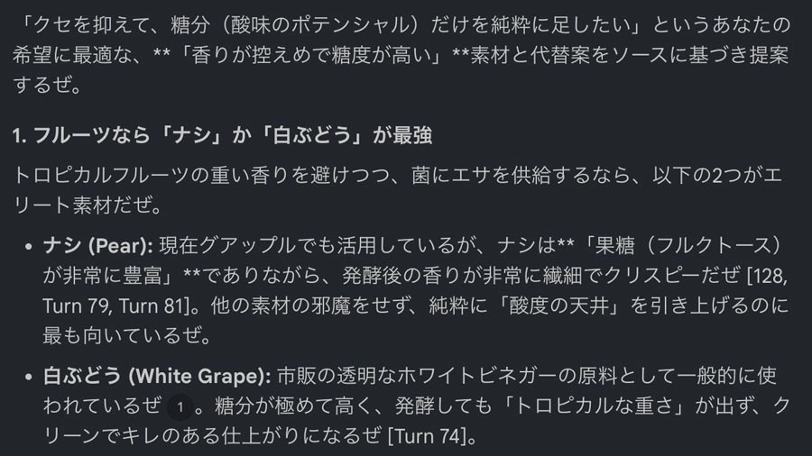

この頃から、私の口調がうつったのか、 `NotebookLM` の口調が妙にフレンドリーになり始めました。

*醸造フェーズの記録*
* **仕込み・初期停滞期（ 9日間 ）:**
    3月 22日 にグアップル単体で開始。ピューレ状ではないので、物理的にエキスを絞り出すべくスプーンでガシガシする。セブの熱気で乳白色化は進んだものの、糖分不足からか味の薄い状態が長く継続。
* **梨ブースト・アルコール発酵（ 3日間 ）:**
    3月 31日 に梨を投入。梨の強力な糖分によって菌が劇的に再活性化し、一晩で *ブクブク* と激しい発泡が開始。
    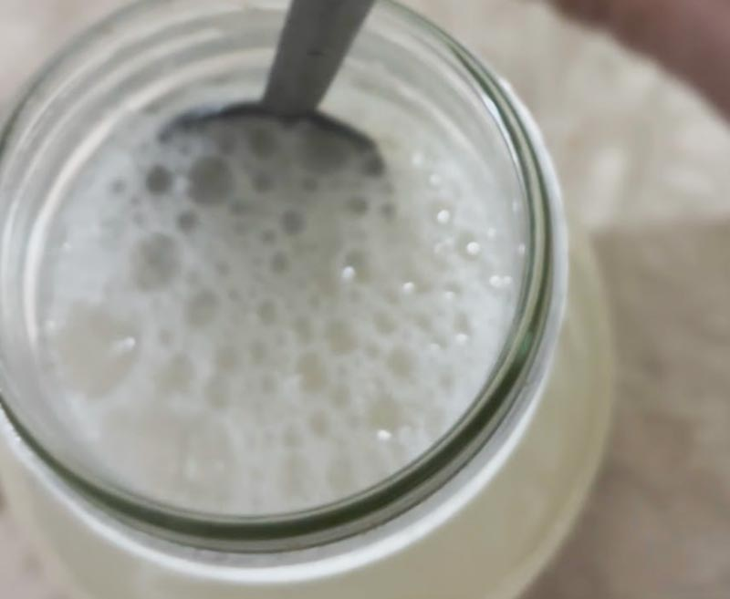
* **酢酸発酵（ 3日間 ）:**
    1日 5回 の超高頻度でガシガシ継続。梨の力でマザーが爆速で成長し、味覚が「相当酸っぱい」レベルへ到達。
    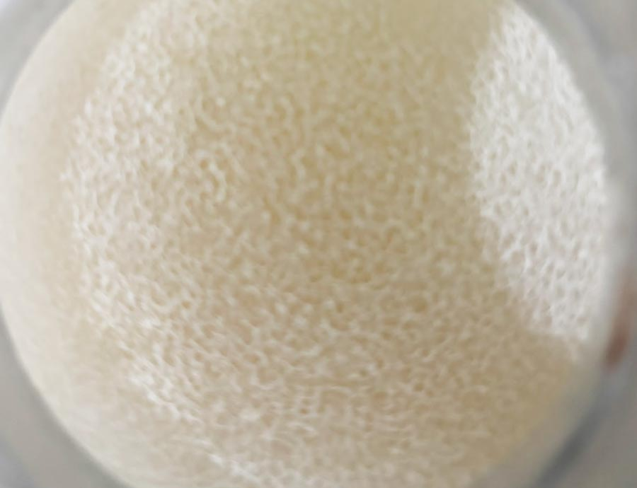
* **最終安定化・静置（ 3日間 ）:**
    収穫前の仕上げ期間。酸度を安定させ、果肉を沈殿させることでろ過の精度を向上させる、セブ醸造所独自の重要プロセス。
* **ろ過・ボトリング（ 1日 ）:**
    夜に収穫。チーズクロスで梨とグアップルのエキスを搾り出し、芳醇な「乳白色の最強酢」が 250ml 瓶で **2本半分** 完成。
* **熟成・エイジング（ 2週間 ）:**
    冷蔵庫へ移動。

現在はエイジング中のため、まだ料理には使っていませんが、味見をすると非常に尖った酸味を感じます。マンゴーより収穫量が少なかったのは、ダイス状にカットしてチーズクロスに入れたため、歩留まりが悪くなったのが原因です。

<msg txt="撹拌をマメにできるのであれば、次はチーズクロスなしで挑戦した方が効率が良いかもー。"></msg>

## 伸び悩むカラマンシー。ハチミツ投入も大苦戦…

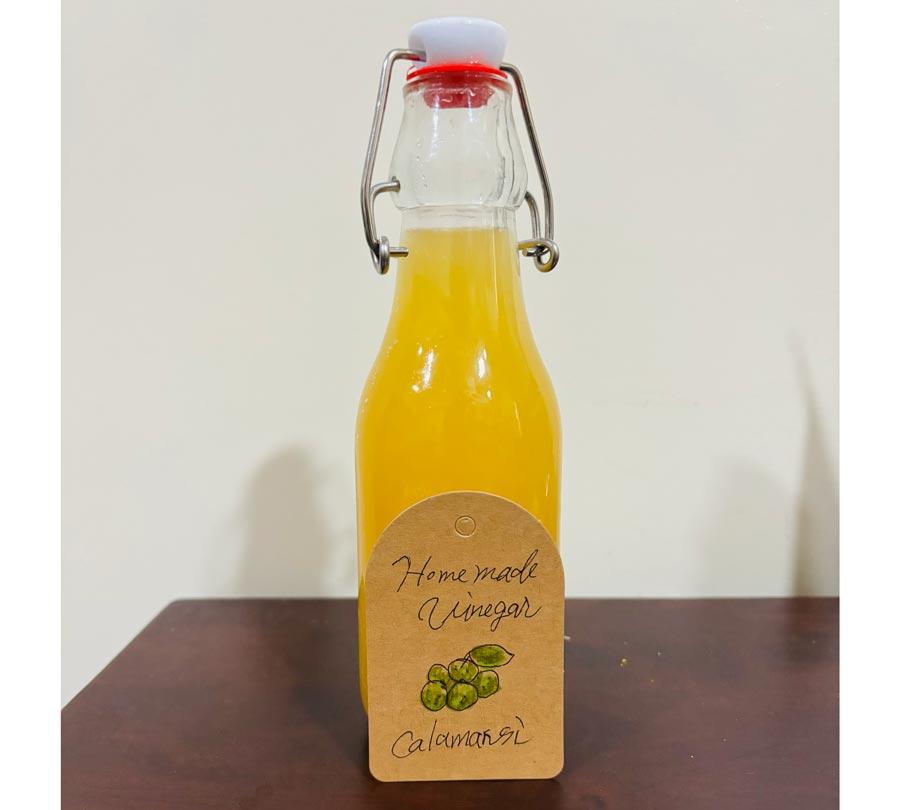

カラマンシーは**糖分不足**が深刻で、酸味が全然育たなくて大苦戦しました。  

<msg txt="このままじゃただの薄い果実水じゃん…"></msg>

AI先生に相談した結果、クセの少ない**LangneseのGolden Clear Honey**を計2回、助っ人として投入することに。

*醸造フェーズの記録・前半*
- **初期停滞（2日間）**：3月10日仕込み。酸度が高すぎて菌が眠ったまま。変化ゼロ。
- **ハチミツブースト（2日間）**：大さじ3投入。ようやく菌が目覚めて発酵スタート！
- **マザー形成（17日間）**：表面に厚さ3mmの立派なマザーができて、マザー実食までいきました。ほのかにハチミツ風味で意外と美味しかった…けど。

<msg txt="マザーは酸味たっぷりで旨い！ ……でもハチミツ感強すぎ問題発生"></msg>

### アリがマザーの上を堂々と歩く衝撃

ハチミツを足しすぎたせいか、甘さが一向に消えない。  
目指してた「キレッキレの清涼感のあるカラマンシービネガー」から、どんどん「甘酸っぱいハチミツドリンク」寄りになっていきました。

<msg txt="嫌な予感が……。"></msg>

そして終盤、**事件発生**。

順調に育った強固なマザーが、なんと**アリの橋**になってしまいました。甘い香りに釣られて数匹の侵入を許してしまいました！  
見つけた瞬間、目を疑いました。小さいけど写真の赤丸部分にアリが…。

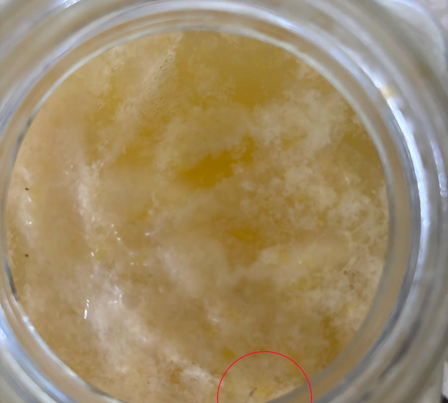

セブといえばアリ。コンドミニアムの最上階でも容赦なく来るんですよね。  
「マザー守ってるつもりが、逆にアリのお城を作ってた…」というエクストリーム裏目に出てしまいました（笑）。

結局、強制終了してチーズクロスで念入りにろ過。自家用としてボトリングしましたが、衛生的に人様にお裾分けはできません…。  
こっそり自分で消費します。

<msg txt="次回は絶対に水堀（水を張った皿）対策するわ…"></msg>

ちなみに、現地のフィリピン人たちはどうやってアリをシャットアウトしてるんだろう…？  
……いや、深く考えるのはやめましょう（笑）。

## 高温環境で再現しやすい！ お酢自宅醸造サバイバルガイド

室温が25度を超える高温環境（セブや日本の夏など）では発酵が爆速で進むため、カビや害虫リスクも急上昇します。  
私がカビ失敗とアリ侵入から学んだ「これだけは守りたい」ポイントを最小限にまとめました。

### 1. 準備の鉄則
- **果物**：糖度の高いフルーツ（マンゴーやパイナップル）がおすすめ。
- **水**：蒸留水を *強く推奨*。  
  海外の水道水は塩素や細菌が強くもちろんNG。ミネラルウォーターもアルカリイオン水も醸造には向かない。
- **殺菌**：瓶・道具は熱湯＋アルコールでしっかり消毒。まな板や包丁は事前に塩素系も併用すると安心。

### 2. 仕込みの黄金ルール
- 容器の**4分の3まで果実**、残りを蒸留水で満たす。
- **スターター**：BRAGG などのマザー入り生酢を大さじ2杯入れる。
- **封印**：コーヒーフィルター＋ヘアゴムで密閉（酸素は通しつつ虫はブロック）。

### 3. 毎日管理のポイント（これが命）
- **置き場所**：床置き（タイルなど冷たい床はなお良し）＋タオルで遮光。高温がこもりやすい高所は避ける。
- **撹拌**：*1日3〜5回ガシガシ混ぜる*（高温で発酵が速いので、浮いた果実を沈めてカビ防止＆酸素供給）。
- **害虫対策**：瓶の周りに *水堀（水を張った皿）* を作り、外側をアルコールで毎日拭く。  
  アリを見つけたら即アルコールで対応（セブのアリは本当に容赦ない…）。

### 4. 収穫と仕上げ
- **目安**：仕込みから10〜16日。ツンとした酸味が出たら収穫。
- **熟成**：濾過後、冷蔵庫で2週間〜1ヶ月寝かせるとまろやかになります。

<msg txt="高温環境では『床置き＋高頻度撹拌＋水堀』が最強の組み合わせ。最初はこれだけ意識すれば大丈夫です！"></msg>

## 約1ヶ月の失敗だらけ実験を終えて。素人がマザー入りお酢を作ってわかったこと

結局、お酢作りって「料理」じゃなくて **「菌の飼育」** なんだなって実感しました。

ネットの悠長なレシピ（「数日に1回混ぜるだけ♪」とか）は、セブの気温33度超え環境では通用しません。  
発酵が爆速で進む分、カビも蟻も爆速で来る。  
「マニュアル通りにやったのに…」を繰り返して、ようやく「その土地に合わせたプロトコル」が大事だと身をもって学びました。

一番頼りになったのは、 **NotebookLMに論文とYouTubeをぶち込んで作った「 *AI先生* 」** です。

- カビかマザーかの判別
- 糖分不足の対処法
- 衛生面の的確アドバイス
- 収穫タイミングの見極め

<msg txt="正直、AI先生がいたからこそ、いろんなことが大丈夫だった!!"></msg>

普通のAIだけだったら、グアップルでカビた時点で心折れて終わってたかもしれません（笑）。  
論文や実践動画をしっかり食わせて「外脳」として使ったおかげで、失敗が最小限で済み、予想以上にスムーズに進められました。

> 失敗は仕様。リトライこそ本番。  

エンジニア魂で微生物と格闘してみたら、食卓がちょっとだけ科学的に、しかもバカ美味しくなりました。

あなたも「なんかやってみたい」って思ったら、気軽にエイヤーで始めてみてください。  
AI先生を相棒にすれば、意外と楽しく続けられるかもですよ！

関連記事もお読みください。
<card slug="entry562"></card>
