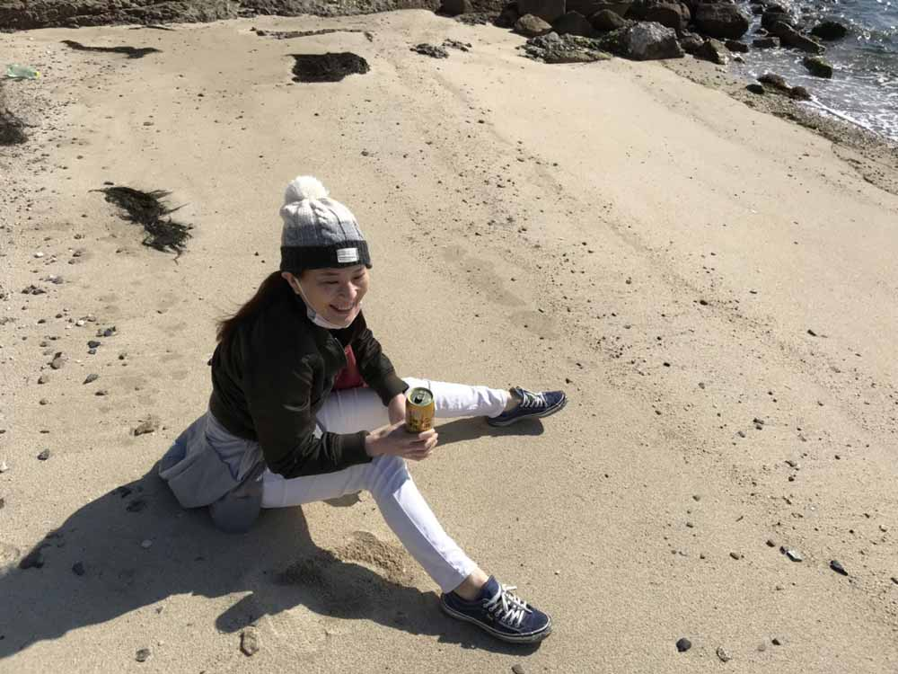

「銀ねこアトリエ」は私の技術的なチャレンジ・考え方や生き方を綴った公開備忘録です。

私だからできることを発信しています。Web制作など、ご興味のある方はTwitter[@LirioY](https://twitter.com/LirioY)にDMください。

## 管理人・かみーゆってどんな人？

神守　由理子（かみもり・ゆりこ）/ フロントエンドエンジニア

通称 : かみーゆ（かみーゆはかみもり・ゆりこの略）

パーソナリティ : 肉とビール、人が好き。自分に厳しい。引越しばかり。酔っ払ったらすぐ寝る。

 <ul>
<li>スマフォアプリ選手権でチーム受賞歴あり
<li>CMS concrete5エバンジェリスト
<li>ITセミナー、大学などで登壇経験多数あり
<li>テクニカルライティングで1記事月間平均5000PV
<li>地方ITセミナーを企画運用し、約100名の集客に成功
<li>地方ITセミナーで100人LT（プレゼンの一種）で人気投票1位
</ul>

## かみーゆ「今日までの歩み」
私のこれまでの人生をざっくり書いてます。ぜひお付き合いください。

### 早く結婚しすぎて周りに置いていかれた。キャリアを築くことに必死だった20代

私、元メイキャッパー・ネイリストです。

ちなみにこの古ぼけた写真は、2003年ネイルエキスポ2003にてトータルルックコンテスト4位入賞した時のもの。

当時キャリアを築きたい欲求はあったものの、子育てとの両立に苦しんでました。

子育て優先したくて、スタイリスト事務所から大手化粧品メーカーへ転職。

<a class="article-link" href="/blogs/entry382">
<section>

会社は人の割合で決まる！組織を腸内フローラに例えてみた

昔、乳酸菌を取り扱う会社にいました。当時は「腸内環境整える前にマジ社内環境整えよう」よ、と思う･･･

<time datetime="2020-10-19">2020.10.19</time>

</section>
</a>

数字を追うばかりの日々でメイキャッパー・ネイリストとしての*キャリアが死んでいく挫折*を味わいました。
### 心機一転。これまでのキャリアを捨ててIT業界へ飛び込んだ30代前半
職業訓練校を経てIT業界へ転身。

EC（ネットショップ）の運用・レタッチャー（写真加工業務）からスタート。当時はワーキングプアそのものでした。

派遣切りされてフリーランスへ。

周りの人と同じことをしていたらお金なんて稼げないと思い、もっとプログラミングを勉強しようと周りの人に助けられながら奮闘しました。

実力がついたおかげでWeb制作会社のフロントエンドエンジニア・テクニカルディレクター、つまり社畜として再び働くことになりました。

この頃から*これからは教育に力を注ぎたい*と思い、職業訓練校などの講師を始めました。

<a class="article-link" href="/blogs/entry369">
<section>

駆け出しエンジニアの君へ。30才過ぎても転職はできる

「ITエンジニア、Webデザイナーに転職したい」。そんな相談を受けることがあります。10年前･･･

<time datetime="2020-07-01">2020.07.01</time>

</section>
</a>

### 子育が落ち着いた！！独身の頃にできなかったことにチャレンジした30代〜40代
ヘッドハントを機にフィリピン・セブ島へ移住。  
家財を整理し、 「*この先はMac Book Proとスーツケースだけで生きていこう*」と決意する。  

日系ベンチャー企業のエンジニア講師となる。

新規事業立ち上げ、オフショア開発部門でブリッジSEとなる。オフショア専任に。

<a class="article-link" href="/blogs/entry356">
<section>

広島に帰省したのでウェブタッチミーティングでフィリピンやオフショアの話をしてきました

セブ島のIT留学・オフショア会社に転職・引っ越して約1年！
久々の広島の帰省です。せっかくなのでウェブタッチミーティングでセブ島でのオフショ･･･

<time datetime="2020-02-26">2020.02.26</time>

</section>
</a>

想像以上の激務に自分を見失う。

### いったん走るのをやめ、しばし休息。新たなチャレンジのため充電する40代
2020年コロナウィルスの蔓延によりフィリピン・セブ島で世界最長のロックダウン（町の封鎖）に直面。

行動が制限され自分を見つめ直す時間ができ、*数字を追い磨耗する生き方に疑問*を感じ、退職。

現在は3か月限定で充電期間として貯金を切り崩しながらセブ島ライフを満喫中。 

<a class="article-link" href="/blogs/entry386">
<section>

消耗しない生き方の選択とセブ島での充電生活レポート

かみーゆ、また仕事辞めたってよ。2019年4月「MacBook Pro とスーツケースだけで生きていこう」と、セブ島に来て1年半経ちまし･･･

<time datetime="2020-10-27">2020.10.27</time>

</section></a>

残りの人生は、*南の島で食べるだけ稼いで生きていく*のが夢。

### 新たなチャレンジのため仲間と一緒にビジネスを立ち上げるため奮闘中

フィリピンの貧困、セブ島でいろんな現実を見ました。ロックダウンでさらに失業者増加。

この歳になると、自分だけが幸せになっても面白くないんですよね。フィリピンに新たな雇用を生むべく、仲間と新規事業を立ち上げるべく奮闘中です。

## 当サイト「銀ねこアトリエ」の歩み
単なる自分のための備忘録として2014年にはじめた「銀ねこアトリエ」。

*concrete5*の5.6からconcrete5 8に心機一転SSL対応。

現在はUXの向上のため、*静的サイトジェネレーター*に切り替えました。  

時代とともに日々アップデートしています。

## お仕事のご依頼はフォームかTwitterから
セブ島で仲間とWeb制作やオフショア開発など承ってます。

ご興味のある方は[お問い合わせ](/contact/)ください。お急ぎの方はTwitterのDMの方が早いかも。

大変恐縮ですが、明らかなセールスメールや常識を欠いた内容には返信致しませんのでご了承ください。
