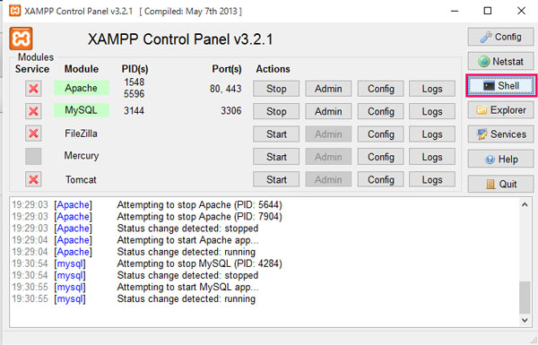
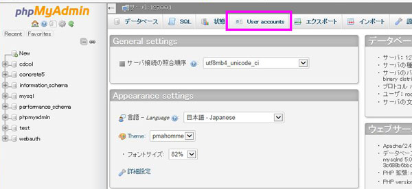
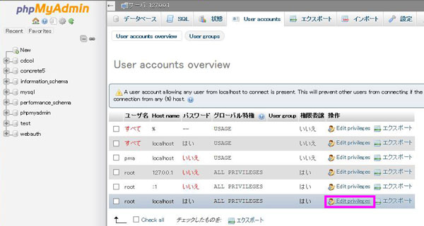
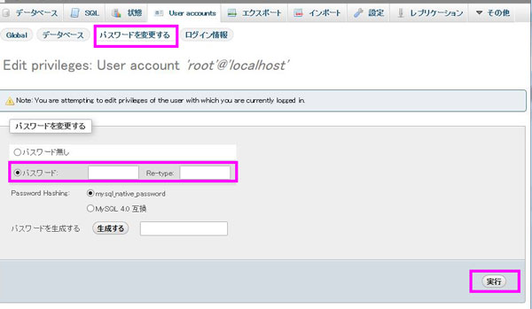

## まずは、XAMPPをローカルにインストール
まずはXAMPP(XAMPP v5.6.14 (PHP 5.6.14) )をインストール。
※現時点で最新版。

* [XAMPP（今回はWindows用）](https://www.apachefriends.org/jp/index.html)

program内にインストールすると動かなくなる可能性があるのでCドライブ直下が良いようです。

## XAMPPは初心者向けの仮想環境？
私が職業訓練校生の時に出会ったXAMPP。<br>
当時、職業訓練校でPHPを学ぶために使ったローカルでも使える仮想環境はXAMPP。

最近の制作する時はMac環境ですし、お仕事ではVagrant＋gulpなのでXAMPPのことなんてすっかり記憶の彼方に。。。。

XAMPPは初心者にはうってつけのツール（の認識）でした。

最近はどうやら、知見のない人がXAMPP走らせたままで放置してセキュリティ上の問題が方々であったようで、XAMPP提供側がApacheの管理画面をなくすなど仕様変更があったらしい。面倒になったけど仕方ない。。。

おかげさまで多少、超初心者には敷居が高くなりました。

## さくっとコマンドプロンプトでパスワード変えました
以前のバージョンであればApache管理画面でphpMyAdminのログインパスワードを簡単に帰れましたが、Apache管理画面がなくなりましたからね…。あれこれ悩んだ挙句、ググると、localhost/security/にアクセスすればいけるとか情報発見。早速試すも404が返される。。。

Apacheのダッシュボードの上部メニューにHOW-To Guides発見。中を確認してみるとメニューに「Reset the MySQL/MariaDB Root Password」というものが！（こっちを先に見ろよ）。

パスワードを変えたければシェルをクリックしてコマンドを叩いてねとのことでした（英語）。

とりあえずコントロールパネルを管理者権限で起動し「shell」をクリック。



コマンドプロンプトが立ち上がるので初期パスワードを設定するため以下入力。

```
mysqladmin --user=root password ”任意のpassword"
//例）
mysqladmin --user=root password ”password"
```

パスワードは変更できましたが、phpMyAdminにアクセスできなくなっちゃうので、config.inc.phpの設定も合わせて変更します。xampp/phpMyAdmin/config.inc.php 21行目当たりにパスワードの設定があり、値が空になっているのでここを変更。

コマンドプロンプトで設定したパスワードと一致させます。そして保存。

```
$cfg['Servers'][$i]['password'] = '';
↓
$cfg['Servers'][$i]['password'] = ’任意のパスワード';
//例）
$cfg['Servers'][$i]['password'] = 'password';
```
これで初期パスワード設定完了です。

phpMyAdminにアクセスできるようになります。

## 追記
以下の方法でもパスワードは変更できます。

1.phpMyAdminにログイン
### 2.上メニューUser Accountをクリック

### 3. root localhostのEdit privilegesをクリック
※画像はすでにパスワード変更しているのでパスワードの項目が「いいえ」になっているけど初期設定では「はい」になっています。



### 4.「パスワードを変更する」をクリック
パスワード変更画面へ行きパスワードを2回入力して実行。



~~※config.inc.phpは変更不要です。~~

※config.inc.phpにパスワードが反映されてないと思います。XAMPPコントロールパネル＞シェルから行った手順同様に書き換えましょう。

Windows7で検証ずみです。

私のWindows10環境下だとUser Accountにアクセスしようとするとエラーが出てここまでたどりつけませんでした。手動で設定をつついたらいけるんでしょうが、コマンド叩いたほうが早いので諦めました。

おそらく8でも動くんではないかと思います…。
