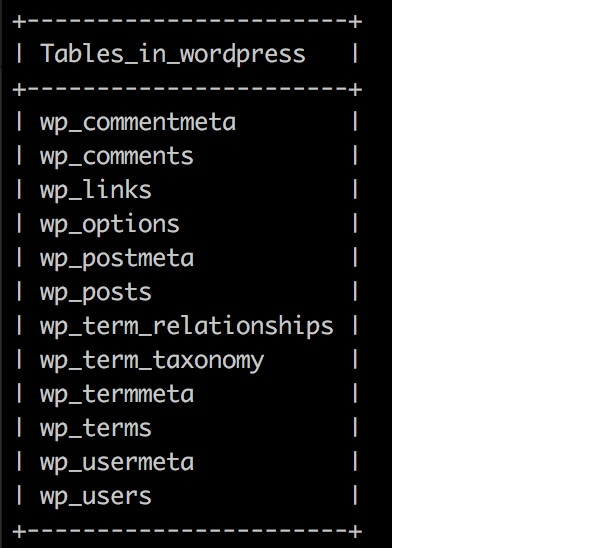
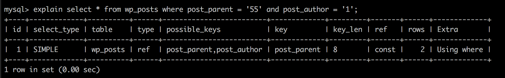
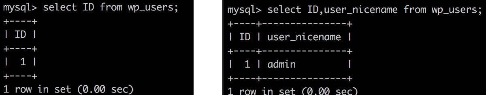
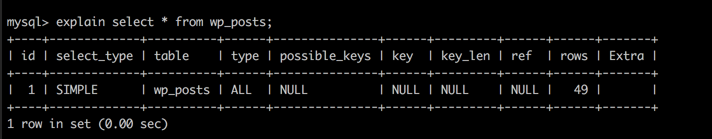
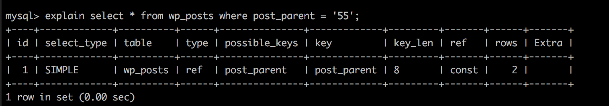
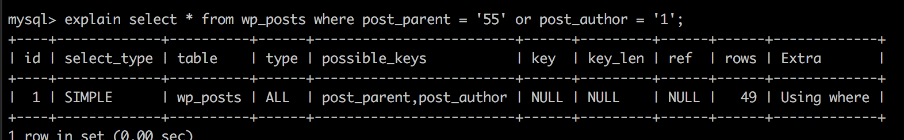

## ざっくり、「しろたん師匠」のご紹介？
### しろたん師匠 /インフラ屋さん

<div class="box">
広島市内に生息。

ノーと言える大人ですが、口を一度開けば毒を吐くこともあります。
インフラ、サーバーサイドだけでなくフロント周りまで幅広く手がけているようです。

一見怖そうですがしろたんのようなラブリーキャラをこよなく愛しているみたいです。<br>
テトリスがうまいです。

嫁がイケてます。
</div>
## SQLってほんま大切やん
最近ちょっとデータベースやサーバーのスペックを本来考えないといけない複雑な案件しました。
本日たまたま仕事帰りに会社の近所で会社を経営しているしろたん師匠にエンカウントしてしまいました。
一見怖そうですがしろたんのようなラブリーキャラをこよなく愛しているみたいです。<br>
メモリやデータベースについて思いの丈をぶつけてみました。

まずはSQL知っとかんといけんじゃろう。

SQL上何がどう動いているのが分かってるのかい？
何がどう処理されてるかによってサーバーへの負荷が違うんだぜ。

とりあえず、そこ覗いてみようぜっちゅうことで。。。。SQL入門的なコマンド覚えたのでメモしておきます。

## まずは、コマンドからデータベースをみてみよう
とりあえず、サーバーに入りましょう!!!

今回はvagrantで作ったサーバーの中を参考にみてみます。<br>
vagrant sshで接続します。

```bash
$ mysql -u【ユーザー名】 -p【パスワード】
```

ワンラインでかけますのでユーザー名がuserパスワードがpasswordの場合はこんな感じで続けて書けます。
```bash
$ mysql -uuser -ppassword
```
MySQLに接続できるようになりました。
データベースのあれこれがわかるのでまずはコマンドshow databasesを叩いてみましょう。
終端に必ず;(セミコロン)が要ります。

```sql
mysql > show databases;
```

今度はデータベースのテーブルを確認していきます。

どのデータベースを使用するか選び、中身を見てみましょう！


```sql
//データベースを選ぶ
mysql > use 【データベース名】;
//例
mysql > use mydatabase;

//中身を見る
mysql > show tables;
```

select * from【テーブル名】でそのテーブルの全てのデータが見ることができます。

例えば、wordpressのwp_usersの中身を見て見たければこんな感じ。



```sql
//テーブルの中を見る
mysql > select * from 【テーブル名】;
//例
mysql > select * from wp_users;
```



```sql
//データベースを選ぶ
mysql > select 【カラム名】 from 【データベース名】;
//例
mysql > select ID from wp_users;
//複数指定するときはカンマで区切る
mysql > select ID,user_nicename from wp_users;
```

また、カラム数が多すぎて見にくい場合は、縦並びに変えることもできます。<br>
最後に\G(バックスラッシュラージg)を付与するだけ。


## explain selectで出力してみた
とりあえず、早速教えてもらったexplain selectで出力する方法を教えてもらいました。

explain selectを実行するとSQLの挙動や出力スピードを最適化するのに役立つそう。

いつか役に立つはずなの、そのやり方もメモっておきます。

```sql
mysql > explain select * from wp_posts;
```

まずは上記コマンドで出力内容を見て見ましょう。



### select_typeとid
別々のフィールドですがセットとして考えて良いみたいです。

ちなみにクエリがJOINだけから構成される場合、select_typeはSIMPLEとなります。
(MySQLが実行出来るJOINの種類はNested Look Join（NLJ）の一種類しかないそうです)

> #### ネステッドループ結合とは？
> ネステッドループ結合は最初にアクセスする表(外部表、駆動表とも呼ばれる)をフェッチし、そのフェッチしたデータと結合可能なデータを内部表から検索する処理をループして結合します。

### サブクエリが絡むと次のselect_typeには次の5種類のうちいずれかが表示されるそう

* PRIMARY…外部クエリを示す
* SUBQUERY…相関関係のないサブクエリ
* DEPENDENT SUBQUERY…相関関係のあるサブクエリ
U* NCACHEABLE SUBQUERY…実行する度に結果が変わる可能性のあるサブクエリ
* DERIVED…FROM句で用いられているサブクエリ
table
まんまテーブル名です。

### type
* const … PRIMARY KEYまたはUNIQUEインデックスのルックアップによるアクセス。最速。
* eq _ ref…JOINにおいてPRIARY KEYまたはUNIQUE KEYが利用される時のアクセスタイプ。constと似ているがJOINで用いられるところが違う。
* ref … ユニーク（PRIMARY or UNIQUE）でないインデックスを使って等価検索（WHERE key = value）を行った時に使われるアクセスタイプ。
* range … インデックスを用いた範囲検索。
* index … フルインデックススキャン。インデックス全体をスキャンする必要があるのでとても遅い。
* ALL … フルテーブルスキャン。インデックスがまったく利用されていないことを示す。OLTP系の処理では改善必須。

### possible_keys
オプティマイザがテーブルのアクセスに利用可能なインデックスの候補として挙げたキーの一覧。

### possible_keys
オプティマイザによって選択されたキー。

### key_len
選択されたキーの長さ。

### ref
検索条件で、keyと比較されている値やカラムの種類。定数が指定されている場合はconstと表示される。JOINが実行されている時には、結合する相手側のテーブルで検索条件として利用されているカラムが表示される。

### rows
そのテーブルからフェッチされる行数。実際の行数とは違うことがあるので注意が必要。

whereでpost_parentの値を絞ってみます。<br>
そうするとtypeがref(where key = valueで検索された)になりpossible_keysとkeyがpost_parent、refがconstになりましたね。



条件を二つでand検索にするとExtraのところにUsing whereが追加されます。<br>
keyはpost_parentを選択されてますね。


次にor検索で実行してみますとこんな感じ。
typeがALLになりました。



## どんなコマンドを叩いたか思い出せない時
今回はざっと教えてもらいましたが、どんなコマンドを叩いたか忘れてしまって復習できない時があります。

そんな時はhistoryコマンドでどんなコマンドを叩いたか探す方法も教えてもらいました。

まず、ルートに戻ってls -alで隠しファイルを確認します。

```bash
$ ls -al
```

そうすると、.mysql_historyという隠しファイルが　確認できると思います。

catコマンドで中身を見てみましょう。
```bash
$ cat .mysql_history
```
## とりあえずまとめ
とりとめのない感じの中身になっちゃいましたが、とりあえずexplain selectで出力されるデータを解析(?)してクエリをチューニングするらしいのですが、しろたん師匠はどうクエリが動いているのかをみて欲しかったみたいです。

私なりになんとなくあっちこっちから調べて情報を継ぎ接ぎしましたが、このクエリ実行がサーバーのスペック等に影響するのでSQLがどう動いてるのかぐらいはやっぱり知っておきたいですね。

* [MySQLのEXPLAINを徹底解説!! / 漢のコンピューター道](http://nippondanji.blogspot.jp/2009/03/mysqlexplain.html)
* [ネステッドループ結合とは? / Walking Alone](http://www.doppo1.net/oracle/tuning/nested-loop.html)
