## この記事のゴール：VS Code をインストールして HTML、CSS などを超快適に書けるようにセッティングするまで

この記事はコーディング初学者の方のために VS Code をインストール、基本操作方法とフロント系のコードを快適に書くためのセッティングするまでをまとめています。

初学者には多少テクニカルな部分は「初心者コーダーに贈る！超軽量高機能エディターVS Code入門 2」 をリライトしてまとめます！！今しばらくお待ちください。

ショートカットは記事本文中は Mac 中心に書いてありますが、後にショートカットの一覧を置いてます。

2020 年から現在に至るまで世界中がコロナ禍です。日本もたくさんの失業者がいると聞きます。それでもなんとか勉強して Web 制作の仕事に就こうとして勉強している方たちを Twitter 上でたくさん目にします。

私は業界も 10 年。エンジニア講師していましたし、少しでも駆け出しエンジニアのお力になれればと思いこの記事をまとめました。よろしければ参考にしてください。

## Visual Studio Code とは？

Visual Studio Code（以下、VS Code）は、 2015 年に Microsoft によって開発されたソースコードエディターです。

Windows はもちろん、Mac、Linax でも使えます。

高機能にもかかわらず無料で使用できます。VS Code は[Electron](https://electronjs.org/)というプラットホームで作られてます。他にも同様のプラットホームで作られた高機能エディターの中には Atom などがあります。

VS Code は以下からダウンロードできます。

[Visual Studio Code DL](https://code.visualstudio.com/)

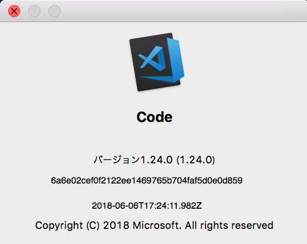

余談ですが、昔はサクラエディター、テラパッドや秀丸というというテキストエディターがありましたが、シンタックスハイライトでタグが色分けされるくらいで、現在みたいにインテリセンス（自動補完機能）なんてありません。当時はいちいちググるのも面倒だし、タグやプロパティをほぼ覚えてました。

いやー、いい時代になった。

## VS Code の個人的推しポイント

初心者から手練れ（経験豊富な人）まで、私のオススメする 4 つの推しポイントをご紹介します。

1. _インテリセンスが素晴らしい_<br>さすが Microsoft の作ったテキストエディター。Visual Studio を使ったことがある方ならわかると思いますが、Microsoft 製品はとにか補完・文字の候補を出してくれるアレ（自動補完機能）が大変優れてます。うろ覚えでもじゃんじゃんコード書けます。
2. _拡張機能が豊富_<br>拡張機能豊富です！私はブログの下書きも VS Code を使っているのですが、テキスト公正くんで不自然な日本語を取り除くようにしています。
3. _付属ターミナルが便利_<br>独自の UI の付属ターミナルがあるので、いちいち iTerm などのターミナルを起動する必要がありません。
4. _Git 連携が簡単_<br>近年コーダーはバージョン管理必須ですよね？コマンドを使うにせよ、SourseTree を使うにせよ、他のアプリを起動するのは面倒です。切り替えることなくコミットできます。

この先は VS Code をダウンロード、インストールして読み進めてみてください！
Mac の方はアプリケーションフォルダーにぶち込んでインストール終了です。Windows の方はインストールウィザードにしたがって進めれば OK です！

### 英語が苦手な方へ。まずは日本語パッケージをインストール

英語が苦手な方はまずは日本語パッケージをインストールしましょう。

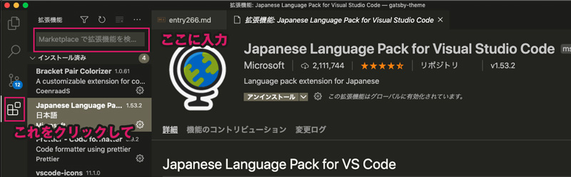

サイドバーメニューの*四角のマーク*をクリック（もしくはショートカット Cmd+Shif+x）で拡張機能を開きます。

検索バーに Jap ぐらい入力したら「Japanese Language Pack for Visual Studio Code」が表示されるので、インストール。

完了したら、右下に表示される「Restart Now」をクリック・VS Code を再起動します。

## VS Code のざっくりとした歩き方

日本語化が無事できたところで、VS Code の簡単な使い方を説明します。

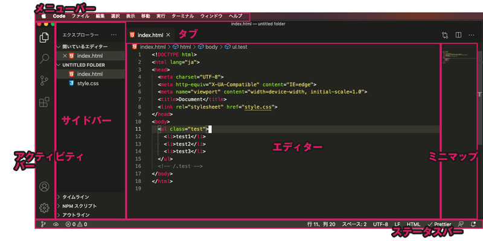

ミニマップとタブ、エディターの説明は割愛します。

### アクティビティバーとサイドバー

VS Code 左手にある以下のメニューをアクテビティバーと呼びます。*4 つの主な機能*があります。<br>
各メニューをクリックするとサイドバーが開きますが、画面が狭くなり使いにくくな事もあります。そんな時は「Cmd+B」で必要に応じて開閉しましょう。

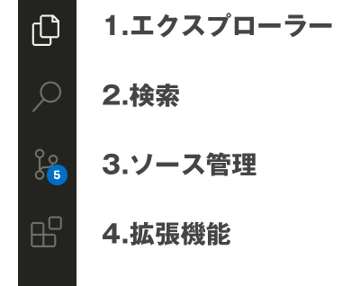

#### _1.エクスプローラー_（Cmd+Shift+E）

ファイルやディレクトリを管理ができます。その中には 1. 開いているエディター、ワークスペース（名）、タイムライン、NPM スクリプト、アウトラインの 5 つの機能があります。使わない機能は**紛らわしいので非表示にしておくこと**をオススメします。

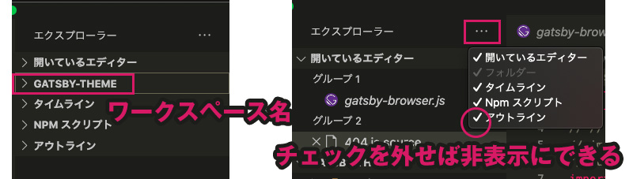

#### _2.検索と置換_（Cmd+Shift+F）

ファイル類をまとめて検索したり置換できます。

検索に関しては、こちらにより詳しく書いてありますのでそちらを参考にしてください。

<a class="article-link" href="/blogs/entry336/">
<section><div class="article-link__img"></div><div class="article-link__main">
<div class="article-link__main__title">VScodeでカンタン！正規表現置換のためのチートシート</div>
<p class="description">コードをいわゆる「置換（置き換え）」、一気に変換したい！ってときありませんか？「正規表現」を使うと･･</p>
<p>
<time datetime="2019-07-21">2019.07.21</time>
</p>
</div>
</section></a>

#### _3.ソース管理_（Ctrl+Shift+G）

Git でソースのバージョン管理ができます。こちらは、初心者コーダーに贈る！超軽量高機能エディター VS Code 入門 2 に記載します。

#### _4.拡張機能_（Cmd+Shift+X）

拡張機能ここから探してインストールできます。ソートしたりカテゴリーで絞り込んで探す事もできます。

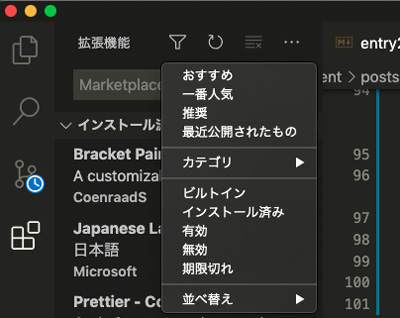

アンインストール、アップデート等も管理できます。オススメの拡張機能は後述する便利な拡張機能にまとめます。

### メニューバー

上部にあるのがメニューバーです。慣れないうちは多用するかと思います。ショートカットを覚えたら使わなくなります。

### ステータスバー

下のバーはステータスバーです。左側は Git に関するものなので、右のみ説明します。

- _行＆列_<br>現在の行と列がわかります。クリックすると行番号を指定して移動できます。<br>文字を選択すると、現在選択している文字数もここに表示されます。
- _スペース_<br>タブの設定スペースの数を指定できます。
- _エンコードの設定_<br>エンコードの指定ができます。基本 UTF8 です。ここをクリックするとエンコードを指定して再度開くか、保存したりできます。
- _改行コードの指定_<br>デフォルトは LF です。<br> LF(↓)･･･UNIX 系。Linux 。<br> CR+LF(↵)･･･Microsoft Windows。

* _言語モードの指定_<br>PHP CSS 等使いたい言語にモードを変えることができます。メリットととして言語ごとにシンタックスハイライトがオンになりミスなどチェックしやすくなります。個人的には拡張子が違っても、言語モードを変えてチェックしたいこともあるので結構活用してます。

## 設定から配色テーマを変更しておく

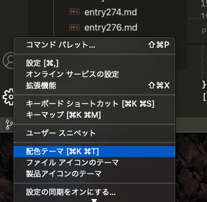

一日中コードを見るのでツールの配色はテーマは大切です。アクティビティーバー右下歯車マークから変更しておきましょう。

デフォルトは Dark+です。用意されているテーマがお気に召さないなら探してきてインストールも可能です。

## VS Code の設定を変更しながらコードを書いてみよう

ではそろそろ、VS Code の設定を変更しながらコードを書いてみましょう。

### 最初の一歩・ファイルで開くかワークスペースで開く

基本的に Web 制作をする際はディレクトリー（フォルダー）単位で管理します。

VS Code では*ワークスペース*といって、ディレクトリー単位でファイルやフォルダをまとめて開くことができます。

適当なフォルダをディスクトップに作っておきましょう。

「Cmd+O」でワークスペースやファイルをひらけます。

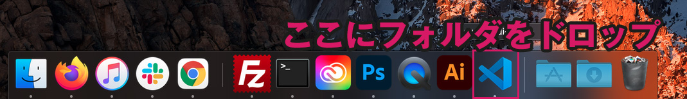

Mac の場合は開きたいフォルダーやファイルを Dock の VS Code のアイコンにドラック&ドロップしても開くことができます（Win 機はディスクトップの VS Code アイコン上にドラック&ドロップ）。

### フォルダやファイルを追加してコーディングしてみる

「Cmd+Shift+E」でエクスプローラーを開きます。

新しいファイルを追加するショートカット「Cmd+N」です。ファイルをワークスペースに追加したい場合は、「Cmd+S」でファイル名 index.html で保存するだけです。

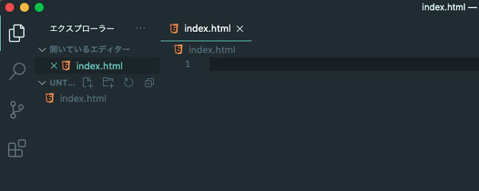

### Emmet でコーディングしてみる

早速 Emmet でコーディングしてみましょう！

> Emmet とは？
> コード(スニペット)とショートカットを組み合わせて、効率的に HTML や CSS のマークアップ手助けしてくれるすごいツール

VS Code の初期機能に Emmet という HTML や CSS のコードの入力を補完してくれるプラグインが搭載されています。

!+タブだけで html の骨組みとなるコードが展開されます。

Emmet にはチートシートが用意されているので入力の仕方はそちらを参考にしてください。

[Emmet チートシート](https://docs.emmet.io/cheat-sheet/)

### コーディングしやすいように設定を変える

コーディングは規則的に書いておくとミスも発見しやすいし、他の人も管理しやすくなります。

最初からキレイに書くクセをつけるためにエディター側で設定します。

今回は Google の HTML のコーディング規約を参考にします。

[Google HTML/CSS Style Guide](https://google.github.io/styleguide/htmlcssguide.html)

HTML CSS のインデントはソフトタブ（スペース 2 コ）です。

設定を「Cmd+,」で開き、`Editor:Tab size` を 2 に設定します。

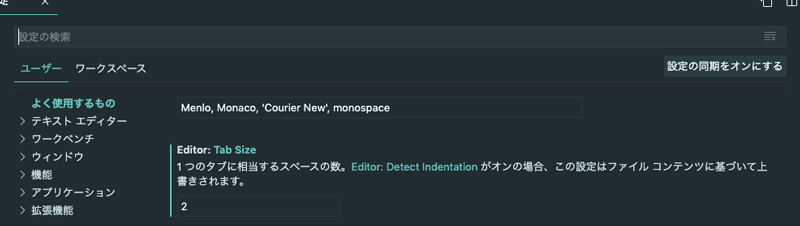

この設定は setting.json というファイルに集約されていて、ファイルに直接書き込むことでも変更可能です。

設定の右上にファイルマークをクリックすると、setting.json を開くことができます。

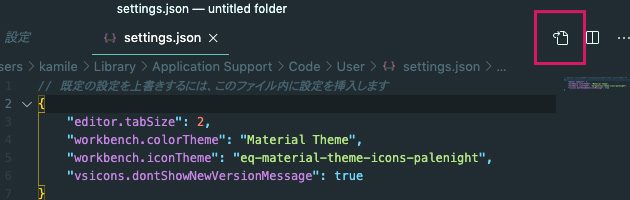

現在こんな感じになっていると思います。

```json
// 既定の設定を上書きするには、このファイル内に設定を挿入します
{
  "editor.tabSize": 2,
  "workbench.colorTheme": "Material Theme" //ここはテーマによって違う
}
```

<br>先ほどのように一個づつ設定を変えていってもいいのですが結構設定が多いので、コードで一気に追加します。

```json
// 既定の設定を上書きするには、このファイル内に設定を挿入します
{
  // タブサイズをスペースに
  "editor.tabSize": 2,
  // 配色テーマ
  "workbench.colorTheme": "Material Theme",
  // カーソルを見やすくする
  "editor.cursorBlinking": "smooth",
  "editor.cursorSmoothCaretAnimation": true,
  "editor.cursorStyle": "block",
  // 半角スペースを常に表示
  "editor.renderWhitespace": "all",
  // 起動時に前回開いていたワークスペースを開く
  "window.restoreWindows": "one",
  //インデントにさらにガイドライン追加
  "editor.renderIndentGuides": true,
  // 未保存のタブを分かりやすくする
  "workbench.editor.highlightModifiedTabs": true,
  // Emmetを使用しないファイル形式
  "emmet.excludeLanguages": ["json"],
  "emmet.variables": {
    // Emmet で展開される HTML の言語を変更
    "lang": "ja"
  },
  "emmet.preferences": {
    "filter.commentAfter": "\n<!-- /[#ID][.CLASS] -->"
  }
}
```

設定したら、さっきのファイルの中身を消してもう一度 Emmet でコードを書いてみましょう。

!+タブキーで展開し、`body` のなかに以下のようにコードを書いて展開してみましょう！

```
.parent>ul.child>li*3{test$}|c
```

`|c`を最後につけるとコメントが追加されます。

展開された HTML はこちらです。

```html
<!DOCTYPE html>
<html lang="ja">
  <head>
    <meta charset="UTF-8" />
    <meta http-equiv="X-UA-Compatible" content="IE=edge" />
    <meta name="viewport" content="width=device-width, initial-scale=1.0" />
    <title>Document</title>
  </head>
  <body>
    <div class="parent">
      <ul class="child">
        <li>test1</li>
        <li>test2</li>
        <li>test3</li>
      </ul>
      <!-- /.child -->
    </div>
    <!-- /.parent -->
  </body>
</html>
```

スペースが`・`で表示されるのでインデントの狂いにも気づきやすくなります。

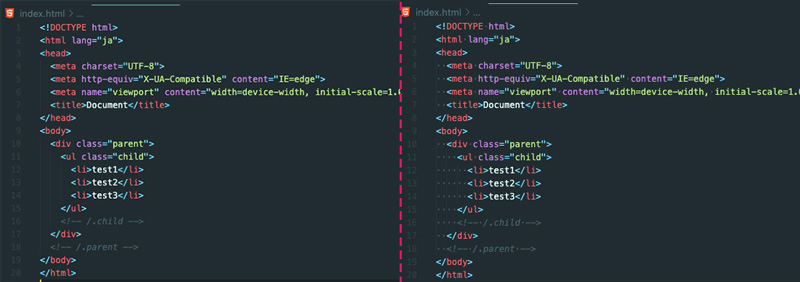

### CSS ファイルを追加してみる

css を html ファイル側から追加してみましょう！

title タグの下に`link:css`と入力しタブ展開します。

```html
<title>Document</title> link:css
```

link タグが追加されます。

```html
<!DOCTYPE html>
<html lang="ja">
  <head>
    <meta charset="UTF-8" />
    <meta http-equiv="X-UA-Compatible" content="IE=edge" />
    <meta name="viewport" content="width=device-width, initial-scale=1.0" />
    <title>Document</title>
    <link rel="stylesheet" href="style.css" />
  </head>
  <!-- 省略 -->
</html>
```

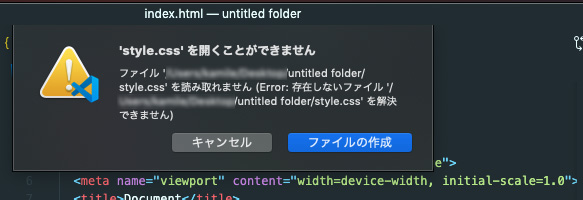

`href`の値、`style.css`を cmd を押しながらクリックすると「ファイルを開くことができません」と表示されます。ファイルの作成を押すと、style.css が追加されます。

適当に CSS を書いてみましょう。

*c#333+タブ*でコードが展開されます。

```css
body {
  color: #333;
}
```

## VS Code を拡張しよう
VS Code がさらに使いやすくなるよう、拡張機能をインストールしましょう。

### Prettier Formatterをインストールしよう


html CSS JavaScriptのフォーマットが効くよう*Prettier Formatter* をインストールします。

「Shift+Cmd+X」で拡張機能を開きます。

これでどんなにぐちゃぐちゃなコードを書いても大丈夫です！！

ただ、何でもかんでもフォーマットされると超うざいです。。。。なのでsetting.jsonにHTML、CSS、JavaScript限定にして以下のように設定しておくことをオススメします。

```json
// フォーマット
"editor.formatOnSave": false,
"[html]": {
    // ファイル保存時に自動でフォーマット
    "editor.defaultFormatter": "esbenp.prettier-vscode",
    "editor.formatOnSave": true
},
"[javascript]": {
    "editor.defaultFormatter": "esbenp.prettier-vscode",
    "editor.formatOnSave": true
},
"[css]": {
    "editor.defaultFormatter": "esbenp.prettier-vscode",
    "editor.formatOnSave": true
}
```

### オススメの拡張機能のご紹介・もっともっと便利にコーディング

さらに効率よくコードを書くためにそのほかのいくつかの拡張機能も必要に応じてインストールしましょう！

出来るだけHTML、CSSのコーディングが快適かつウキウキコーディングできるプラグインを厳選してみました。

<small>※ プラグインは名前でカンタンに探せます！</small>

- _Bracket Pair Colorizer_<br>ペアの{}（波括弧）を色付けして見分けやすくしてくれる拡張機能です。JavaScriptやCSS（特にSCSS）の{}（波括弧）の入子って地獄。ペアの色が違うだけで助かります。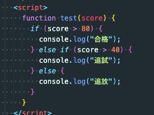<br>

- _Community Material Theme_<br>VS Codeに使えるテーマです。デフォルトより遥かにオサレ。インストールと同時にファイルのアイコン類も変えられるようになります。<br>
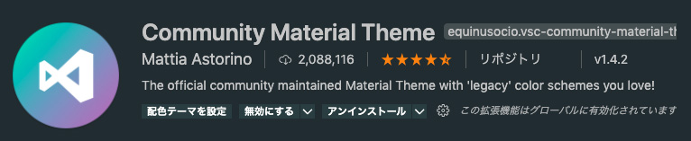<br>

- _Bracket Pair Colorizer_<br>ペアの{}（波括弧）を色付けして見分けやすくしてくれる拡張機能です。JavaScriptやCSS（特にSCSS）の{}（波括弧）の入子って地獄。ペアの色が違うだけで助かります。<br>

- _Live Server_<br>VS Codeで簡易ローカルサーバーを起動することができます。ボタンで一発インストールするだけでタスクランナー使えます。作業効率がアップするので駆け出しさんにもオススメです!<br>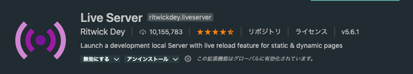<br>

- _Auto Rename Tag_<br>ペアになっているHTML/XMLタグの名前を自動的に変更できます。後からタグを書き直したいなんてシチュエーション日常茶飯事だから入れて損はなし。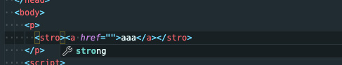<br>
- _HTML CSS Support_<br>HTMLに対するCSSのサポート。class属性の補完、ID属性の補完、css、scssファイルの検索をしてくれます。)<br>
- _CSS Peek_<br>HTMLのidやclassへ定義ジャンプしたり、HTMLファイル上でCSSスタイルを確認できます。)<br>
- _zenkaku_<br>見つけたら排除！！全角スペースほどコーディングで邪悪なものはないです。地味だけど長年お世話になってる拡張機能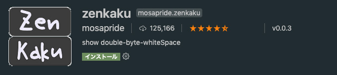<br>

## まとめ・VS Codeを使いこなしてコーディング上手になろう！
VS Codeが生まれたのは2015年。当時は私の周りは皆Sublime Text使っていて、VS Code自体はまだ注目されていませんでした。ところがいつの間にかめちゃめちゃ使い勝手がよくなり、世界でシェアNo.1の高機能エディターとなりました。

Gitとの連携もカンタンでこれで無料ってめちゃめちゃいいです！

初心者コーダーに贈る！超軽量高機能エディターVS Code入門 2にはスニペットの作り方とGit連携について綴る予定です。しばしぽ待ちください！

これからHTMLなどのコーダーを目指す方はとりあえず、ショートカットと死ぬほどEmmet覚ると幸せになれそうです！

めっちゃ長くなってしまいましたが最後までお読みいただきありがとうございました！！

## おまけ・VS Code ショートカット一覧

現在ショートカット早見表を追加中です！！

必須ショートカットは星*★*、おすすめショートカットはハート*❤︎*です！

一覧は PDF でも配布されてます！

- [Windows ショートカット一覧](https://code.visualstudio.com/shortcuts/keyboard-shortcuts-windows.pdf)
- [Mac ショートカット一覧](https://code.visualstudio.com/shortcuts/keyboard-shortcuts-macos.pdf)

<div class="box">
<h4>余談：ショートカットを死ぬ気で覚えて！</h4>
この記事は先ほども言ったように今頑張っている駆け出しエンジニアに向けた記事です。エンジニア講師の経験上、勉強始めたばかりの方に多く見られるのはショートカットが使えない場合が多いです。ショートカットを使えるだけで、<em>一作業0.2 ~ 0.3秒づつくらい短縮</em>できます。これが積み重なると大きいし、作業の速さはコーダーにとっての価値になります。
</div>

### 一般

| Windows       | Mac         | 概要                                                  |
| ------------- | ----------- | ----------------------------------------------------- |
| Ctrl+Shift+P  | Cmd+Shift+P | _★_ コマンドパレットを開く                            |
| Ctrl+P        | Cmd+P       | _★ ❤︎_ クイックオープン（ファイルなどを探すのに便利） |
| Ctrl+Shift+W  | Cmd+Shift+W | *★*ウィンドウやワークスペースを閉じる                 |
| Ctrl+Shift+N  | Cmd+Shift+N | *★*新しいウィンドウを開く                             |
| Ctrl+K Ctrl+S | Cmd+K Cmd+S | キーボードショートカットを開く                        |

キーボードショートカットでは、ショートカットを当て、変更ができます。よく使う機能でショートカットが当たってないものは当てておきましょう。


### ファイル操作系

| Windows       | Mac          | 概要                                                                                           |
| ------------- | ------------ | ---------------------------------------------------------------------------------------------- |
| Ctrl+O        | Cmd+O        | _★_ 既存のワークスペースやファイルを開く                                                       |
| Ctrl+N        | Cmd+N        | _★_ 新しいファイルを開く                                                                       |
| Ctrl+S        | Cmd+S        | _★_ ファイルを保存                                                                             |
| Ctrl+Shift+S  | Cmd+Shift+S  | _★_ 別名でファイルを保存                                                                       |
| Ctrl+K S      | Cmd+Option+S | _★_ すべてのファイルを保存                                                                     |
| Ctrl+W        | Cmd+W        | _★_ 現在のエディターを閉じる（開いているエディターがなくなったらワークスペースも閉じられます） |
| Ctrl+K Ctrl+W | Cmd+K Cmd+W  | _★_ すべて閉じる                                                                               |
| Ctrl+Q        | Cmd+Q        | _★_ VS Code 終了                                                                               |

### エディター操作系

行単位の操作と開いているファイルをタブ切り替えでかなり作業が早くなります。

| Windows           | Mac                             | 概要                           |
| ----------------- | ------------------------------- | ------------------------------ |
| Ctrl+X            | Cmd+X                           | _★_ カット                     |
| Ctrl+C            | Cmd+C                           | _★_ コピー                     |
| Alt+ ↑ / ↓        | Option+↓ / Option+↑             | _★_ 行の移動                   |
| Shift+Alt + ↓ / ↑ | Shift+Option+↓ / Shift+Option+↑ | _★_ 行のコピー                 |
| Ctrl+Shift+K      | Shift+Cmd+K                     | _★_ 行の削除                   |
| Ctrl+Enter        | Cmd+Enter                       | _★_ 空の行を下に追加           |
| Ctrl+Shift+Enter  | Shift+Cmd+Enter                 | 空の行を上に追加               |
| Ctrl+Shift+\      | Shift+Cmd+\                     | カッコ（()[]など）へ移動       |
| Ctrl+] / [        | Cmd+] / Cmd+[                   | _★_ インデント追加・削除       |
| Home / End        |                                 | 先頭・最後へ移動               |
| Ctrl+Home         | Cmd+↑                           | _❤︎_ ファイルの先頭へ移動      |
| Ctrl+End          | Cmd+↓                           | _❤︎_ ファイルの最後へ移動      |
| Ctrl+↑ / ↓        | ⌃PgUp / ⌃PgDn                   | _❤︎_ 上下の行の入れ替え        |
| Alt+PgUp / PgDn   | Cmd+PgUp /Cmd+PgDn              | ページの入れ替え               |
| Ctrl+Shift+[      | Option+Cmd+[                    | _★❤︎_ 次のタブのファイルへ移動 |
| Ctrl+Shift+]      | Option+Cmd+]                    | _★❤︎_ 前のタブのファイルへ移動 |
| Ctrl+K Ctrl+C     | Cmd+K Cmd+C                     | 行にコメント追加               |
| Ctrl+K Ctrl+U     | Cmd+K Cmd+U                     | 行のコメント削除               |
| Ctrl+/            | Cmd+/                           | _★_ コメントの追加と削除       |
| Shift+Alt+A       | Shift+Option+A                  | 空のコメント追加               |
| Alt+Z             | Option+Z                        | 文字の折り返しのオンオフ       |
