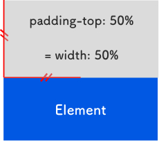
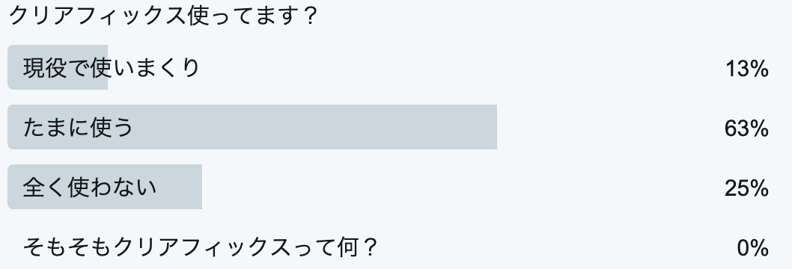

## まずはじめに
Webサイトって横幅は決まってるけど、高さはコンテンツ量によって無限に伸びる特性があります。なので、CSSプロパティも横方向に対しては親切で縦方向に対して無頓着な仕様になっています。そんなことだけじゃないけど、色々めんどくセーなーと日頃思っていることをまとめてます。

## 折りたたみマージン
マージンという厄介なプロパティがあります。上下にあるとなぜか重って相殺されます。<br>
慣れない人からするとめちゃめちゃ混乱することでしょう。


## 画像要素に aタグとかでラップすると下に隙間できる
マークアップ言語は英語圏の人が作ってます。imgタグはフレージングコンテンツ、つまり文字列のような振る舞いをします。


これを回避するためのコードはこちら。
```css
img {
  vertical-align: bottom;
}
```
## 画像のアスペクト比がおかしい
昔の香港ムービーのように画像のアスペクト比がおかしいサイトがあります。<br>
その場合は以下のコードで回避しましょう。こうしておけば高さの比率を保てくれます。

```css
img {
  height: auto;
}
```

ついでに、バナーなどウィンドウ幅や親タグよりデカくてはみ出してることがありますので、それを回避するために、imgタグの初期値として以下を設定しておきましょう。<br>
「画像要素にaタグとかでラップすると下に隙間できる」を回避したいので以下のようしておけば無駄がありません。
```
img {
  max-width: 100%;
  height: auto;
  vertical-align: bottom;
}
```
もしくは要素を dislplay: block; にすれば、インラインな振る舞いがなくなります。
### 画像のアスペクト比について追記
[ZEST2007mini](https://twitter.com/ZEST2007mini)さんより`object-fit`あるじゃないかーとのことでした。
私のブログはできるだけIEをカバーした内容で書くように心がけてるのですっ飛ばしてました。object-fit-imagesというJSを使えばIE対応可能だそうです。

[object-fit-images](https://github.com/bfred-it/object-fit-images)

#### CSS プロパティ object-fit について
img や video コンテナーにどのようにはめ込むかを設定するプロパティ。

```css
img {
   ojfect-fit: contain;
}
```
|値|詳細|
|-|-|
|contain|アスペクト比を維持したままコンテンツボックスに収まる。アスペクト比が合わない場合は余白ができる。|
|cover|アスペクト比を維持したまま、要素のコンテンツボックス全体を埋める。アスペクト比と合わない場合は、画像が切り取られる。|
|fill|オブジェクトのアスペクト比がボックスのアスペクト比と合わない場合は引き伸ばされます。|
|none|置換コンテンツは、拡大縮小されません。|
|scale-down|オブジェクトの実際のサイズが小さいほうを採用します。|

## パディングの縦方向を%指定したら変な値になる
パディングの縦の挙動が不思議。なぜか横幅を参照して算出してくれます。<br>
なので、それを利用して Google マップや YouTube などの iframe をレスポンシブ化できます。



アスペクト比16:9の場合、以下のようなコードになります。<br>
9 ÷ 16 = 0.5625 なので 56.25% になります。

```css
.iframeWrapper {
  height: 0;
  width: 100%;
  padding-top: 56.25% ;
  position: relative;
  overflow: hidden;
}

.iframeWrapper iframe {
  position: absolute;
  top: 0;
  left: 0;
  height: 100%;
  width: 100%;
}
```
## 高さを 100vh 指定したら、iPhone の Safari で見るとフッターメニュー分隙間ができる

高さを 100vh 指定したら、iPhone の Safari で見るとフッターメニュー分隙間ができる
## アンドロイドで明朝体が使えない
機種依存でも明朝体は品があっていいですよね。アンドロイドユーザーってなんでみんな変なフォント使ってるんでしょう？使いたければWebフォントで代用しましょう！

## 游ゴシック、游明朝IEでバグる
もうメイリオ使いましょう。以下のようにハックすればOK。

```css
_:-ms-fullscreen, :root body {
  //ここにフォントファミリーの設定
}
```
## パディングが要素からはみ出す
CSS をリセットするときにボーダーもパディングも内側に含めましょう。

```css
* {
  box-sizing: border-box;
}
```
## クリアフィックス、、、、やめましょ
親要素に擬似要素（::beforeと::after）を無理くり追加してfloat解除するのやめましょ。


もうすでに使える便利な CSS のレイアウトモジュールはあります。<br>
現時点では flex を積極的に使って、IE の利用者が格段に減ったら grid を使いましょう。

それにしても Win ユーザーってなんであんなに頑固にIEを使い続けるんだろう。。。。ラストモヒカンすぎて涙がちょちょぎれます。

## まとめ
現時点で思いつくだけの CSS の変だなーと思うところと回避方法を書いてみました。<br>
思い出せたらまた追記します。<br>
皆さんのコーディングライフの一助となれば幸いです。<br>
最後までお読みいただきありがとうございました。
