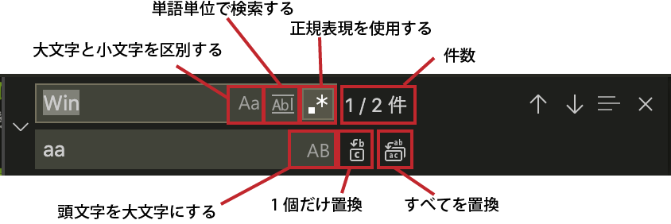
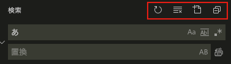
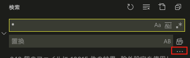
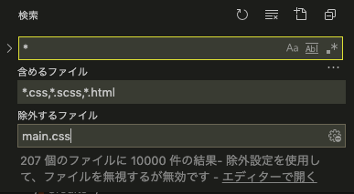
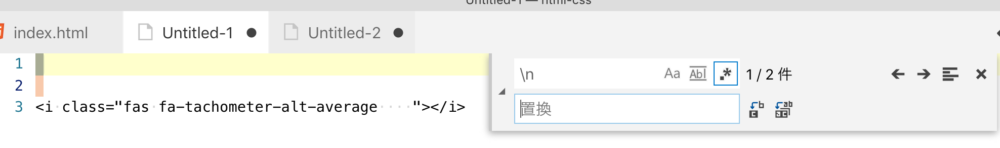
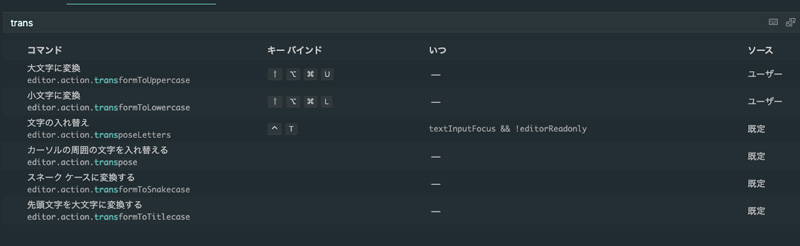
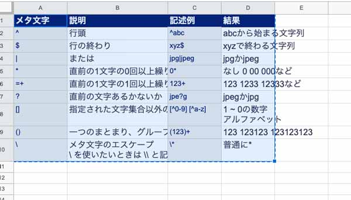

## 前提条件・VS Codeを使う
使用ツールはVisual Studio Code（以下VS Codeと省略）。

ざっくり言うと、制作部をフォルダー単位で管理できたり、コーディングしやすい機能が最初から備わっている、Microsoft発の高機能エディターです。

この記事では深く触れませんので、VS Codeに関する記事も合わせてお読みください。

<a class="article-link" href="/blogs/entry266/">
<section><div class="article-link__img"></div><div class="article-link__main">
<div class="article-link__main__title">初心者コーダーに贈る！超軽量高機能エディターVS Code入門1</div>
<p class="description">コーディング初心者に贈るVS Code完全マニュアル第1弾！インストールから拡張機能、カスタマイズまで、コーディング初心者･･</p>
<p>
<time datetime="2018-06-11">2018.06.11</time>
</p>
</div>
</section></a>

今回は、単一ファイルの置換方法と複数ファイルの置換方法両方のやり方をご紹介します。

### 単一ファイル内での置換
ショートカットキー `cmd + opt + F (Win cntrl + H)`で置換機能。検索だけしたいときは、ショートカットキー`cmd(Win cntrl) + F`。



* 大文字と小文字を区別する
* 単語単位で検索する
* 正規表現を使用する
* 件数
* 頭文字を大文字にする
* 1個だけ置換
* すべてを置換

### 複数のファイル内での置換
余談ですが検索だけしたいときは、ショートカットキー`cmd(Win cntrl) + shift + H`を押すとエディターの右上に検索ボックスが出てきます。ちなみに、ショートカットキー`cmd(Win cntrl) + shift + F`でファイル全体の検索ができます。

上部メニューについて左から解説します。



1. 更新
2. 検索・置換ボックスをクリア
3. 新しい検索を開く(2020年リリースの機能!!)
4. 折りたたみと展開の切り替え

結果をエディター画面に表示できます。マッチした個所やファイルの数だけでなく、その前後行をハイライト付きで一覧表示可能です。

### 細かい絞り込み
ちょっとわかりにくいんですが...ボタンをクリックするとさらにinput窓が出現します。



さらにどんなファイルを対象にするかなど設定でき、細かく絞り込めます。

#### 含めるファイル

探したい探したいファイル名を入力します。

*（ワイルドカード）を使うと、特定の拡張子のファイルが探せて便利です。

例えば、`*.css`、`*.scss`、`*.html`という3つのファイルを探したいとき、,(カンマ)で区切ります。

#### 除外するファイル

除外するファイルに省きたいファイルを設定すると

歯車マークを押すと除外したいファイル名を入力した状態で除外するか否かを切り替えられるので便利です。

こちらも使い方は含めるファイルと一緒で複数あるときは,(カンマ)で区切ります。

すべてまとめるとこんな感じになります！



## よく使う正規表現基本の「キ」を表にまとめました
正規表現で使用する特殊文字は以下の通りです。正規表現では「メタ文字」「メタキャラクター」と呼びます。

使い方をこちらにまとめました。

|メタ文字|説明|記述例|結果|
|-|-|-|-|
|`^`|行頭|`^abc`|abcから始まる文字列|
|`$`|行の終わり|`xyz$`|xyzで終わる文字列|
|`|`|または|`jpg|jpeg`|jpgかjpeg|
|`*`|直前の1文字の0回以上繰り返す|`0*`|なし 0 00 000など|
|`+`|直前の1文字の1回以上繰り返す|`123+`|123 1233 12333など|
|`?`|直前の文字あるかないか|`jpe?g`|jpegかjpg|
|`[]`|指定された文字集合以外の１文字|`[^0-9]` `[^a-z]`|1 ~ 0の数字<br>アルファベット|
|`()`|一つのまとまり、グループ|`(123)+`|123 123123 123123123|
|`` \ `` | メタ文字のエスケープ <br> `` \ `` を使いたいときは `` \\ `` と記述する。|`` \* `` | 普通に*|

正規表現では空白、改行もよく使うのでまとめておきます。

|記号|解説|
|-|-|
|`` \n ``|改行|
|`` \t ``|ハードタブ|
|`` \s ``|半角スペース|

## チートシートのお品書き
* 改行を取り除く
* 2個以上のスペースを取り除く
* URLなどの一括置換
* 連番付きの文字列から数字を取り除く

### 改行を取り除く
いたってシンプル。
```
// 置換する文字列
\n
// 置換後の文字列
なし
```


### 2個以上のスペースを取り除く
もしタブを削除したい場合は(`` \t ``)に替えればオッケー。

### URLなどの一括置換
一度書いたHTMLのソースコードをWordPressなどのショートコードに置き換えないといけないことってありますよね？<br>
そんなときはこいつだ！URLのコード（https://exmample.com/）は適宜変えてください。
```
// 置換する文字列
<a href="https://exmample.com/(.*?)(\">)
// 置換後の文字列
<a href="<?php echo home_url('/$1')?>">
```

### 日本語の間の空白を取り除く
PDFから文章をコピーすると謎の半角スペースが紛れ込んでることがよくあります。
間のスペースを取り除くだけならこんなコードでオッケーです。

```
//置換する文字列
[亜-熙ぁ-んァ-ヶ] [亜-熙ぁ-んァ-ヶ]
//置換後の文字列
なし
```

### 大文字・小文字の変換
置換といえばVS Codeには大文字・小文字変換機能が付いています。

最初の文字だけを大文字に替えたり、スネークケースに変えることも可能です。

よく使う方はショートカットを当てておきましょう。

キーボードショートカットはショートカットCmd+K Cmd+Sでひらけます。

「trans...」あたりの文字で検索をかけたら以下のように絞り込めます。



ショートカットの例。
* 小文字を大文字に Cmd+Shift+Option+U
* 大文字を小文字に Cmd+Shift+Option+L

### エクセルやスプシで表作成を依頼された時（20/12/15）
テーブルで表を作ってほしいと依頼され時があります。表が長いとコーディングがすげーめんどくさいですよね。。。

そんな時は置換で一気に解決ダー！（猪木風）

挿入したいテーブルを丸っとコピーしてVS Codeに貼り付けます。


セルとセルの間はタブとして認識されるのでそれを利用します。

```
//置換する文字列
^((.*?)\t)+(.*?)$
//置換後の文字列
<tr>\n  <td>$1</td><td>$2</td>\n</tr>
```
<small>※ tdタグを含む$1の部分はセルの数で調整してください。</small>

残ったタブを削除します。
```
//置換する文字列
\t
//置換後の文字列
なし
```

### PHPのif文をヨーダ記法に一括置換（21/04/05）

他でも使えそうですが、通常のコードをヨーダ記法などに書き換えたい時の置換方法です。

演算子を挟んで中身を入れ替えます。他にも応用できます。

```
\$(.*?) !== '(.*?)'

'$2' !== $$$1
```

変換した文字の先頭に$を付与したいときは$$$1とか$$$2とかにします。

ヨーダ記法に関してはこちら。

<a class="article-link" href="/blogs/entry452/">
<section><div class="article-link__img"></div><div class="article-link__main">
<div class="article-link__main__title">WordPress phpcsでコーディング規約を守るコード</div>
<p class="description">この記事はWordPressコーディング規約をphpcs導入して入れたものの、エラー英語だしよくわかんないって嘆いている人向･･･</p>
<p>
<time datetime="2021-04-05">2021.04.05</time>
</p>
</div>
</section></a>


### HTMLタグをガスッと削除（21/04/15）

最近どうしてもHTMLから文字だけ抽出したいケースに出くわしました。

```html
//置換する文字列
<("[^"]*"|'[^']*'|[^'">])*>
//置換後の文字列
なし
```

改行のないHTMLの場合は置換後の文字列を`\n`などにしておくと良いです。

ただ、これだと改行だらけになるので置換で1こだけにします。
```
//置換する文字列
\n+
//置換後の文字列
\n
```

## まとめ・置換最強
置換を制すればコーディング効率も抜群に上がります。

ぜひマスターして、ムダな作業を減らしましょう。

この記事が皆さんのコーディングライフの一助となれば幸いです。

最後までお読みいただきありがとうございました。
