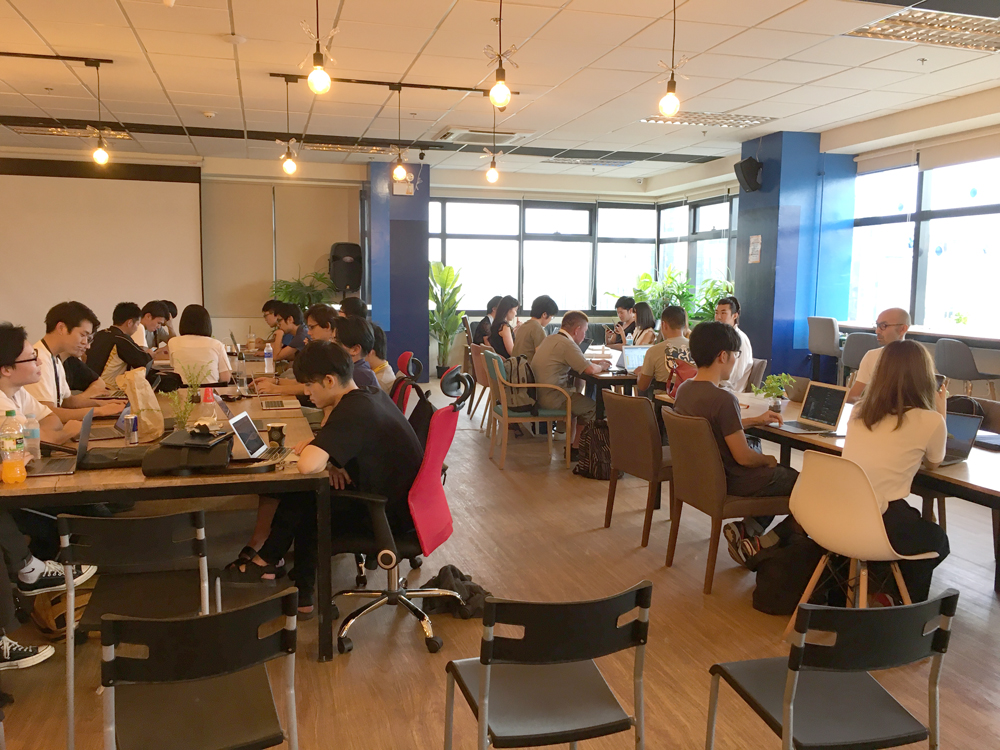

## SEO勉強会inセブ島！のレベル感とか概要とか

講師はウェブ解析士協会 (WACA)の江尻さん。

今回の勉強会はWeb解析云々ではなくどちらかというと、Google アナリティクス個人認定資格（GAIQ）ベースの質問を交えながらGoogleアナリティクスを使えるようになってねー的な内容でした。

感想としてはGoogleアナリティクス触ったことない人にはちょっとキビシーかなー。。。やや上級と言った肌感ではありましたが楽しく勉強させていただきました。

まあ、SEOタダで勉強したいならちょっとやそっとは勉強してこよう。どんまい！！

ちなみにワタクシ、休みの時くらいパソコン持ちたくない！！ 
ノートとペンで参戦します。

うぇーーい。

## 激白すると、遥か昔にWeb解析士の試験受けたことがあります
2012年くらい（昔々その昔なので、記憶が定かではない）に受講して、初級まではとりました。

余談ですが、当時勤めてた会社がEC（ネットショップ）系の会社で、ユーザーに自社商品の購入を促すページを作ってました。

当時純真だった私は会社の役に立とう！と考え、一念発起してWeb解析の勉強をすることにしました。

ところがどっこい私のマネージャー、「SEO会社にお金払えば解決できるから、勉強したところでお金と時間が無駄」的なことを言放ちました。鼻で笑いながら。マジで鼻で笑われたので今でも鮮明にその状況を思い出せます。

今でも鬼のように根に持ってます。

当時のSEO対策といえば被リンク購入。ブラックハット（SEO手法としてはアウトなヤツ）です。

被リンクが多いと、Googleはそのサイトの評価を上げていたので、みんな普通にそんな対策をしてました。

今ではアルゴリズムが改善してそんな対策すぐ見破られてしましますし、当然ドメインの価値は下がります。

なので今となっては、

ザマーミロー！という気分です。

ちなみにWeb解析士上級はお財布事情で勉強してません！！最近当時一緒に勉強していたお友達が上級を受講して受かった様で羨ましい限りです。

## 押さえておきたいポイント
Googleアナリティクスを使う上で、Web解析士の視点でいくつかご紹介いただきました。

### Googleアナリティクスのデータは見る順番が大切
GoogleはオンラインGoogleアナリティクス講座を無償で提供してます。私も勉強してます。

通常、Googleアナリティクスは以下の順番で確認するのが好ましいとオンラインGoogleアナリティクス講座では言われてます。

1. オーディエンス
2. 集客
3. 行動
4. コンバージョン（成果）

とはいえ、どんな成果が出てるかを真っ先に確認したいもの。 
なのでこんな感じで見るのがオススメとのこと。

(オーディエンス)
1. コンバージョン（成果）
2. 集客
3. 行動

### 抑えておきたい4つのキーワード
Googleアナリティクスのいいところは膨大なデータを切り口と指標の2軸で分析できるところです。

さらに欲しいデータを抽出していけば、自分の欲しいゴールに近づける様になります。

とりあえず超簡単な説明ですが以下。

#### ディメンション
レポートなどでの切り口のこと。ランディングページ（最初の到達ページ）に焦点を当てるのかなど。

#### メトリクス（指標）
ある項目についての定量的データ。直帰率、PV数、セッション数などがそれに当たります。

#### セグメント
セッションもしくはユーザー単位で絞り込みをかける機能です。 
最初からデフォルトで22種類のセグメントが登録されていますが、オリジナルのセグメントを作成することもできます。

#### フィルター
何かを排除したりできます。みんなよくやってるのが自社のIP排除。 
それ以外も、ディメンションごとにフィルターかけることができます。
## まずは一目見て欲しい分析が見れる「カスタムレポート」を作れるように！
「カスタムレポート」とは自分たちが欲しい情報だけを抽出していつでも見れる様にまとめておくことができる機能です。膨大な機能のあるGoogleアナリティクスだからこそ、必要なデータをまとめておくことは重要です。

昔、Web担フォーラムの記事でスターターセットの作り方を見つけたのでみなさんにご紹介したいのですが探しきれませんでした。

見つけたら教えてほしですw
## まとめ
SEO勉強会inセブ島では懇親会まで参加させていただき、とても楽しい時間を過ごさせていただきました。

何よりも若者への未来の話までできて良かったです。 
日本は若者がどんどんいなくなってます。若者はとても貴重な存在です。 
大切に育てないといけないなーって思いました。

開催運営のSprobe 村田さん、金田さんありがとうございました。
