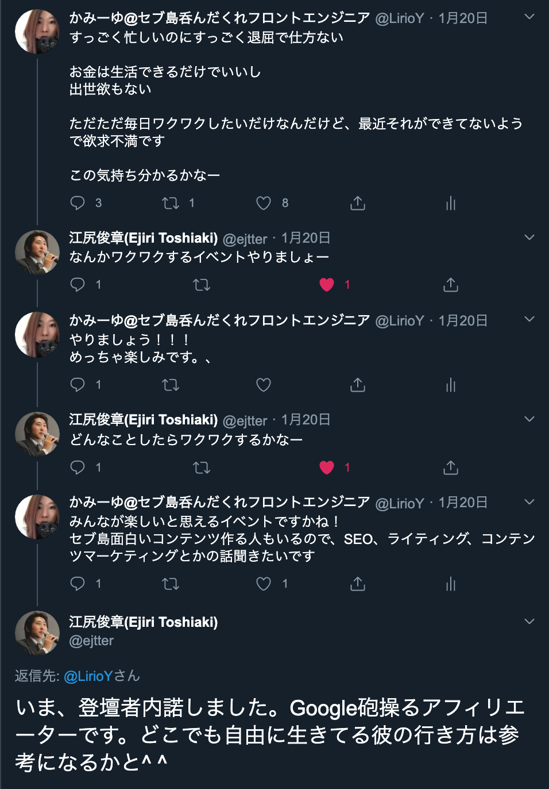
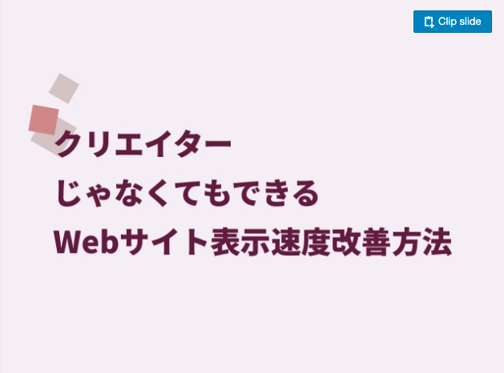
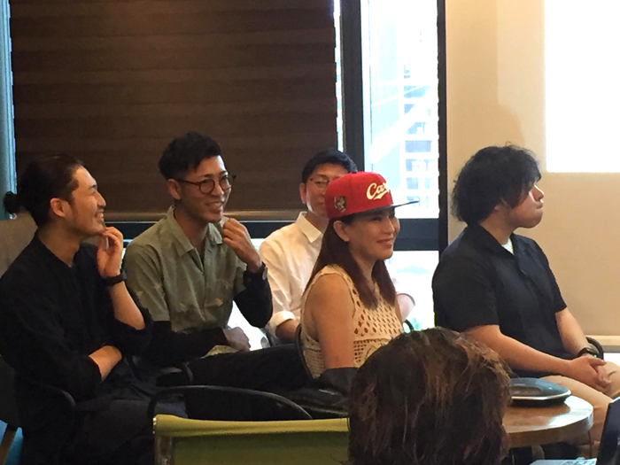
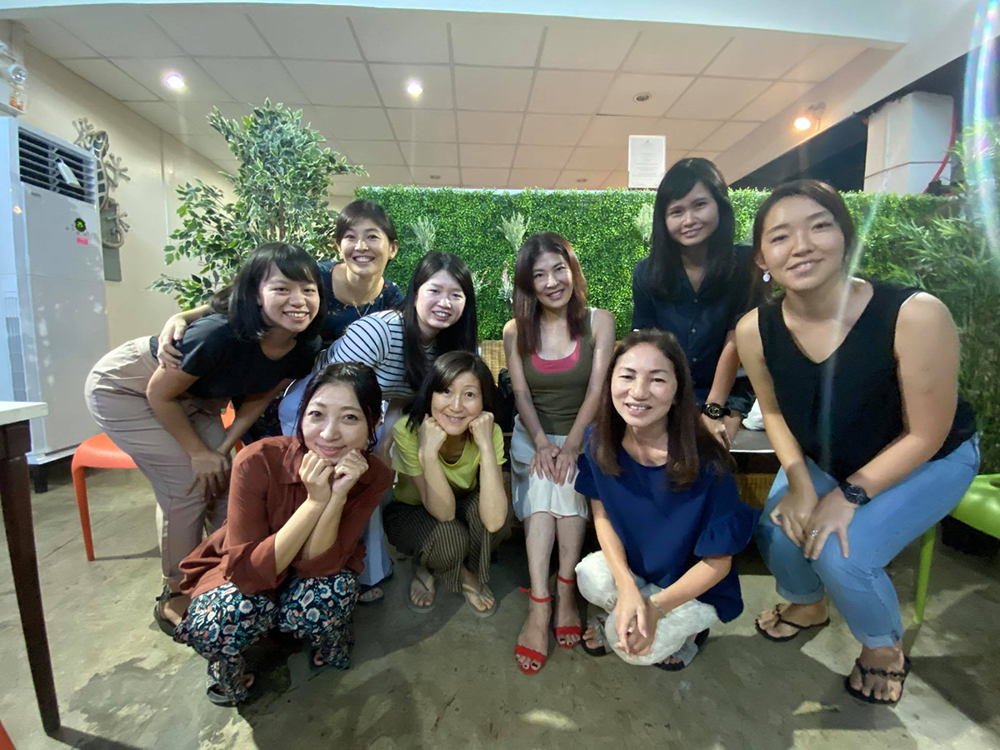

## SEO・マーケ・アフェリエイト・メディア立ち上げなどの珍しい勉強会がセブ島で開催
セブ島では年に数回、WACA（Web解析士協会）さんとスプローブさん主催でWeb解析系の勉強会を開いているとのこと。

ちなみに前回の様子はこちら

<a class="article-link" href="/blogs/entry341">
<section>

SEO勉強会に参加しました in セブ島

Sprobeさん主催のSEO勉強会に参加してきました。Googleアナリティクスの機能を基本からちょっとしたアドバンスな部分までハンズオン形･･･

<time datetime="2019-11-18">2019.11.18</time>

</section>
</a>

私も昨年11月参加、Web解析士協会理事の江尻さんとお友達にならせていただきました。

下記のようにTwitterで「**超退屈だ！欲求不満だ！**」とつぶやいたら、江尻さんがおもしい人を日本から連れてきてくると約束してくれました。

セブ島での開催が決定し、私もついでに登壇者の1人としてオファーしてもらえました。

このイベント、SEOやリスティング、Webマーケを軸にウェブの世界でどう生き抜くかをテーマに各登壇者が話すという、なかなかおもしろいイベントとなりました。

開催・運営・会場提供などに携わったWacaの川口さん、スプローブの村田さんをはじめとするスタッフの方には心から感謝です！

イベント詳細はこちら

[【2020/2/29 オンライン参加可】ウェブ生存戦略セミナー（アフィリエイト/SEO/メディア運営) (解析士割有り）](https://web-mining.doorkeeper.jp/events/103375)

### 当日の私のスライド
有料イベントだったため一部、内容を伏せてあります。

[クリエイターじゃなくてもできるWebサイト表示速度改善方法（事例のこぼれ話のおまけつき）](https://www.slideshare.net/yurikamimori/webweb-230646329)

クリエイターじゃなくてもできるWebサイト表示速度改善方法（事例のこぼれ話のおまけつき）

## 濃ゆいメンバーがセブ島に集結
仕事に忙殺されて、記事を書くのに1か月もかかってしまいちょっとあやふやになりつつ、遅ればせながら登壇者をご紹介します。

各登壇者の詳しいプロフィールに関しては、以下リンクを参考にしていただければ幸いです。

[【2020/2/29 オンライン参加可】ウェブ生存戦略セミナー（アフィリエイト/SEO/メディア運営) (解析士割有り）](https://web-mining.doorkeeper.jp/events/103375)

### 小林 貴志さん
通常アフェリエイターは稼ぐ方法を教えてくれないみたいですが、惜しみなくアフェリエイトで稼ぐ方法をお話いただけました。
アフェリエイトの真髄を知り尽くしている小林さん。大阪でアフェリエイト酒場なるものがありそこに出没するらしく、アフェリエイトのノウハウをあれこれ教えてもらえるようです。興味がある方はどうぞ。

### 國吉イチさん
メディアの立ち上げの話でした。
現在同僚で若干入社したばかりの19歳（だったと思う）で弊社のメディアの立ち上げを行い、月間50万PVまで育てた猛者です。ブログ結構面白いし、こっそり尊敬してます。

### 神守由理子(私)
Webサイト表示スピードに関するお話をさせていただきました。
Webサイトは大事なコンテンツを乗っけるためのツール。なのでコンテンツをいかに快適に読ませるかがモットーです。

セブ島であれば週末リップルというバーに行けば私に会えます。Webサイト改善の話が聞きたい時はお酒を一杯おごってくださいwww

### 辻 幸範さん
事業のメディア化のお話。江尻さんのテーマに沿ってサバイブなお話でした。私は勝ち負けあんまり気にしない方ですが、生き残るためには時に勝つことも必要だということ。

そして、辻さんが行なっているギルドプロジェクト、超楽しそうです！！

私も今度から何かやりたいことがあったら、誰かにお金出してもらえる？って聞いてみようと思います。自分のアイデア・提案力などに価値があるか簡単に計れますよね。

### 森永 乃武幸さん
意思決定などのマインドセットのお話でした。

小手先の知識だけではダメだと思いました。ちなみに森永さんはWeb解析のスペシャリスト。午後はWeb解析士の講義でも登壇されていたようです。
懇親会では、私が「再びWeb解析士受けようかなー」（数年前に合格済）と言っていたらやめといた方がいいとアドバイスいただきましたw

### ファシリテーター：江尻 俊章さん
2000年からWeb解析に携わっているWeb解析士協会理事の方です。話するととってもフランクで若者を応援する姿勢が大好きです。こういう大人が日本にもっと増えると日本は幸せになれそうですね。

## おまけ:セブポットさんに遊びに行ってきました
イベントにセブ島でフリーペーパーを配布したり情報発信サイトを運営しているセブポットさんという企業の方が参加していて、お声がけいただき遊びに行ってきました。

Webサイト：[セブポット](https://www.cebupot.com/)

イベントに登壇するとこういった**思わぬ出会いがありとてもワクワク**します。

イベントでは話できなかった、Webサイトの改善すべき点などを雑談を交えながらお話しさせていただきました。
とても楽しかったです！ありがとうございます。

私、いつも言ってるんですが**1番大切なのはコンテンツ**！**コンテンツが薄っぺらかったり、価値がユーザーに伝わらなかったら意味がない**と断言します！！！

単に検索順位を上げるためだけにやっている施策などカスです。

今までの経験上、熱量の高いコンテンツは確実に閲覧してもらえます。熱は絶対に伝わります。

次に重要なのは、ユーザーが**コンテンツを快適に閲覧できるかどうか**、です。

表示スピードだけじゃないです。色やフォントの種類やサイズ、導線、すべて考慮してはじめて使いやすいサイトになります。アクセシビリティやユーザビリティ大事。

運用する方、オーナーの方は目先の検索順位に惑わされず、**そのWebサイトが誰のために存在するサイトか？という軸からブレないで**ください。

## さいごに
こういったナレッジシェアって大切！ITの進化は目まぐるしい。ほんっとついていくの大変です。誰かが中心になって、こういう会をどんどん開いていけるといいですね。

コンテンツラブの私ですがまたどこかのイベントで登壇するかもしれませんので見かけたら気軽に声をかけてください^_^

最後までお読みいただきありがとうございました。
