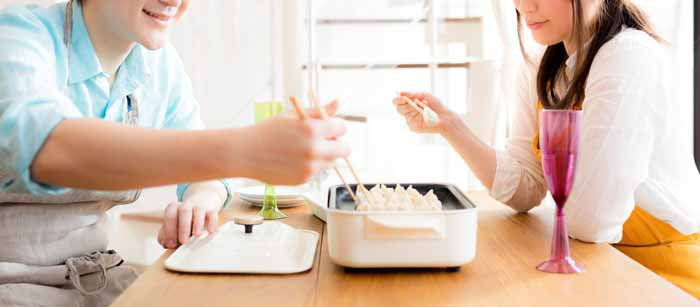
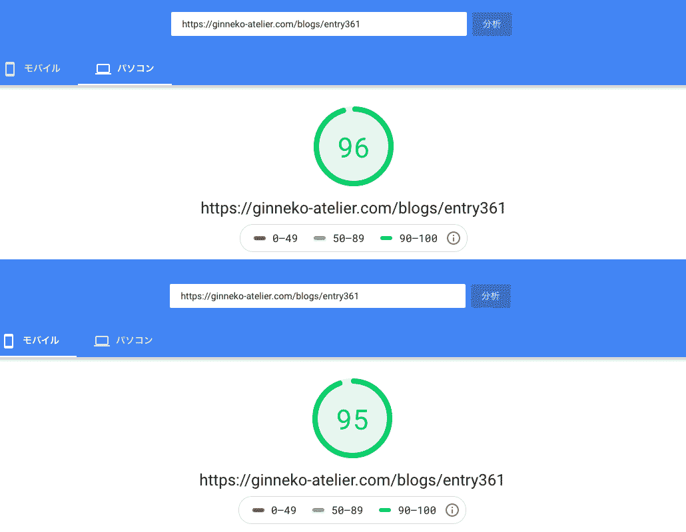
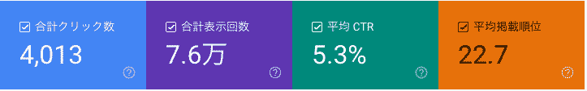
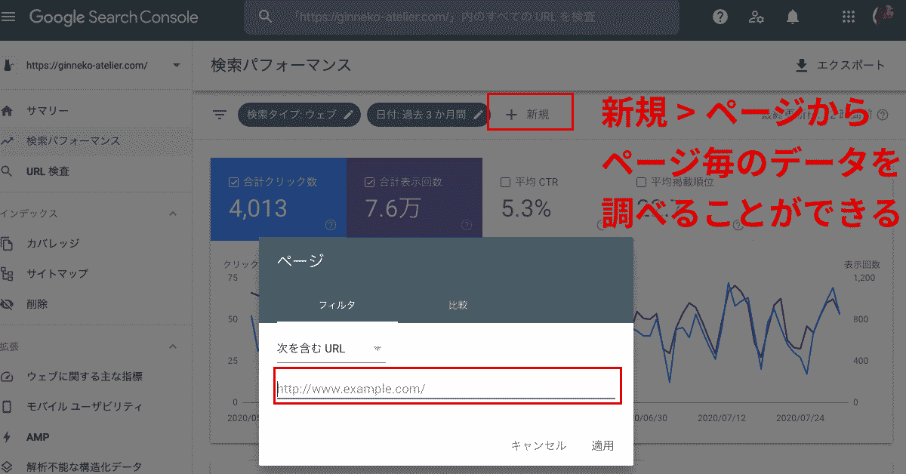
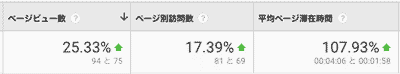

## ブログ運用の伸び悩みは結婚生活のマンネリ化に似ている
突然ですが、みなさん結婚したことありますか？

「あなたー！忘れ物ない？」 
「今日のお弁当あなたの大好きな明太子入りよ❤️」  

結婚して半年から一年くらいはこんなスウィートな茶番劇が続くことでしょう。

そんなスィートな期間は最初だけ。

努力しなきゃ一瞬で遠い思い出になります。「偏に風の前の塵に同じ※」です。

<small><a href="https://manapedia.jp/text/2321">※平家物語冒頭より引用</a></small>

## 人もウェブサイトも年齢とともに劣化します

「結婚当初はあんなに可愛かったのに」  

いつもまでも若いと思ったら大間違い。 
人もウェブサイトも確実に劣化します。

年を取るもんは取る。だから**メンテナンスが必要**なんです。

### ウェブサイトも人もUXやUI大事。できる範囲で最善を尽くす

「年をとったから」 
「子どもを産んだから」  

体型の崩れや見た目の劣化を言い訳にしている人います。  

年齢なりのちょっとした努力の積み重ねはできるはずです。

結婚した途端おうちではジャージしか着ない、毎日すっぴん、、、どんどんズサンになっていく。いつも気を張るのは大変ですが、メリハリは大事です。  

パートナーはそんなあなたを居心地悪いと感じているかもしれません。  

上記はあくまで例で、ノーメイクが好きな人も実際います。 
**どんな人と一緒にいるのが心地いいかなんてパートナー次第**。

逆に相手が求めてもいないのに毎日露出の多い服を着られても迷惑。 
**UI/UXの押し付けほど迷惑なものはありません**。  

ウェブサイトも一緒でユーザーに合わせて最適化します。  

昨今はスマホ第一に考えてサイト作るのが一般的ですが、「銀ねこアトリエ」はテック系の記事が多いせいかPCでの閲覧が多め。  

元々はモバイルファーストで作ってましたが、ユーザーに合わせてPCファーストに切り替えました。  

ちなみに、**ウェブサイトの心地よさの決め手って何だと思いますか？**  

見た目もありますが表示スピードも大きいです。 
なぜならば**サイト表示に3秒以上かかるとユーザーが逃げちゃう**からです。

実は私、サーバーのスペックで表示スピード改善は今のところ諦めていました。  

でもできることはあります。諦めてはダメです！！！
画像・コード・CSS・Webフォントなどを徹底的に軽量化したり遅延読み込みなどを実装しました。

<a class="article-link" href="/blogs/entry325">
<section>

Webサイトの表示速度を真剣に考える

昔いた会社で、画像の圧縮、CSSなどの外部ファイルを徹底して不要ファイルを削除して圧縮してさらにワンソース化した結果、50位から20位以内に･･･

<time datetime="2019-06-21">2019.06.21</time>

</section></a>

おかげさまでPCではどのページもPageSpeed Insightsで90点以上になりました。 
スマホもわりと良好。

### UX/UI改善のまとめ
人もウェブサイトも劣化しないために必要なことは 
この人といて**居心地がいいを無理なくキープ**すること。  

Webサイトも自分だけではなくユーザーにとって居心地がいいを実現することがポイントですね！

## 自分が言いたいことばかり言わず、相手が興味の持てる話題を提供する 
仕事から帰ったら、妻からPTAやパート先・ママ友の愚痴。 
もしくは旦那さんの、会社での功績や自慢話。  

いずれにせよ、ウンザリします。

こんな毎日が続くと結婚生活も嫌気がさしてきます。  

（私も自分の言いたいことを言いつづけて人の話を聞かないタイプではあります。周りのみんな、ごめんちゃい。）  

自分がドヤって気持ちよく書いた渾身の記事ほど意外と読んでもらえないことってありませんか？  

はっきり言います。 
ユーザーは自己満ストーリーを読みたくてサイトに訪れているのではないんです。 
情報が知りたいだけ。

情報を知りたくてググってるだけなんです。

ブログ「銀ねこアトリエ」でも面白半分で書いたくだらない記事があります。3か月間でたった12PVかつ平均滞在時間13秒。自己満足の結果なんてそんなもんです。

<a class="article-link" href="/blogs/entry212">
<section>

カラオケでうろ覚えで歌って90点以上とる方法

先日カラオケでRGばりのうろ覚えカラオケで90点以上たたき出したのでコツをお教えします。

<time datetime="2014-12-24">2014.12.24</time>

</section>
</a>

人間同士の場合、人が聞きたいか聞きたくないかなんて表情か態度で気づくしかありません。

でもご安心ください。**ブログはデータから判断**できます！！！ 
本当にユーザーがAnalyticsやsearch consoleを使ってデータから判断しましょう。

### 相手に興味のある話題に変える方法
第2ステップ。
search consoleを使って自分の記事がどんなキーワードで検索されているかを調べます。

**表示回数**、**掲載順位**、**クリック数**、**クリック率**を確認できます。

検索キーワードでどのくらいの順位に表示されているか調べます。

全体ではなく**ページ単位で分析**することをオススメします！！

* 表示回数 ... そのキーワードに興味のある人の目安になる
* 掲載順位 ... 記事がそのキーワードに即した内容のため上位表示されている

書いた記事が大多数の人に興味があるとは限りません。ニッチでとてつもなく需要があることもあります。よほど表示回数が少なくない以外は掲載順位に着目してみてください。

狙ったキーワードで順位が低い場合、**最低10位ぐらいに上がるまで計測し経過を見つつリライト**します。

ポイントは自分がめちゃ書きたいことではなく、検索キーワードに沿った内容を意識して書くこと。  

ライトな内容の記事を書いている人は10位くらいを目指したほうがいいです。 
ブログサイト「銀ねこアトリエ」はテック系なので20位以降でも結構読まれてます。  

第2ステップ。 
順位が上がってきたらクリック数を増やすことに注力します。

クリック率を上げる一番効果的な方法は**タイトルとディスクリプション（記事の説明）の調整**です。

大抵ユーザーは「記事を読むかどうか」をタイトルとディスクリプションで判断します。  

* タイトルには必ず基本の検索キーワードを入れる
* ディスクリプションにも検索キーワードを散りばめる

<section class="box"><h4>キーワードをディスクリプションに入れる理由</h4>
検索した時に散りばめたキーワードが太字で目立つから、です。 また、タイトルは大幅に変えると順位にモロに影響するので注意してください。
</section>

ここまでできたら、第3ステップ。 
Analyticsも合わせて経過を見ていきます。

とくに私は滞在時間に着目しました。

秒で記事を離れているのであれば、**ユーザーの読みたい内容を提供できていない**ということになります。

そこで、同じキーワードで10位以内に浮上する他の記事がどんな内容じっくり読み漁って行きました。

* このキーワードで本当は何が知りたいのか？
* どのくらい掘り下げた内容が読みたいのか？
* ユーザーがこのキーワードで検索した時、知りたい内容と記事がマッチしているか？
* 他の記事と差別化はできているか？

上記を意識して読み分析し、記事を書き直します。

* サムネイルは適切か？
* 導入文はユーザーに刺さるか？

その後滞在時間の経過を数日観察します。

## つまり、相手が聞いていて楽しい話をするためには？
相手が本当に何を聞きたいか観察することで、どんな話題が喜ばれるか見えてきます。 
人であれば、態度や日常の会話から小さなサインが出ています。

今回の改修&リライトした記事で劇的に改善した事例をご紹介します。

<a class="article-link" href="/blogs/entry336">
<section>

VScodeでカンタン！正規表現置換のためのチートシート

コードをいわゆる「置換（置き換え）」、一気に変換したい！ってときありませんか？「正規表現」を使う･･･

<time datetime="2019-07-20">2019.07.20</time>

</section>
</a>

もともと自分の備忘録適度にテキトーに書いた記事でしたが、表示回数も多いのに直帰率高く滞在時間ほぼ0。 

検索キーワードと記事の内容を照らし合わせ、ユーザーが知りたい情報に気づくことができました。

**結果PVは2倍、滞在時間**も改善しました。  

全体でもタイトルとディスクリプションにテコ入れしたページはたくさんあり、クリック率は1％改善しました。  

人もサイトも自分が言いたいことばかり言っていたらダメ。 
そんなことしていると結婚生活ではパートナーに忍耐を強いることになりますね。

## この記事を書いた理由とか諸々
### ブログ「銀ねこアトリエ」の始まりと現在までの歩み
私はブログ「銀ねこアトリエ」を2014年からスタートさせました。 
フリーランス時代はウェブ制作上に日々の自分の経験したお困りごとを書きとめてました。 
始めた頃は何もしなくてもPV稼いでいて、お仕事のお問い合わせもありました。

ところが、ここ数年会社勤を再スタートし忙しくて放置。 
しかも今年に入ってドメインの更新を忘れて止まるという失態を犯しました。

### ボロボロになったブログサイトは結婚でテコ入れしなかった生活に似ている
結婚生活もウェブサイトも共通したダメポイントは**相手への想像力と配慮の欠如**。

一緒に過ごして相手が感じる居心地のよさやどんな話題や経験を相手に提供できるか、です。

もちろん、自分を大切に。相手の犠牲になる必要はありません。  

家族をないがしろにしたらこんな感じだろうということで、結婚生活に例えました。

きっとうまく回せば、結婚生活でもハッピーになれる。…と思います！！！  

私が言ったところで説得力はありませんがww
## まとめ
7月1日より、1か月間ブログサイト「銀ねこアトリエ」改修してみて感じたことなどを結婚生活に例えて紹介させていただきました。

ちなみに私自身はシングル・エンジニアライフを満喫しているのでご安心を！
みなさんのSEOライフの一助となれば幸いです。

最後までお読みいただきありがとうございました。
