## WordPressブログ開設のためにざっくり何をする必要がある？
この記事は月約千円で始めるWordPressブログ解説の後半です。<br>
前回の記事を読みたい方はこちらから。

<a class="article-link" href="/blogs/entry379">
<section><div class="article-link__img"></div><div class="article-link__main">
<div class="article-link__main__title">【WordPress初心者へ】月額1000円！ワードプレスブログの始め方・前半</div>
<p class="description">WordPressって人気ですよね。WordPress使ってブログ始めたいけど何から手をつけて･･･</p>
<p>
<time datetime="2020-07-29">2020.07.29</time>
</p>
</div>
</section>
</a>

* サーバーの準備（ドメインの反映に時間かかるよ）
* WordPressインストール
* WordPressの各種設定をしていこう（← 後半はここから）
* WordPressのブログを書くための準備
* 記事を書いてみよう
* Analytics、search consoleの準備と設置

| |費用|
|-|-|
|年間| 5,000円 ~ |
|ドメイン取得料金|500円 ~|

初期費用金額の試算を改めて紹介します。

サーバー次第ですが**月額1000円以内で始めることができます**！

必要なのはやる気です。

## WordPressの各種設定しよう
ブログを始めるために設定をしましょう。

ここでは最低限の設定のみ説明します。<br>
今回ご紹介するのは最低限ブログを公開するための内容です。

前回はテーマをCocoonに設定するところまで行いました。

### サイトの基本のSEO情報
ウェブサイトはユーザーが見たい情報をグーグル検索で探してたどり着くオーガニックサーチがきっかけで流入されてることが多いです。

私のサイトも7割以上がオーガニックサーチからの流入で記事を読んでもらってます。


クリックされる時に重要なのがサイトの**タイトル**と**ディスクリプション**です。

みなさんも検索するときに出くわす以下のような表示です。

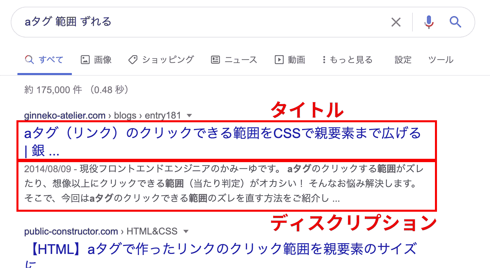

必ずタイトルとディスクリプションを設定しましょう。

#### タイトルの設定
Cocoon設定から全体のタイトルとサイトの説明を設定しておきます。

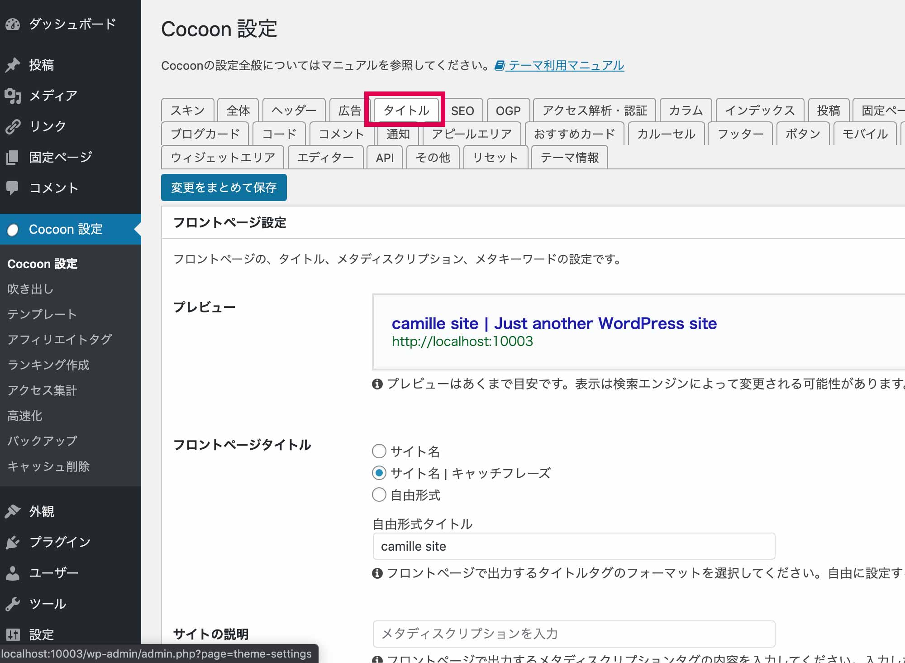

#### AMPをオンに

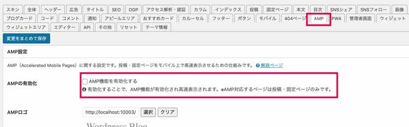

#### ファビコンを設定する
ファビコンとはブラウザーのウィンドウタブの左側にあるちっこいアイコンです。

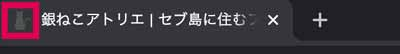

ファビコンはユーザーがサイトを探すための目印にもなります。
ファビコンの設定は「管理画面」 > 「外観」 > 「カスタマイズ」から画像をアップロードするだけです。

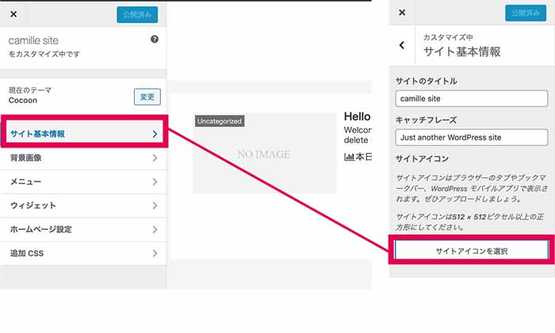

最近ライト・ダークモードと使っている人がいるのでデザインによっては白背景などをつけたほうが良さそう。いずれにせよ、必ず設定しましょう。

### パーマネントリンクの設定
SEO上重要なのがURL。それをWordPressでは「設定」 > 「パーマリンク設定」からドメイン以下のURLの出力条件を変えることができます。

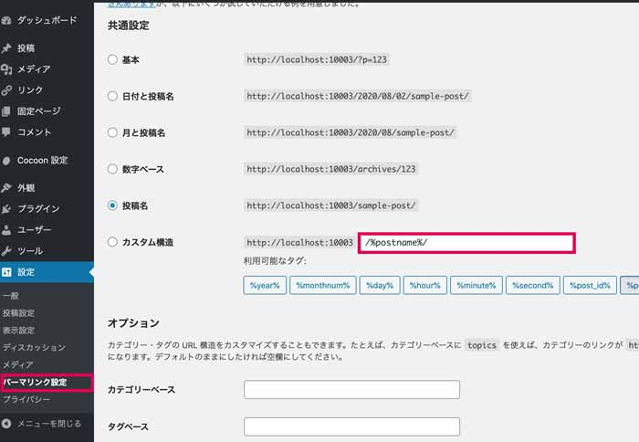

個人的にオススメなのは以下みたいなパターンです。

* ドメイン/カテゴリー名/スラック名
* ドメイン/スラック名
* ドメイン/blogs/スラック名

記事idにしてしまうのが設定不要でラクなのですが、あえてスラックを毎回設定するようにします。

理由は**検索エンジンがURLも解析している**からです。<br>
記事のスラックは`%post_name%`にセットして、記事と関連する英単語を使うようにしましょう。

スラックをマルチバイト文字である日本語で設定してしまうと変な文字列（URLエンコード）になってしまいます。

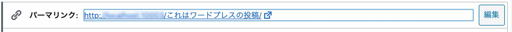

↓↓↓↓
```
http://ドメイン/%E3%81%93%E3%82%8C%E3%81%AF%E3%83%AF%E3%83%BC%E3%83%89%E3%83%97%E3%83%AC%E3%82%B9%E3%81%AE%E6%8A%95%E7%A8%BF/
```

検索エンジンは長いURLを好まないし、先ほども述べたようにURLも解析しています。<br>
スラックは必ず、英語で付けましょう。

### 画像の設定
サーバーの容量には上限があるので、不必要な画像が生成されないようにしておくのがオススメ。

私はアイキャッチといって記事をアピールする画像と記事内などに使う汎用的な画像の2種類だけ作るようにしています。<br><br>


画像の設定は「設定」 > 「メディア」から変更できます。

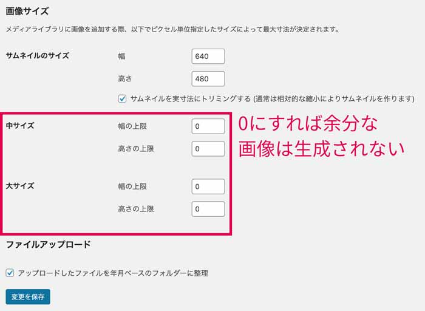

画像のアスペクト比は4:3か16:9がオススメです。<br><br>


WordPressは画像の設定で一枚しか画像が必要ない場合でも画像サイズに設定した数だけリサイズされて生成されます。<br>
「中サイズ」と「大サイズ」を幅・高さ共に0にしておきます。これで、不要なデータが生成されなくなります。<br><br>


そして絶対に幅5000pxとかでっかい画像をアップしてはダメですよ！！！！<br>
必ずリサイズしてUPLOADしてください。

画像たくさん作らなきゃいけないんだって思っている方いると思います。<br>
結構無料ソフトもあるのでそういうものを活用してください。

私のオススメはAdobeのプロトタイプソフトXDです。


[XDダウンロード](https://www.adobe.com/jp/products/xd.html)

元々は**ワイヤーやデザインカンプを作るためのソフト**ですが**無料**で使えます。

複雑な作図はコツが要りますがカンタンな単なイラスト作成や画像にフィルターもかけることができます。

XDを使うためにはAdobeアカウントが必要です。

### 記事を書くための設定
WordPressは書きたいジャンルごとに記事を整理できます。どんな種類の記事を書くかしっかり決めておきましょう。

整理方法は2種類あります。あらかじめルールを決めておくことをオススメします！

#### カテゴリーの設定
最初にどんな記事ジャンルの記事を書くか決めておくことをオススメします。<br>
あらかじめジャンルを整理しておくと自分の書きたいことがブレにくいですし、ユーザーもこの人何が伝えたいんだろうってならなくて済みます。

カテゴリー記事が増えてきたらカテゴリーごとに一覧ページが勝手に作られます。<br>
ユーザーも見たいジャンルの記事が一気に探せてベンリです。

カテゴリーにもスラック設定があります。<br><br>


これが重要。<br><br>


ちゃんと設定してないとカテゴリー名がそのままスラックとして適用されます。日本語はマルチバイト文字なのでなっがーいURLになってしまいます。<br>
記事ごとのスラック同様、必ず英語でタイトルをつけましょう。

カテゴリーごとに名前とスラックと説明を設定しておきましょう。
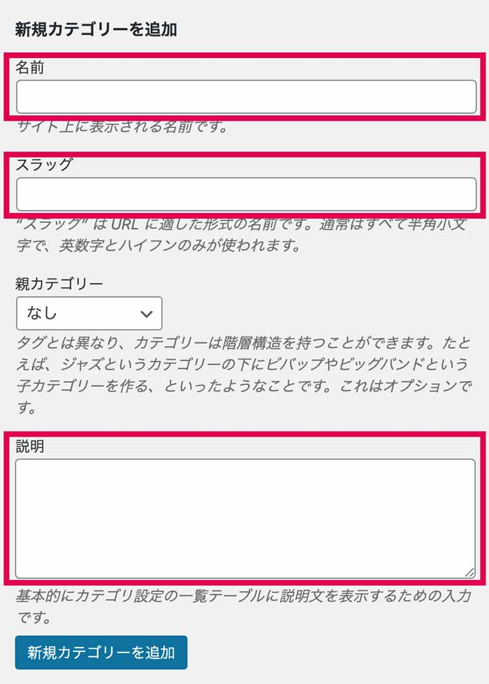

#### タグの設定
タグもカテゴリー同様、細かいキーワードのジャンルごとに記事の整理ができます。カテゴリーは階層構造を持てますが、タグは持てません。

カテゴリーでしっかりカテゴライズする分、タグは意識せず自由度高く使うことをオススメします。混乱しそうであれば、あえて**使わないという選択肢**もあります。

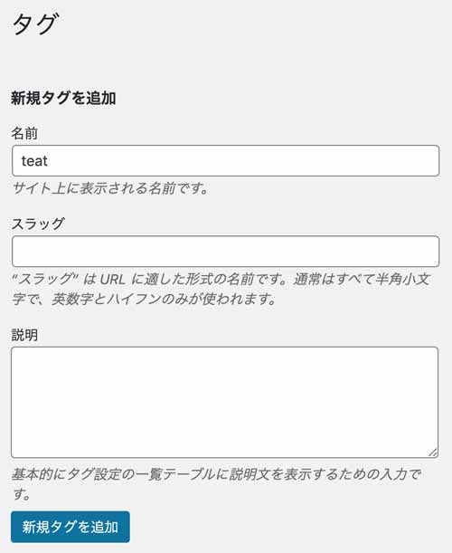

タグも増やしすぎるとカオスになります。20こまでといった感じで上限を決めることをオススメします。

### そのほか最低限必要なページがあれば用意しましょう
その他の必要なページがあれば、随時固定ページを利用して作ります。
現時点で最低限あればいいページは以下ぐらいかと。

* プロフィール
* プライバシーポリシー


とくにプライバシーポリシーは設置しておきましょう。

理由は計測のためにAnalyticsを使うから。Analyticsを使うためにはCookieという個人データを取り扱う機能を利用します。個人情報保護方針の上で同意を取る必要があります。

たかだか個人のブログでも、訴えられないよう必ず設置しておきます。

プライバシーポリシーページはデフォルトでWordPress上、あらかじめ下書きで準備されています。

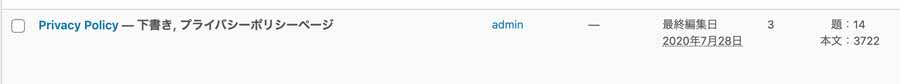

適宜必要であれば修正して使いましょう。

## noindexを外す
はい。ここまででなんとか公開準備ができました。早速公開してみましょう。<br>
サイトインストール時、検索エンジンにクロールされないように設定しておいた以下の設定を解除します。

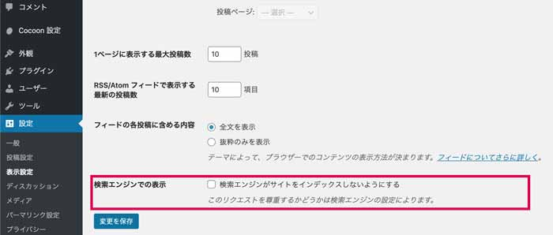

## Search Console、Google Analyticsのアカウント作成してサイトを計測しよう
CocoonはSEOに特化したテーマなのでGoogle Analyticsやsearch console（通称サチコ）の設定がカンタンです。
まずはGoogleアカウントでそれぞれのアカウントを解説しましょう。<br><br>


Webサイトの解析には両方のアカウントが必要です。<br>
役割の違いですがざっくり言うと以下の通り。

* Search Console ... ユーザーがサイトに到達するまでのデータを集積します。
sitemapの送信・管理や被リンクの数も調べることができます。サイトのユーザビリティの問題やエラーなどもこちらで確認できます。
* Google Analytics ... ユーザーがサイトに到達した後のデータを集積します。
PV、セッション数、滞在時間などを分析できます。

Cocoon設定の「アクセス解析・承認」から設定します。

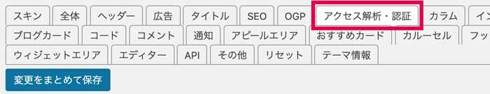

### Google Analytics
Google Analyticsのアカウントを作成します。

[Google Analytics](https://analytics.google.com/)

そして、「トラッキングID」を追加すればOKです。

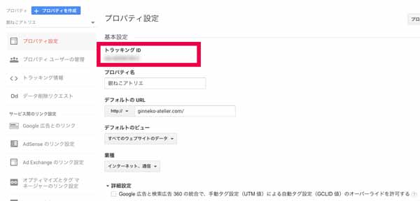

設定後、トラッキングコードからテストトラフィックを送信してチェックしてみましょう。

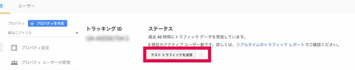

### Analytics設定でやっておいてほしいこと

正しい解析は正しい数値から。

このままだと、自分が確認のために閲覧したデータも計測されてしまいます。<br>
なので**フィルターに自分の使っているIPアドレスの除外設定**をしておきましょう。

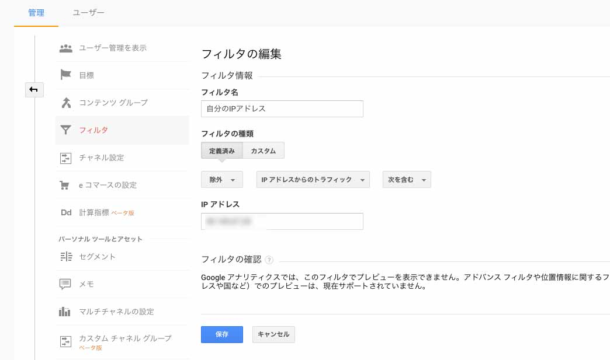

自分の使っているIPアドレスは以下のようなサービスで調べることができます。

[ネットワーク監視サービス](https://www.cman.jp/network/support/go_access.cgi)

なお、IPアドレスは固定IPアドレスの契約をしていない場合はルーターの電源を落としたなどで変わることがあります。

なので、定期的に調べで変わっていないかチェックしましょう。

もしくはChromeのプラグイン、オプトアウトを入れておくのもオススメ。<br>
[Google Analytics オプトアウト](https://tools.google.com/dlpage/gaoptout?hl=ja)

### Search Consoleについて
[Search Console](https://search.google.com/)

Cocoonでのサチコ（Search Console）を認証する上で必要なデータは「設定」 > 「所有権の確認」から調べることができます。<br>
HTML タグの認証方法を見てみます。

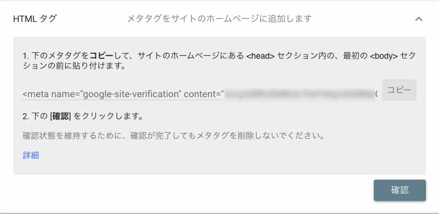

content=の"（ダブルクォーテーション）内の値をコピーし、search consoleのIDとして貼り付けます。

設定が終わったら、確認をポチっと押しましょう。

## 超ざっくり記事を書いてみよう！！
では早速Gutenberg（グーテンベルク）で記事を書いてみましょう！<br>
GutenbergはHTMLの知識がなくても、書いた文章に応じてHTMLに変換してくれるWordPressのエディターです。

最低限、検索エンジンが解析しやすい記事の書き方をご紹介します。

### 見出しと段落はセットで使う
見出しはその下に続くコンテンツの要約です。

ユーザーにとってもSEO上もその一文を読めばどんな記事が書いてあるかわかるのでとても重要。

HTMLでは見出しタグといい、重要度別で1 ~ 6まで存在します。

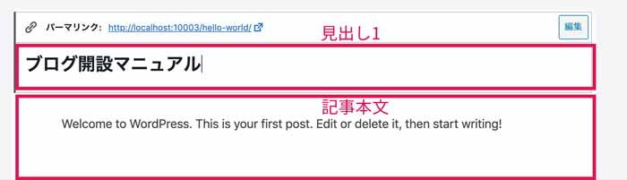

h1から急にh4という使い方はせず必ず順番に使います。


ちなみにみなさん、雑誌や新聞を読む時見出しを読んでそのコンテンツをスキップするか決めせんか？

コンテンツを読むかどうかをユーザーに委ねることはユーザビリティアップにもつながります。
```
h1
  h2
    h3
  h2
  h2
```

### 箇条書きを積極的に使う
あるレストランに行ったとします。<br>
メニューが以下だった場合どう思いますか？

お肉のコースはソーセージ、牛フィレステーキ、鶏のソテーです。

お肉のコース

* ソーセージ
* 牛フィレステーキ
* 鶏のソテー

後者の方が読みやすいですよね？

箇条書きの利点は文書を塊に分けることができるので、見た目も含め分かりやすくなります。<br>
検索エンジンも同様で段落上の文章よりも、リスト化された方が解析しやすいんです。

Gutenbergを使えばカンタンなボタン操作で書いた文章をHTMLに変換できます。
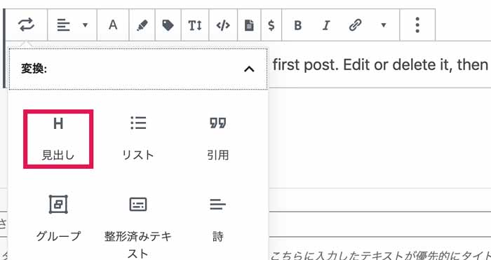

箇条書きには大きく2種類あります。

並ぶ順番が決まっているものとそうでないものです。

基本的には文字の先頭にポチッと点があるものでいいですが、順番絶対コレって決まっている箇条書きをしたいときは番号のついたリストを使いましょう！！

### アイキャッチ、カテゴリー、カテゴリー、スラックを設定したら公開だ！！
アイキャッチ、カテゴリー、カテゴリー、スラックすべて設定したら公開しましょう。<br>
たくさん、記事を読んでもらうためにはSNSでシェアするのが一番手っ取り早いです。

ここで重要になるのが**OGP設定**。<br>
OGPとはオープングラフプロトコルの略で、主に各種SNSで解析されるデータです。<br><br>


ポイントはOGP画像。<br><br>


先ほど設定したアイキャッチ画像がそのまま転用されます。<br>
適宜サイズやアスペクト比もSNSごとに容赦無く上下左右切断されます。


画像にロゴやテキスト・人物写真などが変なところで切れてないか各デバッガーでシェアする前に確認しましょう。

* [Facebook シェアデバッガー](https://developers.facebook.com/tools/debug/?locale=ja_JP)
* [Twitter Card validator](https://cards-dev.twitter.com/validator)

## おまけ・絶対セキュリティのために入れておいて欲しいプラグイン
WordPressは何よりも狙われやすいCMSです。使う以上自分の身は自分で守る。プラグインで解決しましょう。

<small>※ 万能ではないことを納得した上で使いましょう。</small>

### Site Guard
だいたいブルートフォースアタックは海外経由なので文字認証が日本語という時点で撃退できます。

[SiteGuard WP Plugin](https://www.jp-secure.com/siteguard_wp_plugin/)

ただ、このプラグイン、さくらレンタルサーバー×G-Suiteとの組み合わせが死ぬほど悪かったです。<br>
さくらレンタルサーバー×G-Suiteとの組み合わせがそもそも悪いのか。。。使うとき注意してください。

## まとめ
これでWordPressサイトを最低限ブログを書けるレベルまで持っていけたのではないかと思います！

コンテンツは書いて経過を計測してPDCAを回す楽しさもあります。<br>
この記事がみなさんの一助になれば幸いです。

ぜひ、WordPressを使ったブログライフをお楽しみください。<br>
最後までお読みいただきありがとうございました。
