## コロンってどんなところ？どんなお店があるの？
コロン（MAP）は港があるのもあり、物資の運搬の拠点でかつては機関車が行き来していたそうです。

市場名がカーボン（石炭）マーケットなのもなのが納得できます。

たくさんの路面に面したショップがあります。 
中国系の経営のお店が多いそう。  

そして、  

ぶっちゃけ「**治安は悪い**」です。

ストリートチルドレンやホームレスが当たり前のように行く先々にいます。

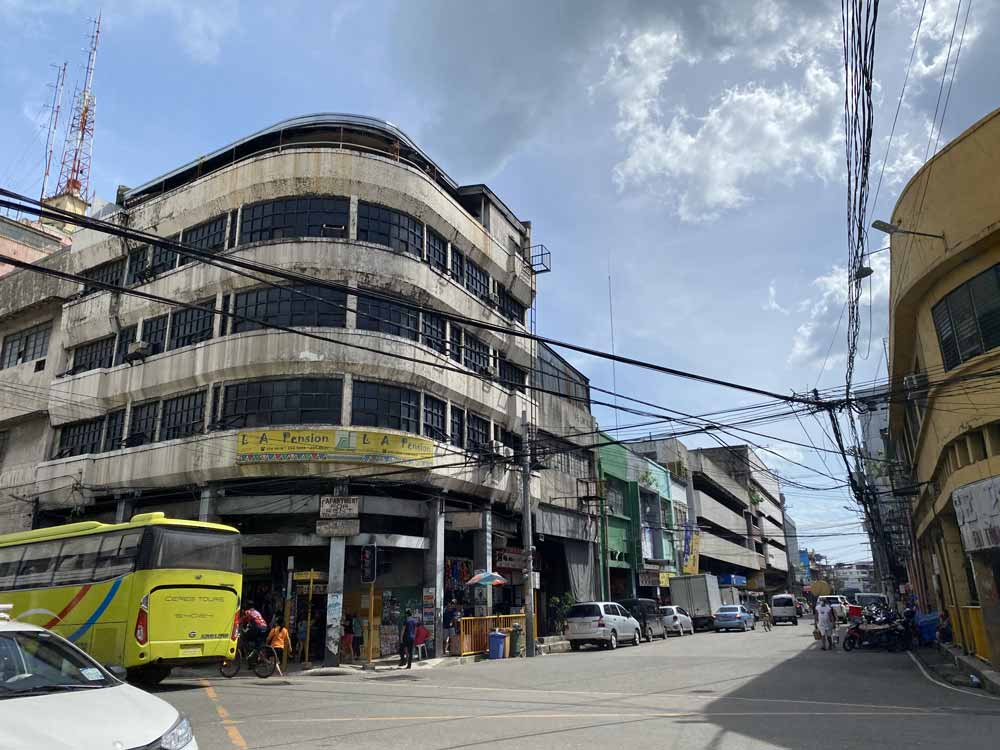

とはいえ、リーズナブルなお店が点在し、外国人でも長く住む人にとって便利な「お買い物スポット」でもあります。  

外国人である我々がコロンストリートで買い物する時のポイントです。
* **フィリピン人**と行く
* 外国人同士**複数人**で行く
* 明るい時間に行く

同じアジア圏ではありますが、肌の色も違うし好んで着る服も違うので外国人と一目でわかります。 
**平和ボケした日本人なんての恰好のカモ**です。  
この日は元同僚と一緒に行きました。

### 「BEASTAR」フィリピーノ御用達・セブ島のシマムラへ
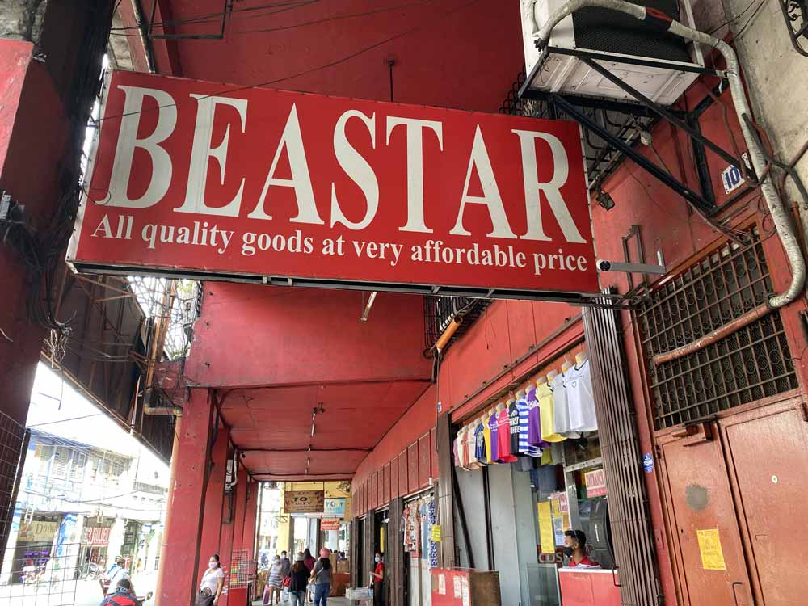

各洋服などが安価に手に入るお店「BEASTAR」へ。

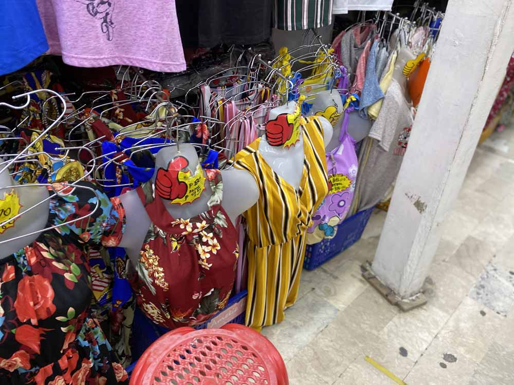

セクシーなお洋服も多数あります。

ジーンズやワンピースだけじゃなく、カバンやブランケットに至るまで100ペソから200ペソとにかく安い。

※ 1ペソ約2円です。

驚きの金額ですが、こういう場所で彼らなりに上手く買い物してるんですね。

BEASTAR 
[MAP](https://goo.gl/maps/gmpEWWnybscRHSJr7)

### 本命カーボンマーケットへ！
今日は**ウズラの卵とアボカドが欲しくてカーボンマーケットに**来ました。

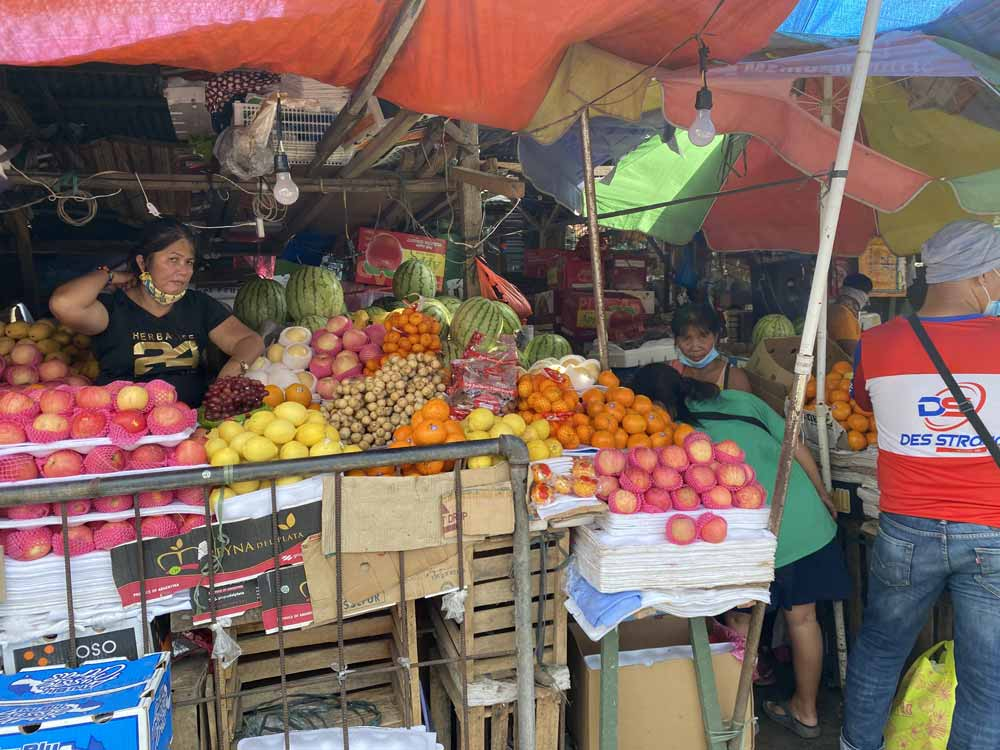

悲しいかな、この日アボカドは手に入りませんでした。

この時期フィリピンではアボカドは季節外れとのこと。 
日本では年中手に入る食材なので戸惑いましたが、フィリピンでは季節外れの食材の入手は難しいです。

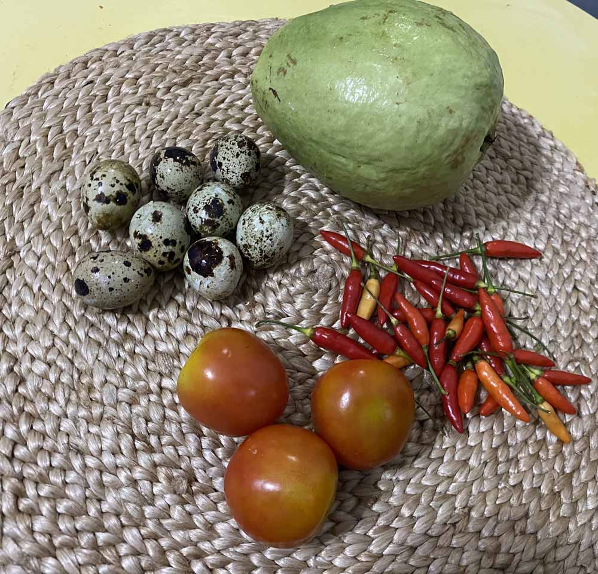

この日の購入したものは、今回はフルーツのグアバ（キロ40ペソ・20ペソ）・ウズラの卵12コ（1コ2ペソ・24ペソ）・唐辛子（5ペソ）・トマト3コ（1コ5ぺソ・15ペソ）。

セブ島では野菜を食べる習慣が少なく、ビタミンや酵素不足しがちです。フルーツは手軽に取れる栄養源として重宝します。  

グアバはお酢とお塩で食べるのがオススメとのこと。  

ウズラの卵はマーケットでは雑にビニール袋に入れられて売られています。

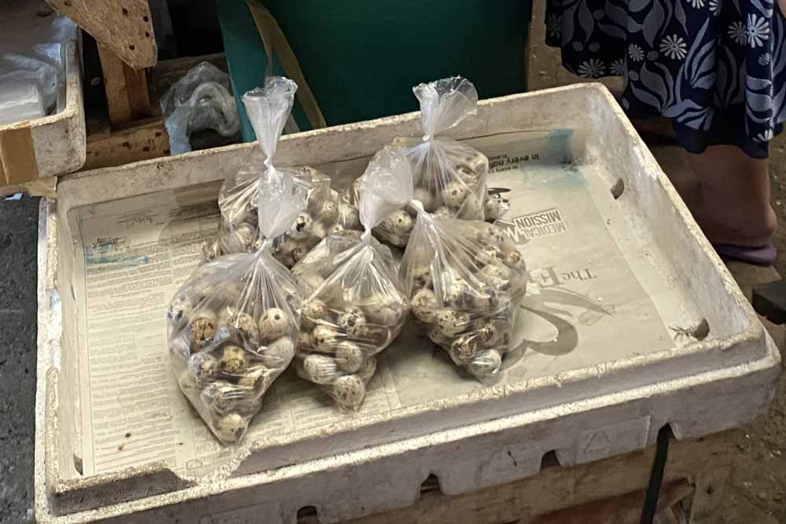

案の定帰宅したら**すでに3 ~ 4コ壊れてましたww**  

一般的なスーパーではケースに入った状態で買えますが、マーケットではそうは行きませんね。

ヒビが入ってる程度だったので、帰宅後茹でてピクルスにしました。  

カーボンマーケットでは、鮮魚・干魚・鶏、お米などなんでも手に入ります。

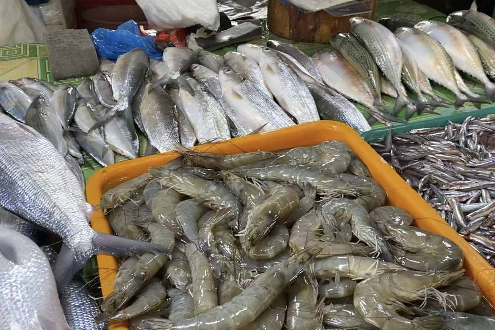

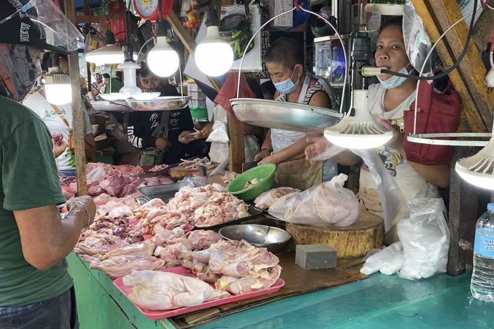

ちなみにセブ島に住んでいたら路上のあちこちに鶏がいるのですが、生活に困ったらお金に変えるそうです。

### ディープなスポット・ウェットマーケットへ
カルボンマーケットの奥にある室内の市場・ウェットマーケットへ潜入しました。

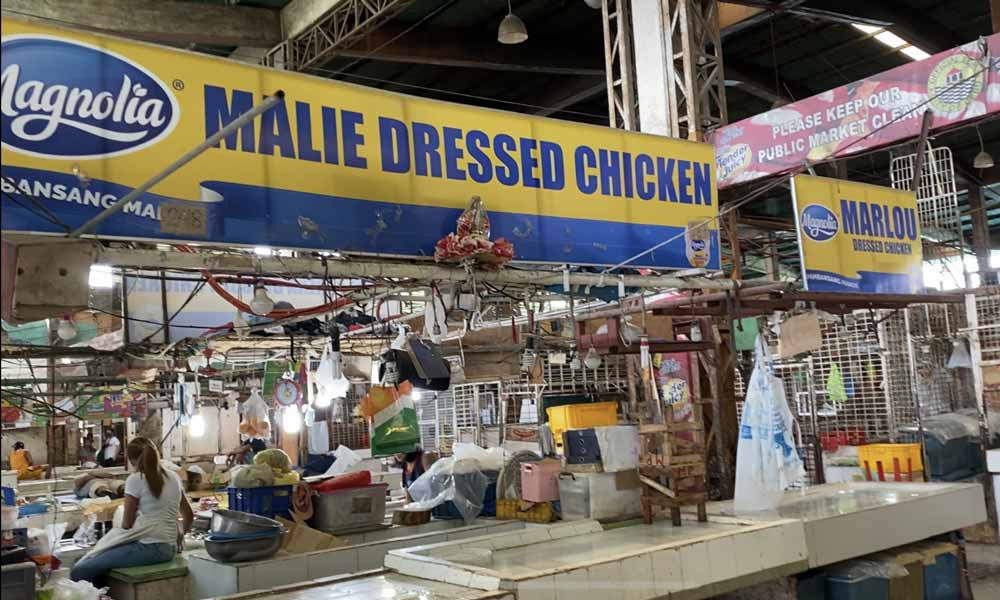

ここはお肉などの販売が中心で、**血や体液で汚れてもすぐに水で流せるように床が濡れています**。

ほとんどのお店は明け方から朝、夕方からさらにお肉を中心に販売しているそう。

一区画一日たった50ペソで借りられるとのことです。

借りるためには政府（役所）に、貸してもらえるか否か許可を得る必要があるそうです。  

ECQ（ロックダウン）中は自分の区画を運営するため、市場に寝泊まりして土日だけ自宅に帰っていたとのこと。収入を得られないと生活できませんからね。
貴重なお話が聞けました。

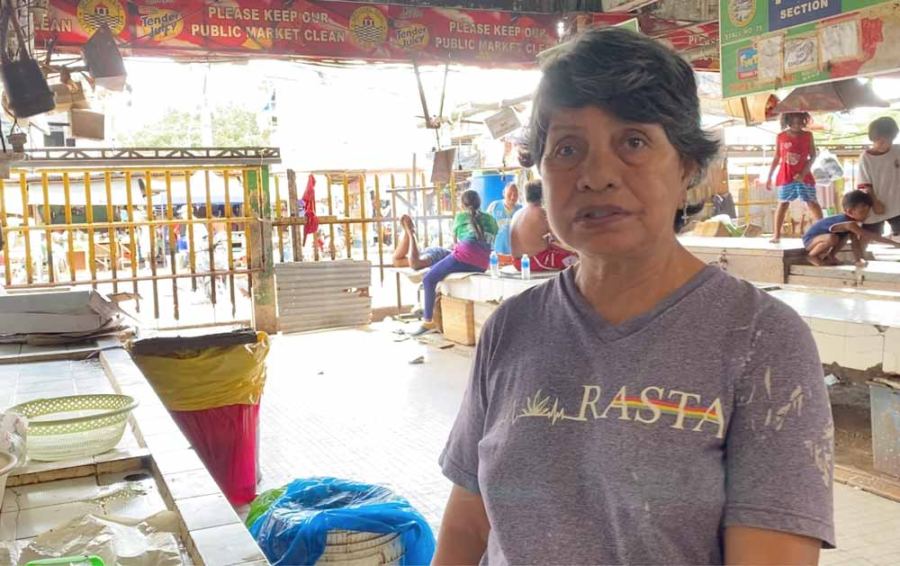

こちらはチョリソーといってソーセージの一種。フルーツじゃないですよww 
日本で食べられるチョリソーは辛いソーセージですが、フィリピンではやけに甘いのが特徴です。

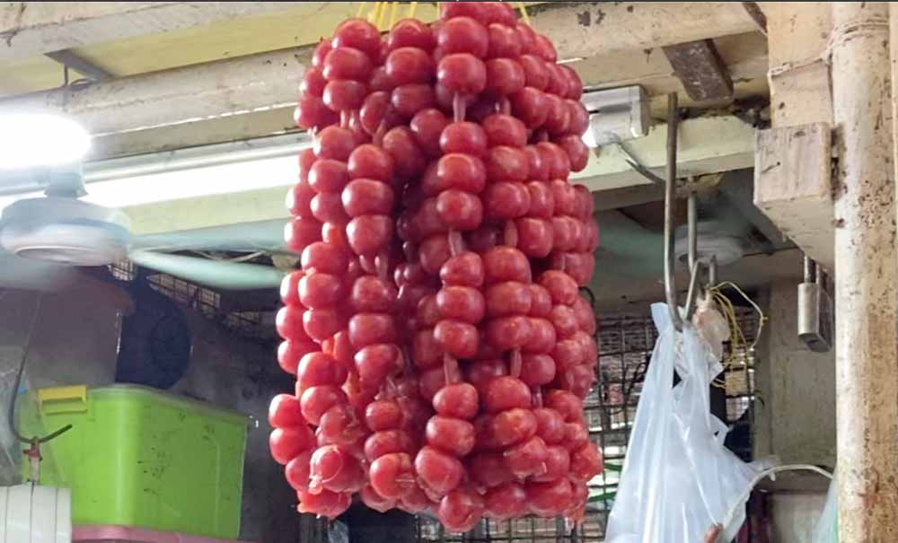

こちらは豚の顔。キロ100ペソ。骨をちゃんと抜いてあるから少しお高め。

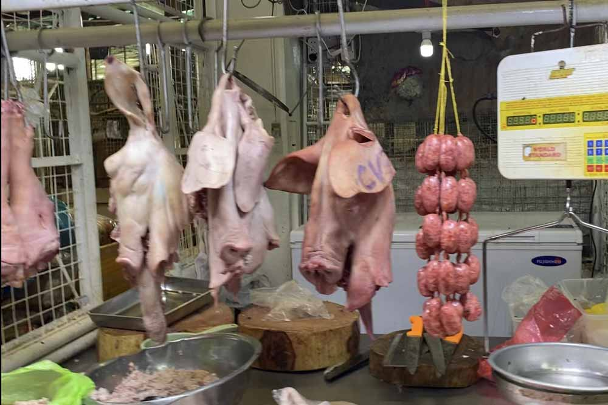

豚の血も売ってました。 
**ドゴドゴ**という内臓やショウガなどと煮込んだ料理の材料として使います。

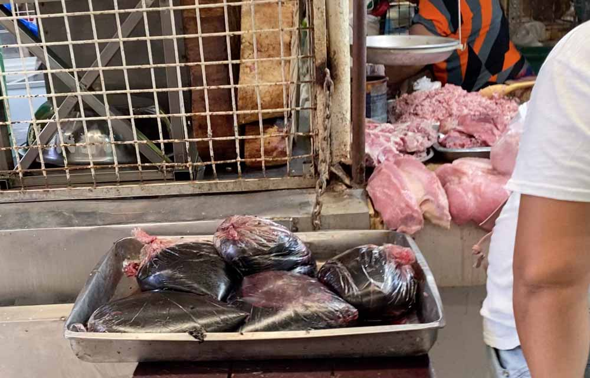

私には未開の食べ物です。  

私たちが潜入したのはお昼過ぎ。市場は基本オフタイムなので、**おっさんたちが机や台の上でゴロゴロ**しています。

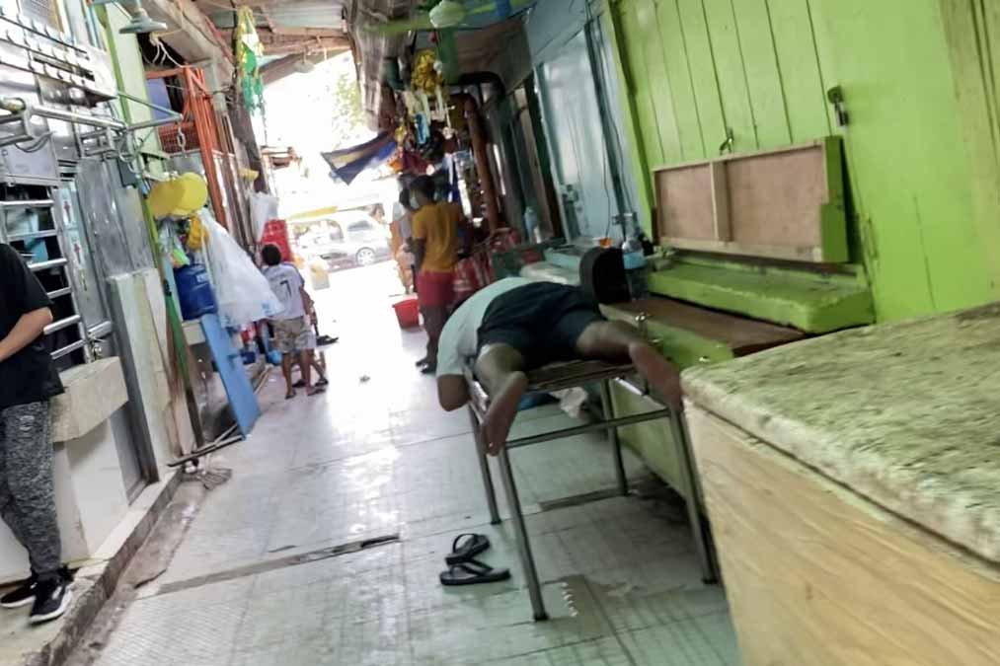

ちなみに、ありのままに伝えると**ウェットマーケットは不衛生**です。

しかも**まるまると太ったラットを数匹目撃**してしまいました。。。。。

### 観光用馬に乗りました
カーボンマーケットは馬で物資を運搬していた名残もあってか観光用の馬車がいます。

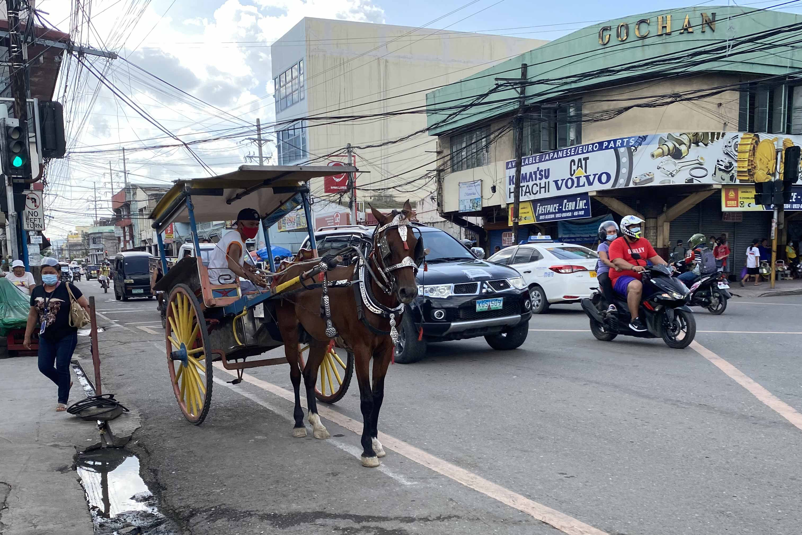

地元の人は絶対乗らないと思いますが、せっかくなのでトライ。

金額は50ペソ。今はソーシャルディスタンスのせいで乗れなくなってしまったハバルハバル（バイクタクシー）よりお高め。  

ジェネラルちゃん（メス）は5才。5000ペソで他の島から購入してきたとのこと。約1万円なので日本では考えられない金額なんですがこちらでは高額です。

かつてセブ島は観光が大きな経済の基盤でした。 
コロナの影響で彼らの生業が営めなくなったと改めて思い知らされます。

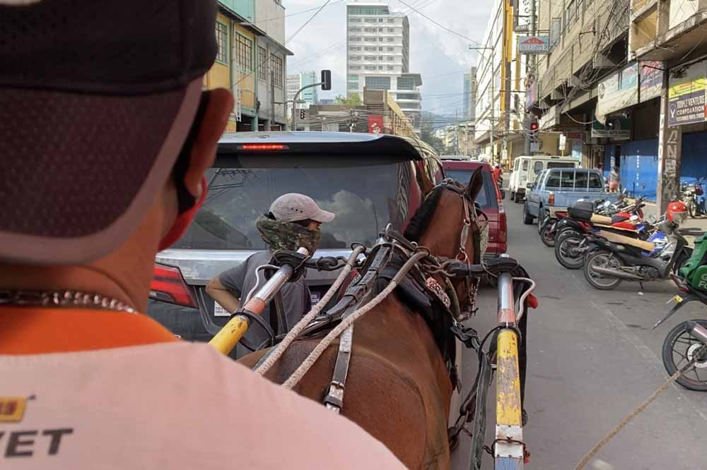

早くセブ島にも観光業が戻ってきたらいいなあって思いました。
### 美容用品の卸問屋へ！

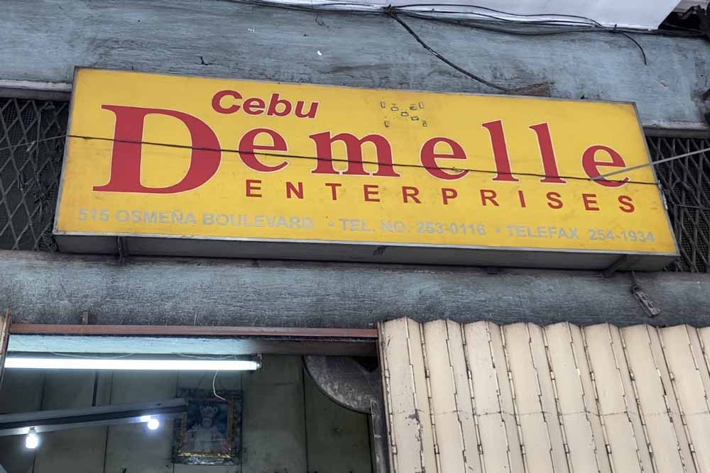

マニキュアやヘアダイなどリーズナブルな美容用品の卸問屋へ連れて行ってもらえました。 
マニキュアなどがたった30ペソ前後。日本で考えるとまずあり得ない価格です。

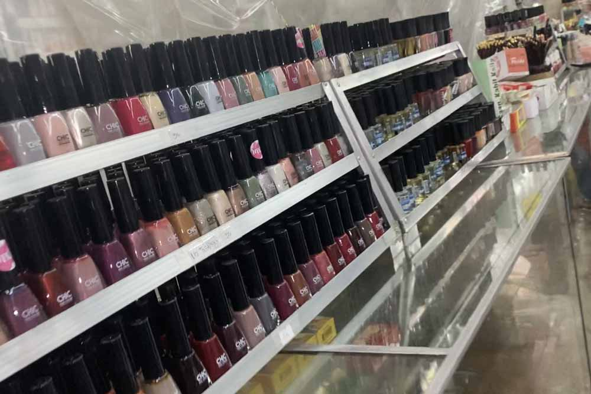

前から欲しかった、ヘアアイロンを手に入れることができました！

店員さんが箱を開けて、中身を見せてくれたただけでなく直接試すこともできました。 
日本ならテスターとかあるので考えられませんねww

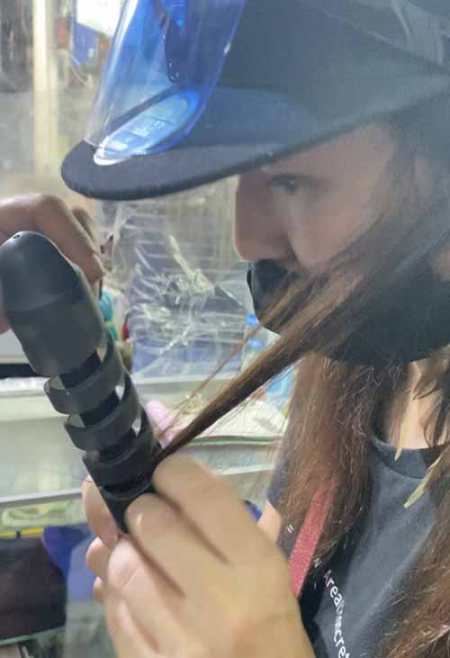

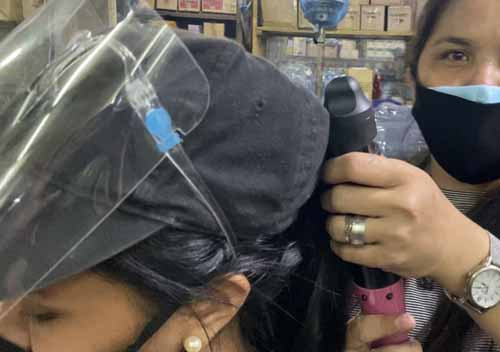

たった**1200ペソで購入**できました。

アヤラモールで買ったら3000ペソ以上です。 
上手く買い物すれば安価に手に入りますね！！

#### Cebu Demelle Enterprises

[MAP](https://goo.gl/maps/JR371LEZMD7vZ59dA)

### 路面店でゴリラポット？的三脚をたった180ペソで入手
前から欲しかったスマフォ用三脚も手に入りました。

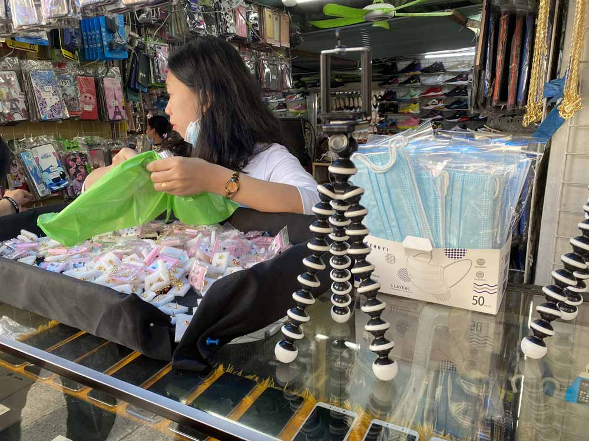

壊れてもいいかなってお値段なのでとりあえずは満足。

ちなみにアヤラモールで見た同じタイプは1500ペソ！！高すぎて買うのを断念しました。

## 海外移住の拠点として人気のフィリピン・セブ島

たまたま転職してセブ島に来ましたが、現在プチ移住を満喫中です。

私がセブ島を海外移住の拠点として**オススメポイント**と**オススメしないポイント**をお伝えします。

※ 現在はコロナのため入国制限があります。

### オススメポイントその1・「英語圏」なので新たに知らない言語を学ぶ必要がない
**フィリピンの公用語は英語**。 
フィリピン人は小学校から英語で授業を受けるので平均して**英語のスキルは高い**です。

**中学英語が理解できれば最低限のコミュニケーションは取れる**かと思います。

新たに言語を学ぶ必要がないのは大きなポイントだと思います。

### オススメポイントその2・物価がとにかく安い
贅沢しなければ、**日本人水準の生活レベルを年間100万から150万くらいで維持**できます。

みんな稼ぐことに着目しがちですが、**支出が抑えられるのは最大の利点**かと思います。

### オススメポイントその3・暖かいので免疫力が上がる
赤道直下で温暖な気候のおかげで年中元気で病気にかかりにくいです。

**冷えって万病の元**だと思うんですよね。セブ島にいたら年中体温も暖かく保てます。

免疫力も上がっていいみたいです。

### オススメしないポイント1・公共機関でもルールがコロコロ変わっていい加減すぎ
女心と秋の空か？！ってくらい**ルールがコロコロ変わってめっちゃ振り回されます**。

先日もビザの手続きで移民局に行きましたが、移民局のスタッフの情報共有ができてなさすぎてたらい回しにされ、散々待たされた挙句、自動でID発行するからもう帰っていいよって言われました。

その時間概ね4時間。

**人が少ない日本では時間の価値が高い**はずですが、人口が多いこの国では時間に対する価値感があまりにも違うせいか、平気で待たせます。  

日本人が厳しすぎるのか。。。ねばならない思考の人にはオススメしません。
住むのなら、**「まあ、いいか」の精神**でいきましょう！
### オススメしないポイント2・治安はとにかく悪い
実は私、この国に来て2日目くらいで携帯（iPhone 8）を盗まれました。

iPhoneの追跡機能を使ってみたら、すでにマニラにありました。。。

賃金水準はとにかく劣悪で、そしてiPhone一個盗んで売っぱらえば半年ぐらい生活できるそう。  

我々は所詮外国人。

日本と同じ感覚で住んではダメです。

**安全なところに住みたいなら、日本から出ないのが一番**です。
### オススメしないポイント3・ローカルフードの栄養価を期待するな
**フィリピン人はとにかくお米が好き**。おかずの汁をかけてご飯を食べるほど。  

炭水化物と塩分が大好きで、30代後半から糖尿病や高血圧になる人も多いとか。 
そして、炭水化物食べ過ぎで痩せていてもお腹が出ている人も多いです。 
とにかく食に満足したいフィリピン人にとって手っ取り早いのが油と炭水化物です。  

ロックダウン中は行動が制限されたせいか、ローカルフードしか食べられず、食事が塩分・油過多、しかも野菜が思うように食べられませんでした。

ほぼ毎日食べた結果、見事に太りましたww  

たまに食べるのはいいですが、健康を考えると控えたほうがいいです。

## 忘れないで。私たちはあくまで外国人

セブ島だろうがどこだろうと海外移住をしたらそこでは我々は外国人だということ。

カバンを無造作に置いて目を離したり携帯を机に置きっぱなしとか決してやらなくなりました。

出かける時も高級品は身に付けず、カバンも前に持ってしっかり手で抱え込むようにして歩いています。

そして日中でもできるだけ大通りを通るように心がけています。  

最近では、ロックダウン以前よりホームレスは増え、治安は少し悪化しているように思えます。  

2020年、**フィリピン人の最低賃金は1日385ペソ（約800円）**とのこと。

しかも、**8月時点で失業率は45.5%**。

<small>[CNN Philippines](https://www.cnnphilippines.com/news/2020/8/16/sws-survey-adult-joblessness.html)参照</small>  

ロックダウンで僅かな補助金は出たそうですが、もらえる人は限られていたそうです。

10万円もらえる日本は恵まれてますね。  

それでもたくましく、市場で日々生きるために頑張っている地元のフィリピン人たちにパワーをもらえました。
## まとめ・外国人が海外で生活するために必要なこと
一年半フィリピン・セブ島に住んで思うのは**外国人である我々こそ率先してフィリピンの文化を受け入れ理解することが重要**です。

会社に勤めていた時はその理解がちょっと足りなかったと反省しています。  

少しずつでも、言葉を理解し、文化を理解する。 
移り住んだ外国人である我々が少しでもいいから歩み寄る。 
理解したいと日々思ってたら自然にビサヤ語も覚えてきますよ！  

今では野良犬や鶏、腹を出したおっさんがそこら中にいるのが私にとっての日常です。  

そして、今回コロンを案内してくれた元同僚クイニーには感謝です。

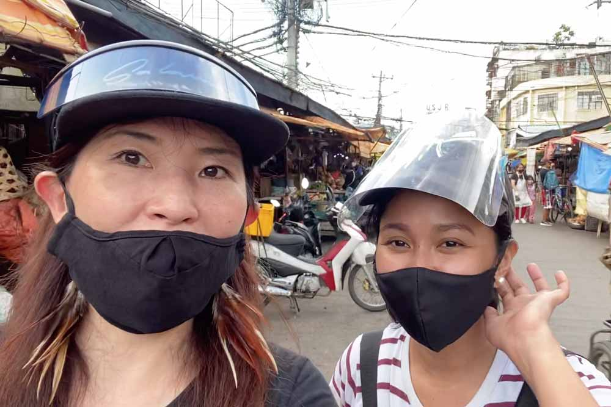
