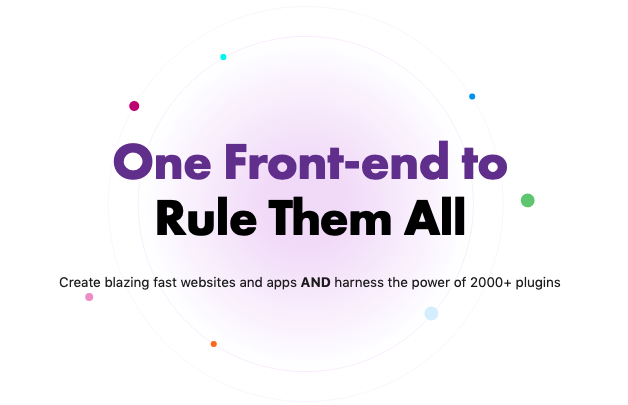
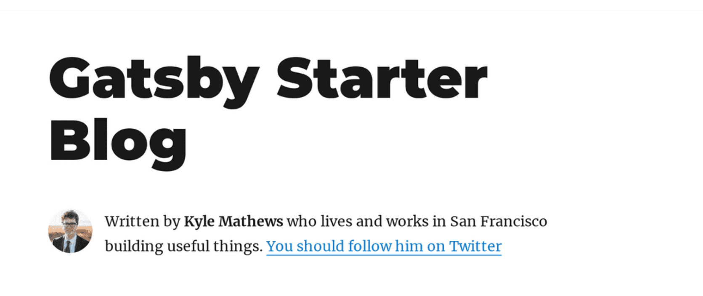
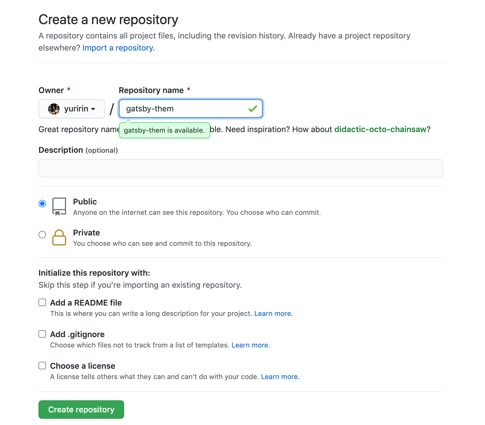
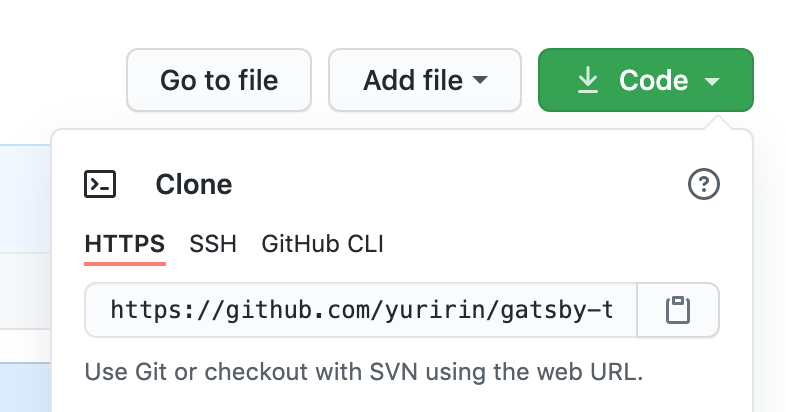
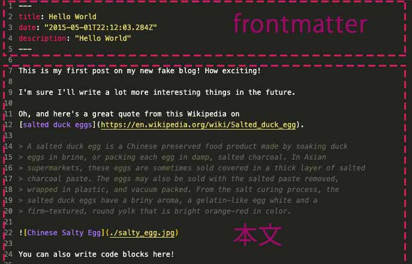
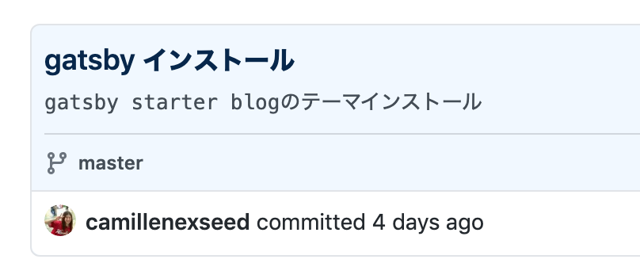
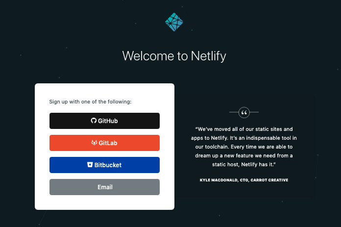
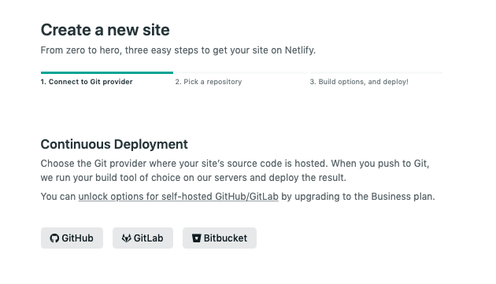
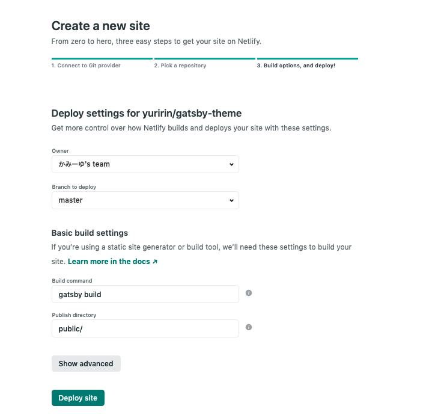
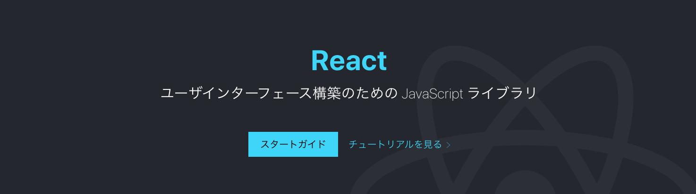

## 今までのGatsbyの記事と注意点
現在ここまで記載しています。<br>制作するまでを目標にUPしていくので順を追ったらGatsbyサイトが作れると思います。

1. インストールからNetlifyデプロイまで（←イマココ）
2. [投稿ページの充実と画像の方法]((/blogs/entry406/))
3. [ブログ記事、カテゴリー、タグ一覧の出力](/blogs/entry408/)

## Gatsby(JS)とは？
Gatsby(JS)はReactで作られた**静的サイトジェネレーター**です。内部的にGraphQLを用いてデータを取得し、markdownからHTMLを生成、などの処理を簡単に行うことができます。<br>



[公式サイト](https://www.gatsbyjs.com/)

生成される静的サイトは**SPA（シングルページアプリケーション）**でもあるので、表示速度も速く感動します。

### Gatsby(JS)の気になる難易度
難易度はJS触れる人ならなんとかいけると思います。<br>
1から作ること考えたら超楽です！
Reactの入口としてはオススメです。コンポーネント作る練習にもなります。

ES6以上の記述方法がある程度知っている。<br>
あとGraphQLの使い方知らないと慣れるまでしんどいかもしれません。

React、GraphQLについてはこのブログの最後の方に説明足してます。興味あったら読んでください。

## Gatsby JS をインストール
まずは、Gatsbyをグローバルにインストールします。
インストールできない場合は、sudo実行してください。

```
npm install -g gatsby-cli
```
もしくは
```
sudo npm install -g gatsby-cli
```

## スターター用テンプレートをインストール
まずはスターター用テンプレートをインストールしましょう。

[456 Gatsby Starters](https://www.gatsbyjs.com/starters/?v=2)

一番メジャーでベーシックな**Gatsby Starter Blog**をインストールします。



Install this starter locally:とある下のコードをコピーします。

```
gatsby new my-gatsby-project https://github.com/gatsbyjs/gatsby-starter-blog
```

my-gatsby-project はお好みで変えてください。

私はプロジェクトを1つのディレクトリーに並列に置いて管理しているので、そこにgatsby用のディレクトリをおく場合はそのディレクトリに移動してください。


```
cd projects
```
例えばprojectsで各プロジェクトを管理しているのであれば、cdコマンドでそのディレクトリーに移動しておきましょう。

私は普段VS Code からコマンドを使います！Gatsbyのディレクトリーができたら、そのディレクトリをVS Codeで開くことをオススメします。

Netlifyにデプロイしたいのでgitにも追加します。

今回私はgithubを使い、公開設定で制作することにしました。

[https://github.com/](https://github.com/)


早速新しくリポジトリを作ります。<br>
とくに設定せずデフォルトのままで追加します。



以下は実際制作中のリポジトリです。

[gatsby-theme](https://github.com/yuririn/gatsby-theme)

コミットできるようにしておきます。<br>
まずは「first commit」とコメントしてコミット。
```
git init
git add .
git commit -m 'first commit'
```

リモートと連携します。連携するURLはgithubのリポジトリページから取得しておきます。



以下のコマンドでリモートリポジトリと連携できます。
```
git remote add origin https://github.com/yuririn/gatsby-theme.git
```
gitアカウントを複数使い分けている人は、**ssh接続じゃないとpushできない**ので以下のコマンドで。
```
git remote add origin git@github.com:yuririn/gatsby-theme.git
```
注意！！！

最近、githubのポリシーが変わって複数のアカウントでhttpsでのpushができなくなりました。<br>
その場合は、鍵設定が必要です。<br>
設定の仕方はこちらを参考に。
[GitHubでssh接続する手順~公開鍵・秘密鍵の生成から~](https://qiita.com/shizuma/items/2b2f873a0034839e47ce)

とりあえず今回はmasterへプッシュできるようにしておきましょう！！
```
git push --set-upstream origin master
```
追加できているか確認。
```
git remote -v
```
## Gatsbyを起動してみる
早速Gatsbyを起動してみましょう！

以下コードでタスクランナーが走ります。
```
gatsby develop
```
他にもコマンドがいくつかありますが、頻繁に使うのは`gatsby clean`ぐらいです。

|コマンド|詳細|
|-|-|
|gatsby develop| 開発サーバーを起動|
|gatsby build|ビルド|
|gatsby info|デバッグの環境情報を取得|
|gatsby clean|ローカルのキャッシュクリア|


## 初期設定等を変更しよう
ファイル・gatsby-config.jsから初期設定を変更しておきましょう！

サイトメタ情報変更

```
siteMetadata: {
  title: `銀ねこアトリエ`,
  author: {
    name: `かみーゆ`,
    summary: `セブ島に住むフロントエンドエンジニア`,
  },
  description: `セブ島に住むフロントエンドエンジニアの気ままな日記`,
  siteUrl: `https://ginneko-atelier.com/`,
  social: {
    twitter: `lirioY`,
  },
},
```
## 記事を追加しよう！
さらに記事を追加します！
記述方法はMarkdownです。

記事はcontent/blog内に格納されています。

設定を変えたい場合はgatsby-config.jsを修正する必要があります。
```
plugins: [
  {
    resolve: `gatsby-source-filesystem`,
    options: {
      path: `${__dirname}/content/blog`,
      name: `blog`,
    },
  },
],
```
### 投稿：test.mdを追加してみよう
/blogディレクトリー直下にtest.mdを追加してみましょう！

構造は以下の通り。

タイトルやメタ情報を追記できるfrontmatterの部分と、本文に当たる部分の2パートあります。


以下の通りfrontmatterを書いてみます。
```
---
title: テスト投稿
date: 2020-11-26
description: この記事はテスト投稿です
---
```
以下はSEO的に大切なので抜かりなく記述しておきましょう。

* title ... タイトル
* date ... 日にち。-（ハイフン）でくぎる
* description ... 記事の説明

それに続けて適当に本文を書いてみましょう！

```
初めての投稿！！
## 見出し2
初めての投稿です！ワクワク、ドキドキハート！
```

今回はテスト練習なので、これでコミットしてデプロイしてみます。

**ファイルの追加**
```
git add .
```

次のように**コミットメッセージを概要と詳細**に分けたい時は間に改行を挟みます。



```
git commit -F- <<EOM
>記事追加
>
>テスト記事を投稿する
```
## Netlifyへデプロイする
Netlifyをgitと連携してMasterにpushされたデータが反映するように設定しましょう！

[Netlify公式サイト](https://www.netlify.com/)


右上のSign Upから入って、githubと連携させます。



「New site from Git」からリポジトリを追加します。


Continuous DeploymentからGitHubを選択。



勝手に公開用のディレクトリpublicとbuildコマンド`gatsby build`が選ばれます。<br>
あとは「Deploy site」ボタンをクリックするだけです！



これで少し待ったら、デプロイのステータスがpublishedとなるはずです！！

## まとめ
いかがでしたでしょうか？<br>
githubと連携して、gitのコマンドでmasterにpushするだけで公開できるようになったかと思います。

ちなみに以下は移行中の銀ねこアトリエです。<br>
現在リライトしつつ選定しつつ、本日時点でローカル環境には62記事移し終えました。。。

[移行中の銀ねこアトリエ](https://ginneko-demo.netlify.app/)

リライトつらたん。。。。

次回はCSSを移行して、記事にサムネイルを足す方法をご紹介します！

最後までお読みいただきありがとうございました。

### 参考 & Wiki
今回難しい用語が多かったので、Wikiをつけました。参考にしてください。

#### 静的サイトジェネレーターとは？
静的なHTML/CSS & JavaScriptを生成するツールのこと。

#### Reactとは？
Facebookの開発したJavaScriptのフレームワーク・ライブラリの1つです。
UIのパーツ（構成部品）、いわゆるコンポーネントを作り、組み合わせてウェブサイトなどをできます。
パーツを再利用できるのが最大の特徴です。



[React 公式サイト](https://ja.reactjs.org/)

#### GraphQLとは？
Facebookが開発しているWeb APIのための規格で「クエリ言語」と「スキーマ言語」の2つから構成されています。

* **クエリ言語**は、GraphQL APIのリクエストのための言語で、これはさらにデータ取得系のquery、データ更新系のmutation、サーバーサイドからのイベントの通知であるsubscriptionの3種類があります。なお、この記事では、総称としてのクエリ言語は「クエリ言語」と書き、クエリの3種のひとつであるqueryは「query」と書くことにします。
* **スキーマ言語**は、GraphQL APIの仕様を記述するための言語です。リクエストされたクエリは、スキーマ言語で記述したスキーマにしたがってGraphQL処理系により実行されて、レスポンスを生成します。

[「GraphQL」徹底入門 ─ RESTとの比較、API・フロント双方の実装から学ぶ](https://eh-career.com/engineerhub/entry/2018/12/26/103000)
