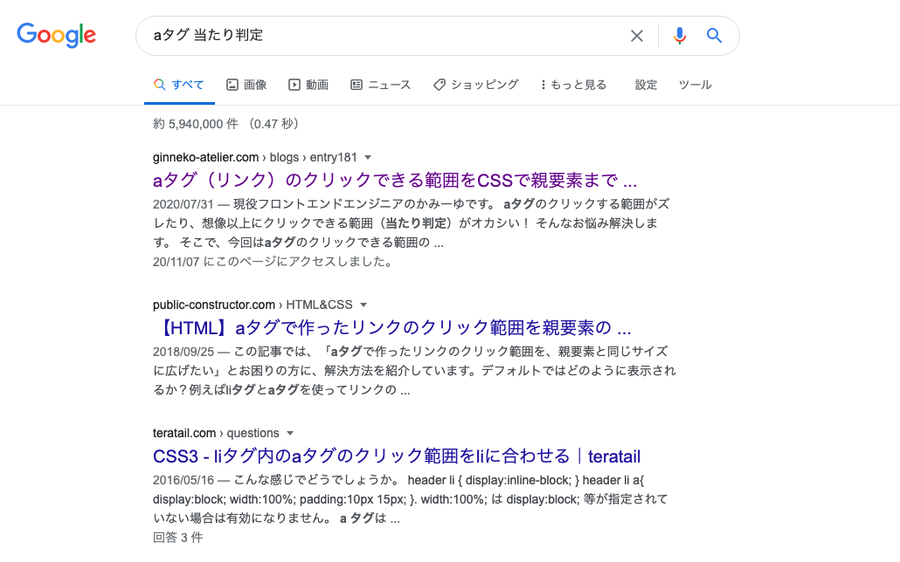
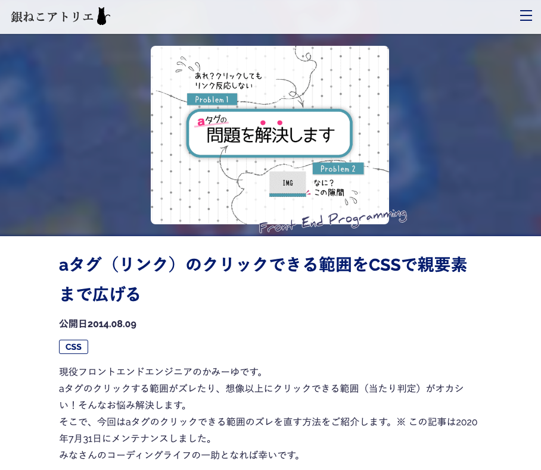
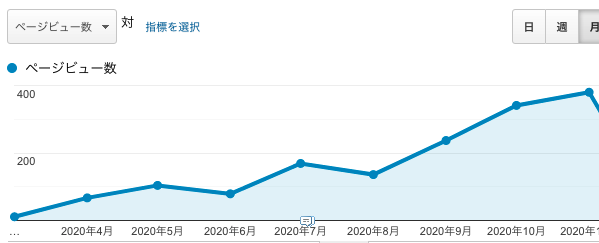
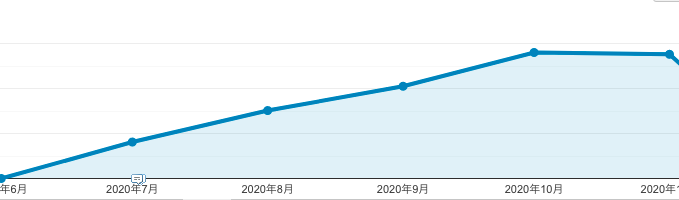

## ブログ記事を読んでもらうのは意中の人に振り向いてもらうことに似ている
2018年広島でSEOの勉強がしたくてSEOの勉強会を開きました。

<a class="article-link" href="/blogs/entry279/">
<section>

SEO 勉強会「『Googleに聞きたい！ 検索エンジンQ&A』」無事終わりました

10/6(土)「Googleに聞きたい！検索エンジンQ&A」無事終わりました。ご参加くださったみなさん、本当にありがとうござい･･･

<time datetime="2018-10-09">2018.10.09</time>

</section>
</a>

おかげで未知のジャンルの新たな友だちができました。 
アフェリエイターです。

> アフェリエイトとは広告商品の一種。 
> メディアに商品の宣伝や販促をしてもらい、実際に販売につながった場合に、そのきっかけとなった紹介に対して報酬（コミッション）を支払う仕組みを利用して収入を得ている人のこと。

私の友だちのいちアフェリエーターが言っていました。

「記事は**ラブレターを書く気持ち**で書く」

その時は大切な人に伝えたいメッセージを書く時の気持ちで書いてるんだーって思いました。

### できるアフェリエーターは桁違いにクソ稼ぐ

私の知らない世界だったのですが、できるアフェリエーターはサラリーマンの想像が及ばないくらいクソ稼ぎます。

**アフェリエイトだけで年間1千万円稼ぐ主婦**もいるんだとか。  

アフェリエイトにまったく興味はわかず雲の上の話くらいに思ってました。

今年に入り、コロナでフィリピンはロックダウンに見舞われ記事を書く時間が少し確保できるようになりました。 

SEOの勉強にもなるし、願わくは**最近ウェブサイト制作以外でも少し収入があったらいいなー**と思うようになりました。  

まずはPVを稼ぐ記事を優先的に増やし、Adsenseのインプレッション数（広告の表示回数）を増やすことを目標にしました。

## 中世ヨーロッパのナンパ男カサノヴァに学べ！慣れないうちは数をこなすこと

友だちたち曰く、口を揃えて言うのは「最初は数をこなすのが大事」とのこと。

すでにアフェリエイトでご飯を食べている人が言うのだから間違いないでしょう。

そもそも「銀ねこアトリエ」は自分のログを振り返るためのサイトで忙しい時期など数えると15記事も書いてない年もありました。  

そんないい加減な私が掲げた目標は**月15本執筆**。

チョーキツかったですwww

**仕事終わりにスタバで毎日記事書いたって投稿をたまにTwitterで見かけますがマジで尊敬**します。  

中世ヨーロッパに存在したジャコモ・カサノヴァという作家がいます。 
彼ばブサイクだったにもかかわらず、女性にしつこーーーく声をかけ続け**1000人もの女性と付き合った**そうです。

ブサイクにもかかわらず。

<small>[ジャコモ・カサノヴァ|ウィキペディア（Wikipedia）](https://ja.wikipedia.org/wiki/%E3%82%B8%E3%83%A3%E3%82%B3%E3%83%A2%E3%83%BB%E3%82%AB%E3%82%B5%E3%83%8E%E3%83%B4%E3%82%A1)</small>

なぜカサノヴァがそんなに付き合えたかというと、、、

絶え間なくロックオンした女性にアタックし続けたから、だそう。 
ターゲットとなった女性の心理を察するに、「そんなに私のこと好きなの？」という気持ちと単に断れなかったのでしょうね。  

愛の告白1000本ノック！！ ブログも不屈の精神でいきましょう！

<small>※ 1000本ノックは例えです。</small>

### ブログ執筆1000本ノックは大事な学習期間

ブログを書いていると渾身の記事なのにPVがまったく伸びない記事もあります。

ささっとテキトーに書いた記事でも読まれてることもあります。

要は**自分のいいと思っている価値観が万人に受けるとは限らない**ってことですね。

今さらですが、友人が「**ひたすら書け**」ってアドバイスが理解できました。  

ブログを書き始めて間もない時ほど、**学習期間**が必要なんですね。  

恋愛の1000本ノックをし続けたカサノヴァもやみくもに告白し続けた訳ではなく、**たくさんの告白から学んだ結果、1000人の女性と付き合うことができた**と思います。  

**敗因を知り改善策を立てる**ことが成功へのカギですね！

### 時に報われないことを覚悟する
今年に入ってたくさんの記事を書きました。

中には**時間をたっぷりかけて下調べして書いた**にもかかわらず**読まれてない記事もあります**。  

凹みます。  

ブログを始めたら、序盤は**努力して書いても報われない覚悟**して書く必要があります。  

恋愛だって**報われない告白**だってあります。  

相手がいて成り立つことだし相手の望むニーズにあってないなら仕方ない。

会社員の頃どうしても女性と付き合いたかったインターンがいました。  

毎週末クラブで不屈の精神でナンパし続けました。  

結局インターンの間、彼の努力は報われることがありませんでした。

にもかかわらず、彼はインターンを卒業の日に言いました。  

「僕は変われたんです。今までの僕は自信がなく女の子に声をかけることすらできなかった。それだけでも進歩だと思います！」  

感動しました。  

ブログも告白も**続けることが大事**。 

この「銀ねこアトリエ」も2014年から通算して実は300本近く記事を書きました。読まれてない記事は削除したり、まとめたりして現在100本程度です。

報われなかった記事たちが200近くあるのです。  

努力はいつか報われる… 信じましょう！

### 1000本ノックで自分の向き不向きを知る
何本も記事を書いていると自分の得手不得手がわかってきます。

この「銀ねこアトリエ」ではテック系の記事が一番PVを稼いでいます。  

と思いきや、意外な記事がPVを稼ぐこともあります。 
当時、飼いねこが食中毒になり「**同じ体験をした人が私の記事を読んで助かるかも**」と想いで書きました。

<a class="article-link" href="/blogs/entry279/">
<section>

飼いネコが食中毒！？対処法等の備忘録

ネコの嘔吐が異常な時は要注意。うちのネコが拾い食いで死にかけたのでその時の対処法や医療費等をメモして･･･

<time datetime="2018-07-14">2018.07.14</time>

</section>
</a>

書いた当時はこんなに読んでもらえるとは思いませんでした。

書いてみないと**どんな記事が、何が刺さるか、何が読まれるか分からない**んです。

確かに得意なジャンルの記事はPVを伸ばしやすいです。が、それ以外も書いてみると思いの外読んでもらえるなんてこともあります。

しかも得意な記事ばかり書いているとネタが尽きてきます。 
このジャンルの記事ちょっと私には書くの難しいかもーって思っても書きたいならチャレンジする価値はあります。  

「美人だから俺には無理だろう」と思っていても**告白してみるまで分からない**じゃないですか。  

ひたすら書いていれば、Google Analyticsやsearch consoleが、**どんな記事が自分に向いてるのか**を数字で示してくれます。  

**PVだけにとらわれて一喜一憂しない**ことです。  

恋愛と一緒。 うまくいかなくても終わったことは引きづらず次へ行きましょう。

きっといい出会いが待っています。  

ちなみにカサノヴァは手当たり次第、しかも女性だけじゃなく男性にも手を出したそうです。

### あと一歩の時はめげずにチャレンジ
あと一歩、惜しい記事に必要なのはリライトです。

カサノヴァの告白も同じことを言い続けたわけじゃなく、**何かしらの改善**があったはずです。 
じゃないとブサイクなのに1000人もの女性と付き合えないです。

「あと一歩」かどうかを判断する材料として二段階のポイントがあります。

1. 検索された時に**表示回数があるのにクリック（流入）されていない**場合
2. 流入があるけど**直帰や離脱されている**場合

#### 第一段階検索された時に表示回数があるのにクリック（流入）していない場合
表示回数とクリック数search consoleで調べましょう。

この場合は**Metaディスクリプションとタイトルがユーザーに刺さってない**からです。

そんな時はMetaディスクリプションとタイトルを調整します。

#### 第二段階:流入があるけど直帰や離脱されている場合

このケースではファーストビューや導入部分を改善します。

こちらは今年に入ってもっともリライトしている記事です。

ABテストも実施し数回リライトしました。 
4月にはたった月間60PVしかなかったのに先月は400PVまで伸びました。100倍まではいきませんがなかなか結果を出せたと思います。

数字を見ると効果が出てるなーって実感もあり励みになりますよね。

### 1000本ノックから見えてくるもの。自分の勝ちパターンを知る
今年の6月くらいからのデータを振り返り、自分のパターンが見えてきました。

私はテック系の記事であれば、時間をかけずにさっと書けます。

今年に入ってとりわけCSSの記事を多めに書くようにしています。  

理由は**息長くPVを稼ぐ**からです。 
今まで執筆した記事の上位記事はすべてCSS系です。  

<a class="article-link" href="/blogs/entry370">
<section>

CSSを駆使してラジオボタン・チェックボックスをカスタマイズ

CSSでラジオボタン・チェックボックスの見た目を変える方法を詳しく解説しました。HTML/C･･･

<time datetime="2020-07-07">2020.07.07</time>

</section></a>

こちらの記事、確実に長い期間PVを稼ぐことをわかった上で執筆しています。

だから時間をかけてしっかりと記事を作りこみました。

6月に公開し、自然流入で検索順位も現在上位に食い込んできています。

テック記事は滞在時間も長いです。

次にPVを稼ぎやすいのがライフスタイル・キャリア系の記事です。 
この手の記事は瞬間的に数字は伸びますが持続性が低く、書くのに時間もかかります。。  

私の記事を書くときのルールです。 
文字数は2000文字以上、最近はアイキャッチ画像もシリーズ記事以外は毎回変えています。

先月の序盤は勢いと情熱で書いてました。。。  

しばらくしてしんどくなり、「**こりゃこのペースは続けられないわ**」って気づきました。  

体力を温存しながら、失敗せず、できるだけ読んでもらえる記事をいかに書き続けるにはどうすればいいか考えました。

**テック系5割**、**ライフスタイル・キャリア3割**、**チャレンジ2割**という割合で執筆することにしました。  

おかげさまで楽になりました。

**誰しもが勝ちパターンを持っている**はずです。

告白でもこれを言えばラクに落とせるという「キラーワード」を持っている人もいるはず。

勝ちパターンを見つけましょう。

## まとめ・1PVに一喜一憂せず肩の力を抜いて書き続ける
ブログ書き始めでPVが伸び悩み、辛い時期もあるでしょう。

文章が下手でもいいんです。 
誤字があっても後から修正すればいいんです。

PVが稼げるようになれば、Adsenseのインプレッション数（広告の表示回数）は伸びますから！！

> 諦めたらそこで試合は終わりですよ。 
> 安西先生

いつか陽の目を見るはずです！！ 
ぜひ諦めずにブログ書き続けましょう。

そして、クリスマスが近いのでぜひ好きな人への告白がまだの人は頑張ってください。

最後までお読みいただきありがとうございました。
