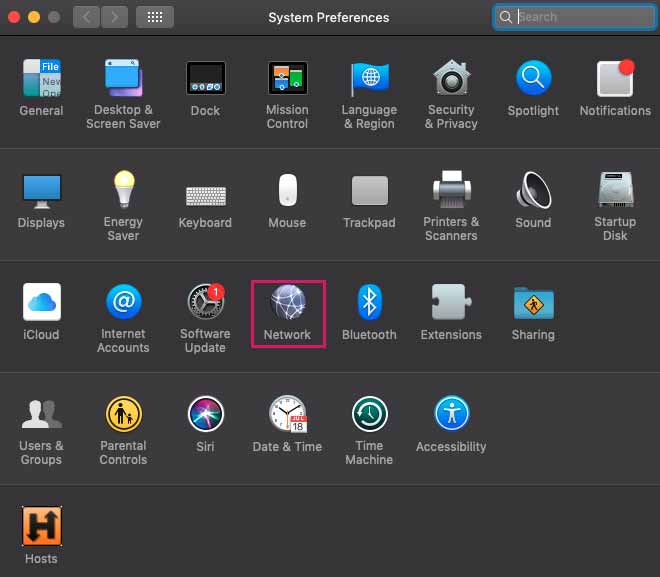
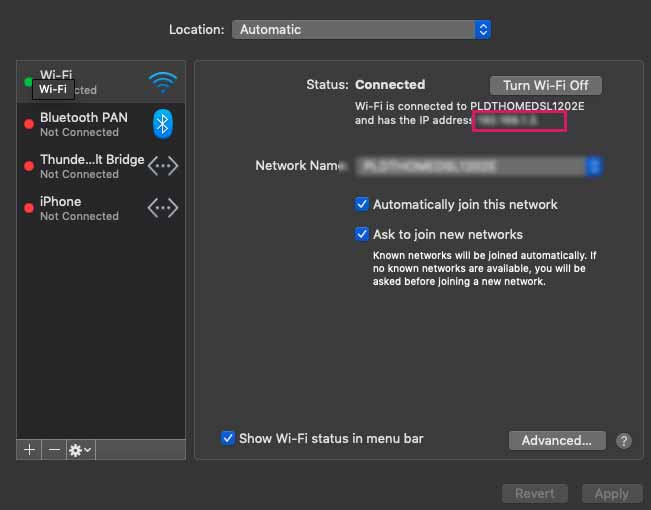
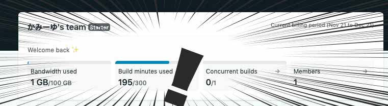

## PCのIPを指定するだけ
カンタンです。<br>
PCのIPアドレスを指定するだけです。

```bash
gatsby develop -H ×××.×××.×××.××× -p 8000
```

PCのIPに当たる×××.×××.×××.×××の部分はMacだと「システム環境設定」>「ネットワーク」から調べることができます。





IPアドレスをコピーします*最後の.（ドット）*は不要です。

## 面倒なので、package.jsonのscriptに登録しておきましょう
毎回コード打ち込むのは面倒なので、package.jsonのscriptにコマンドを登録しておきます。

パソコンのIPは場所が変わったりなどしたら変わります。

気をつけてください。
```js
"dev-m": "gatsby develop -H ×××.×××.×××.××× -p 8000",
```

あとは以下のコマンドで起動してください。

```bash
npm run dev-m
```

## まとめ
これでGatsbyでのサイト構築が楽になりますね！

ちなみに私はラップトップで一度記事を書き、ゴロゴロしながらiPhoneで記事の誤字脱字などをチェックしています。

記事のチェックが終わった後に、GitHubにプッシュし、Netlifyにデプロイしています。

Netlifyは基本無料ですが**使用量やビルド数に制約があります**。

今月頭にNetlifyへ移行しましたが、すでにこんなにBuildしてしまいヒヤヒヤしております。



スマホのゲームで*課金する大人の気持ち*が少しわかります。。。

最初はこのIP指定の仕方を知らなかったのでエライ目にあってしまいました。

残り105分を大事に使います。

皆さんのコーディングライフの一助となれば幸いです。

最後までお読みいただきありがとうございました。
