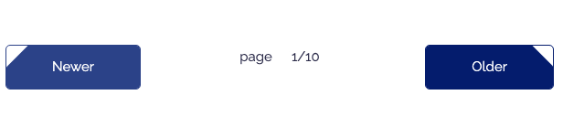

## 今までのGatsbyの記事と注意点
現在ここまで記載しています。<br>制作するまでを目標にUPしていくので順を追ったらGatsbyサイトが作れると思います。

1. [インストールからNetlifyデプロイまで](/blogs/entry401/)
2. [投稿ページの充実と画像の方法](/blogs/entry406/)
3. [ブログ記事、カテゴリー、タグ一覧の出力](/blogs/entry408/)
4. [プラグインを利用して目次出力](/blogs/entry410/)
5. プラグインナシで一覧にページネーション実装（←イマココ）
6. [個別ページテンプレート作成](/blogs/entry416/)
7. [プラグインHelmetでSEO調整](/blogs/entry418/)

### このシリーズではテーマGatsby Starter Blogを改造
この記事は一番メジャーなテンプレート、「*Gatsby Starter Blog*」を改造しています。同じテーマでないと動かない可能性があります。

## 早速ページネーションを実装しよう！
ページネーションを実装するためには一覧を分割しページを生成します。<br>
さらにページネーションを出力するコンポーネントを作成します。

WordPressなど、その他のCMSに慣れていると*一覧を分割しページを生成するってところがちょっと不思議*です。

### ページネーションを実装するためにページを分割する
まずはgatsby-node.jsにページを分割するためのコードを書いていきます。

一覧ページの実装の仕方についてはこちらを参考にしてください。

<a class="article-link" href="/blogs/entry408/">
<section><div class="article-link__img"></div><div class="article-link__main">
<div class="article-link__main__title">Gatsbyブログサイト移行物語3~ブログ記事、カテゴリー、タグ一覧の出力~</div>
<p class="description">gatsbyのブログ用記事を抽出し一覧を作りました。カテゴリー、タグ一覧もぞれぞれ用意したのでだいぶ使い勝手がよ･･･</p>
<p>
<time datetime="2020-12-03">2020.12.03</time>
</p>
</div>
</section>
</a>


```
/ (プロジェクトディレクトリー)
    ├ gatsby-node.js（ページを生成するところ）
    ├ src/
    |    ├ templates/
    |    |   └ blogs.js（一覧を出力するところ）
    └ components/
         └ pagination.js（新規作成）
```

<br>gatsby-node.jsのブログ詳細ページを生成しているコードを利用して、数量を数えます。<br>
変数`count`にページ数を格納します。

frontmatterのpagetypeがblogのみカウントします。

```js
// ~ 省略 ~

exports.createPages = async ({ graphql, actions, reporter }) => {
  // ~ 省略 ~

  let count = 0 //追加

  if (posts.length > 0) {
  //ブログ詳細ページを生成しているコード
    posts.forEach((post, index) => {
    if (post.frontmatter.pagetype === 'blog') {
        const previousPostId = index === 0 ? null : posts[index - 1].id
        const nextPostId = index === posts.length - 1 ? null : posts[index + 1].id

        createPage({
          path: post.fields.slug,
          component: blogPost,
          context: {
            id: post.id,
            previousPostId,
            nextPostId,
            hero: post.frontmatter.hero,
          },
        })
        count++ //追加
      }
	})

  // ~ 省略 ~

  }

  // ~ 省略 ~

}
```
<br>続けて以下のコードを追記します。今回は1ページに12記事を表示します。

contextに値を追加します。

`limit`はループ数、`skip`はオフセット（どこからループを始めるか）数です。

`current`には現在どのページを表示しているか値を格納し、`page`にはトータルのページ数を格納します。

これで一覧ページのテンプレートpages.jsに各値を渡せます。

```js
  // ~ 省略 ~
  count++
})

// ここから
const postsPerPage = 12 //追加
let numPages = Math.ceil(count / postsPerPage) //追加

for (let index = 0; index < numPages; index++) {
  const withPrefix = pageNumber => pageNumber === 1 ? `/blogs/` : `/blogs/page/${pageNumber}/`//追加
  const pageNumber = index + 1//追加

  createPage({
    path: withPrefix(pageNumber), //修正
    component: blogList,
    context: {
      limit: postsPerPage, //追加
      skip: index * postsPerPage, //追加
      current: pageNumber, //追加
      page: numPages, //追加
    }
  })
}
```
<br>こんなまどろっこしいコードを書かなくても、構造によっては`posts.length`で記事数を取得できます。

私の場合mdファイルの出力をループするもの（一覧出力）とそうでないもので分けています。なので、タイプ分けする必要のない人は`let count = 0`も`count++`も必要ありません。<br><br>

`let count = 0`をこちらのコードに差し替えてください。

```js

const count = posts.length
```

### pages.jsで値を受け取る
次にpages.js側で値を受け取ります。

`query blosQyery()`に`$limit: Int!`と`$skip: Int!`を追加します。

`Int!`は型が*数字で空の値はダメですよー*って意味です。空でもいい場合は`!`を省きます。

`Int!`が原因でエラーを吐いている場合は、gatyby-node.js側で間違ったコードを書いている可能性があるのでよく確かめてみましょう。

```js
import React from "react"

// ~ 省略 ~

const blogs = ({ pageContext, data, location }) => { //なければpageContextを追加
  // ~ 省略 ~
})

export default blogs

export const pageQuery = graphql`
  query blosQyery(
    $limit: Int!
      $skip: Int!
    ) {
    site {
      siteMetadata {
        title
      }
    }
    allMarkdownRemark(
      limit: $limit
      skip: $skip
      sort: {fields: [frontmatter___date], order: DESC }
      filter: {frontmatter: {pagetype: { eq: "blog" } } }
    )
    {

    totalCount
      nodes {
        excerpt
        fields {
          slug
        }
        frontmatter {
        title
        date(formatString: "YYYY.MM.DD")
        description
        category
        cateId
        hero
        tags
        }
      }
    }
  }
`
```

<br>1ページに表示する記事の数は`$limit`、オフセット値は`$skip`に格納されるので、受け取った値を`allMarkdownRemark()`で絞り込みます。

```js
allMarkdownRemark(
  limit: $limit
  skip: $skip
  sort: {fields: [frontmatter___date], order: DESC }
  filter: {frontmatter: {pagetype: { eq: "blog" } } }
)
```
<br>createPageから投げられた値は引数`pageContext`に格納されます。
```js
const blogs = ({ pageContext, data, location }) => {
}
```

### ページネーションを出力するコンポーネントを作る
前と次へ移動する簡易的なページネーションの実装の仕方をご紹介します。



src/components/にpagination.jsを作成します。

```js
import { Link } from "gatsby"
import React from "react"

const Prev = ({ current, type }) => {
	if (current === 1) {
		return (
			<li className="pagination__prev not-work"><span>Newer</span></li>
		)
	} else if (current === 2) {
		return (
			<li className="pagination__prev"><Link to={`/blogs/${type}/`}>Newer</Link></li>
		)
	} else {
		return (
			<li className="pagination__prev"><Link to={`/blogs/${type}page/${current - 1}/`}>Newer</Link></li>
		)
	}
}

const Next = ({ num, current, type }) => {
	if (current === num) {
		return (
			<li className="pagination__next not-work"><span>Older</span></li>
		)
	} else {
		return (

			current === '' ? <li className="pagination__next"><Link to={`/blogs/${type}page/2/`}>Older</Link></li> :
				<li className="pagination__next"><Link to={`/blogs/${type}page/${current + 1}/`}>Older</Link></li>
		)
	}
}

const Pagination = ({ num, current, type }) => {
	return (
		<ul className="pagination">
			<Prev current={current} num={num} type={type} />
			page {current}/{num}
			<Next current={current} num={num} type={type} />
		</ul>
	)
}

export default Pagination
```

<br>あとは表示したいところにコードを追記してください。

```js

// ~ 省略 ~
import Pagination from "../components/blogList/pagination"
// ~ 省略 ~

const blogs = ({ pageContext, data, location }) => {
	const { current, page } = pageContext
	// ~ 省略 ~

	return (
		<Layout location={location} title="銀ねこアトリエ">
			{/* ~ 省略 ~*/}
			<Pagination num={page} current={current} type="" />
			{/* ~ 省略 ~*/}
		</Layout>
	)
})
```

<br>カテゴリーやタグ一覧でもページネーションを実装したいときは`type`を追加してください。

```js
<Pagination num={page} current={current} type={tags} />
```
### もっと複雑なページネーションを実装したい方へ

記事数が多くなるとより詳細なページネーションが欲しいですよね。


詳細なページネーションのソースはGitHubにあげています。<br>
めちゃくちゃコードが長くなったのでこの記事ではコードは紹介しません。

こちらを参考にしてください。

[pagination.js | GitHub](https://github.com/yuririn/gatsby-theme/blob/master/src/components/blogList/pagination.js)

## なぜプラグインナシで実装したのか？
今回プラグインナシで実装した理由です。

Gatsbyはプラグインが豊富でいくらでもプラグインで実装できます。プラグインがうまく動かず、やむなく勉強にもなるし自力で実装することにしました。

後々よくコードを見てみたら*私の書き方が間違っていただけ*でした。<br>
はじめて触るGatsbyに疲れていたのもありますが、人間が一番バグります。

実装が面倒な人は[gatsby-awesome-pagination](https://www.gatsbyjs.com/plugins/gatsby-awesome-pagination/)あたりが人気なので、プラグインを利用するといいかもしません。

## まとめ
ページネーションが実装され、安心してたくさん記事が書けるようになりました。

次回「*Gatsbyブログサイト移行物語*」ではprivacypolicyなど、ループに含めたくないけどmdファイルで管理したいページの[実装方法をご紹介](/blogs/entry416/)（掲載済）します！

皆さんのコーディングライフの一助となれば幸いです。

最後までお読みいただきありがとうございました。
