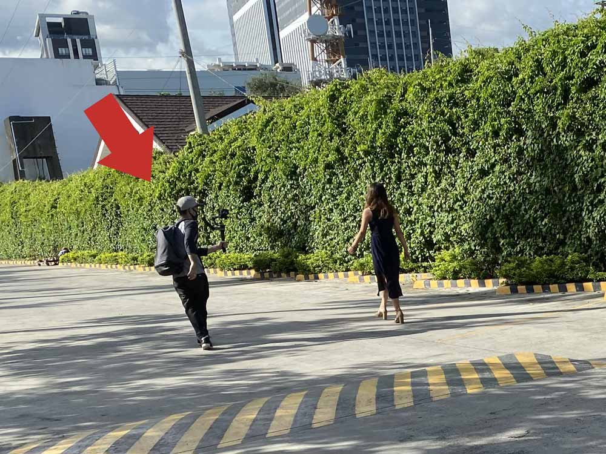

## セブ島からビジネスを発信するためにYouTubeチャンネル設立。YouTubeだからできること
私がセブ島に来たのは2019年4月。 海外で働くのなんてはじめてでワクワクしながらマクタン空港に降り立ったのを覚えています。  

最初は必死に働いていましたが、ロックダウンで自分を見つめ直す時間ができました。消耗する働き方にピリオドを打つため、2020年9月に退職。  

今後の人生をどうしようかと考えていた時ふと思い出しました。

フィリピンに来る前から私は**教育がやりたかった**んだって。  

いろんな人に相談しているうちに、そのプラットホームとして仲間とオフショア会社を設立することになりました。

<iframe width="560" height="315" src="https://www.youtube.com/embed/njff9dkkW8k" frameborder="0" allow="accelerometer; autoplay; clipboard-write; encrypted-media; gyroscope; picture-in-picture" allowfullscreen></iframe>

フィリピン・セブ島での生活やビジネスについてもっと発信した方がいい。文字ではなく映像だから伝わることもあります。

なので、YouTubeチャンネルを設立しました。

とはいえ、私は世間一般でいうYouTuberとかになるつもりはありません。  

飾らず等身大で発信しますのでよろしくお願いします。

### 教育とオフショアを両立しようとしたら会社を作ることになった
私は長年組織や教育のあり方に疑問を抱き、時に苦しんできました。

働きすぎて磨耗しきってしまったので、これ以上既存の組織に入る元気もありません。  

そんな時ほど考えが原点に戻るものです。

もともとこの国には教育とオフショアがやりたくてやって来ました。

充電期間中いろんな人と話した結果、オフショア会社を立ち上げることとなりました。

## 我々が目指すもの
ブレないために、今後どんな会社にしていきたいかなど考えを綴っておきます。

### 私たちにとって会社とは実践が積める「教育のプラットホーム」

私の目指す教育とは、あくまで「**食べていけるスキル**」を身につけさせることです。使えないスキルや知識は必要ありません。

テックスクールや職業訓練校の講師をやっていた時、「このままじゃこの子たちは食べていけない」とよく思い、苦しかったです。  

明らかに「実践」が足りないからです。  

今後、授業料をとって基礎だけを教えるような*生ぬるい教育*をするつもりはありません。

実践を積んで、スキルが身につけば転職・起業・フリーランスなど「人生の選択肢」が増えます。

1つの会社に貢献することばかりが人生じゃありません。  

会社に関わった人がスキルを身につけ、人生が豊かになり、さらに周りに教育を広めていく循環が生まれる。  

それが私たちの願いです。

### 役職は取っ払う。個々が責任を持って意見の言える組織へ
組織で責任が持てなかったり意見が言えなくなるのは**縦割りの組織体制が原因**だと思うんです。  

そうであれば、思い切って縦割りを取っ払ってしまったらどうだろう。

出世という制度がなければ競争したり誰かを蹴落そうとしたりする必要もないし、役職がなければ仕事量に対する理不尽さも生まれないはずです。

役職の違いによる給料格差ももちろん無くなります。  

力を合わせてやったことが自分たちの給料として跳ね返ればモチベーションも上がると思います。

## フィリピンの実情を発信したい。私の眼に映ったフィリピン

フィリピンのほとんどの人は*自分を貧困*と感じています。

「1週間500ペソもあれば十分だよ」って言ってる元同僚もいますし、20分くらいで辿り着けるところなら節約のため余裕で歩きます。  

2020年フィリピンでの**最低賃金は1日385ペソ（約800円）**です。

しかもコロナの影響で**現在失業率は50%**です。  

### ほとんどのフィリピン人は家族を助けるために働く

フィリピン人の多くは5人以上の大家族。中には**8人家族なんてこともザラ**です（昔は宗教の価値観で避妊を禁止されていた）。

親は子供の将来を考え大学に行かせます。それらの学費は奨学金を使ったり家族みんなでサポートします。

先ほども伝えた通り給料はとても安いです。少しでもいい職につけるように大学は必須なんです。  

私は日本へ3か月ほど出張に行き、そこでフィリピン人たちと働いたことがあります。

家族を助けるために毎月仕送りをしていました。

### せっかく良い大学を出てもコンビニやモールで仕事する人も多い

せっかく良い大学を出ても、コンビニやモールで働く人も少なくありません。

若い労働力が潤沢ということは**彼らの替えはいくらでもいる**ってことです。

家族を助けるために仕事は選んでられない。それが実情です。

安月給でも給定職につくことこそ正義なのです。

### 「定職こそ正義」という考え
安定していれば安月給でも家族のために我慢して働きます。

組織に属さず、起業やフリーランスとしてもっと稼ぐというアイデアはあまりありません。

したとしても、ごく一握りの人間です。

わずかでも安定して定期的にお金が入ってくることが重要なのです。

## まとめ・セブ島でのチャレンジは続く
この度オフショア会社を設立する経緯とフィリピンの実情についてお話ししました。

2021年初旬、国籍も性別も年齢も関係ない、フラットなオフショア会社を作りますのでぜひ応援してください！！  

準備期間も含めて、もっとYouTubeでもっと私たちのことを発信します。ぜひチャンネル登録お願いします。

かみーゆチャンネルの登録は[こちら](https://www.youtube.com/channel/UCbSgjkCIPucux8cFTuQcdcw)。

この動画は今回一緒に会社を始める[@noLALAnoLIFE1](https://twitter.com/noLALAnoLIFE1)が撮影・編集しました。

ちなみに、動画作成も承ります！！ご希望の方は[@lirioY](https://twitter.com/lirioY)にDMください。

最後までお読みいただきありがとうございました。
