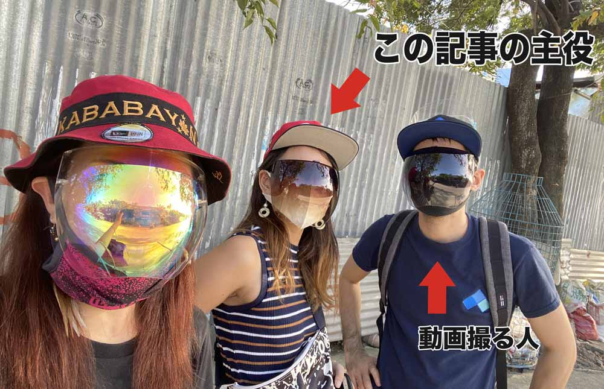
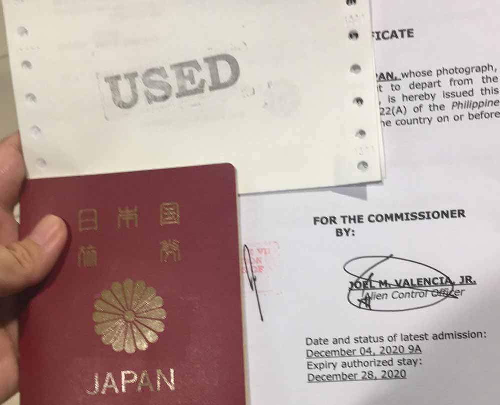

## 手記を書いたのは元同僚。ざっくりどんな人かご紹介
この記事は私の元同僚による手記です。

ロックダウンの影響もありフィリピンでのVISA手続き大変すぎて、*今後日本へ帰る人たちに気をつけて欲しい点などを伝えたい*という思いで寄稿いただきました。

ちなみに彼女のパーソナリティです。

自然豊かな日本の中部地方でのびのび育った元教員。オーストラリアに留学したり、働いていたので英語はペラペラ。

セブでは一緒に買い物したり、昼から一緒に呑んだくれることができる重要な人でした。

1. VISA手続き編（←イマココ）
2. [航空券購入 + バランガイ編](/blogs/entry429/)
3. [渡航編](/blogs/entry422/)
4. 帰国後編

ここからは託してくれた手記をほぼそのまま掲載します。

### フィリピンの9G（就労ビザ）から観光ビザへのダウングレードが難関

私は9Gと呼ばれる就労ビザで働いていました。フィリピンで日本人が会社を退職して帰国するためには9Gを観光ビザに変更する必要があります。

これがいわゆる*ダウングレード*です。

このダウングレードが曲者（くせもの）です。

この手続きを終了せずに帰国すると不法に出国したとみなされ、皆さんの*渡航歴に傷がつくことがある*そうです。

どんな影響があるかは正直わかりませんが、他国へ入国するときに説明を求められたり、入国に時間がかかるようなリスクは避けたいですよね。

### ダウングレード手続きがコロナ禍でめっちゃ時間がかかる
でもそんな*大事なダウングレードの手続きがフィリピンではコロナ禍でめっちゃ時間がかかる*ようになっています。

実際、約2か月かかるとイミグレ（移民管理局）から言われましたが、実質3・4か月待った人もいるそうです。（コロナ禍前は長くて1か月とのこと）

私も例に漏れず待てど暮せど、ダウングレードは承認されませんでした。

### 仕方ないので家族の事情を説明して帰国しないといけない理由を訴えてみた
このままじゃ帰れんやん！と気づき、11月初めにマニラのイミグレ宛に「祖母が倒れたからすぐ帰りたい。早くダウングレードして！」（本当のこと）という内容を会社からの正式なレターとしてメールで送りました。

<small>※ フィリピンはレター（手紙）文化。とても有効的です。</small>

 本来は家族都合の場合は配慮するって聞いていたので、期待して待っていましたが返信なし。 
電話でも何度もアタックしましたが繋がらない。

繋がっても「OK確認する、昼にまた連絡して」 

* *電話する→繋がらない* の繰り返し。

まったく進展がないので、セブのイミグレ、セブ領事館、日本にあるフィリピン大使館、外務省などに問い合わせましたが答えはみんな「*できることはなにもありません*」でした。  

**ホント使えねーな**。 って思ったりなんかしました。  

結局私のダウングレードが承認されたのはふつうに2か月後。家族都合だとしても配慮はないんだと学びました。

みなさん、*期待しちゃダメ*ですよ。

### 世の中金次第。ダウングレードを時短する裏技があるらしい
マニラのイミグレに直接行って*5000ペソ払うと3日でダウングレードができる*と聞いたので早期の帰国を考えてる人はこちらも検討するといいと思います。

ちなみにメールは毎日送っていましたが**祖母の写真を添付したメールには返信がきました**。

PDCA大事。

### ラスボスはECC（Emigration Clearance Certificate）
マニラのイミグレに確認したらダウングレードが終わったと報告を受けたので、意気揚々とセブのイミグレに確認したらまだないけど？とのこと。

結局、私のダウングレードが正式に通達されたのは火曜日でした。 
木曜日にマニラでの手続きが終わったと確認が取れていたのに、ここで*6日間のロス*。泣ける。。  

しかし、これで終わらないのがフィリピン。  

最後にECC（Emigration Clearance Certificate）の手続きをして正式に出国できるようになります。(証明写真3枚必要）  

<h4>ECC（Emigration Clearance Certificate）とは？</h4>
6か月以上フィリピンに滞在した外国人がフィリピンを離れるときに必要な出国許可証です。そもそも、フィリピンに滞在中にビザ代をきちんと払っているか、犯罪歴がないかを証明するためのものです。

この手続きは1日でできま、、、いや、できていたそうです。

*現在は3日かかります*。  

『**出国する外国人激減しとんのになんで余計に時間かかっとるんや！**』  

という心の声はしまい、3日後にECCを取りにイミグレへ。そこで新事実、もろもろの*手数料9000ペソ（日本円で約1.8万円）*！！  

みなさんは財布に9000ペソは入れてる派ですか？ 私は入れない派です。  

そんな外国人に突然言われても銀行口座もないのでおろせません。仕方なく家へお金を取りに行き、よーやくECCがもらえる！と思ったら、「月曜日に取り来て」とトドメの一発。  

『*もームリ、何回来たと思っとんの？あんた今日渡すって前言ったよね？鳥頭なの？*』  

って内容を1000倍に薄めた文句を伝えたところ、今日中に終わらせると言ってくれたのでそこからさらに2時間待ってついにすべてのVISAの書類を手に入れることができました！！

### コロナ禍。海外からの帰国で学んだアドバイス

今（2020年12月コロナ禍）ではECCにも時間がかかるのでチケットの渡航日は*ECCを提出してから4日はあけることをオススメ*します。

逆にすでに航空券買っていて、間に合わない！って言ったら早く手配してくれそうな雰囲気でした。交渉してみる価値ありです。

私はエージェントなしで会社のフィリピン人スタッフと駆けずり回って取得しましたが、エージェントを使えばもっと短い期間でできるかもしれません。  

「**私、もうイミグレへは行きたくありません**」。  

あ、あと火曜日のセブのイミグレは激混みなので避けることをオススメします！8:20時点で12組いました。この日は*配偶者ビザの手続き日*だからみたいです。 
1日潰れる覚悟をして向かいましょう！

## さいごに、管理人（かみーゆ）から
本日（2020年12月23日）、無事日本に帰還したと連絡を受けました。

なんとかおばあちゃんにも会えてホッとしました。

今回ご紹介したのは氷山の一角。コロナ禍でのフィリピンからの帰国は想像以上に大変だったようなので、続きを記事化してご紹介します。

今後、フィリピンから日本に帰る人の一助となれば幸いです。そんな人たちのために彼女が記事を託してくれていますので^ ^

次は、「[航空券購入 + バランガイ編](/blogs/entry429/)」です！ぜひ併せてお読みください。

最後までお読みいただきありがとうございました。
