## フィリピンではロックダウンと共にマスクやフェイスシールド着用を余儀なくされる
2020年4月よりフィリピンはコロナ蔓延で世界最長ロックダウンになりました。

許可証なしでは外出できなくなり、さらにマスクやフェイスシールド着用が義務付けられるようになりました。関所が設けられ、門限もあります。老人子供はいまだに外出できません。

2020年12月、さらにフルタイプのフェイスシールドの着用の義務化が決まりました（らしいです）。ただでさえ暑い南国でのフェイスシールド着用。。。ツライ。

## 独断と偏見でフィリピンのフェイスシールドを紹介します！
こんな困難？な状況でもめげないのがフィリピン。

いつの間にかいろんな形のフェイスシールドが増えて、その日のお洋服のコーディネートに合わせて選べるようになりました。

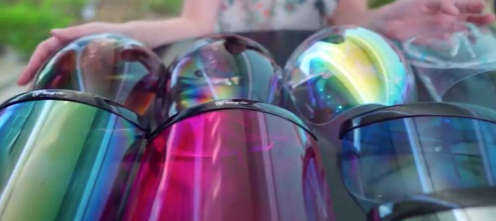

実は私、20代の頃はメイクさん・ネイリスト、そして地方テレビ局のスタイリストをしていました。

*センスには自信があります*！！

満を持してスタンダードなものからファッショナブルなものまで、フィリピンのフェイスシールドをご紹介します。

<small>※ 個人的な見解が含まれます。</small>

 今回、周りの人たちの協力の下たくさんのフェイスシールドを集めることができました。 
アザーーース!!!!

### エントリーNo1。スタンダードなフェイスシールド
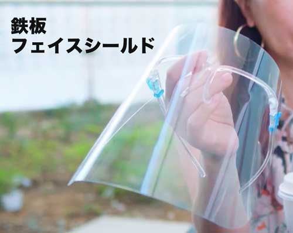

コンビニ、スーパー、モール、路上などどこでも手に入るスタンダードなフェイスシールドです。

フェイスシールドが必要になった頃は150ペソぐらいしていましたが、現在50ペソ程度でどこでもすぐに手に入ります。

デメリットはとにかく持ち運びに弱く、*すぐ傷だらけ*になります。あと自分で組み立てないといけないので不器用な人にはオススメしません。

<small>※ 1ペソ約2円です。</small>

#### *かみーゆ独断と偏見評価*
* おしゃれさ : *1*
* 軽さ : *5*
* 耐久性 : *1*
* お手頃さ : *5*
* 入手の容易さ : *5*

#### スタンダードなフェイスシールド補足情報・ダウンタウンで全材料購入可能！
フィリピンの代表的なダウンタウン・コロンストリートのAizilym Enterprisesという雑貨屋さんに行くと*たった8ペソ*で全材料が手に入ります。

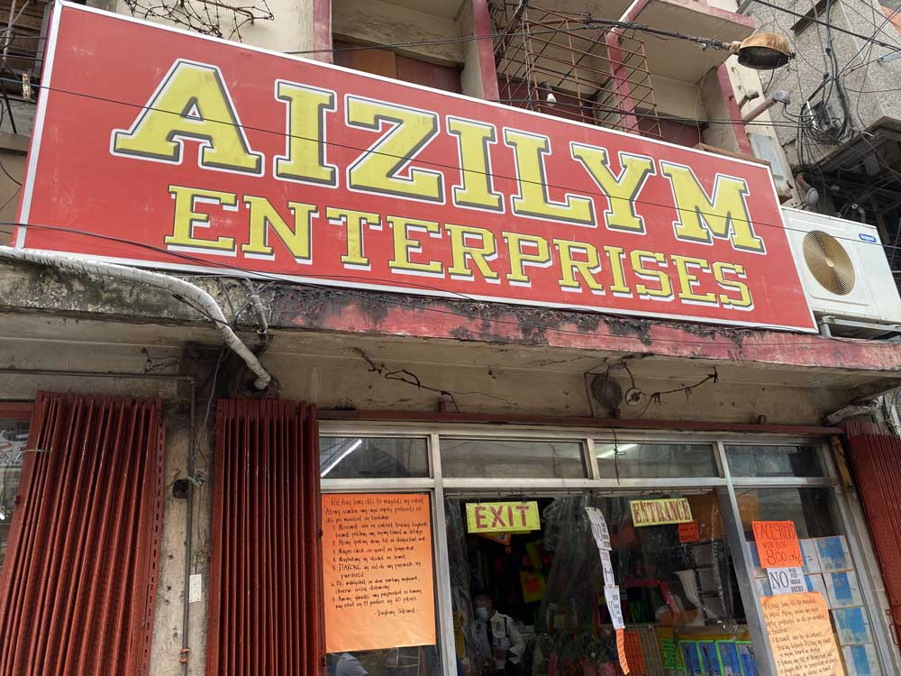

レジのあたりでこっそり？売ってますので、**日本に帰国予定で小銭を稼ぎたい人**は是非立ち寄ることをオススメします。

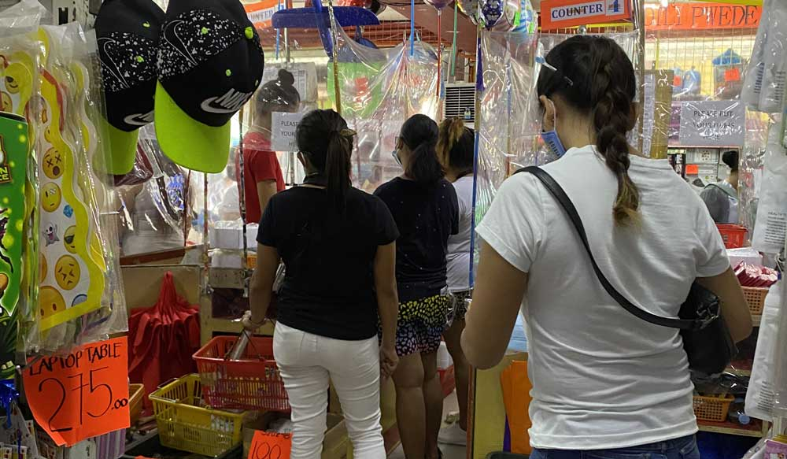

*フィリピンのダウンタウンは決して治安がよくない*ので知り合いのフィリピン人などと行くことをオススメします。

興味ある方はこちらの記事を参考にしてください。

<a class="article-link" href="/blogs/entry374">
<section>

セブ島地域密着の生活・カーボンマーケットでお買い物しました

先日地元の人しかあまり行かないカーボンマーケットをはじめとするコロン（街の名前）エリアで買い物を楽しんだのでレポート･･･

<time datetime="2020-11-01">2020.11.01</time>

</section>
</a>

店名：*Aizilym Enterprises*

[MAP](https://goo.gl/maps/3YGVCwYn3eT4kSc77)

### エントリーNo2。ハードタイプフェイスシールド・ハーフサイズ

フルサイズの義務化さえなければもっともオススメするのがこのタイプです。

硬いし、軽い。マスクの上におおいかぶさらないので息苦しさを感じないです。

しかもカバンにさっとしまえて超便利。  

もちろん透明なタイプもあります。

カラバリも豊富なので、恥ずかしがらず*お気に入りの色を着用することををオススメ*します。

ちなみに私が愛用しているのはこちらのブルーのグラデーションタイプです。半分は透明なので視界がいいです！

めっちゃ気に入ってます。

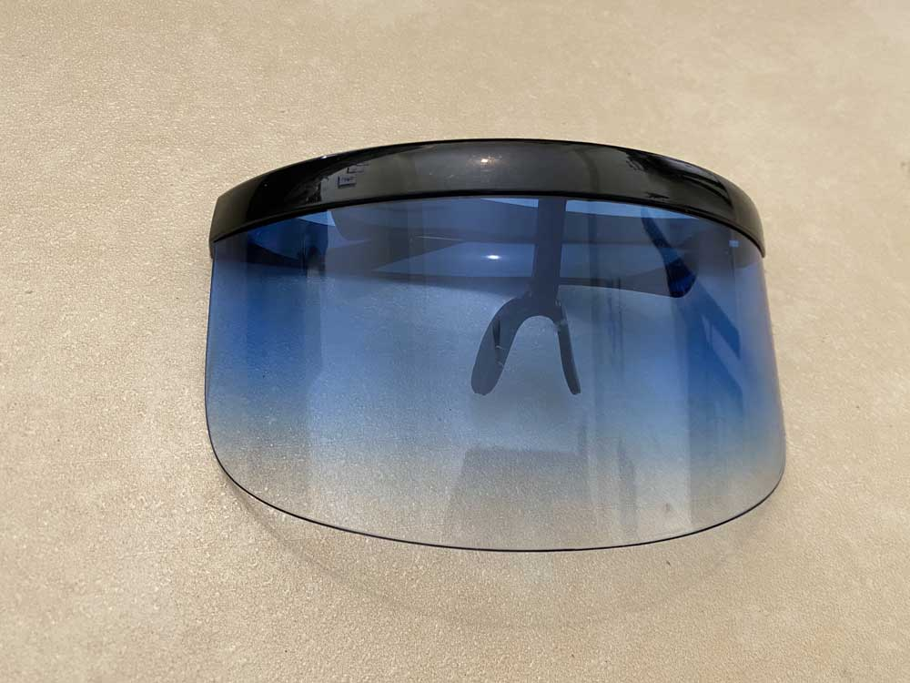

 ちなみに、男性にはこちらのミラータイプがオススメ。

イケメンに見えます。

*多分*。

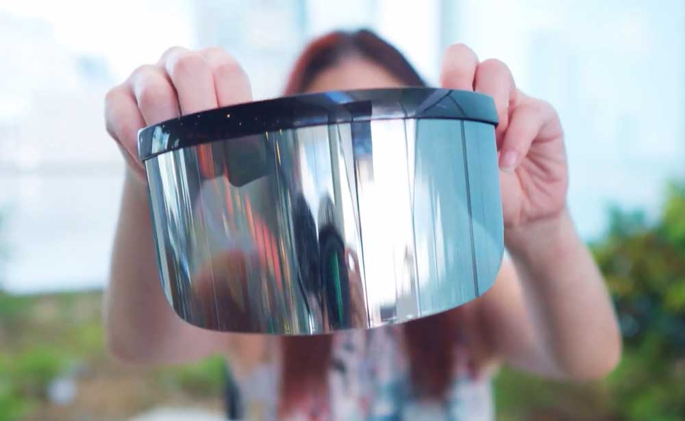

私はコロンストリートの路面店で買ったのでたった130ペソでした。アヤラモールで買うと150 ~ 180ペソだったので安く入手しようとすると、**路面店が断線オススメ**！

値切り交渉も可能です!!

ちなみに私はこちらの白いフレームの透明タイプを持っていましたが、何度か落とし、壊れて柄が取れてしまいました。

ハ●キルーペではないので*強い衝撃には弱い*ですが、フィリピンで手に入るものの中では耐久性抜群です。

#### *かみーゆ独断と偏見評価*
* おしゃれさ : *4*
* 軽さ : *4*
* 耐久性 : *4*
* お手頃さ : *3*
* イケメンさ : *5*

### エントリーNo3。ハードタイプフェイスシールド・フルサイズ
続きまして先ほどと同じタイプのフルサイズのご紹介。

こちらもハーフサイズと同様、カラバリ豊富。もちろんスタンダードな透明タイプもあります。

個性派を目指すな*断然ピンク*。もちろんブルーやグリーンなどもあるので、その日の気分やラッキーカラーに合わせるといいかもです。

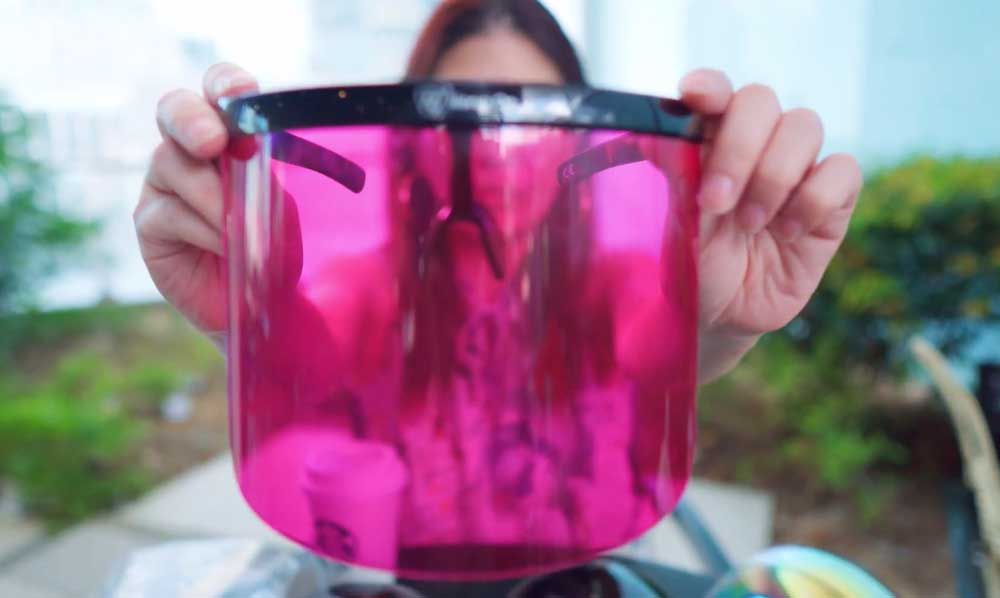

 こちらはミラータイプです！

顔がほぼすっぽりおおわれ、もはや誰かわかりません。

*すっぴんの外出時にオススメ*です！

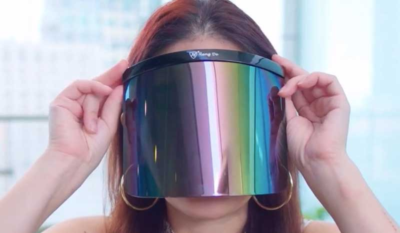
 でもまてよ。

 あれ？

 あれれ、、、？

 これ、どっかで見たことあるぞ、、、、  

・  

・  

・  

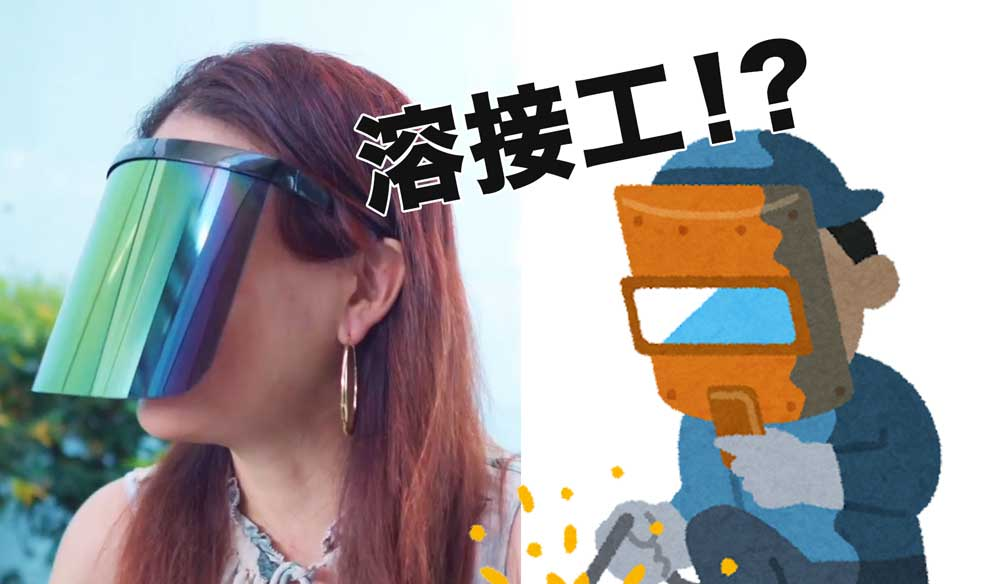

**溶接工**やん。。。。  

そして弱点は*とにかく重い*。鼻の上から少しずつずり落ちます。

こちらもコロンストリート、125ペソで手に入れました。

もはや価格の基準がわからん。。。。

#### *かみーゆ独断と偏見評価*
* おしゃれさ : *3*
* 軽さ : *1*
* 耐久性 : *4*
* お手頃さ : *3*
* 職人度 : *5*

### エントリーNo4。フォルムが美しいフルフェイスシールド

先日ITパークのアヤラモールでさらにおしゃれなフェイスシールドを見つけました。

見よ、**この美しい球状のフォルム**。

こちらはレインボーです。

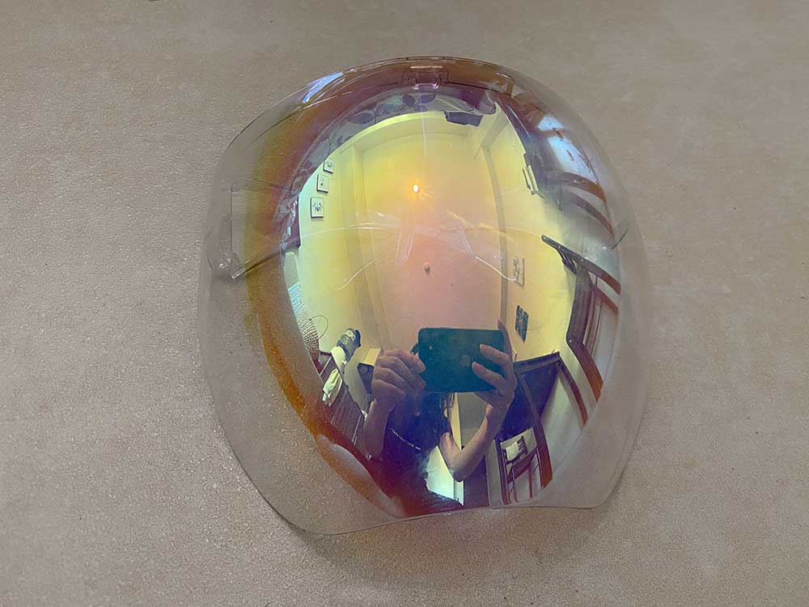

280ペソです。ちょっとお高い。

装着すると*近未来感*が半端ないです。これぞ**ニューノーマル**！

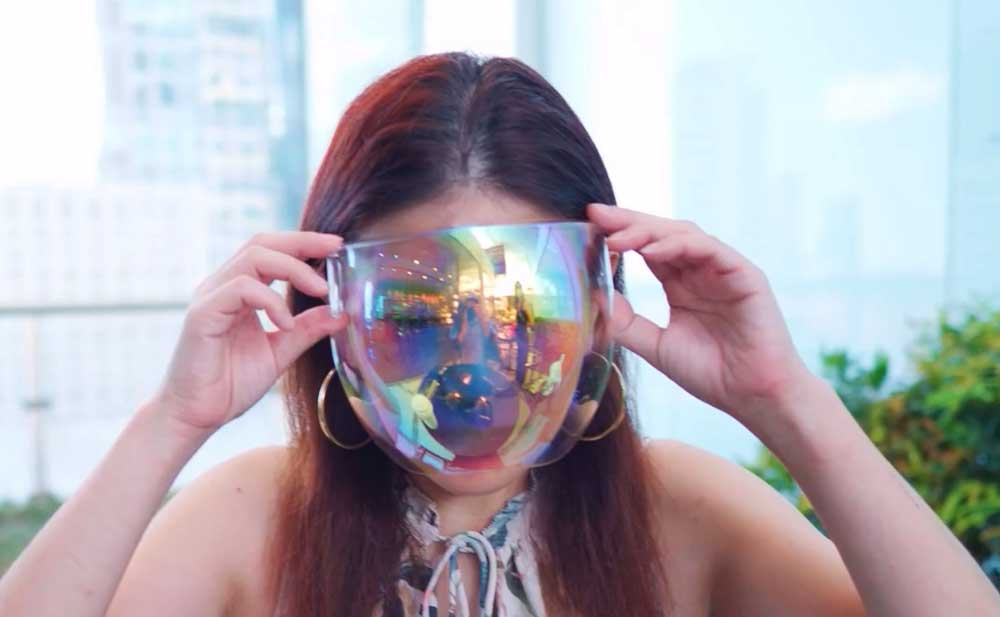

まるで自らをロボットと名乗る謎のフランスのアーティスト、*Daft Punk（ダフト・パンク）*のように瞬時になれますね。

<small>※ 楽曲は「One more time」が有名です。</small>

将来、クラブが再開したら着用して行くことをオススメします。

<iframe width="560" height="315" src="https://www.youtube-nocookie.com/embed/A2VpR8HahKc" frameborder="0" allow="accelerometer; autoplay; clipboard-write; encrypted-media; gyroscope; picture-in-picture" allowfullscreen></iframe>

[Daft Punk（ダフト・パンク）](https://ja.wikipedia.org/wiki/%E3%83%80%E3%83%95%E3%83%88%E3%83%BB%E3%83%91%E3%83%B3%E3%82%AF)

 ブラックのグラデはなかなか渋い。こちらも男性にオススメです。

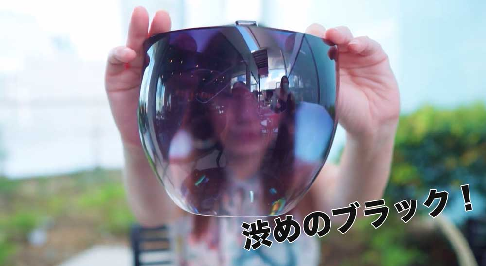

 ブラウングラデはこんな感じ。シックで上品です。

大人な装いに似合いますね。デートや結婚記念日のお食事に着用していくことをオススメします。

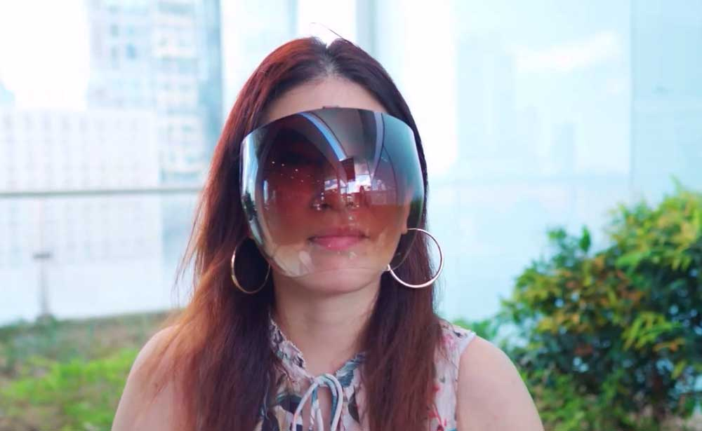

スタンダードな透明はもちろん、他にもたくさんカラバリがあります！

1つデメリットを言っておくと、フォルムが顔にフィットしすぎて**鼻息で曇り**ます。

#### *かみーゆ独断と偏見評価*
* おしゃれさ : *5*
* 軽さ : *4*
* 耐久性 : *3*
* お手頃さ : *1*
* 近未来度 : *5*

### エントリーNo5。大きな顔面でも安心！すっぽりかぶれるフルフェイスシールド
<small>※ 今から紹介するのは私が所有しているフェイスシールドではありません。</small>

おしゃれ系のフェイスシールドもサイズがまちまちで小顔じゃないとつけられないものもあります。

安心してください。

顔がでかい人でも安心してつけられるフェイスシールド見つけました。

なんと！かの*有名なあの人*が装着していました。

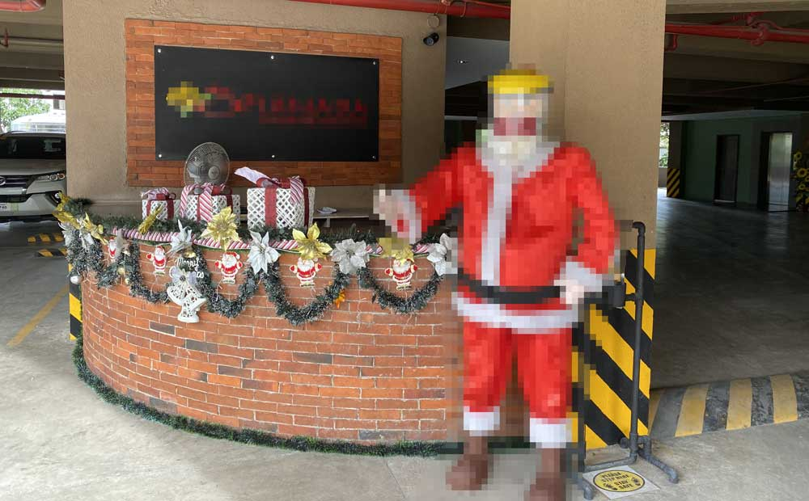

・  

・  

・  

・  

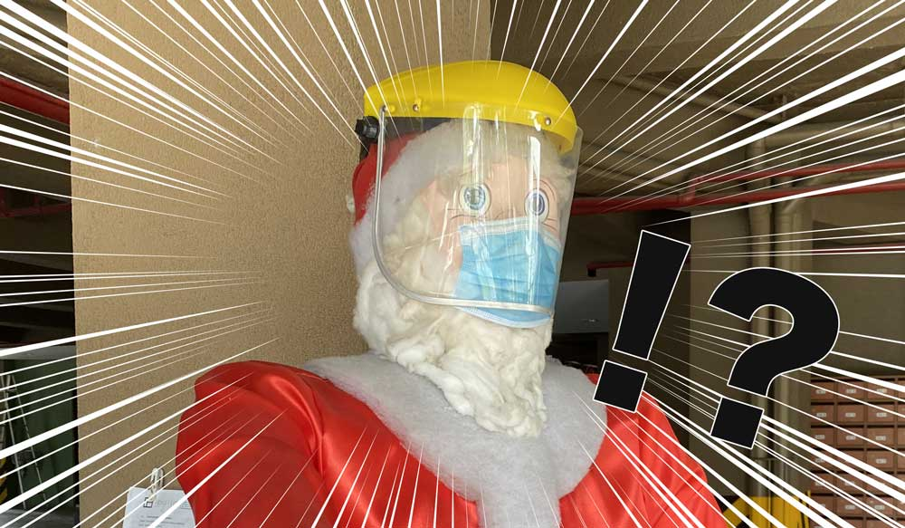

 ちょっとチャビー（太っちょ）でも装着可能なフェイスシールドです！

実際メトロ（フィリピンのスーパー）でサ●タさんと似たような体型のおじさんが同じフェイスシールドを着用していました。

#### *かみーゆ独断と偏見評価*
* おしゃれさ : *1*
* 軽さ : *1*
* 耐久性 : *5*
* お手頃さ : *不明*
* ゆったり感 : *5*

## 選手権なので順位発表します！！…の前に小休止。YouTubeもあるよ！

ブログの元ネタです！少し内容も違います。

ぜひこちらもご覧ください！

<iframe width="560" height="315" src="https://www.youtube.com/embed/VuHVkKR0Xkw" frameborder="0" allow="accelerometer; autoplay; clipboard-write; encrypted-media; gyroscope; picture-in-picture" allowfullscreen></iframe>

チャンネル登録してくれたら跳んで喜びます！好き❤️ 
↓↓↓↓↓ 
[かみーゆちゃんねる](https://www.youtube.com/channel/UCbSgjkCIPucux8cFTuQcdcw)

## 結論・一番オススメフェイスシールドは？
以上5つのフェイスシールドを紹介しました。

選手権なので一番のオススメを発表します。

私のイチオシフェイスシールドは

・  

・  

・  

・  

エントリーNo.4の*フォルムが美しいフルフェイスシールド*です！

理由は
1. 軽い
2. おしゃれ
3. 持ち運びやすい

からです。

ブラウン、ブラックあたりは半分透明で視界も悪くありません。フルフェイスの着用義務化が施行されても利用可能です。

フォルムもかっこいいし、お洋服にも合わせやすいのでぜひチャレンジしてみてください。  

<h3>側（はた）から見るとやっぱり怪しいフルフェイスシールド・ミラータイプ</h3>

最近、このタイプがあまりにも気に入ってどこに行くときも着用しています。  

人は己の姿をよくわかってないものです。  

自分が写っている写真を見て、**インスタ映えを凌駕する破壊力**があることに気がつきました。

<small>※ マクタンの船着場付近で撮影。</small>

 おしゃれを通り越して、*不審者*にしか見えません。

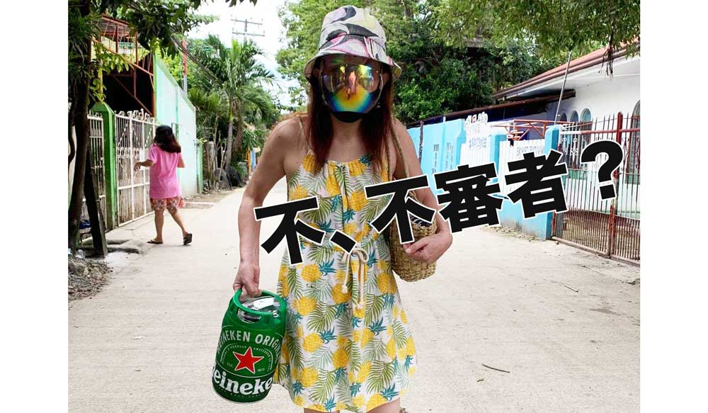

*ニューノーマル*どころか、見事に*ニューアブノーマル*です。

## まとめ・フィリピンでは日本で入手困難なフェイスシールドがお手頃価格で手に入る

フィリピンでは日本で考えられないようなデザインや色のフェイスシールドがお手頃価格で手に入ります。

コロナ禍でも苦境を楽しめるフィリピン文化に脱帽です。

日本でもいつかフェイスシールド着用義務付けられるかもしれないのでぜひ参考にしてください。

最後までお読みいただきありがとうございました。

### おまけ・実はみんなちゃんとフェイスシールドを装着していない
フィリピンではほどんどのモールやスーパーなどでフェイスシールド着用を義務付けられています。

が、**誰一人まじめに着用していません**。

着用すると前が見えないし息苦しいので仕方ないです。

まあ、まじめにルールを守らない。守るわけないのがフィリピン。  

じゃあどうするか。  

頭の上に乗っけてます。怒られたら着用するのが鉄板です。

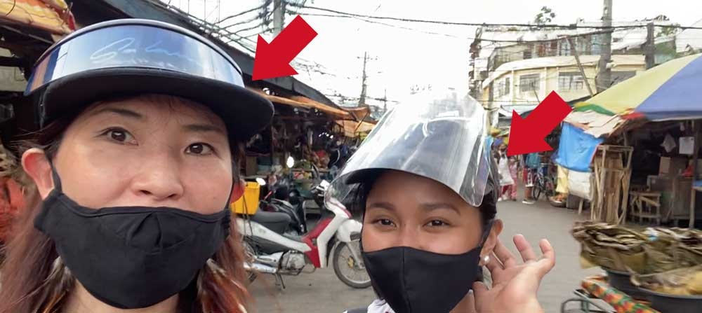

*フェイスシールドがヘアアクセサリーと化してる*のでオシャレになるわけだw
