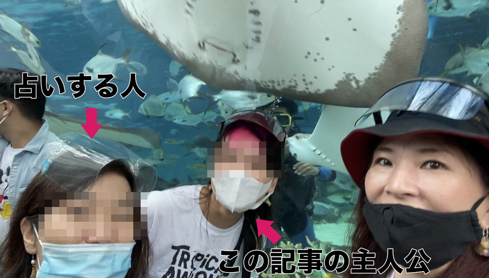
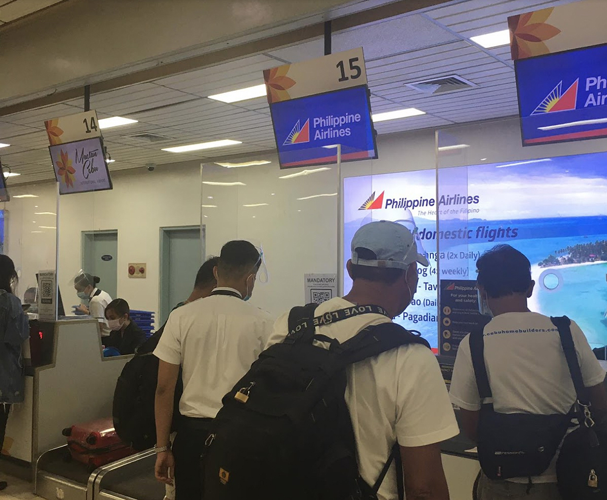
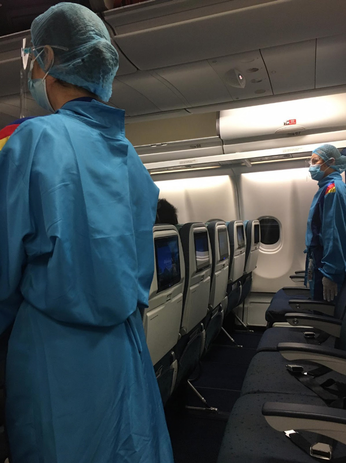
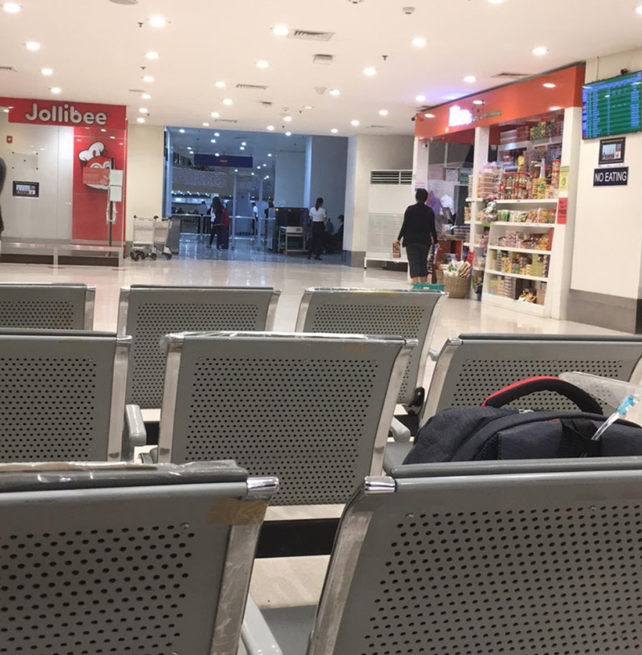

## 手記を書いたのは元同僚。ざっくりどんな人かご紹介
この記事は私の元同僚による手記です。

ロックダウンの影響もありフィリピンから渡航が大変すぎて、*今後日本へ帰る人たちに気をつけて欲しい点などを伝えたい*という思いで寄稿いただきました。

ちなみに彼女のパーソナリティです。

自然豊かな日本の中部地方でのびのび育った元教員。オーストラリアに留学したり、働いていたので英語はペラペラ。

<small>※ プライバシーに配慮してモザイク処理をしてます。</small>

セブでは一緒に買い物したり、昼から一緒に呑んだくれることができる重要な人でした。

1. [VISA手続き編](/blogs/entry422/)
2. [航空券購入 + バランガイ編](/blogs/entry429/)
3. 渡航編（←イマココ）
4. 帰国後編

ここからは託してくれた手記をほぼそのまま掲載します。

## VISA手続き・航空券購入を終え、いざ渡航
帰国日が決まるまで苦労の連続だったので本当に渡航できるのか心配でたまりませんでしたが、無事に日本へ帰国することができました。 
ただ以前のフィリピンから日本への渡航とは変わった点がたくさんあるので読んでから帰国されると安心かと思います！

私はフィリピン航空からセブ（18:15）ーマニラ（6:30）ー名古屋（11:30）のルートで帰国しました。

現時点で名古屋直行便は飛んでなく、このルートが一番最短時間だったのでこれにしました、

が、結果かなりしんどかったです、、、

名古屋への帰国方法に需要があるかわかりませんが、きっと成田、関空行きも変わらないはず！それでは私の渡航日記スタート〜！

### 1、空港へ向かう
Grab（タクシーなどの配車サービス）を取ってマクタン空港まで向かいました。平日の15時にセブ市を出発して、到着が16時10分。フィリピン航空から国内線は3時間前に空港に到着するようにとアナウンスが出ていましたが（国際線は4時間前）私は出発の2時間前に空港に到着しました。

こういうところに性格が出ますね。

### 2、空港到着
国内線のターミナル1に到着後、黄色のスタッフTシャツを着たにいちゃん達が迎えくれました。

そして、[Traze(正式名称：Traze Contact Tracing)](https://www.traze.ph/)というアプリをダウンロード済みか確認されました。

これに*登録しないと空港内に入れない*とのこと。初耳だった私はその場でダウンロードを試みましたが私のiPhoneではダウンロードできないと表示され、*パニック*。

<small>※ IOS 13.0以降</small>
  

**これがNew Normalなのか！**  

と動揺していると黄色のにいちゃんが自分のスマホから登録できるからと貸してくれました。 *なんていいやつ！！*

Trazeは接触追跡アプリで登録後、空港入り口にあるQRコードを読み取ると空港に入れるみたいです。（にいちゃんが全部やってくれたのでよくわかってないｗ）

### 3、チェックイン
荷物検査のあとフィリピン航空のカウンターへ行きチェックインをしました。

第一関門だったMedical Certificate等をチェックされ無事にチケットを手に入れました！
ここで書類足りないって言われたら*すべてが終わる*のでめっちゃホッとしました。そしてここでもフィリピン航空の追跡サイト？への入力を求められます。QRコードを読み取ってすすめていくものです。  

**これもエラーになりパニック**。  

グランドスタッフ（グラウンドスタッフとは、空港で働く航空会社の地上勤務職員）が手伝ってくれました。

ちなみにこの間も黄色のにいちゃんは近くにいて私の荷物を持ってくれています。

*案の定最後にチップを求められました*が、荷物持ちから、アプリ登録、案内等助けてくれたのでチップをあげました。

いつの間にか**にいちゃんが2人になってたのはフィリピンのご愛嬌**として受け止めました。  

<h3>アプリ・Traze Contact Tracing登録義務化</h3>

あとで調べたら2020年11月28日から国内線・国際線共にTrazeの登録が義務付けられてたみたいです。知らなかったー。私のように登録してなくても空港でどうにかなりますが、事前に終わらしておくと安心だと思います！

アプリをダウンロード（Android、iPhone、 Huawei 対応）し、Individual（個人）として登録。あとは空港ターミナルでQRコードを読み取るだけ。

参考：フィリピンエアライン公式ホームページ : <a href="https://www.philippineairlines.com/en/aboutus/newsandevents/advisQRy-covid19-27nov20-124-traze#Must target="_blank" rel="noopener">Download TRAZE CONTACT TRACING App</a>

登録サイト：<a href="https://www.traze.ph/" target="_blank" rel="noopener">https://www.traze.ph/</a>

### 4、搭乗、マニラへ
17時ごろにゲートに着きました。

1人だったことと混んでいなかったのでチェックインはスムーズでした。ちょっとしたお土産屋さんやレストランは開いてました。

そして飛行機に搭乗してマニラへ。

飛行機はソーシャルディスタンスを取るため1席づつ空いてていつもより快適でした。

機内食に水とスナックが配られました。

### 5、マニラ到着
19時半にマニラ到着。乗り継ぎカウンターでどこで待てばいいか確認。  

「預け荷物はピックアップ不要だからシャトルバスでターミナル2へ行って」

とのこと。

乗り場を聞くと「there」と指を指すだけ。*お姉さん冷たい*。

でもよくあることなのでその方向へ歩いていき、そこにいたおっさんに聞くと答えはもちろん「there」。  

*だからどこ？？*って思いながら歩いて行ったら出口にたどり着いたので出口のガードに聞こうとしたらさっきのおっさんが来て

「出ちゃダメだよ！あそこ、あそこ！あそこのシートに座って待つんだ」と言われました。

よく見ると20ｍ先の壁際にあるイスに数人座ってました。

**わかるかよ！！看板立てとけ！！**と思いながら大人しく待ってシャトルバスに乗ってターミナル2へ。

私の便は翌朝6時半発だったので、ターミナル2で夜を明かさねばなりません。バスを降りて入り口近くのガードにチケットを見せると待機場所を教えてくれたのでそのまま入り待機場所へ。

待機場所と言ってもトイレと小さな売店があるだけです。外へ出ることは自由ですが空港の奥には入れません。

椅子は手すりがあるため横にもなれません。 Jollibee（フィリピンの国民的ファストフード）もありましたがすでに閉まっていました（営業時間6am-6pｍ）。  

セブの飲食店は9・10時まで営業しているところが増えていたのでその感覚で行った私がバカでした。  

でもGrabは注文できるのでなんとかはなります。Arival Jollibeeとドライバーに伝えると来てくれます。

「Merry Christmas！」と元気に配達してくれたので*フォー（ベトナム料理）なのに箸が入ってなかったことは不問*にしました。売店あってよかった。  

結局この場所で6時間待機しました。

フィリピン人は床でイビキをかいて寝ていましたが、私は一睡もできず、ただひたすらこの文章を書いていました。お子さん連れの方は**ホテルを確保しておくことを強くおすすめ**します。

### 6、マニラでチェックインと出国審査
朝3時ごろ、ガードが「カウンターが開いたから入れるぞー」と起こしに来てくれました。*まぁ、私寝てませんが*。

私はすでにボーディングパスを手に入れていましたが念の為フィリピン航空のカウンターへ。

やはりそこでもNew Normalな手続きがありました。まず体温を測られ、ヘルスチェック用紙への記入を求められます。それを私はカウンターで提出しましたが、搭乗の際にまた同じ用に記入を求められたのでカウンターでの提出は不要だったかもしれません。

そしてここでもQRコードを読んでの入力作業が必要です。今回は国際線のため日本の厚生労働省が作ったサイトにアクセスし、各自QRコードを取得しなければいけません。

QRコードの画面が出てきたらスクショして保存すればいいんですが、私はボタンを間違えて画面を消してしまい再入力しました。一睡もしてないんだから仕方ない。でも何回も入力できることがわかりました。

私みたいに消してしまっても大丈夫ですよ。これが**日本到着時のPCR検査の際に必要になる**っぽいです。New Normalですね。

この入力の際に帰国後の滞在先住所や連絡先を入力します。ここで入力した連絡先に帰国後電話がいくので家族の番号を記入するつもりの方は家族に伝えておくといいと思います。

最後にグランドスタッフに「PCR検査の証明書は？」と聞かれましたが「PCRは日本で受ける。Medical Certificateは持ってる。」と言ったら「OK」で終わりました。

 『*なんで聞いたの？ドキドキさせないでよ！*』と思いましたがOKならOKです。  

そしていよいよ書類準備に3ヶ月以上かかった出国審査です！すごくドキドキしながらパスポートと書類を渡しましたが、**秒で終わりました**。ホント秒。**あんだけ準備した**んだから当たり前っちゃー当たり前ですが、拍子抜けです。

あとは搭乗ゲートへ向かうだけですが、搭乗ゲートがまだ決まっていないからあとでアナウンスすると言われたのでそれまで入口付近でまた待機。朝4時時点でサンドイッチやフィリピン料理を売っているお店が2店舗開いていました。

この待ち時間が一番つらかったです。  

眠いけど横になれない、頭働かない、寝過ごしたら終わる、空港寒い。  

とか考えながら1時間半待ちました。

乗り換えのつらいところです。結局ゲートのアナウンスは聞こえず、電子掲示板にも表示されなかったので、ガードに聞きました。

**海外では情報は待つのではなく自分から取りに行くのが鉄則**です。わからないことはすぐ誰かに聞きましょう。幸いフィリピンはどこへ行ってもスタッフっぽい人がいるので聞き放題です。

朝5:30にスタバが開くと聞いたのでコーヒーを買ってゲートへ向かいました。ゲートへ向かうと、簡易の受付カウンターがありスタッフがQRコードと、ヘルスチェック用紙を確認していました。これもNew Normal。

それが済むといよいよ搭乗です。

名古屋行きはほぼフィリピン人でした。席もガラガラで、『*ラスト1席だって言われて急いでチケット買ったのにどこがだよ!？*』と思いましたが3席分使ってゆったり帰れたのはよかったです。

機内ではマスクの着用は義務でしたが、フェイスシールドはどっちでもいいって感じでした。

### 7、アドバイス
New Normalでは*いろんな情報をスマホを使って入力*する場面があります。スマホは使える状態にしておきましょう。

携帯番号やフィリピンの住所を覚えてない人はメモしておくとスムーズです。私は毎回入力エラーが出てスムーズにいきませんでしたがその都度周りのスタッフが助けてくれました。現地でなんとかなります！

一番大事なのは英語が苦手でも**帰国前には必ず航空会社が出してる*オフシャルな情報*を確認し**てください。コロナの状況次第で頻繁にルール変更がありそうなので。

航空会社のオフィスへ行ってスタッフへ搭乗に必要な書類等を直接聞くのもいいと思います。私は3人に確認しました。みんな微妙に違うことを教えてくれましたが、私の場合PCR検査は不要だという点はみんな同じで安心しました。

<small>→「チケットの買い方編」で後述します</small>

 機内はめっちゃ乾燥してるので乾燥対策はしっかりしましょう。

私はマスクしてましたが喉が痛くなって2回起きました。コロナに感染するリスクが上がる気がするので、こまめに水を飲むようにしましょう。

5分に1回水を飲むとウィルスに感染しないとテレビで言ってました。
寝れませんね。

でも*機内で感染することも多い*と聞くので感染対策はしっかりして、安全に帰国できるようにしましょう！

## さいごに、管理人（かみーゆ）から
彼女は2020年12月23日、無事日本に帰還しました。

アプリ・Traze Contact Tracingは必ずスマホのOSのバージョンを確認しておきましょう。

フィリピンのルールにブンブン振り回されて、なんとか日本に帰った彼女の手記がこれから帰国する方の一助となれば幸いです。

次は「帰国後編」を掲載予定です。わー最終回やーw。

最後までお読みいただきありがとうございました。
