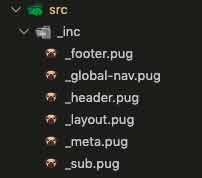
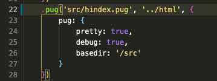

## pugとは？
Pugとは、Haml（HTMLを抽象化したマークアップ言語）記法に影響を受けたJavaScriptで実装された高機能テンプレートエンジンです。

*より短く、キレイかつ簡潔にコード*を書くことができます。

> The general rendering process of Pug is simple. pug.compile() will compile the Pug source code into a JavaScript function that takes a data object (called “locals”) as an argument. Call that resultant function with your data, and voilà!, it will return a string of HTML rendered with your data.<br>
> The compiled function can be re-used, and called with different sets of data.<br>
> 公式サイト：[pug](https://pugjs.org/api/getting-started.html)

昔は、*Jade（ヒスイ）*と呼ばれていましたが、すでに商標登録されていたのでPugに名前が変更されました（Version 2以降）。

似たようなテンプレートエンジンでEJSもあります。参考にしてください。

<a class="article-link" href="/blogs/entry459/">
<section><div class="article-link__img"></div><div class="article-link__main">
<div class="article-link__main__title">【Gulp】EJSを使ってHTMLを量産する</div>
<p class="description">最近GulpでEJSというテンプレートを使ってHTMLのファイルを量産しました。･･</p>
<p>
<time datetime="2021-05-05">2021.05.05</time>
</p>
</div>
</section></a>

私の考えるpugでコーディングするデメリットとメリットを紹介します。

### 導入のメリット

* 大量のページを手分けして量産できる
* 短いコードでキレイかつ簡潔にコードが書ける
* ヘッダーや共通部分とそれ以外を分けて書ける



こちらは私が作っているサイトの実際のpugファイルです。footerやheaderなどを分けてデフォルトで読み込み、主要コンテンツだけ毎度変更しています。

### 導入のデメリット

* 実務で使うためには*gulp*や*webpack*のタスクを書いたりコマンドを覚える必要がある
* インデントをミスると意図しないコンパイルが起きる
* コードの書き方など多少の学習コストがかかる



こちらは私が実際に利用しているLaravel mixのwebpackのコードです。タスクを書いたりしないといけないのは少し面倒ですね。

## 導入方法
pugはnpm経由でインストール可能です。

npmをインストールしていることが前提です。インストールのコードは公式サイトでは以下が紹介されています。

```shell script
npm install pug
```

<br>今回は練習のため、`pug-practice`というディレクトリを作ってみましょう。ディレクトリー名とproject名が被らないように注意してください。

npmのモジュールを管理できるようにpackage.jsonを作っておきます。VSコードであれば、ターミナルを`control + shift + @`で開くことができます。

### npm initでpackage.jsonを作成
package.jsonを作成し、npmモジュールを管理しながら、進めていきます。

package.jsonを作成は以下のコマンド。

```
npm init
```
もしくは
```
npm init -y
```

通常プロジェクト名など、対話式で入力し作成していくのですが`-y`のオプションを使うと面倒な入力を省くことができます。

### npmのモジュールをインストール
次にpugをインストールします。

```shell script
npm install pug pug-cli -D
```
場合によってインストールでコケるのでsudo（管理者権限で実行）をつけてみてください。

<small>※ テンプレートを分けたい場合は、pug-cliを再インストールする必要があります。<br><a href="#テンプレート化したい場合に使う記述方法">テンプレート化したい場合に使う記述方法</a>を参照してください。</small>

<br>`-D`オプションで現在のプロジェクト管理下のみでモジュールが使えるようになります。

現時点ではグローバルにインストールせず、プロジェクト毎にモジュールをインストールするのが主流です。

package.jsonファイルが以下のようになっていたら成功です。

現時点でpugのバージョンは3.0.0でした。

今回はnpmだけで実行してみます。scriptsに`pug`のコマンドを追加します。

```js
{
  "name": "pug-practice",
  "version": "1.0.0",
  "description": "",
  "main": "index.js",
  "scripts": {
    "test": "echo \"Error: no test specified\" && exit 1",
    "pug": "pug ./src --hierarchy -o ./dist -P"
  },
  "keywords": [],
  "author": "",
  "license": "ISC",
  "dependencies": {
    "pug": "^3.0.0",
    "pug-cli": "^1.0.0-alpha6"
  }
}

```

```js
"pug-w": "pug ./src --hierarchy -o ./dist -P -w"
```
<small>※scriptのオプションは記事の最後にあります。</small>

実行は以下のコマンド。

```
npm run pug-w
```

<br>今回用意するディレクトリーの構造です。srcディレクトリーにindex.pugを追加します。
```
/pug-practice
  ├ node_modules/
  ├ package.json
  ├ src/
  |  └ index.pug（追加）
  └ dist/
     └ index.html（勝手に出力されます）
```
src内のファイルを更新するとコンパイルされます。`-w`オプションが付いているのでリレンダー（再コンパイル）されます。

<small>※scriptのオプションは記事の最後にあります。</small>

## 基本の記述方法

記述方法です。多分永久保存版。

### 基本中の基本・単純なタグと文字列を出力したい場合
pugの記法はタグ名+スペース+コンテンツです。閉じタグは不要です。

```pug
p hello,pug!
```
これでファイルはコンパイルできましたね！！

```html
<p>hello,pug!</p>
```

<br>htmlを直に書くことができます。
```pug
div
  <p>hello,pug!</p>
```

```html
<div><p>hello,pug!</p></div>

```

<br>*=（イコール）*でタグ内にコンテンツを内包させることもできます。

```pug
p='こんにちは。IT戦士のかみーゆです。'
```
```html
<p>こんにちは。IT戦士のかみーゆです。</p>
```

### エスケープ処理
出力内容をエスケープしたくないことがありますよね？
そんなときは!（エクスクラメーション・マーク）を使うとそのまま出力されます。

```pug
p='見出し1は<h1>タグで囲みます'

p!='見出し1は<h1>タグで囲みます'
```

```html
<p>見出し1は&lt;h1&gt;で囲みます。</p>

<p>見出し1は<h1>で囲みます。</p>
```
### コメント
コメントをpug上には残して、htmlには反映したくない場合は */（スラッシュ）2つ＋-（ハイフン）*を文前に追加。

```pug
//- ここにコメントをかく
```

htmlのコメントとして残したい場合は */（スラッシュ）2つ*です。

```pug
// ここにコメントをかく
```

### 入れ子（ネスト）構造を書きたい場合
入れ子にしたい場合はインデント（字下げ）を使います。
以下のような書き方をします。

```pug
header
  h1 hello, pug!
```

コンパイル後。

```html
<header>
  <h1>hello, pug!</h1>
</header>
```

<br>もしくは*:（コロン）+スペース*を使います。
```pug
div: p test
```
コンパイル後。
```html
<div>
  <p>test</p>
</div>
```
### idとclassの出力
idは`#`、classは`.`でつなぐ。

```pug
section#hoge
div.piyo
```
コンパイル結果。
```html
<section id="hoge"></section>
<div class="piyo"></div>
```

またidやclassを使うとき、divは省略できます。

```pug
.piyo
```

###  srcやhlefなどの属性の出力方法
属性は()内に属性名=値で記載できます。複数あるときは、*,（カンマ）*か*スペース*で区切ります。
```pug
img(src="image.jpg", alt="画像", width="300", height="200")

a(href="./" target="_blank") トップページ
```
コンパイル後
```html


<a href="./" target="_blank">トップページ</a>
```
<br>id、クラスも同様にカッコ内にも書けます。

```pug
section(id="hoge")

div(class="piyo")
```

<br>マルチラインで書くこともできます。

```pug
input(
  type='checkbox'
  name='agreement'
  checked
)
```

出力結果。

```html
<input type="checkbox" name="agreement" checked="checked"/>
```

<br>*`（バッククォート）*を使えば、属性の値を複数行にまたいで書くこともできる。
```pug
input(data-json=`
  {
    "very-long": "piece of ",
    "data": true
  }
`)
```
出力結果。
```html
<input data-json="
  {
	  &quot;very-long&quot;: &quot;piece of &quot;,
    &quot;data&quot;: true
  }
" />
```

<br>さらに`&attributes()`を使って、後から属性を連想配列として追加できます。
```pug
a(href="/")&attributes({'style':'color:white','target':'_blank'}) リンク
```
出力結果です。
```html
<a href="/" style="color:white;" target="_blank">リンク</a>
```

### 改行追加
インライン扱いされるようなタグは改行されずコンパイル時美しく整形されません。
改行を加えたい場合は *|（パイプ）2つ*を使います。


```pug
a(href="/") HOME
|
|
a(href="/blog") Blog
```

出力結果はこちら。

```html
<a href="/">HOME</a>
<a href="/blog">Blog</a>
```

### 文字列の中にタグ
文字列の中に文字を入れる方法が2つあります。
1つは *|（パイプ）*を使う方法です。

```pug
p
 | これは
 strong テキスト
 | です
```

もう一つは`#[]`で囲む方法です。

```pug
p これは#[strong テキスト]です
```
前述したものに比べてこちらの方がはるかに簡単なのでよく使います。

<br>出力結果はこちら。

```html
<p>これは<strong>テキスト</strong>です</p>
```

### JSやstyleを追加したい場合
headタグ内やbody内にJSやCSSのコードを追加したいときは以下のように書きます。

```pug
style.
  a {
    color: #333;
    background: #aaa;
  }

script.
  let pug = 'Hello, pug!!!';
  console.log(pug);
```

出力結果はこちら。
```html
<style>
  a {
    color: #333;
    background: #aaa;
  }
</style>

<script>
  let pug = 'Hello, pug!!!';
  console.log(pug);
</script>
```
## プログラミング的記述方法
分岐や変数、ループの書き方です。

ちょっと難しくなりますが、ムリに使わなくてもpugは十分書けます。

### 変数
pugでは変数が使えます。何気に便利。コンテンツとして出力したいときは `#{}` の中に記入します。

```pug
- var name = "aaa"

p #{name}
```

出力結果はこちら。
```html
<p>aaa</p>
```

<br>属性の中に変数を入れるときはこんな感じで書きます。

```pug
//- 変数のみ
input(type="text" value=name)

//- 変数 + 文字列
input(type="text" value=name + 'です')
```

<br>文字列と混在させるときは変数を `${}` 内に記入し *`（バッククオート）*で囲むと前述したものより可読性が上がります。

```pug
//- 変数 + 文字列
input(type="text" value=`${name}です`)
```

出力結果です。

```html
<input type="text" value="aaa"/>
<input type="text" value="aaaです"/>
```

<br>三項演算子で出力を分けることもできます。

```pug
- var toppage = true

h1(class=toppage ? 'is-top' : 'is-lower') 見出し

```
出力結果です。
```html
<h1 class="is-top">見出し</h1>
```

<br>そのまま変数を出力したい場合は *\（バックスラッシュ）*を使用します。

```pug
p \#{pug}は変数です。
```

出力結果です。
```html
<p>#{pug}は変数です。</p>
```

<br>`&attributes()`を使えば、属性を配列に渡して値を追加可能です。

```pug
- var attributes = {};
- attributes.target = '_blank';
a(href="/")&attributes(attributes) リンク
```
出力結果です。
```html
<a href="/" target="_blank">リンク</a>
```

### ifやcaseなどの分岐処理
*if文*です。ヘッダーロゴのリンクをつけるつけないなどの判定によく使います。

```pug
- var pageId = 'home'
- var pageName = 'my site'

if pageId == 'home'
  h1 #{pageName}
else
  p: a(href="/") #{pageName}
```
出力結果です。
```html
<h1>my site</h1>
```

<br>いわゆる*swhich文*のような書き方もできます。

```pug
- var  pageTemplate = 'contact'
case pageTemplate
  when 'contact'
    section.contact
  when 'top'
    section.top
  default
    section
```
出力結果です。
```html
<section class="contact"></section>
```
breakで抜けることもできます。
```pug
default
- break
```
*:（コロン）*を使うとまとめて書けます。
```pug
- var  pageTemplate = 'contact'
case pageTemplate
  when 'contact': section.contact
  when 'top': section.top
  default: section
```

### for、each、while文などのループ処理
ループもできます。

まずは*for文*から。

```pug
ul
  - for (var i = 0; i <= 2; i++) {
    li.item リスト0#{i}
  - }
```

出力結果。
```html
<ul>
  <li class="item">リスト00</li>
  <li class="item">リスト01</li>
  <li class="item">リスト02</li>
  <li class="item">リスト03</li>
</ul>
```
<br>*while文*も使えます。出力結果は先ほどの*for文*と一緒です。
```pug
- var n = 0;
ul
  while n < 3
     li.item リスト0#{n++}
```

<br>*each文*はより実用的に使えると思います。

```pug
ul
  each val in [1, 2, 3]
    li= val
```
出力結果。
```html
<ul>
  <li>1</li>
  <li>2</li>
  <li>3</li>
</ul>
```
<br>インデックスも合わせて利用する場合。
```pug
ul
  each val, index in ['cat', 'dog', 'rabbit']
    li= index + ': ' + val
```
出力結果。
```html
<ul>
  <li>0: 猫</li>
  <li>1: 犬</li>
  <li>2: うさぎ</li>
</ul>
```

<br>連想配列パターン。共通の変数として宣言さえしておけばメニューなんかにめっちゃ使える。

三項演算子と組み合わせると、クラスに現在のページというクラスも追加できます。

```pug
- var menu = {'cat': '猫', 'dog': '犬', 'rabbit': 'うさぎ'}
- pageId = 'cat'
ul
  each val, key in menu
    li(class=key == pageId ? 'is-current' : '' ): a(href=`/${key}`)=val
```

出力結果。
```html
<ul>
  <li><a href="/cat">猫</a></li>
  <li><a href="/dog">犬</a></li>
  <li><a href="/rabbit">うさぎ</a></li>
</ul>
```
<br>さらにちょいテク。pugはそもそもJSのメソッドが使えるので、値を大文字（アッパーケース）化してそのままタイトルに使う方法もあります。
```pug
ul
  each val in ['cat', 'dog', 'rabbit']
    li: a(href=`/${val}`)=val.toUpperCase()
```
出力結果。
```html
<ul>
  <li><a href="/cat">CAT</a></li>
  <li><a href="/dog">DOG</a></li>
  <li><a href="/rabbit">RABBIT</a></li>
</ul>
```

### 関数・mixin
再利用したいときは*mixin*に登録しておきましょう。
```pug
mixin list
  ul
    li CAT
    li DOG
    li RABBIT
+list
```
出力結果。
```html
<ul>
  <li>CAT</li>
  <li>DOG</li>
  <li>RABBIT</li>
</ul>
```
<br>引数を使うパターン。下層ページのタイトルやパンくずで使えそう。

```pug
mixin pageHeader(pageId, pageName)
  header(class=pageId)
	//- toUpperCase()でローマ字大文字に
    p #{pageId.toUpperCase()}
    h1 #{pageName}

- var pageId = 'service'
- var pageName = '私たちのサービス'
//- 引数のデフォルトが出力される
+ pageHeader

//- 値を変更可能
+ pageHeader(pageId, pageName)
```

出力結果。

```html
<header class="service">
  <p>SERVICE</p>
  <h1>私たちのサービス</h1>
</header>
```
<br>引数にはデフォルトも設定しておけます。

```pug
mixin pageHeader(pageId='top', pageName='トップページ')
```
出力結果です。
```html
<header class="top">
	<p>TOP</p>
  <h1>トップページ</h1>
</header>
```
<br>スプレッド構文を利用するパターン

```pug
mixin list(id, ...items)
  ul(id=id)
    each item in items
      li= item
+list('my-list', 1, 2, 3, 4)
```
出力結果です。
```html
<ul id="my-list">
  <li>1</li>
  <li>2</li>
  <li>3</li>
  <li>4</li>
</ul>
```
## テンプレート化したい場合に使う記述方法
ファイルを分けて、テンプレート化していきます。

このままではコンパイル時に、*_（アンダースコア）*がついたファイルもコンパイルされてしまうので、「pug-cliをGitHub – pugjs/pug-cli: Pug’s CLI interface」から*インストールし直す*必要があります。
```
npm i github:pugjs/pug-cli#master -D
```

参照：[pug-cliで_（アンダースコア）がついたファイルやディレクトもコンパイルされてしまう問題を解決する
](https://qiita.com/soarflat/items/48cec8fb19252a3fc4ad)

### include・ファイルの読み込み
ファイルを読み込みたい場合は *include+ペース+ファイルパス*です。

拡張子（.pug）は省略できます。

```pug
include _inc/_header
```
### extend・継承
extendとblockを使って元となるファイルを継承することもできます。
たとえば、_layout.pugというテンプレートを使いたい場合は次のような書き方になります。

```pug
extend _layout
```
### append・独自の設定
ページごとに独自の設定をもたせたいときはappendを使います。
```pug
//- _layout.pug
block slider
//- home.pug
append slider
  script(src="slider.js")
```

## テンプレートサンプル（簡易バージョン）

ディレクトリー構成の例です。超簡易バージョンなので、実務用にするためには少し手を加える必要があります。
```
/pug-practice
  ├ node_modules/
  ├ package.json
  ├ src/
  |  ├ _inc/（追加）
  |  |  ├ _layout.pug（追加）
  |  |  ├ _header.pug（追加）
  |  |  └ _footer.pug（追加）
  |  └ index.pug
  └ dist/
     └ index.html（勝手に出力されます）
```

index.pugをテンプレート出力するためには以下のように書くと良いと思います。

### layout.pug・レイアウト用テンプレート
```pug
//- Setting
block variables
append siteInfo
  - var siteName = 'My Site'
  - var menu     = {'home': 'トップページ', 'service': 'サービス', 'about': '私たちについて', 'contact':'お問い合わせ'}
  //- メニューの出力
  mixin list(current='', list=menu)
      ul
        each val, key in list
          - var key = key === 'home' ? '' : key
          if current !== ''
            li(class=val === current ? 'is-current' : '' ): a(href=`/${key}`)=val
          else
            li: a(href=`/${key}`)=val

//- コンテンツ
<!DOCTYPE html>
html
  head
    title=pageName
    meta(name="description" content=pageDescription)
  body
    include _header.pug
    main
      block content
    include _footer.pug

```

### header.pug・ヘッダー用テンプレのコード

```pug
//- setting
block siteInfo
block variables

//- コンテンツ
header
  if pageId === 'index'
    h1 #{siteName}
  else
    p: a(href="/") #{siteName}

nav
  +list(pageName)

```

### footer.pug・フッター用テンプレのコード
```pug
//- setting
block siteInfo

//- コンテンツ
footer
  +list
  p: small (c) #{siteName}
```

### index.pug・コンテンツ用テンプレのコード
```pug
//- setting
extend _layout

append variables
  - var pageId = 'index' //- Name of the page
  - var pageName = 'トップページ'
  - var pageDescription = 'ページの説明'

//- コンテンツ
append content
  h1 #{pageName}
  p test

```

### 出力結果
```html
<!DOCTYPE html>
<html>
  <head>
    <title>トップページ</title>
    <meta name="description" content="ページの説明"/>
  </head>
  <body>
    <header>
      <h1>My Site</h1>
    </header>
    <nav>
      <ul>
        <li class="is-current"><a href="/">トップページ</a></li>
        <li><a href="/service">サービス</a></li>
        <li><a href="/about">私たちについて</a></li>
        <li><a href="/contact">お問い合わせ</a></li>
      </ul>
    </nav>
    <main>
      <h1>トップページ</h1>
      <p>test</p>
    </main>
    <footer>
      <ul>
        <li><a href="/">トップページ</a></li>
        <li><a href="/service">サービス</a></li>
        <li><a href="/about">私たちについて</a></li>
        <li><a href="/contact">お問い合わせ</a></li>
      </ul>
      <p><small>(c) My Site</small></p>
    </footer>
  </body>
</html>
```
## まとめ
いかがでしたか？

npmでcliで読み込むと、webpackやgulpどちらにでもカンタンに組み込めるので便利かと思います！

今回はよく忘れる変数やループ処理などの使い方を*かなりディープ*にまとめました。

[pugの公式サイト](https://pugjs.org/api/getting-started.html)を結構頑張って網羅してる（つもり..
）のでよかったら参考にしていただけると嬉しいです。

次回はもう少し実務で使えるテンプレのレシピをまとめようと思います。

最後までお読みいただきありがとうございました。

### おまけ・pug-cli の npmスクリプトのオプション

pug-cliのscriptのオプションです。途中まで訳しましたが、ちょっと自信なし。。。参考までに！

|オプション名|詳細|
|-|-|
|-h, --help             |ヘルプオプションの出力|
|-V, --version          |バージョンを調べる|
|-O, --obj `<str|path>`   |JSON/JavaScriptのオプションオブジェクトやファイル|
|-o, --out `<dir>`        |HTMLやJSを`<dir>`（指定した名前のディレクトリ）に出力|
|-p, --path `<path>`      |filename used to resolve includes|
|-P, --pretty           |インデントなど整えて出力|
|-c, --client           |クライアントようにコンパイル？（compile function for client-side runtime.js）|
|-n, --name `<str>`       |コンパイルされたテンプレートの名前（-cオプションが必要）|
|-D, --no-debug         |デバッグなしでコンパイルする|
|-w, --watch            |ファイルを監視し、更新されたらリロードする|
|-E, --extension `<ext>`  |出力ファイルの拡張子を指定|
|-s, --silent           |ログを出力しない|
|--name-after-file      |name the template after the last section of the file path (requires --client and overriden by --name)|
|--doctype `<str> `       |specify the doctype on the command line (useful if it is not specified by the template)|
|--hierarchy            |階層構造を維持したまま出力|
