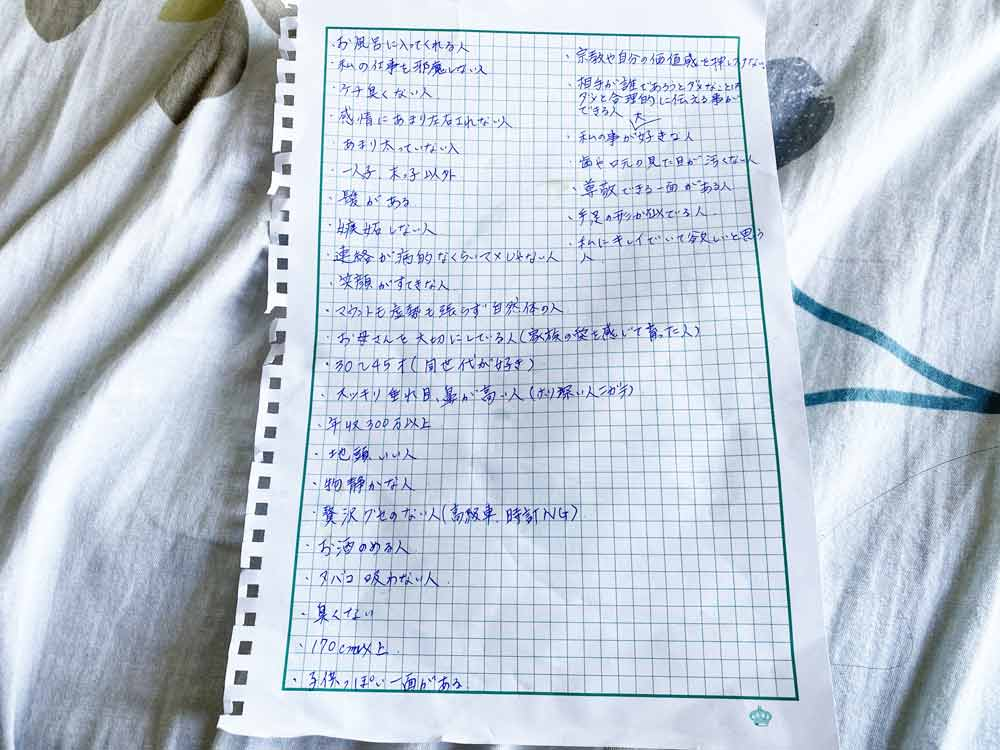
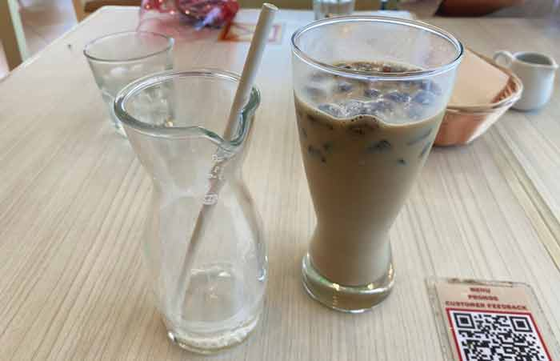

## きっかけ・友だちとの会話の中で気づきがあった
私、ぶっちゃけ恋愛というものが昔っから苦手です。

毎年「*今年こそちょっとぐらい幸せになりたいなー*」と思いつつ不器用でアンテナも鈍く機会損失ばかりして生きてきました。

そんなとき友だちに「**出会いたい恋人像ってちゃんと持っている？**」って言われて、ハッと気付きました（ちなみに私は男女かかわらず自分のことをベラベラ話しします）。

 私の恋人に対する前提条件は「*風呂に入る*」と「*私の仕事をジャマしない*」の2つくらいです。 
あとは「目・鼻・口がついていればいーや」って、あまり気にしていません。しかも押されると折れてしまいます。

出会いたい恋人像の条件がすっごくぼんやりしているんです。指摘されるまで気づきませんでした。

 ウェブ制作においても、そういえば*どんな条件で制作するかを最初にきちんと決めていない*と必ずと言っていいほど事故が起こります。

 *恋愛もそうかもしれない！*

なので恋人の条件を要件定義に例えてみることにしました。

## 要件定義とは？目的はイメージを明確化すること

要件定義に関してざっくり説明です。

> システム開発などのプロジェクトを始める前の段階で、必要な機能や要求をわかりやすくまとめていく作業のことです。 企画の進行とともに要件定義に立ち返ることも多く、目的の脱線を防止する役割も果たします。

では要件定義の手順に沿って要件を固めていきます。

1. 要望：アイディア
2. 要求：実装して欲しい大まかな機能一覧
3. 検討：要求の実現性を考える
4. 提案：検討した結果を提案
5. 要件：双方が合意した具体的な機能一覧と実装方法

### フェース1:どんな要望があるか
ウェブ制作の話です。

よくあるのはバーン、ガーン、シュシュシュって感じで作ってと言われます。

 こんな要望、マジで困りますよね。  

サイトが表示される前にかっちょいいローディングアニメがあって、表示されたら画像の切り替わるアニメーションがあって、ニュースが3件表示されて下の方にマップが欲しい。コーポレートカラーをアクセントカラーに使いたい。

ここまでクライアントから具体的な要望があると、どんなサイトが作りたいかイメージがつきます。

 そこで、自分がどんな恋人に対してどんな要望があるのか考えてみました。

<em>安心して、自分を偽らず、ストレス溜めずに一緒に過ごせるような人</em>

どんな人だったらこの私の要望を叶えられるか、次のフェーズ・要求で条件をリストアップします。

我ながら書いていると泣けてきます。。。

### フェース2:どんな要求があるか
Web制作においての例です。

イメージスライダーは自分で画像が差し替えられるかどうかとか、ニュース更新のためにWordPressなどのCMSを入れるかなど要望を叶えるためにやれる事項はたくさんあります。

あくまで今は要求のフェーズなので*予算*、*期間*、*実装可能*かなどは無視していいです。

要望を叶えるために必要な機能を1個づつリストアップします。

* ローディングアニメ実装
* イメージスライダー（画像の変更可能）
* ニュース投稿可能
* Googleマップ埋め込み
* .....

 Web制作での要求と同様、「こんな人だったら私の要望を叶えられるだろうなー」という条件を「*風呂に入る*」と「*私の仕事をジャマしない*」の2つ以外もリストアップしてみました。

ただ列挙するだけではなく、きちんと「*なぜその条件が必要か*」の理由も考えました。

 たとえば1つ「お母さんを大切にしている人（家族の愛を感じて育った人）」ですが、私がお母さん大好きで子どもの頃も今も彼女が母親で幸せだなーって思います。

そういう気持ちが共感できたら幸せですし、**「お母さんを大事にする人」は恋人や奥さんも大事にする**という持論があります。

 このリストには**理由を裏付けできない条件はない**です。

ちなみに私は理想が低いと豪語してたのですが余裕で30項目くらいありましたww

あくまで要求のフェーズなので*予算*、*期間*、*実装可能*などは無視していいのでこれでOKです。

### フェーズ3:要求の実現性を検討する
Webサイト制作においてリスト化された要求を可能な限り実現してあげたいのですが、そうもいきませんよね。

* 技術的に開発可能か？
* 予算はどの程度必要か？
* 納期はいつ頃になるか？

たとえばイメージスライダーをクライアント側で差し替えしたい。その機能を実装するためには実装に5日かかる。

などなど、予算や納期などと要求を擦り合わせていきます。

 では恋人の条件においてです。私は絶対に「お風呂に入ってくれる」のを優先したい！など、どの項目を優先するかのフェーズが「検討」にあたります。*妥協*という言い方がしっくりくるかもしれません。

私は「170cm以上」という項目を条件に挙げてますが、「お風呂に入ってくれる」ことの方がよっぽど重要なので余裕で諦めます。

### フェーズ4:検討した結果を提案する
Web制作では予算や期日を加味して実装できる機能を戻します。

* 実装できる機能
* 請求する金額
* 納品できる期日

ここで発注者側へのアドバイスです。

「*あとで変えてもらえるだろう*」とか甘いことを思わず、しっかり詰めてください。

要件定義が甘いからあとで揉めるんです。後味悪いくらいならとことん詰めておきます。

 改めて提案のフェーズを恋人の条件を当てはめて考えました。

この時点で「**まあいっかって気持ちで付き合うからしっくりこなくて別れるんだろうなー**」と遠い目になりました。

 どんな条件が譲れないかちゃんと見極めて、変な妥協をしない（自戒）ことが重要です。記事を書きながら猛省しています。人生を振り返ると現実逃避したい気分です。

なので、*このプロジェクトの納期は私が死ぬまで*という設定にしておこうと思います。

### フェーズ5:双方が合意したことを要件にまとめる
最後に、クライアントの要望と納期・機能・予算を擦り合わせて双方の納得いった要件のみを定義してまとめます。

クライアントが納得してもらうまでは2 ~ 4を繰り返す感じになるかと思います。

要件定義はプロジェクトを進める上で発注側がちょっと違うことを言ってきても「要件定義にないですよ」って突っ込める材料にもなります。

 私も発注先（恋人）が見つかるまで、要件をブラッシュアップしようと思います。

私のゴールは*安心して自分を偽らず、ストレス溜めずに過ごせる人*を見つけるのこと。

ブレないように心に要件定義を刻んでおきます。

## まとめ
今回はバレンタインデーが近いので、恋人の条件を要件定義に例えてみました。

カフェで「今年こそ幸せになりたい！」て言っていたら、友だちに*恋人にしたい条件をリストアップ*することをすすめられました。

私は言われたら即やるタイプ。その日帰って早速リスト化してみました。

条件を絞り込んでるうちに「これって要件定義に似てるなー」って思い、記事化することにしました。

 友だち曰く、「毎日そのリストを見ていたらそういう人が見つかる」とのこと。

さらに「自分もリストの条件の恋人にぴったりな人間へなれる」とのこと。

 なんだか意味もなくワクワクしてきましたw

 この記事がみなさんの要件定義？恋人探しの一助となれば幸いです。

最後までお読みいただきありがとうございました！

### 参考サイト
[要件定義～システム設計ができる人材になれる記事](https://qiita.com/Saku731/items/741fcf0f40dd989ee4f8)
