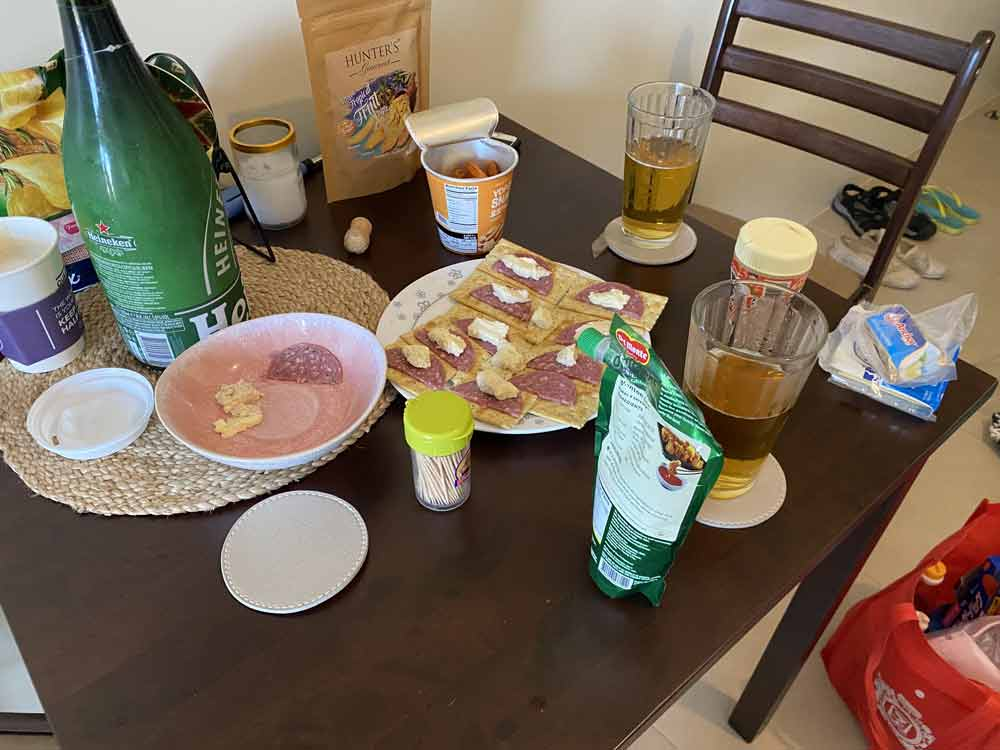
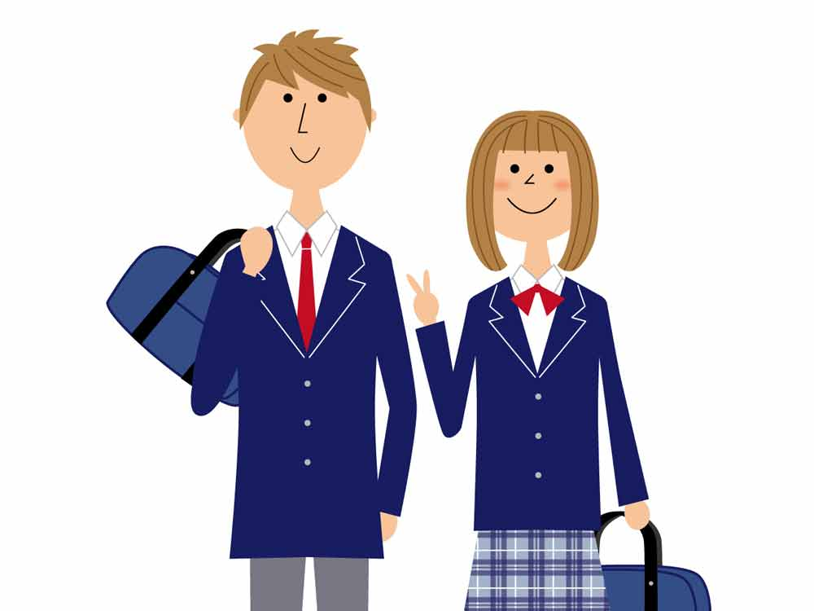
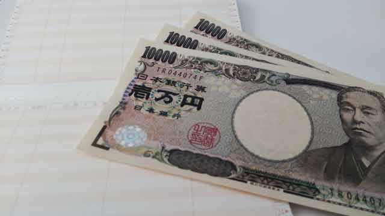
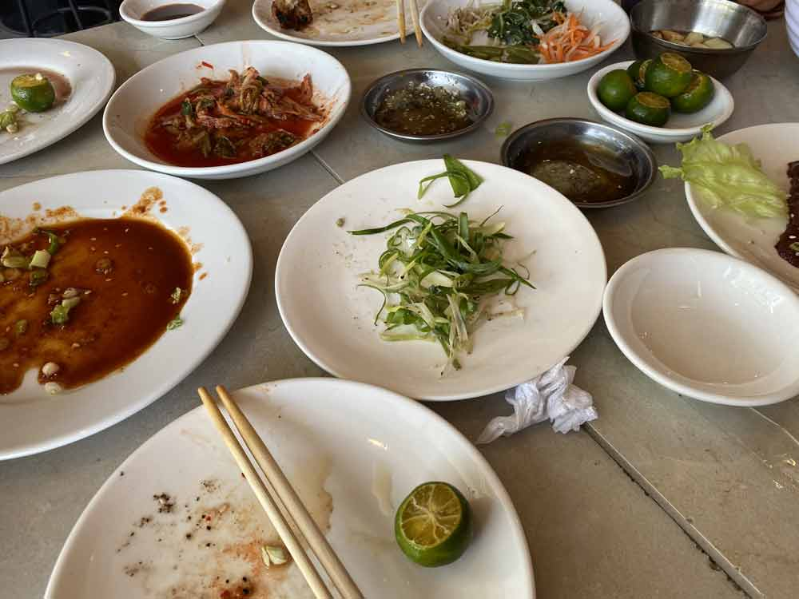
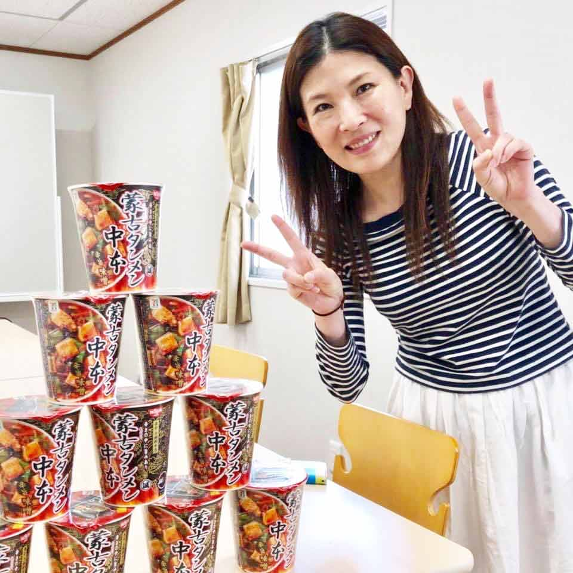
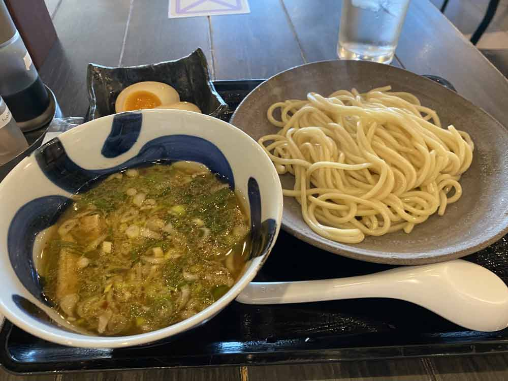
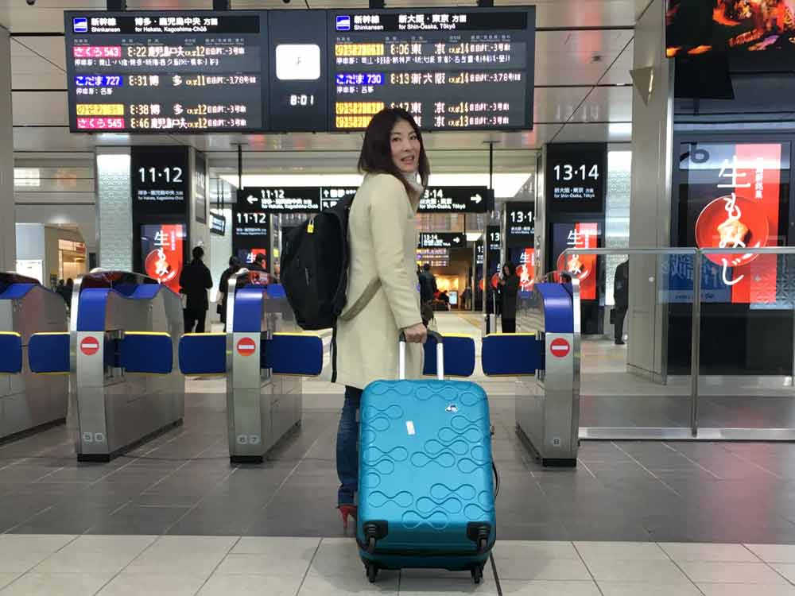
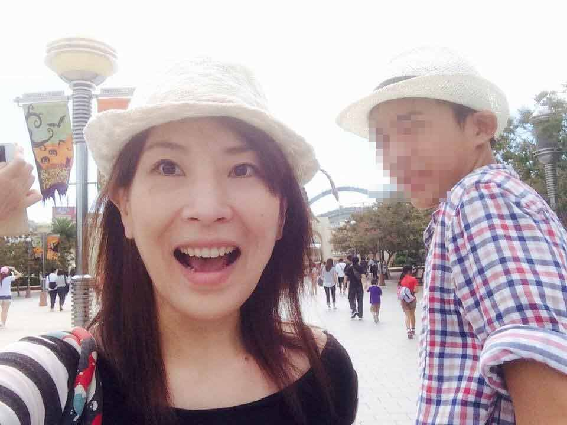

## 私がダイエットしない理由

ダイエットするのって面倒くさくないですか？

私がダイエットしない理由は**単純に面倒**だから、です。

*苦しい食事制限*もしたくないし、*退屈な運動*もしたくありません。

 なら、*ダイエットする状況にならない*ようにすればいいと思いませんか。

 80kgまで太った人が30kg痩せてもまったく称賛しません。優しくなくてごめんなさい。

でも、「最初から太らなければダイエットなんてしなくていいじゃん」って心で思っています。

普段から食事や生活を気をつけていれば「努力しないで済むのに」ってね。

### ダイエットは辛い。だからやらない
もちろん私も昔から体型維持できていたわけではないですよ。

学生の頃はぽっちゃりしていて、たくさんダイエットしていました。ダイエットを始めたきっかけもあります。

当時付き合っていた彼と下校中のことです。

突然沈黙したと思ったら  「痩せんさい。手遅れになる前に痩せんさい（広島弁）」  と言われました。

*大切なことなので2回言った*んでしょうね。  

その時の心境ですが、ぶっちゃけ*ショックではなくむしろ面白かった*です。  

とはいえ、その頃の私は10代乙女。それまで体型に関して無頓着だったのですが、一念発起しダイエットすることにしました。

ヨーグルトダイエット、バナナダイエット。お小遣いをはたいてダイエットドリンクとかも購入しました。

同じ食事ばっかりして、常に空腹。今考えるとこんなの自殺行為ですよね。

今考えると*正気の沙汰とは思えないこと*をしていました。

二度とぜーーったいやりたくないですw

### ダイエットって自業自得で作った借金の返済とそっくり？

自業自得で借金した人が返済できてもあまり称賛されませんよね？  

最初から負債は負わない。  

だから、たとえ太っても挽回できない体重まで増やさないようにします。そうすれば最小限の努力で済みますから。

## 何が食べたいか、自分と相談する
体って正直です。疲れたらクエン酸たっぷりの酸っぱいものが食べたかったり、筋トレしてるとお肉が食べたくなったりします。

<small>※ セブ島ドラム缶焼肉粋。日本じゃ食べられないレバ刺し食べられるし、めーーーーっちゃ元気が出ます。</small>

どんな栄養素が欲しいかって体が一番わかってます。だからその時欲したものを食べるようにしています。

たとえ、食べたいものがカップラーメンでも食べたい理由があるはずです。

### 昔はもっとスタイルに過敏だった
私は20代の頃、「子どもがいるから、歳だから」を理由に太ったり老け込むのだけはイヤだと思ってました。

当時は美容関係の仕事もしていたし、それなりにスタイル維持の努力はしていました。

 30代でITに転職。美容とは無縁だし、そこそこサボるようになりました。

ちなみに日本でITの仕事している時の好物は「*ファミチキ*」と「*蒙古タンメン中本のカップラーメン*」です。絶対体に悪いですよねww？

<small>※ 蒙古タンメン中本好きすぎて誕生日プレゼントとしてもらいました。大好きなので満面の笑み。</small>

 と思ったら、翌日は不思議と野菜スティックが無性に食べたくなるんですよ。

体って本当におもしろい。

多少の増減はあるものの、**食べたいものを食べてるとさほど太らない**ことに気がつきました。

### 食べたいものを食べて、食べたくないものは食べなくていい

「酢キャベツ」がいいとかダイエット食には流行がありますが、義務的に食べることほど辛いことはないです。しかもマズければなおのこと。

だから体にいいとしても*食べたくないものも断固食べない*ようになりました。

それでストレス溜まるくらいなら食べないほうがマシです。

自分の心と体が欲したものを優先して食べます。  

一方好きなものを食べている時って**幸せホルモンがバンバン出ている**と思うんです。

私はラーメンが大好きなんですが、「麺の喉越しサイコー！」とか「魚介のダシの香りがたまらん！」とかめっちゃ頭の中で喋りながら食べてます。そんな瞬間が最高に幸せです。

罪悪感を持って食べるのほど不幸なことはありませんよ。

## 体型や体重を人と比べない
普段から私は体重や体型を人と比べないようにしています。むしろセブに来て体重計に乗ってないので自分が何キロあるかすらわかりません。

私の体重が何キロあろうが地球も滅びないし、大した問題じゃないと思っています。  

そもそも、遺伝子も育った環境も違うのに**他人と比べるだけムダ**です。  

他人と比較ばっかりしていると「*比較沼*」に陥ります。人類、自分以外はみんな他人。

たくさんいるから常に沼にどっぷり浸かって苦しいのは自分ですよ。  

*自分が心地よく過ごせればいい*んですよ。

## ダイエットってほどじゃないけど、食事や運動のコントロールをするタイミング
ちなみに私が 「ちょっと食事控えようかなー」とか「運動しようかなー」と思うタイミングがあります。

普段履いているお気に入りのジーンズなどがキツいと感じたときです。

そんな時は1サイズ大きなものを買えばいいんでしょうが絶対しません。

理由は自分が「心地よく過ごせないから」です。お気に入りのジーンズを履いているときは*間違いなく心地よく過ごせています*。

私はあまり洋服買わないので**お気に入りの服と一緒に過ごす時間も大切**なんです。

逆にお腹がプニプニしていても「まあいいやー」と開き直ることもあります。

どんな体型でも自分が「心地よく過ごせるか」を優先しています。

ちなみにこちらは15年以上前おばあちゃんに買ってもらったコートです。いまだ現役です。

## 食欲が異常だと思ったら自分を内観してみて
そもそもなんで*あなたの食欲が止まらない理由*を考えたことありますか？

痩せることにフォーカスしがちですが。  

ここからは私の持論です。

人はストレスなどで精神の均衡が崩れると何かで補おうとします。手っ取り早いのが「食欲」や「性欲」を満たすことです。

「*気持ちいい*」は一番手っ取り早くメンタルを満たしますからね。  

私の周りにもストレスなどで傷ついたメンタルを知らず知らず食欲で補おうとする人、とても多いです。

ストレスで太る→ダイエットしてストレスたまる、の繰り返し。

メンタルが傷ついた状態でダイエットなんてしたら余計ストレスが溜まりますよ。  

だったら先に**ストレスの原因を取り除くほうが先決**じゃないでしょうか？

### 衝動的な食欲は精神状態のバロメーター
もし、おかしいなって思ったら以下の項目をチェックして欲しいです。  

* 何にストレスを感じているか？
* そのストレスは取り除くことができるのか？
* 取り除けないストレスなら他の発散方法はあるか？
* そもそもストレスの溜まるような考え方に陥ってないか？

 先に精神的に安定することを優先しないと根本は解決できません。

リバウンドするだけです。

### 食欲は旺盛過ぎても、ないのもダメ。育児ノイローゼでガリガリになった過去

実は20代の頃、育児ノイローゼで40kg切るぐらいまで痩せたことがあります。  

初孫を生み、今考えるとそれはもう異常なプレッシャーでした。

ちゃんとした母親にならばければならない。自分の母親がやった通りに私もやらなければならないと、思い込みで自分を苦しめてました。

* おむつは布であるべき
* 子どもを産んでも実家に帰ってはいけない
* 旦那を頼ってはいけない
* 母乳で育てなければならない

私、基本自分のことが大好きなんですが、当時の私は若いし痩せてはいるけど*まったく美しくなかった*と思います。

 *心が健康ならそれだけで人は美しい*ものです。

アラフォーでもビールに育まれたお腹でも、プレッシャーもストレスもない。毎日楽しいし、今の自分がちょうどいいです。

余談ですが、子どもって神経質に接しようがテキトーに接しようが勝手に育つんですよね。

息子のために少しでもキレイでいたいと思ってましたが、そんなこと息子にとってはどうでも良かったみたいです。

## まとめ・不自然なことをやめるとダイエットなんて必要ない
体を作るのも食物から摂取する栄養です。健康な体が健康な思考を育むもの。

それを我慢するのって不自然だと思うんです。

運動もそう。好きなスポーツして、体を動かしたら気持ちいじゃないですか？楽しくもない苦しいばかりの運動なんてダイエットのためにするのなんて不自然ですよ。

何よりも大事なのは**食欲が暴走するほど精神が病むまでストレスを溜めないこと**。

心が不自然なまま放って置くと食欲とか変な場所にしわ寄せがきます。

手遅れになる前に手を打っておけば*しんどいダイエットなんてしなくて済む*んです。  

体や心の声をしっかり聞いてあげてください。

この記事がみなさんの健康ライフの一助となれば幸いです。

最後までお読みいただきありがとうございました。
